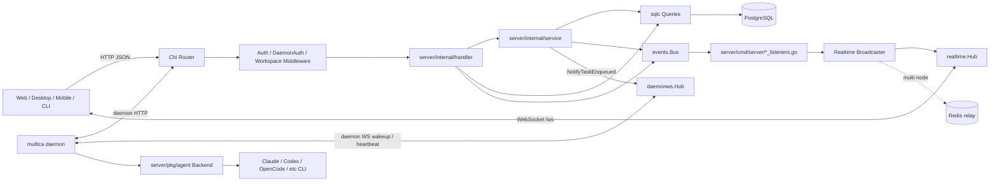
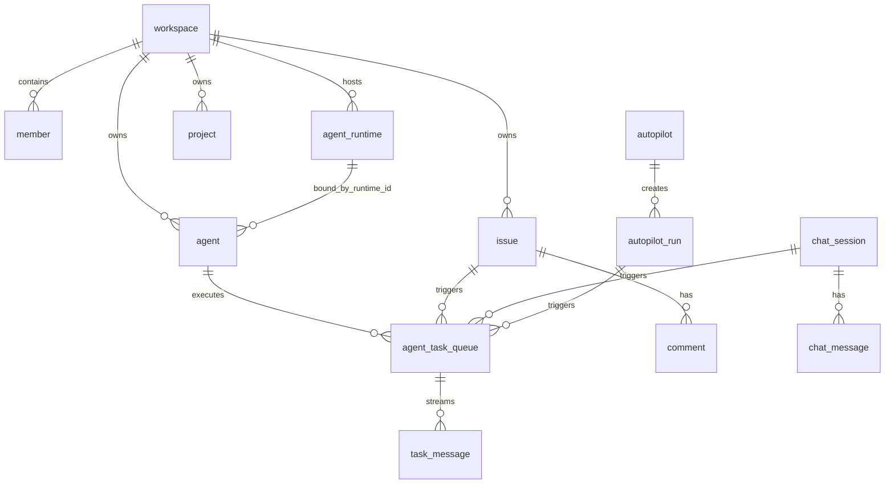
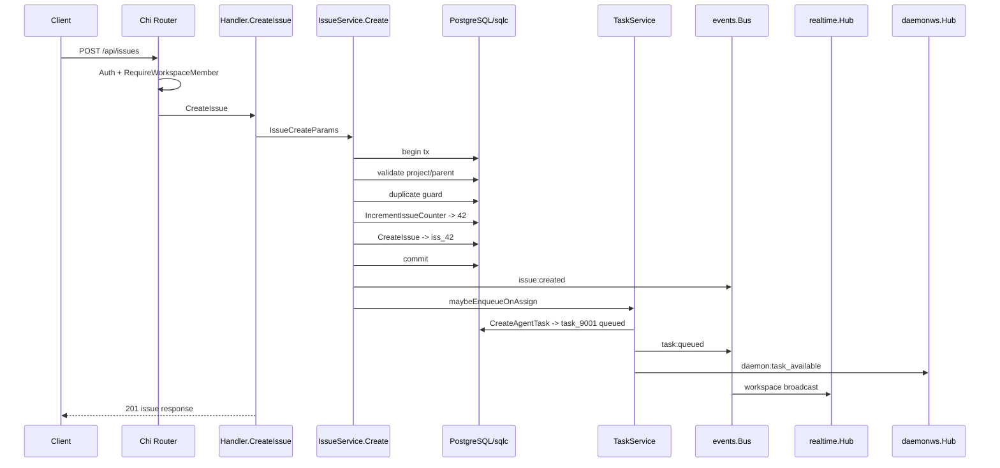
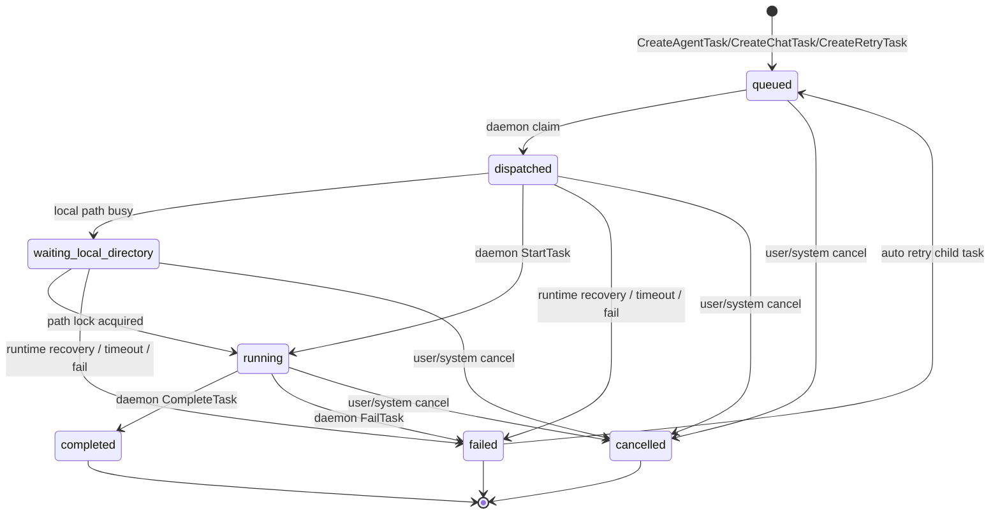
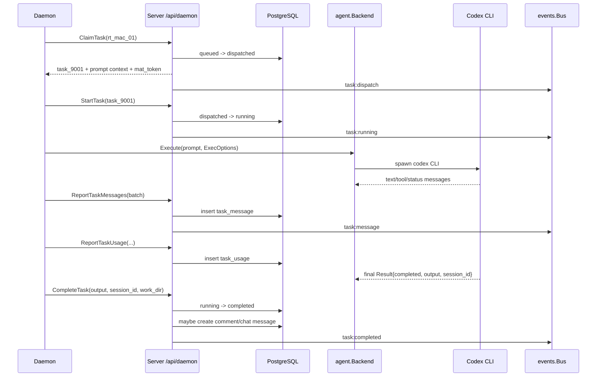
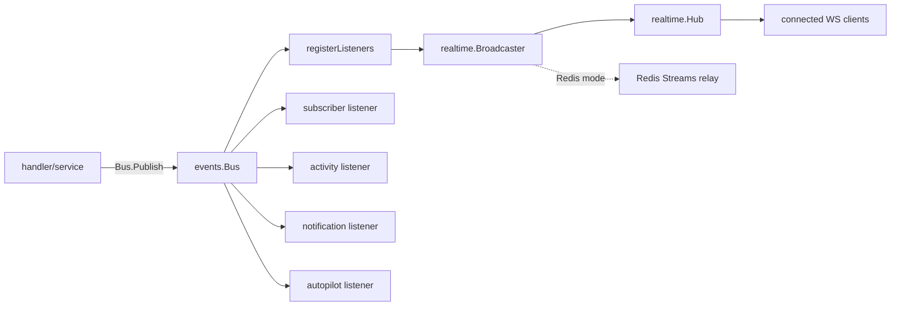
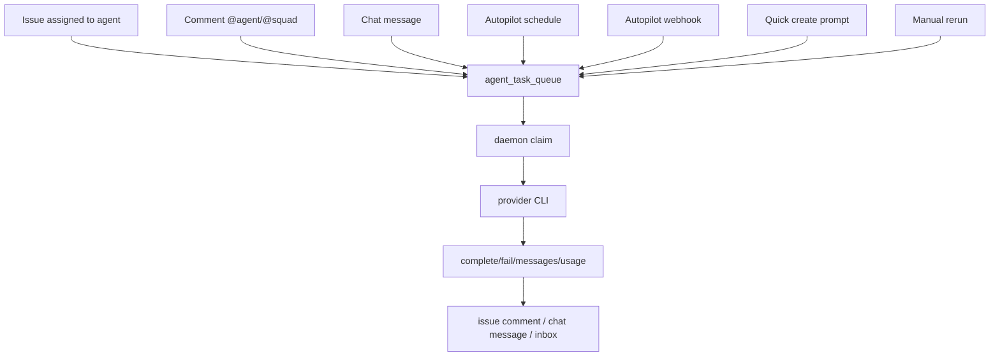

# 后端技术详细拆解

这篇文档按后端工程视角拆 Multica。前端只出现在和后端强绑定的位置：HTTP header、认证 cookie/token、WebSocket 连接、事件 payload、上传/下载 URL。React、组件、状态库、页面技术不在本文范围内。

结论先放前面：

- Multica 后端核心是一个 Go API server，入口在 `server/cmd/server/main.go`。
- HTTP 框架是 Chi，路由总表在 `server/cmd/server/router.go`。
- 数据访问是 PostgreSQL + sqlc，SQL 源在 `server/pkg/db/queries/*.sql`，生成代码在 `server/pkg/db/generated/*.go`。
- 业务分层不是严格 DDD，但有清晰倾向：`handler` 管 HTTP/鉴权/DTO，`service` 管跨入口业务规则，`queries` 管 SQL。
- 实时能力主要是 WebSocket，不是 SSE。浏览器/桌面实时事件走 `GET /ws`；daemon 控制面另有 `GET /api/daemon/ws`。
- SSE 只在少数 agent/provider/MCP 兼容逻辑里出现，不是 Multica 自己对客户端的主实时协议。
- 后端最重要的运行链路是：issue/comment/chat/autopilot 产生 `agent_task_queue` 行，daemon claim task，调用本地 provider CLI，最后回写 task/comment/chat/usage 并广播事件。

## 一张总图



## 锚点数据

后面用同一组数据解释，避免在类型和表之间来回跳丢焦点：

| 名称 | 示例值 | 本质 |
| --- | --- | --- |
| 用户 | `chen@example.com` / `usr_chen` | 登录人，人类 actor |
| Workspace | `acme-ai` / `ws_7f3a` | 租户边界 |
| Agent | `CodeSmith` / `agt_codesmith` | AI teammate 配置 |
| Runtime | `rt_mac_01` | 本机 daemon 注册出来的可执行点 |
| Provider | `codex` | daemon 最终调用的 agent CLI 类型 |
| Issue | `ACME-42` / `iss_42` | 用户可见任务 |
| Task | `task_9001` | 后端给 daemon 执行的队列项 |
| Comment | `cmt_501` | issue 下的人类或 agent 留言 |
| Chat session | `chat_77` | 私聊 agent 的会话 |

理解时可以把很多 UUID 类型都当作字符串看。比如 `pgtype.UUID`、`string`、前端 route id 在本质上都是“某个对象的 ID”，只是在不同层被不同库包装。

## 1. 进程启动与依赖装配

入口：`server/cmd/server/main.go`。

启动时，server 主要做这些事：

1. 读环境变量，例如 `PORT`、`DATABASE_URL`、`JWT_SECRET`、`REDIS_URL`、`MULTICA_PUBLIC_URL`、`CORS_ALLOWED_ORIGINS`。
2. 初始化 feature flag，并把 flag 注入 daemon 执行环境 `execenv`。
3. 建立 PostgreSQL `pgxpool`，生成 sqlc `db.New(pool)`。
4. 创建两个实时 hub：
   - `realtime.Hub`：给 Web/Desktop/Mobile 等客户端推业务事件。
   - `daemonws.Hub`：给本地 daemon 推 wakeup、runtime profile refresh、heartbeat ack 等控制面消息。
5. 如果有 `REDIS_URL`，创建 Redis store 和 realtime relay。没有 Redis 时就是单节点内存模式。
6. 注册 event listener：
   - `registerListeners`：事件转 WebSocket 广播。
   - `registerSubscriberListeners`：维护 issue subscriber。
   - `registerActivityListeners`：写活动日志。
   - `registerNotificationListeners`：写 inbox。
   - `registerAutopilotListeners`：同步 autopilot run。
7. 调 `NewRouterWithOptions(...)` 构造 Chi router 和 `*handler.Handler`。
8. 启动后台 goroutine：
   - runtime sweeper
   - batched heartbeat scheduler
   - autopilot failure monitor
   - DB-backed scheduler
   - channel supervisor
   - metrics server
   - HTTP server

一个容易忽略但很重要的点：`main.go` 会构造两套 `TaskService`。一个在 `handler.New(...)` 内部，供 HTTP handler 使用；另一个在 `main.go` 里给后台 worker/autopilot service 使用。两者共享 DB、bus、hub、daemon wakeup，因此行为一致，但对象实例不是同一个。看代码时不要误以为只有 `h.TaskService` 一个入口。

## 2. Router 是后端边界总表

路由总表：`server/cmd/server/router.go`。

核心分组如下：

| 分组 | 示例 | 认证方式 | 主要用途 |
| --- | --- | --- | --- |
| Health | `/health`, `/readyz`, `/health/realtime` | 无或 metrics token | 存活、就绪、实时系统状态 |
| WebSocket | `/ws` | Cookie 或首帧 token | 客户端实时事件 |
| Auth | `/auth/send-code`, `/auth/verify-code`, `/auth/google` | 登录前限流 | 登录和验证码 |
| Public API | `/api/config` | 无 | 给客户端读部署配置 |
| Public webhook | `/api/webhooks/autopilots/{token}`, `/api/webhooks/github` | 路径 token 或签名 | 外部系统触发 |
| Daemon API | `/api/daemon/**` | `DaemonAuth` | daemon 注册、心跳、claim、上报 |
| User API | `/api/me`, `/api/tokens`, `/api/workspaces` | `Auth` | 用户账号级能力 |
| Workspace API | `/api/issues`, `/api/agents`, `/api/projects`, `/api/chat` | `Auth + RequireWorkspaceMember` | 主要业务对象 |
| Admin/Owner API | workspace 成员、runtime profile、integration 管理 | workspace role | 管理能力 |

读后端功能时，第一步通常是从 `router.go` 找 endpoint，再跳到 handler。

例如创建 issue：

```text
POST /api/issues
  -> middleware.Auth
  -> middleware.RequireWorkspaceMember
  -> Handler.CreateIssue
  -> IssueService.Create
```

daemon claim task：

```text
POST /api/daemon/runtimes/{runtimeId}/tasks/claim
  -> middleware.DaemonAuth
  -> Handler.ClaimTaskByRuntime
  -> TaskService.ClaimTaskForRuntime
```

## 3. Handler、Service、SQLC 的职责边界

### Handler 层

目录：`server/internal/handler/`。

`Handler` 聚合对象在 `server/internal/handler/handler.go`，里面持有：

- `Queries`：sqlc 查询入口。
- `DB` / `TxStarter`：事务和裸 SQL 能力。
- `Hub` / `DaemonHub` / `Bus`：实时广播和事件总线。
- `TaskService` / `IssueService` / `AutopilotService` / `EmailService`。
- Redis-backed stores：update/model list/local skills/liveness/rate limiter。
- `Storage` / CloudFront signer：附件。
- Analytics / metrics / token cache。
- Lark/Slack/channel supervisor。

Handler 的主要职责是“HTTP 边界”：

- 解析 URL、query、body、header。
- 认证用户、daemon、workspace、role。
- 把用户输入从字符串转成内部 ID。
- 调 service 或 sqlc。
- 组装 response DTO。
- 发布必要事件。

比如 `parseUUIDOrBadRequest` 用于用户输入，非法就返回 400；`parseUUID` 是 panicking 版本，只应该用于 DB round-trip 或已经校验过的值。这个规则在后端很关键，因为 UUID 校验不严会造成跨租户或误删风险。

### Service 层

目录：`server/internal/service/`。

Service 的职责是“多入口共享的业务规则”：

- `IssueService.Create`：HTTP、Lark、未来 API key 都能复用同一套创建 issue 规则。
- `TaskService`：enqueue/claim/start/complete/fail/cancel/retry。
- `AutopilotService`：autopilot run 和 trigger。

例如 issue 创建不是简单 insert，它包含：

1. 开事务。
2. 校验 parent issue / project 都属于同 workspace。
3. duplicate guard 防重复。
4. 递增 workspace issue counter。
5. 插入 issue。
6. 提交事务。
7. post-commit 链接附件。
8. 发布 `issue:created`。
9. 记录 analytics/metrics。
10. 如果分配给 agent/squad 且不是 backlog，创建 task。

这些如果放在 handler，Lark 或其他入口就很容易漏逻辑，所以被收敛到 service。

### SQLC 层

SQL 源：`server/pkg/db/queries/*.sql`。

生成代码：`server/pkg/db/generated/*.go`。

核心链路：

```text
server/migrations/*.up.sql
  -> server/pkg/db/queries/*.sql
  -> make sqlc
  -> server/pkg/db/generated/*.go
  -> handler/service 调用
```

一个具体例子：

```sql
-- name: ClaimAgentTask :one
UPDATE agent_task_queue
SET status = 'dispatched',
    dispatched_at = now(),
    prepare_lease_expires_at = now() + make_interval(...)
WHERE id = (
    SELECT atq.id
    FROM agent_task_queue atq
    WHERE atq.agent_id = $1 AND atq.status = 'queued'
    ORDER BY atq.priority DESC, atq.created_at ASC
    LIMIT 1
    FOR UPDATE SKIP LOCKED
)
RETURNING *;
```

这段 SQL 的本质是：在并发 daemon/多任务环境里，用数据库锁原子地把一个可执行任务从 `queued` 变成 `dispatched`。

## 4. 核心数据模型

后端学习时，优先掌握这些表的关系：



关键表本质：

| 表 | 本质 | 学习重点 |
| --- | --- | --- |
| `workspace` | 租户 | 所有业务都要回到 workspace 隔离 |
| `member` | 用户在租户里的角色 | owner/admin/member 权限 |
| `agent` | AI 队友配置 | 绑定 runtime、provider、instructions、skills、owner |
| `agent_runtime` | 可执行点 | daemon 注册出来的本机 provider 能力 |
| `issue` | 用户任务 | 编号、状态、assignee、project、origin |
| `comment` | issue 讨论 | @agent/@squad 触发 |
| `agent_task_queue` | daemon 执行队列 | 后端最关键状态机 |
| `task_message` | agent 流式输出 | tool-use/text/thinking 等执行日志 |
| `chat_session` / `chat_message` | chat 入口 | 聊天最终也落到 task |
| `autopilot` / `autopilot_run` | 自动化入口 | schedule/webhook/manual 最终也落到 task |
| `project_resource` | 项目资源指针 | repo/local_directory 等注入 daemon 执行环境 |
| `task_usage` | token/usage | 计量和 dashboard |

## 5. Workspace 隔离和认证

### 普通用户认证

普通 API 走 `middleware.Auth`。

支持的 token：

- `Authorization: Bearer <JWT>`
- `Authorization: Bearer mul_...` personal access token
- `multica_auth` HttpOnly cookie
- `mat_...` task-scoped token
- `mcn_...` cloud node PAT，需 Cloud Fleet 验证

`Auth` 成功后会写请求 header：

```text
X-User-ID: usr_chen
X-Agent-ID: agt_codesmith        # 仅 task token 路径
X-Task-ID: task_9001             # 仅 task token 路径
X-Workspace-ID: ws_7f3a          # 仅 task token 路径或客户端传入
X-Actor-Source: task_token       # 仅 task token 路径，服务端设置
```

普通用户访问 workspace API 时，还会经过 `RequireWorkspaceMember`。workspace 可以由 header 指定：

```text
X-Workspace-ID: ws_7f3a
```

或：

```text
X-Workspace-Slug: acme-ai
```

前端和 CLI 本质上只是在请求里携带 workspace 标识。真正的租户校验在后端 middleware 和 SQL 查询里。

### Daemon 认证

daemon API 走 `middleware.DaemonAuth`。

支持：

- `mdt_...` daemon token：直接绑定 workspace_id + daemon_id。
- `mul_...` PAT：兼容老 daemon 或 CLI 场景。
- JWT：兼容路径。
- `mcn_...` cloud node PAT。

`mdt_` 是最典型的 daemon token。认证成功后 context 里会有：

```text
DaemonWorkspaceID = ws_7f3a
DaemonID = macbook-pro-chen
DaemonAuthPath = daemon_token
```

daemon handler 再通过 `requireDaemonRuntimeAccess`、`requireDaemonTaskAccessWithWorkspace` 确认 runtime/task 属于该 workspace。

### Task-scoped token

daemon claim task 时，server 会给 task 返回 `mat_...` token，注入 agent 进程。这样 agent CLI 在执行中调用 Multica API 时，不需要拿用户完整 PAT。

本质：

```text
mat_token -> user_id + workspace_id + agent_id + task_id
```

后端用它来区分“人类用户请求”和“agent 进程代用户请求”。例如 billing、agent env 这类敏感 endpoint 会拒绝 task-token actor。

## 6. Issue 创建到 Task 入队

以 `chen@example.com` 在 `acme-ai` 中创建 `ACME-42` 为例。

请求：

```http
POST /api/issues
Authorization: Bearer mul_xxx
X-Workspace-Slug: acme-ai
Content-Type: application/json

{
  "title": "修复登录验证码过期提示",
  "description": "用户验证码过期后仍显示网络错误，需要显示验证码已过期。",
  "status": "todo",
  "priority": "high",
  "assignee_type": "agent",
  "assignee_id": "agt_codesmith",
  "project_id": "proj_web"
}
```

后端链路：



关键判断：

- 如果 issue status 是 `backlog`，不会立即 enqueue。backlog 是停车场，可以预先分配但不触发执行。
- 如果 assignee 是 agent，但 agent 已归档或没有 runtime，不会成功触发任务。
- 如果 assignee 是 squad，会触发 squad leader，而不是所有成员并发。
- duplicate guard 按 workspace/project/parent/title 识别未完成重复 issue。

入队后 `agent_task_queue` 大致是：

```json
{
  "id": "task_9001",
  "agent_id": "agt_codesmith",
  "runtime_id": "rt_mac_01",
  "issue_id": "iss_42",
  "status": "queued",
  "priority": 3,
  "trigger_comment_id": null,
  "attempt": 1,
  "max_attempts": 3
}
```

注意：用户看到的是 `ACME-42`，daemon 执行的是 `task_9001`。一个 issue 可以有多个 task，例如 @mention、rerun、retry、squad leader/worker 都会产生不同 task。

## 7. Task 状态机

核心状态：



主要转移来源：

| 状态变化 | 入口 | 代码 |
| --- | --- | --- |
| 空 -> `queued` | issue/chat/autopilot/comment/rerun | `TaskService.Enqueue*` |
| `queued` -> `dispatched` | daemon claim | `TaskService.ClaimTaskForRuntime` / `ClaimAgentTask` |
| `dispatched` -> `waiting_local_directory` | daemon 等本地目录锁 | `MarkTaskWaitingLocalDirectory` |
| `dispatched` -> `running` | daemon 开始执行 | `StartTask` |
| `running` -> `completed` | daemon 成功回报 | `CompleteTask` |
| `running` -> `failed` | daemon 失败回报 | `FailTask` |
| active -> `cancelled` | 用户取消、issue 删除/终态等 | `Cancel*` |
| `failed` -> 新 `queued` | runtime/timeout 类失败自动重试 | `MaybeRetryFailedTask` |

### claim 的并发控制

`ClaimAgentTask` 不是简单取最早 queued task，它有几层保护：

- `FOR UPDATE SKIP LOCKED` 防止多个 claim 抢同一行。
- 按 `priority DESC, created_at ASC` 排序。
- 检查 `max_concurrent_tasks`，同一 agent 不超过配置并发。
- 同一 agent 对同一 issue/chat session 串行，避免同一个 agent 对同一上下文同时跑两个任务。
- different agent 可以并发处理同一个 issue，例如 assignee agent 和 @mention agent。

`ClaimTaskForRuntime` 会先按 runtime 找候选，再逐个 agent 尝试 claim。这样一个 runtime 上可以托管多个 agent，但每个 agent 的并发规则仍然生效。

### prepare lease

claim 成功后，task 先进入 `dispatched`，但 daemon 还要准备 repo、skill、workdir、MCP config。为了避免准备阶段太久被误判丢失，server 设置 `prepare_lease_expires_at`，daemon 可调用：

```text
POST /api/daemon/runtimes/{runtimeId}/tasks/{taskId}/prepare-lease
```

如果 claim 响应丢了，任务会卡在 `dispatched` 且没有 `started_at`。`ClaimTaskForRuntime` 开头会尝试 `ReclaimStaleDispatchedTaskForRuntime`，重新投递这类任务。

## 8. Daemon 注册、心跳、claim、执行

### 注册 runtime

daemon 启动后先注册 runtime：

```http
POST /api/daemon/register
Authorization: Bearer mdt_xxx

{
  "workspace_id": "ws_7f3a",
  "daemon_id": "macbook-pro-chen",
  "device_name": "Chen's MacBook Pro",
  "cli_version": "0.6.0",
  "runtimes": [
    {
      "name": "codex (Chen's MacBook Pro)",
      "type": "codex",
      "version": "codex-cli 1.2.3",
      "status": "online"
    }
  ]
}
```

server 侧：

- `DaemonRegister` 校验 workspace 权限。
- 对每个 runtime 调 `UpsertAgentRuntime` 或 `UpsertAgentRuntimeWithProfile`。
- runtime 记录核心字段：`workspace_id`、`daemon_id`、`provider`、`status`、`device_info`、`metadata`、`last_seen_at`。
- 发布 `daemon:register`，客户端刷新 runtime 列表。
- 返回 workspace repos/settings，daemon 用于后续 repo 准备。

`agent` 通过 `runtime_id` 绑定到某个 runtime。比如 `CodeSmith` 的 `runtime_id = rt_mac_01`，就说明它由这台机器的 Codex runtime 执行。

### 心跳和 offline

daemon 维持 runtime 在线状态：

- HTTP 心跳：`POST /api/daemon/heartbeat`
- daemon WS 心跳：`GET /api/daemon/ws` 后发送 heartbeat frame
- server 有 runtime sweeper，把 stale runtime 标记 offline
- Redis liveness 可选，用来降低 DB heartbeat 写压力

server 侧心跳会做几件事：

- 校验 runtime 属于 workspace。
- 更新 liveness / last_seen。
- 返回 pending update、pending model list、pending local skills、feature flags 等控制面任务。

### claim 与执行

daemon 主循环在 `server/internal/daemon/daemon.go`：

```text
Daemon.Run
  -> preflightAuth
  -> register runtimes
  -> workspaceSyncLoop
  -> taskWakeupLoop
  -> heartbeatLoop
  -> pollLoop
  -> runRuntimePoller(runtimeID)
  -> Client.ClaimTask
  -> handleTask
  -> runTask
  -> agent.Backend.Execute
  -> reportTaskResult
```

`runRuntimePoller` 有几个工程细节：

- 先拿本地并发 slot，再 claim。这样不会把任务 claim 成 `dispatched` 后又因本机没容量而等很久。
- 支持 wakeup channel。task 入队后 server 通过 daemon WS 唤醒，daemon 不必等固定 poll interval。
- auto-update 时会暂停新 claim，但不中断已经 running 的 task。
- claim 到 task 后启动 goroutine 执行，并释放 claim barrier。

### 执行过程的后端交互

以 `task_9001` 为例：



## 9. Agent backend 统一接口

入口：`server/pkg/agent/agent.go`。

统一接口：

```go
type Backend interface {
    Execute(ctx context.Context, prompt string, opts ExecOptions) (*Session, error)
}
```

`ExecOptions` 的本质：

| 字段 | 本质 |
| --- | --- |
| `Cwd` | agent CLI 在哪个目录执行 |
| `Model` | 选哪个模型 |
| `SystemPrompt` | developer/system 指令 |
| `ThreadName` | 会话名称 |
| `MaxTurns` | 最大交互轮数 |
| `Timeout` | 总超时 |
| `SemanticInactivityTimeout` | 语义无进展 watchdog |
| `ResumeSessionID` | 恢复上一轮 agent 会话 |
| `ExtraArgs` | daemon 级默认 CLI 参数 |
| `CustomArgs` | agent 配置里的自定义参数 |
| `McpConfig` | MCP server 配置 |
| `ThinkingLevel` | 推理强度 |
| `OpenclawMode` | OpenClaw 特有本地/网关模式 |

`Session.Messages` 是流式事件，`Session.Result` 是最终结果。

当前 provider 分派在 `agent.New(agentType, cfg)`：

```text
claude / codebuddy / codex / copilot / opencode / openclaw /
hermes / pi / cursor / kimi / kiro / antigravity / qoder
```

后端不把 provider 细节散落在 task service 里，而是让 daemon 在执行阶段根据 runtime provider 构造对应 backend。

## 10. Prompt、Repo、Project Resource、Skill 注入

daemon claim 到 task 后，不是直接把 issue title 扔给 CLI。它要准备执行上下文。

核心准备内容：

- issue/chat/autopilot/quick-create 的 prompt。
- workspace repos 和 project resources。
- 任务对应 workdir。
- AGENTS/skill/context 文件。
- MCP config。
- agent instructions。
- squad leader/worker briefing。
- session resume 指针。
- task-scoped auth token。

Project resource 的本质是“项目相关资源指针”。例如：

```json
{
  "project_id": "proj_web",
  "type": "github_repo",
  "url": "https://github.com/acme/web-app",
  "checkout_ref": "main"
}
```

daemon 看到后会把 repo 放进允许列表，并把资源信息写入执行环境。真正 checkout 通常发生在 agent 运行中调用 `multica repo checkout <url>` 时：CLI 请求本机 daemon，daemon 再从 bare repo cache 创建或更新 task workdir 下的 Git worktree。

`local_directory` resource 更特殊。它指向本机目录，比如：

```json
{
  "type": "local_directory",
  "path": "/Users/chen/work/acme/web-app"
}
```

这会引入本机路径锁：同一路径上一次只能跑一个 task。第二个 task 会从 `dispatched` 进入 `waiting_local_directory`，等锁释放后再变 `running`。

Skill 注入分两类：

- workspace skill：Multica 存在 DB 里的 skill，claim 后以 bundle/ref 形式给 daemon。
- provider 原生 skill：已经在 repo 或用户目录里的 provider 自己发现，Multica 不导入，只让底层工具自然发现。

大 skill bundle 有专门 resolve endpoint：

```text
POST /api/daemon/runtimes/{runtimeId}/tasks/{taskId}/skill-bundles/resolve
```

这样 claim response 可以保持轻量，bundle 下载按单个 skill 做超时和缓存。

## 11. 事件总线与实时广播

事件总线：`server/internal/events/bus.go`。

事件结构：

```go
type Event struct {
    Type          string
    WorkspaceID   string
    ActorType     string
    ActorID       string
    Payload       any
    TaskID        string
    ChatSessionID string
}
```

本质：

- `Type` 是事件名，例如 `issue:created`、`task:running`。
- `WorkspaceID` 决定发给哪个 workspace room。
- `ActorType/ActorID` 说明谁触发的。
- `Payload` 是给客户端或其他 listener 消费的数据。
- `TaskID/ChatSessionID` 是未来细粒度 scope routing 的 hint。

`Publish` 是同步调用 listener。它不是 Kafka，也不是 durable queue。事件副作用如果失败，通常靠日志、补偿或前端重新拉取兜底。

### 事件广播路径



`registerListeners` 的规则：

- inbox、invitation 等 personal event 定向 `SendToUser`。
- 其他带 `WorkspaceID` 的 event 广播到 workspace room。
- `daemon:*` 可以 global broadcast。
- task/chat 已有 `TaskID` / `ChatSessionID` hint，但当前仍主要 workspace fanout，因为客户端细粒度订阅还没有完全切换。

### 常见事件

| 类型 | 何时发布 | 影响 |
| --- | --- | --- |
| `issue:created` | issue 创建 | issue 列表、activity、notification |
| `issue:updated` | issue 字段变化 | issue detail/list 刷新 |
| `comment:created` | 评论新增 | timeline 刷新，可能触发 agent |
| `task:queued` | task 入队 | agent activity/pending task |
| `task:dispatch` | daemon claim | 用户看到开始分发 |
| `task:running` | daemon start | 用户看到运行中 |
| `task:message` | agent 流式消息 | execution log |
| `task:completed` | 成功结束 | task 状态、issue/chat 输出 |
| `task:failed` | 失败结束 | error、retry、agent 状态 |
| `chat:done` | chat assistant reply 写入 | chat 面板追加 assistant 消息 |
| `daemon:register` | runtime online/offline 变化 | runtime 页面刷新 |

## 12. WebSocket：客户端实时契约

客户端业务实时入口：

```text
GET /ws?workspace_slug=acme-ai&client_platform=web&client_version=...
```

认证方式二选一：

1. Cookie auth：浏览器带 `multica_auth` cookie，server upgrade 前验证。
2. Token auth：WebSocket upgrade 后，第一帧必须是：

```json
{
  "type": "auth",
  "payload": {
    "token": "mul_xxx_or_jwt"
  }
}
```

认证成功后，server 自动订阅：

- `workspace:{workspaceID}`
- `user:{userID}`

客户端也可以发送：

```json
{
  "type": "subscribe",
  "payload": {
    "scope": "task",
    "id": "task_9001"
  }
}
```

但按当前 `registerListeners` 注释，task/chat 细粒度 scope 的服务端基础已有，业务广播仍主要走 workspace room，避免客户端未订阅时丢消息。

一个实际收到的 frame 形状：

```json
{
  "type": "task:running",
  "actor_id": "",
  "actor_type": "system",
  "payload": {
    "task_id": "task_9001",
    "agent_id": "agt_codesmith",
    "issue_id": "iss_42",
    "status": "running"
  }
}
```

这就是前端和后端强绑定的地方：前端需要理解事件类型和 payload，但不影响后端核心逻辑。

## 13. Daemon WebSocket：控制面 wakeup

daemon 还有自己的 WS：

```text
GET /api/daemon/ws
Authorization: Bearer mdt_xxx
```

它和 `/ws` 不是一回事：

| WebSocket | 使用者 | 作用 |
| --- | --- | --- |
| `/ws` | Web/Desktop/Mobile | 业务实时事件 |
| `/api/daemon/ws` | 本地 daemon | heartbeat ack、task available、runtime profile changed |

任务入队后：

```text
TaskService.NotifyTaskEnqueued
  -> EmptyClaim.Bump(runtimeID)
  -> Wakeup.NotifyTaskAvailable(runtimeID, taskID)
  -> daemonws.Hub sends daemon:task_available
  -> daemon taskWakeupLoop wakes poller
  -> daemon calls ClaimTask immediately
```

如果是多 API 节点部署，`REDIS_URL` + sharded relay 会让 wakeup 跨节点送达对应 daemon。

## 14. Redis 在后端里的三个角色

Redis 不是主存储，PostgreSQL 才是事实来源。Redis 在这里主要用于：

1. Realtime relay：多 API node 之间转发 WebSocket 事件。
2. Request-path store/cache：
   - PAT cache
   - daemon token cache
   - membership cache
   - liveness store
   - rate limiter
   - update/model/local skills request store
3. Empty claim cache：runtime 最近无 queued task 时，daemon claim 可短路 DB。

没有 Redis 时：

- 单节点开发和自托管仍可运行。
- 实时广播只在本进程内。
- rate limit 可能降级或禁用。
- 某些 store 使用内存实现。

文档和排障时要区分：Redis relay 丢了会影响跨节点实时和 wakeup；Postgres 丢了才是业务数据不可用。

## 15. 失败、重试和幂等

### 失败分类

`TaskService.FailTask` 会写 `failure_reason`。常见类型：

| failure_reason | 本质 |
| --- | --- |
| `runtime_offline` | daemon/runtime 掉线 |
| `runtime_recovery` | daemon 重启恢复 orphan task |
| `timeout` | 执行超时 |
| `codex_semantic_inactivity` | Codex 语义无进展 |
| `iteration_limit` | agent 迭代次数耗尽 |
| `agent_fallback_message` | agent 输出了 fallback/无效结果 |
| `api_invalid_request` | provider API 请求不合法 |
| `agent_error` | 默认 agent 侧错误 |

自动重试只覆盖基础设施形态：

```text
runtime_offline
runtime_recovery
timeout
codex_semantic_inactivity
```

不会自动重试普通 `agent_error`，因为那通常是模型、工具或代码层面真实失败，自动重试可能制造循环。

Autopilot task 不走普通 auto-retry，避免和 autopilot 自己的 cadence/重跑语义叠加。

### terminal 上报幂等

daemon `CompleteTask` / `FailTask` 使用 retry。server 侧如果发现 task 已经终态，会按“已经完成”处理，不因为响应丢包导致重复终态副作用。

### orphan recovery

daemon 启动或 runtime 重注册后会调用：

```text
POST /api/daemon/runtimes/{runtimeId}/recover-orphans
```

server 会把该 runtime 遗留的 `dispatched/running/waiting_local_directory` 任务标记 failed，并按失败原因决定是否创建 retry child task。

## 16. Chat、Comment、Autopilot 最终都回到 Task

Multica 有多个触发入口，但后端中心仍是 `agent_task_queue`。



### Comment @agent

用户在 `ACME-42` 评论：

```text
@CodeSmith 看下验证码过期时后端返回码是不是没被前端识别。
```

后端创建 comment 后会解析 mentions。若命中 agent：

- `TaskService.EnqueueTaskForMention(issue, agt_codesmith, cmt_501)`
- task 写 `trigger_comment_id = cmt_501`
- `trigger_summary` 保存评论摘要
- daemon prompt 会带上这条评论上下文

### Chat

用户在 chat session `chat_77` 发消息：

```text
帮我解释 ACME-42 现在为什么失败。
```

后端：

- 写 `chat_message(role=user)`。
- `TaskService.EnqueueChatTask(chatSession, initiatorUserID, forceFreshSession)`。
- task 没有 `issue_id`，但有 `chat_session_id`。
- 完成时写 `chat_message(role=assistant)`，广播 `chat:done`。
- chat session 上会保存 `session_id/work_dir/runtime_id` 作为下一轮 resume 指针。

### Autopilot

Autopilot 有 schedule/webhook/manual 多种触发，但执行也会落到 task。

典型 webhook：

```text
POST /api/webhooks/autopilots/{token}
```

server 通过 token 找到 trigger 和 workspace，不信任请求 header 里的 workspace。然后创建 delivery/run，最后由 `AutopilotService` 分派 task 或创建 issue。

## 17. 后台调度和定时任务

后端不是只有 HTTP 请求。`main.go` 会启动这些后台组件：

| 组件 | 作用 |
| --- | --- |
| `runRuntimeSweeper` | runtime stale offline、task timeout/recovery |
| `HeartbeatScheduler` | 批量写 heartbeat，减少 DB 压力 |
| `runAutopilotFailureMonitor` | 监控 autopilot run 卡住或失败 |
| `scheduler.Manager` | DB-backed periodic jobs |
| `TaskUsageHourlyJob` | task usage 小时聚合 |
| `AutopilotScheduleDispatchJob` | scheduled autopilot 分发 |
| `ChannelSupervisor` | Lark/Slack inbound 长连接和 lease |
| `runDBStatsLogger` | DB pool 状态日志 |

DB-backed scheduler 依赖 `sys_cron_executions`，不是 OS cron。好处是多副本下可以用 DB lease 做分布式协调。

## 18. 外部集成的后端形态

### GitHub

入口：

- `POST /api/webhooks/github`
- workspace 下的 `/github/connect`、installation 管理。

GitHub webhook 不走普通 Multica Auth，而是 handler 自己验证 GitHub 签名。PR 事件可以自动关联 issue，发布 `pull_request:*` 或 `issue:updated` 事件。

### Lark / Slack

Lark/Slack 不是直接把逻辑写进 issue handler，而是走 channel engine：

```text
ChannelSupervisor
  -> platform connector
  -> engine.Router
  -> resolver set
  -> IssueService / TaskService
```

这意味着飞书里 `/issue` 创建 issue，和 HTTP `POST /api/issues` 会尽量复用同一套 service 规则：duplicate guard、issue numbering、task enqueue、broadcast、analytics。

### Cloud Runtime / Billing

Cloud runtime 和 billing 是 proxy 型能力：

- 自托管没有 `MULTICA_CLOUD_FLEET_URL` 时返回 503。
- SaaS 节点配置 Fleet URL 后，后端把请求转给 cloud service。
- billing 是用户账号级，不是 workspace-scoped，而且拒绝 task-token actor。

## 19. 观测和排障入口

### 关键日志点

| 现象 | 看哪里 |
| --- | --- |
| server 起不来 | `main.go` DB/env/feature flag 日志 |
| 请求 401/403 | `middleware/auth.go`, `middleware/daemon_auth.go`, workspace middleware |
| issue 创建后没执行 | `IssueService.Create` -> `maybeEnqueueOnAssign` -> `TaskService.EnqueueTaskForIssue` |
| task 卡 queued | runtime_id 是否在线、daemon WS wakeup、`ClaimTaskForRuntime`、EmptyClaim cache |
| task 卡 dispatched | daemon 是否收到 claim、prepare lease、`ReclaimStaleDispatchedTaskForRuntime` |
| task 卡 running | daemon process、provider CLI、`GetTaskStatus`、timeout/sweeper |
| 没有实时刷新 | `events.Bus` 是否 publish、`registerListeners`、`/ws` 连接、Redis relay |
| agent 一直 working | `ReconcileAgentStatus`、active task 是否未终态 |
| chat 没有回复 | chat task、`CompleteTask` 写 assistant message、`chat:done` |
| autopilot 不触发 | trigger enabled、webhook token/schedule job、autopilot run/task |

### 常用源码定位命令

仓库有 `.codegraph/`，理解代码优先用 CodeGraph：

```bash
codegraph explore "CreateIssue IssueService TaskService enqueue"
codegraph explore "ClaimTaskForRuntime daemon claim task lifecycle"
codegraph node server/internal/service/task.go
codegraph node server/cmd/server/router.go
```

再用 ripgrep 定点查：

```bash
rg -n "EventTaskCompleted|task:completed" server
rg -n "CreateAgentTask|ClaimAgentTask|StartAgentTask" server/pkg/db/queries
rg -n "HandleWebSocket|BroadcastToWorkspace|SendToUser" server/internal/realtime
```

### 从一个 bug 追链路

假设用户说：“ACME-42 分配给 CodeSmith 后一直不执行。”

按这个顺序排：

1. issue 是否真分配给 agent 且不是 backlog：
   - `issue.assignee_type = 'agent'`
   - `issue.assignee_id = agt_codesmith`
   - `issue.status != 'backlog'`
2. agent 是否可执行：
   - `agent.archived_at IS NULL`
   - `agent.runtime_id = rt_mac_01`
3. task 是否创建：
   - `agent_task_queue.issue_id = iss_42`
   - `status = queued`
4. runtime 是否在线：
   - `agent_runtime.id = rt_mac_01`
   - `status = online`
   - `last_seen_at` 最近
5. daemon 是否被唤醒：
   - `NotifyTaskEnqueued`
   - `daemon:task_available`
   - daemon 日志 `task received`
6. claim 是否成功：
   - `queued -> dispatched`
   - 是否被 `max_concurrent_tasks` 或同 issue active task 阻挡
7. start 是否成功：
   - `dispatched -> running`
   - local_directory 是否卡锁
8. provider 是否执行：
   - daemon 日志
   - `task_message`
   - `failure_reason`
9. terminal 是否回写：
   - `completed_at`
   - `result/error`
   - `task:completed/task:failed`

## 20. 读代码推荐路径

如果你后续要深拆后端，建议按这个顺序：

1. `server/cmd/server/main.go`
   看进程启动、依赖注入、后台 worker。
2. `server/cmd/server/router.go`
   看 HTTP 边界和权限分组。
3. `server/internal/handler/handler.go`
   看 Handler 聚合对象和通用 helper。
4. `server/internal/middleware/auth.go`
   看普通认证和 task token actor。
5. `server/internal/middleware/daemon_auth.go`
   看 daemon token/PAT/JWT 兼容认证。
6. `server/internal/service/issue.go`
   看 issue 创建的完整事务和触发规则。
7. `server/internal/service/task.go`
   看 task 入队、claim、状态机、完成/失败副作用。
8. `server/internal/handler/daemon.go`
   看 daemon HTTP API。
9. `server/internal/daemon/daemon.go`
   看本地 daemon 主循环和任务执行。
10. `server/pkg/agent/agent.go`
    看 provider backend 统一接口。
11. `server/internal/events/bus.go` 和 `server/cmd/server/listeners.go`
    看事件如何变成 WebSocket。
12. `server/internal/realtime/hub.go`
    看 `/ws` 的认证、订阅、fanout、slow client eviction。
13. `server/pkg/db/queries/*.sql`
    看最终 SQL 和并发语义。

## 21. 后端心智模型压缩版

把 Multica 后端压缩成一句话：

```text
HTTP/Webhook/Channel 入口把用户意图写入 Postgres；
service 层把意图转成 issue/comment/chat/autopilot/task；
events.Bus 把状态变化同步给 activity/inbox/realtime；
daemon 通过 runtime 领取 task，调用本地 provider CLI；
daemon 再把消息、usage、结果回写；
server 根据结果补 comment/chat/inbox 并广播。
```

如果后续你问某个具体功能，优先判断它属于哪一类：

- 是“创建/更新业务对象”：从 router -> handler -> service/sqlc 追。
- 是“触发 agent 执行”：从 service -> agent_task_queue -> daemon claim 追。
- 是“执行中状态”：从 daemon API -> TaskService 状态机 -> event 追。
- 是“实时刷新”：从 `Bus.Publish` -> `registerListeners` -> `/ws` 追。
- 是“权限问题”：从 `Auth/DaemonAuth` -> workspace middleware -> handler guard -> SQL workspace predicate 追。
