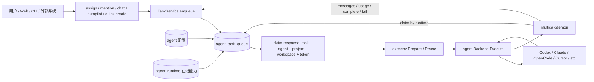
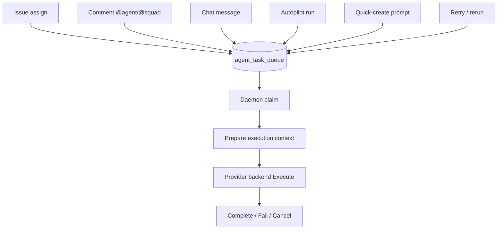
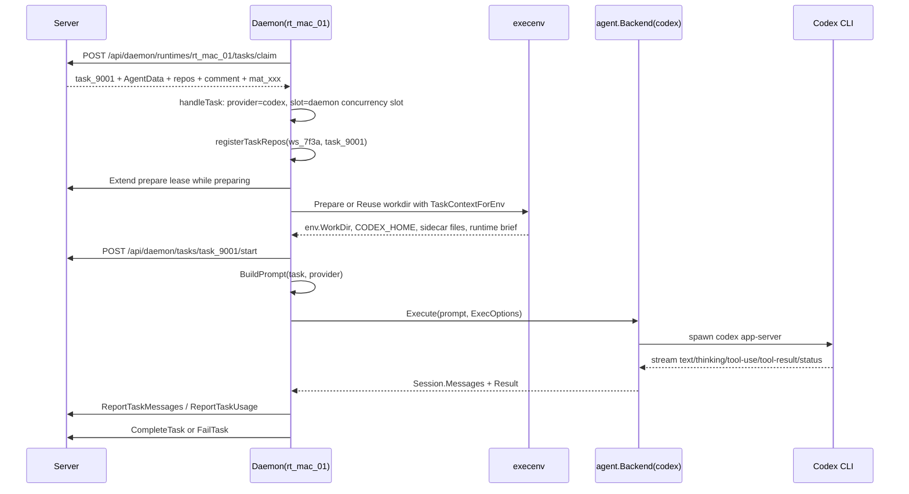
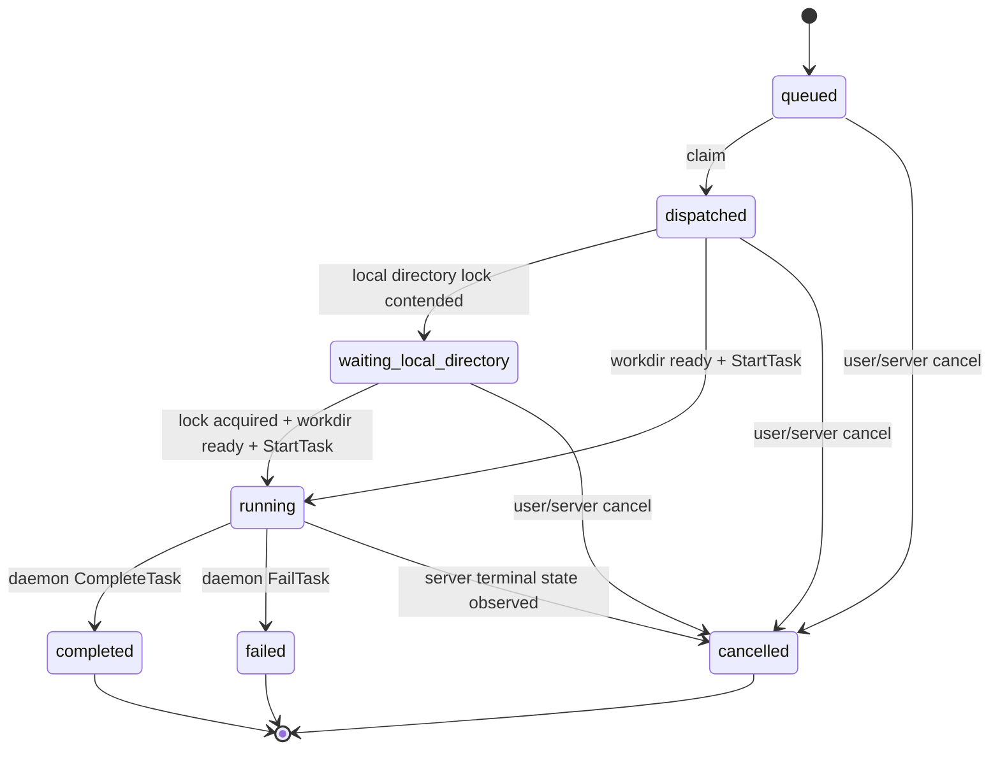

# Agent 开发核心设计拆解

这篇文档以后端 Agent 开发为主线，解释 Multica 为什么这样设计、关键数据如何流转、扩展一个 Agent 能力时应该改哪些层。前端只在 HTTP/WebSocket 契约或触发入口上出现，不讨论页面、组件、状态库。

要点：

- Agent 不是一个 CLI 进程，也不是一段 prompt。它是工作区里的协作身份，同时绑定一个 runtime，并携带执行配置。
- Runtime 不是 Agent。Runtime 是 daemon 注册出来的“可执行点”：某台机器、某个 provider、某个 owner、当前是否在线。
- Task 是 Agent 开始工作的边界。assign、mention、chat、autopilot、quick-create 最终都会收敛成 `agent_task_queue` 里的 task。
- Daemon 是执行器。Server 不直接跑代码工具，只负责入队、claim、鉴权、上下文组装、状态机和结果回写。
- Provider backend 是适配层。Claude、Codex、OpenCode、Cursor 等不同 CLI 被统一成 `agent.Backend.Execute(ctx, prompt, ExecOptions)`。
- 安全设计的核心是“普通 Agent API 不出密钥，claim 时才把必要配置交给 daemon，daemon 再用 task-scoped token 启动子进程”。

## 0. 锚点数据

后面统一用这组数据解释。真实代码里会出现 UUID、`pgtype.UUID`、JSONB、TS 类型包装；这里统一按“某个对象的字符串 ID”理解。

| 名称 | 示例值 | 含义 |
| --- | --- | --- |
| Workspace | `acme-ai` / `ws_7f3a` | 租户边界 |
| 人类用户 | `chen@example.com` / `usr_chen` | runtime owner、触发者或管理员 |
| Agent | `CodeSmith` / `agt_codesmith` | AI teammate 的协作身份和配置 |
| Runtime | `rt_mac_01` | 陈同学 Mac 上 daemon 注册出来的 Codex 可执行点 |
| Provider | `codex` | daemon 最终选择的 provider backend |
| Project | `Web App` / `proj_web` | 项目容器，可能携带 repo/local directory 等资源 |
| Issue | `ACME-42` / `iss_42` | 用户可见工作项 |
| Comment | `cmt_501` | 一次 @agent 的触发源 |
| Task | `task_9001` | 一次交给 daemon 执行的队列项 |
| Task token | `mat_xxx` | claim 时 minted 的一次性 agent 执行凭证 |

一个具体场景：

```text
陈同学在 ACME-42 下评论：
[@CodeSmith](mention://agent/agt_codesmith) 请定位验证码过期时 toast 不显示的问题。
```

这个动作最终不是“给 Agent 发通知”，而是创建一个 task：

```text
task.id = task_9001
task.agent_id = agt_codesmith
task.runtime_id = rt_mac_01
task.issue_id = iss_42
task.trigger_comment_id = cmt_501
task.status = queued
```

## 1. 总体设计：把“人设、机器、一次执行”拆开

Agent 开发最重要的设计点，是把三个容易混在一起的概念拆开：

| 层 | 代码/数据 | 解决的问题 |
| --- | --- | --- |
| Agent 配置层 | `agent` 表、`Handler.CreateAgent/UpdateAgent` | 这个 AI teammate 是谁、能被谁分配、带什么指令/skill/env/MCP/model |
| Runtime 能力层 | `agent_runtime` 表、daemon register/heartbeat | 哪台机器能跑、provider 是什么、是否在线、owner 是谁 |
| Task 执行层 | `agent_task_queue`、daemon claim/start/complete/fail | 这一次具体执行什么、上下文是什么、结果如何回写 |
| Execenv 上下文层 | `server/internal/daemon/execenv` | 把 task/agent/project/workspace 变成 provider CLI 能读的文件和环境变量 |
| Provider 适配层 | `server/pkg/agent/*.go` | 抹平不同 AI 编程 CLI 的启动、流式消息、session、MCP、reasoning 差异 |

这套拆分的好处：

- Agent 可以换 runtime，而不用改 issue、comment、chat 的业务模型。
- Runtime 离线时，task 可以留在队列里等待，不需要丢弃用户意图。
- 不同触发入口可以统一进入 task 状态机，避免每个入口各自实现执行逻辑。
- Provider 差异被压在 backend 适配层，不污染业务 handler/service。
- 密钥和 task token 只在执行链路里出现，普通列表/详情 API 不暴露。



关键源码入口：

| 关注点 | 文件 |
| --- | --- |
| Agent 创建/更新/响应脱敏 | `server/internal/handler/agent.go` |
| Agent env 专用管理接口 | `server/internal/handler/agent_env.go` |
| Agent ready 判断 | `server/internal/service/agent_ready.go` |
| Task 入队/claim/状态机 | `server/internal/service/task.go` |
| Daemon claim response 组装 | `server/internal/handler/daemon.go` |
| Daemon 执行主链路 | `server/internal/daemon/daemon.go` |
| Prompt 分流 | `server/internal/daemon/prompt.go` |
| 执行上下文注入 | `server/internal/daemon/execenv/*` |
| Provider 统一接口 | `server/pkg/agent/agent.go` |
| Codex provider 示例 | `server/pkg/agent/codex.go` |
| SQL 源 | `server/pkg/db/queries/agent.sql`, `server/pkg/db/queries/runtime.sql` |

## 2. Agent 在产品上是一等成员，在代码里是执行配置

官方文档把 Agent 定义成工作区里的一等公民：能被分配 issue、被 `@`、发评论、做 project lead、创建 issue。和人类的核心区别是：

- 它不会收 inbox 通知。
- 它被触发后会自动开始执行。
- 它必须绑定一款本机 AI 编程工具所在的 runtime。
- 它可以被归档，归档后日常入口不可用。

代码里，`agent` 表承载的不是“正在运行的进程”，而是长期配置：

| 字段/配置 | 含义 |
| --- | --- |
| `name`, `description`, `avatar_url` | 协作身份展示 |
| `workspace_id`, `owner_id`, `visibility` | 租户和权限边界 |
| `runtime_id`, `runtime_mode` | 绑定哪个可执行点 |
| `instructions` | Agent 的长期人设/工作方式 |
| `custom_env` | 执行时注入的环境变量，普通响应不返回值 |
| `custom_args` | provider CLI 的追加参数 |
| `mcp_config` | Agent 级 MCP 配置，按 provider 渲染 |
| `model`, `thinking_level` | provider 原生模型/推理强度配置 |
| `max_concurrent_tasks` | 单个 Agent 的并发上限 |
| `archived_at`, `archived_by` | 是否归档 |

把 Agent 当作“配置 + 身份”理解，就能解释很多设计：

- `CodeSmith` 可以在 UI 中像成员一样被分配，但执行要等 `rt_mac_01` 在线。
- `CodeSmith` 的名字和描述能被工作区成员看到，但密钥不会出现在普通 `AgentResponse`。
- 更新 `instructions` 不会启动进程，只会影响下一次 claim 后 daemon 组装的上下文。
- `visibility=private` 限制谁能分配它，不是把这个 Agent 从所有列表里隐藏。

## 3. 创建和更新 Agent：配置面先守住运行边界

创建 `CodeSmith` 时，典型请求可以抽象成：

```json
{
  "name": "CodeSmith",
  "description": "负责 Web App 的工程智能体",
  "instructions": "默认用中文回复。优先先读 issue 和最近评论，再修改代码。",
  "runtime_id": "rt_mac_01",
  "visibility": "workspace",
  "max_concurrent_tasks": 6,
  "model": "",
  "thinking_level": "medium",
  "custom_args": ["--sandbox", "workspace-write"],
  "mcp_config": {
    "mcpServers": {
      "fetch": {
        "command": "uvx",
        "args": ["mcp-server-fetch"]
      }
    }
  }
}
```

`Handler.CreateAgent` 的设计重点不是复杂业务，而是把配置写入 DB 前先校验边界：

1. `name` 必填，`runtime_id` 必填。
2. 默认 `visibility=private`，默认 `max_concurrent_tasks=6`。
3. runtime 必须属于当前 workspace。
4. 如果 runtime 是私有的，只有 runtime owner 或 workspace admin/owner 能创建绑定它的 Agent。
5. `thinking_level` 只做 provider 级枚举校验；具体 model 是否支持这个 reasoning level，到 daemon 执行时用本机模型目录再判断。
6. `runtime_mode` 从 runtime 拷贝到 agent，避免后续响应需要到处 join。
7. `runtime_config/custom_env/custom_args/mcp_config` 都作为配置持久化，但响应时按安全规则脱敏。
8. 如果 runtime 当前 online，会立即 reconcile agent status。
9. 发布 `agent:created` 事件，供实时客户端刷新。

更新 `CodeSmith` 时，`Handler.UpdateAgent` 有几个很关键的设计：

- 只有 workspace owner/admin 或 Agent owner 能管理 Agent。
- 通用 `PATCH /api/agents/{id}` 明确拒绝 `custom_env`，防止用户以为保存了密钥但实际上被忽略，密钥只走专用 env endpoint。
- runtime 切换时重复检查 private runtime gate，防止创建时绕不过去、更新时却能绑到别人的私有 runtime。
- runtime/provider 切换时，如果旧 model 是明确属于旧 provider 的已知值，会清空，让新 provider 用默认值。
- `thinking_level` 是三态语义：
  - 字段省略：不变。
  - 传空字符串：清空。
  - 传具体值：按目标 provider 校验。
- `mcp_config=null` 表示显式清空；字段省略表示保留。
- `runtime_config.gateway.token` 这类被 UI round-trip 的掩码值会恢复原真实值，避免把 `"***"` 写进数据库覆盖密钥。

### 密钥更新为什么单独做 endpoint

`custom_env` 不是普通 Agent 配置，因为它可能包含：

```text
ANTHROPIC_API_KEY=sk-...
ANTHROPIC_BASE_URL=https://router.example.com
CLAUDE_CODE_USE_BEDROCK=1
```

所以它走 `server/internal/handler/agent_env.go` 的专用接口：

- `GET /api/agents/{id}/env` 才返回明文。
- `PUT /api/agents/{id}/env` 才更新明文。
- Agent actor 不能调用这些接口，即使背后 runtime owner 是 workspace owner。
- 只有 workspace owner/admin 可以读写。
- 每次 reveal/update 都写 activity audit。
- 读明文时如果 audit 写入失败，直接拒绝返回，避免无审计泄露。
- 更新时支持 `****` sentinel，表示“这个 key 保留旧值”，防止 UI 把掩码当真实值写回。

这条边界是 Agent 开发里最重要的安全设计之一：配置页面可以显示“有 3 个环境变量”，但普通 Agent API 和 WebSocket 广播永远不带值。只有 daemon claim 到具体 task 后，server 才把 `custom_env` 放进 claim response，daemon 再注入子进程环境。

## 4. Readiness：能不能触发，不等于有没有 Agent

Agent 是否能接活由 `AgentReadiness` 判断：

```text
ready = !archived && runtime_id 有效 && 绑定 runtime.status == online
```

这个判断被多个入口复用：

- issue 分配给 Agent 时是否能入队。
- autopilot run-only 是否能 dispatch。
- squad leader 是否 ready。
- UI/业务层判断是否应该允许触发。

用锚点例子：

```text
CodeSmith 存在，但 rt_mac_01 离线：
  agent row 存在
  assignee picker 可能仍能看到 CodeSmith
  但新 task 不应被当成可立即执行

CodeSmith 被归档：
  不能再作为日常触发对象
  正在跑的任务会被取消
```

设计上，readiness 只关心“现在能不能跑”。它不负责解释为什么一个用户有没有权限分配 Agent；权限由 visibility、workspace role、owner 规则处理。

## 5. 触发入口统一收敛到 Task

Agent 不像人类一样“收到通知后自己读 inbox”。所有让 Agent 工作的入口，最终都进入 `agent_task_queue`：

| 入口 | 用户动作 | task 上的锚点 |
| --- | --- | --- |
| Issue assign | 把 `ACME-42` 分配给 `CodeSmith` | `issue_id=iss_42`, `trigger_comment_id=null` |
| Comment mention | 在评论里 `@CodeSmith` | `issue_id=iss_42`, `trigger_comment_id=cmt_501` |
| Chat | 给 Agent 发私聊消息 | `chat_session_id=chat_77`, `chat_message=...` |
| Autopilot run-only | 定时/webhook/API 触发 | `autopilot_run_id=run_12`, 无 issue |
| Quick-create | 自然语言快速创建 issue | `context.type=quick_create`, 无 issue |
| Squad | 指派给 squad 或 @squad | task 指向 leader agent，带 `is_leader_task/squad_id` |
| Retry/rerun | 手动重跑或失败重试 | 可能带 parent task、session/workdir 复用或强制 fresh |

这是一种“窄腰”设计：



好处是：

- 所有入口共享并发控制、runtime online 判断、claim、start、complete/fail、usage、realtime 事件。
- 新入口只要能构造 task，就能复用 daemon 执行能力。
- 结果回写路径统一，不需要 chat/autopilot/issue 各自实现 provider 执行。

`TaskService.ClaimTask` 会在事务里做两件关键事：

1. 锁定 Agent，检查当前 running/dispatched/waiting 数量是否达到 `max_concurrent_tasks`。
2. 原子 claim 一个 queued task，把它变成 `dispatched`，并设置 prepare lease。

`TaskService.ClaimTaskForRuntime` 再从 runtime 视角找可 claim 的任务，保证同一个 runtime 下多个 Agent 的任务都能被挑选，同时仍尊重每个 Agent 自己的并发上限。

## 6. Claim response：Server 和 Daemon 的执行契约

Daemon 并不是从数据库直接读 task。它调用：

```text
POST /api/daemon/runtimes/{runtimeId}/tasks/claim
```

`Handler.ClaimTaskByRuntime` 会把 DB 里的 task 行扩展成一次完整执行所需的 JSON。这个 response 是 Agent 后端开发最值得熟悉的契约。

对 `task_9001` 来说，claim response 可以抽象成：

```json
{
  "task": {
    "id": "task_9001",
    "agent_id": "agt_codesmith",
    "runtime_id": "rt_mac_01",
    "issue_id": "iss_42",
    "workspace_id": "ws_7f3a",
    "thread_name": "修复登录验证码过期提示",
    "trigger_comment_id": "cmt_501",
    "trigger_comment_content": "请定位验证码过期时 toast 不显示的问题。",
    "trigger_author_type": "member",
    "trigger_author_name": "陈同学",
    "new_comment_count": 2,
    "repos": [
      {
        "url": "https://github.com/acme/web-app",
        "ref": "main"
      }
    ],
    "project_id": "proj_web",
    "project_title": "Web App",
    "workspace_context": "这是一个多租户 SaaS，登录相关改动必须保留审计日志。",
    "prior_session_id": "codex-session-abc",
    "prior_work_dir": "/.../multica_workspaces/ws_7f3a/task_old/workdir",
    "auth_token": "mat_xxx",
    "agent": {
      "id": "agt_codesmith",
      "name": "CodeSmith",
      "instructions": "默认用中文回复。优先先读 issue 和最近评论，再修改代码。",
      "custom_env": {
        "ANTHROPIC_BASE_URL": "https://router.example.com"
      },
      "custom_args": ["--sandbox", "workspace-write"],
      "mcp_config": {
        "mcpServers": {
          "fetch": {
            "command": "uvx",
            "args": ["mcp-server-fetch"]
          }
        }
      },
      "model": "",
      "thinking_level": "medium"
    }
  }
}
```

这个 payload 不是简单把 `agent_task_queue` 原样返回。handler 会做大量“执行前组装”：

- 重新读取 Agent，拿最新 `instructions/custom_env/custom_args/mcp_config/model/thinking_level/runtime_config`。
- 根据 daemon capability 决定返回完整 skills，还是轻量 `skill_refs`，让 daemon 后续按 bundle 下载。
- issue-bound task 会读取 issue、project、project_resource、workspace repos。
- project 上有 `github_repo` resource 时，优先用 project repo，而不是 workspace fallback repo。
- comment-triggered task 会把触发评论内容直接嵌入 response，避免复用 workdir 时 Agent 被旧文件干扰。
- chat task 会合并上一次 agent 回复之后的所有用户消息，不只取最后一条。
- autopilot run-only task 会把 autopilot title/description/source/payload 放进去，因为没有 issue 可 fetch。
- quick-create task 从 task context JSON 里恢复 workspace、prompt、project、parent、squad。
- squad leader task 会把 squad operating protocol 和 roster 追加到 agent instructions。
- workspace context 会注入所有 task kind。
- claim 末尾 mint `mat_` task token，绑定 task、agent、workspace、runtime owner。

claim handler 还有两个关键安全检查：

1. claim response 的 `workspace_id` 必须非空，并且必须等于 runtime 的 workspace。否则取消 task 并返回错误，避免 daemon 用空 workspace 让 CLI fallback 到用户全局配置。
2. runtime 必须有 owner，才能 mint task token。daemon 不允许用自己的 owner/member token 去代表 Agent 执行写操作。

## 7. Daemon 执行链路：把 claim payload 变成一次 provider 调用

Daemon 的核心入口是 `server/internal/daemon/daemon.go` 的 `handleTask -> runTask`。

用 `task_9001` 串起来：



`runTask` 做的事可以按阶段理解：

### 7.1 先拒绝危险状态

`runTask` 第一件事是拒绝没有 `workspace_id` 的 task。原因很实际：daemon 会把 `MULTICA_WORKSPACE_ID` 注入给 agent CLI，如果为空，CLI 可能 fallback 到用户全局配置，造成跨 workspace 写入。

### 7.2 解析 provider 和自定义 runtime profile

daemon 内存里有 runtime index。普通 runtime 直接拿 provider，例如 `codex`。自定义 runtime profile 则是：

```text
protocol_family = codex
command_name = acme-codex-wrapper
fixed_args = [...]
```

也就是说 provider protocol family 仍决定 backend 类型，但实际可执行文件可以被 profile 替换。

### 7.3 准备执行环境

daemon 构造 `execenv.TaskContextForEnv`，把 claim response 中的关键上下文整理成 provider 可消费的材料：

- issue/comment/chat/autopilot/quick-create 上下文。
- agent name/instructions/skills。
- workspace context。
- project title/description/resources。
- repos。
- requesting user 和 initiator。
- squad leader 相关 context。

然后尝试复用：

- 如果 `prior_work_dir` 存在，且不是 local directory 模式，优先 `execenv.Reuse`。
- 否则 `execenv.Prepare` 创建新的 env root/workdir。

设计上，`StartTask` 必须在 `env.WorkDir` 确实存在后才调用。否则 UI 或其他消费者一看到 `running` 就去解析 workdir，会碰到文件还没创建好的竞态。

### 7.4 注入 runtime brief 和 sidecar

`execenv.InjectRuntimeConfig` 会把“Multica 工作流”写进 provider 能读到的位置，例如 `AGENTS.md`、`CLAUDE.md`、`.agent_context/`、provider-specific skills/config 等。设计意图是：

- 顶层 prompt 保持短，只表达这一次任务是什么。
- 稳定的工作流规则、CLI 使用方式、reply 规范、workspace/project/skill context 放在运行时文件里。
- provider 如果不可靠加载 cwd 文件，再用 `SystemPrompt` inline 兜底。

local directory 模式比较特殊：workdir 是用户自己的目录。任务结束后 daemon 会清理注入的 runtime brief 和 sidecar，避免用户以后手动打开 Claude/Codex 时还带着上一次 Multica task 的上下文。

### 7.5 注入环境变量

daemon 启动 provider 子进程前会组装环境变量：

| 环境变量 | 作用 |
| --- | --- |
| `MULTICA_TOKEN` | claim 时 minted 的 `mat_` task token |
| `MULTICA_SERVER_URL` | agent CLI 回调 server |
| `MULTICA_DAEMON_PORT` | agent CLI 调本地 daemon，例如 repo checkout |
| `MULTICA_WORKSPACE_ID` | 强制 workspace 边界 |
| `MULTICA_AGENT_NAME` / `MULTICA_AGENT_ID` | 当前 Agent 身份 |
| `MULTICA_TASK_ID` | 当前 task |
| `MULTICA_TASK_SLOT` | daemon 全局并发槽位 |
| `MULTICA_AUTOPILOT_*` | autopilot task 才有 |
| `MULTICA_QUICK_CREATE_*` | quick-create task 才有 |
| `PATH` | 前置 `multica` 二进制目录 |
| `CODEX_HOME` | Codex per-task home |
| `CURSOR_DATA_DIR` | Cursor per-task project approvals/state |
| `OPENCLAW_CONFIG_PATH` | OpenClaw per-task config |
| Agent `custom_env` | 用户配置的 provider/API 环境变量，过滤 blocklist 后注入 |

注意：`custom_env` 注入时会跳过关键内部变量，避免用户覆盖 `MULTICA_TOKEN`、`MULTICA_WORKSPACE_ID` 这类 daemon 强制设置。

### 7.6 构造 ExecOptions 并调用 backend

daemon 最终把配置压成一个 `agent.ExecOptions`：

```text
Cwd = env.WorkDir
Model = agent.model 或 daemon provider 默认 model
ThreadName = issue title / chat title / autopilot title
Timeout = daemon agent timeout
SemanticInactivityTimeout = Codex semantic inactivity timeout
ResumeSessionID = prior_session_id
ExtraArgs = daemon/provider 默认参数 + runtime profile fixed args
CustomArgs = agent.custom_args
McpConfig = agent.mcp_config
ThinkingLevel = agent.thinking_level
OpenclawMode = runtime_config 中解析出的模式
SystemPrompt = 某些 provider 需要 inline runtime brief 时设置
```

`thinking_level` 有一层执行时保护：API 只校验 provider 枚举，但 model 是否支持该 level 要靠 daemon 本机 provider catalog 判断。如果不支持，daemon 记录 warning 并跳过注入，而不是直接让 task 失败。

## 8. Prompt 设计：短 prompt + 持久 runtime brief

`BuildPrompt(task, provider)` 的设计思路是“不要把所有规则塞进这一次 prompt”。它只根据 task kind 构造当前回合的最小指令：

| Task kind | 判定字段 | Prompt 重点 |
| --- | --- | --- |
| Chat | `chat_session_id != ""` | 直接回答用户消息，附件用 `multica attachment download <id>` |
| Comment | `trigger_comment_id != ""` | 聚焦本条新评论，读取 issue，再按父评论回复 |
| Autopilot | `autopilot_run_id != ""` | 没有 issue，按 autopilot description/payload 执行 |
| Quick-create | `quick_create_prompt != ""` | 把自然语言变成一次 `multica issue create --output json` |
| Assignment | 默认 | 先 `multica issue get`，再读最近评论并完成 issue |

以 `cmt_501` 的 comment-triggered task 为例，prompt 大致是：

```text
你是 Multica workspace 的本地 coding agent。
你的 issue 是 ACME-42。

[NEW COMMENT] 陈同学刚留下新评论，请聚焦这条：
> 请定位验证码过期时 toast 不显示的问题。

先运行：
multica issue get ACME-42 --output json

再优先读取触发线程或最近评论。
最后用 multica issue comment add ... --parent cmt_501 回复。
```

而更长、更稳定的规则放在 runtime brief 里，例如：

- 该怎么使用 `multica issue get/comment list/comment add/status`。
- 工作区上下文。
- Agent instructions。
- Project resources。
- Skills。
- Squad operating protocol。
- Reply instruction。

这能降低两个风险：

- 不同 provider 对 prompt/system prompt 的支持差异很大，文件注入更稳定。
- resumed session 里旧 prompt 可能残留；每次通过 runtime brief 和 comment-specific prompt 重新声明当前触发源，能减少“回复错父评论”或“看旧输出文件”的问题。

## 9. Provider 抽象：统一接口，差异下沉

所有 provider 最终实现同一个接口：

```go
type Backend interface {
    Execute(ctx context.Context, prompt string, opts ExecOptions) (*Session, error)
}
```

`Session` 是统一的流式抽象：

- `Messages`：执行中的 text、thinking、tool-use、tool-result、status、error、log。
- `Result`：最终状态、输出、session id、usage。

`agent.New(provider, cfg)` 按字符串构造 backend：

```text
claude / codebuddy / codex / copilot / opencode / openclaw /
hermes / pi / cursor / kimi / kiro / antigravity / qoder
```

设计上，`ExecOptions` 是“共同字段 + provider 专用透传”的折中：

- `Cwd/Model/ThreadName/Timeout/ResumeSessionID` 是大多数 provider 都能理解的共同概念。
- `CustomArgs/McpConfig/ThinkingLevel` 按 provider 能力选择性消费。
- `OpenclawMode` 是 OpenClaw 专用字段，其他 backend 忽略。
- `SystemPrompt` 只给能安全 inline 的 provider 使用，Hermes 这类依赖 cwd context 的 provider 会忽略。

### Codex backend 是一个典型例子

Codex 的启动骨架是：

```text
codex app-server --listen stdio://
```

Codex backend 做了几件很能体现设计取舍的事：

- 用 JSON-RPC 2.0 通过 stdin/stdout 和 `codex app-server` 通信。
- `--listen stdio://` 是 daemon 硬编码的关键参数，用户 `custom_args` 不能覆盖。
- Agent MCP 配置不是塞进命令行，而是写入 per-task `$CODEX_HOME/config.toml`。
- `$CODEX_HOME/config.toml` 里 daemon 管理的 MCP block 用 marker 包起来，便于重跑/清理。
- 如果 Agent 有 managed `mcp_config`，会过滤用户 `custom_args` 里对 `mcp_servers.*` 的覆盖，避免 last-wins 把 UI 保存的 MCP 配置绕掉。
- config file 权限用 `0600`，因为 MCP env 可能包含 API key。
- Codex 有 semantic inactivity timeout：进程活着但长期没有语义进展时，daemon 能把它判定为失败，而不是无限挂起。
- 结果里 session id 和 token usage 会被统一映射回 `agent.Result`。

这说明新增 provider 时不能只“能跑命令”。还要回答：

- 这个 CLI 如何流式输出？
- 如何 resume session？
- 如何识别 tool use 和 final result？
- MCP 配置应该走 argv、env、config file，还是 provider 原生目录？
- 哪些参数必须禁止用户覆盖？
- 进程退出、超时、无进展、认证失败如何归类？
- 如何保证密钥不出现在 argv 和日志里？

## 10. Skills、MCP、custom env：三类上下文不要混用

Agent 执行时会看到三类“增强能力”，它们解决的问题不同。

### Skills：给 Agent 的知识包

Skills 是给模型看的知识和文件，claim response 里有两种方式：

- 老 daemon：直接拿 `skills` 完整内容。
- 新 daemon：拿 `skill_refs`，再调用 bundle resolve 接口下载内容，减小 claim payload。

daemon 在 `ensureTaskSkillBundles` 后把技能写入 provider 能识别的位置，比如 Codex 的 per-task skills 目录、OpenClaw 的 task workspace skills 等。Skills 是“上下文和操作说明”，不是进程级工具服务。

DB 里 `skill.content` 是主 `SKILL.md` 内容，`skill_file` 是支持文件的相对路径和内容。执行时 daemon 才把这些内容物化成 provider 目录里的文件；这不是只保存文件路径，也不是靠 symlink 直接挂过去。遇到用户已有同名 skill 目录时，daemon 会写到 collision-free sibling，例如 `issue-review-multica`，避免覆盖用户文件。

### MCP：给 provider 的工具服务配置

`mcp_config` 是 provider 能调用的 MCP server 配置。它和 skills 不同：

- skills 是文本/文件上下文。
- MCP 是可执行工具服务配置，可能包含 command、args、env、server URL。

在普通 Agent response 里，MCP 配置会按 actor 脱敏；Agent actor 不该拿到完整配置。到 claim 时，server 才把 raw `mcp_config` 放进 `AgentData` 给 daemon。daemon/provider 再按各自方式应用：

- Codex：写入 per-task `$CODEX_HOME/config.toml`。
- Cursor：写入 workdir `.cursor/mcp.json` 并隔离 `CURSOR_DATA_DIR`。
- Claude/OpenCode 等按各自 backend 规则传递或写文件。

### custom env：给子进程的环境变量

`custom_env` 是最敏感的一类。它只在执行时变成 provider 子进程环境变量。普通 API 只展示：

```text
has_custom_env = true
custom_env_key_count = 3
```

不会展示：

```text
ANTHROPIC_API_KEY=...
```

这三类不要混用：

| 你要表达什么 | 应该用 |
| --- | --- |
| Agent 的领域知识、操作步骤、项目规范 | Skill 或 instructions |
| 让 provider 调一个工具服务 | MCP |
| 给 provider 或工具服务传 API key/base URL/开关 | custom env 或 MCP env |

## 11. 状态机和结果回写：成功必须显式完成

task 的核心状态如下：



几个设计点很重要：

- `dispatched` 不等于 provider 已启动，它只是 task 被 runtime claim 走了。
- prepare lease 用来保护“claim 后、start 前”的窗口，daemon 准备环境时会续租。
- `running` 必须在 workdir 存在后才写，避免消费者读到不存在的 workdir。
- daemon 执行中会定期 `GetTaskStatus`，如果 server 端已经取消/终态，就 cancel 本地 context。
- usage 在 complete/fail/cancel 前尽量上报，因为 token 已经消耗。
- `reportTaskResult` 里只有 `result.Status == "completed"` 才走成功，其它状态都走 fail/cancel 分类。
- complete 上报遇到 transient server 错误时，不会转成 failed，因为那会丢掉 agent 已经成功的事实；它宁愿保留 running 等待后续恢复。
- fail 时也会带 `session_id/work_dir`，方便下一次 chat 或 follow-up 能 resume，不因为失败丢上下文。

`TaskResult` 不是 provider 原样输出，而是 daemon 归一后的终态：

```text
Status: completed / failed / aborted / timeout / cancelled
Comment: 最终要写回 issue/chat 的文本
BranchName: provider 创建的分支名，可选
SessionID: provider session，用于后续 resume
WorkDir: 本次执行目录，用于复用和排障
Usage: 按 model 聚合的 token 使用量
FailureReason: 归类后的失败原因
```

## 12. Agent 开发里的安全边界

这部分值得单独记住，很多实现决策都是围绕它展开的。

| 边界 | 设计 |
| --- | --- |
| Workspace 隔离 | claim response 的 `workspace_id` 必须匹配 runtime workspace；daemon 无 workspace 直接拒绝执行 |
| Runtime 私有性 | 创建和更新 Agent 绑定 runtime 都检查 `canUseRuntimeForAgent` |
| Agent 管理权限 | owner/admin 或 Agent owner 才能管理 Agent |
| Agent 分配权限 | `visibility=private` 只限制谁能分配，不隐藏名字和描述 |
| Env 明文 | 只走 env 专用 endpoint，owner/admin，Agent actor 禁止，读写都审计 |
| 普通响应脱敏 | `custom_env` 值不出现在普通 Agent response；MCP/runtime secret 使用 mask |
| 执行 token | claim 时 mint `mat_` task token，daemon 注入 `MULTICA_TOKEN`，禁止 fallback 到 daemon owner token |
| 子进程环境 | blocklist 关键 env key，避免 custom_env 覆盖内部变量 |
| Provider argv | secret 尽量写 per-task config file，不放命令行和日志 |
| local directory | 注入文件任务结束后清理，避免污染用户真实 repo |

一个真实风险例子：

```text
如果 daemon 把自己的 owner PAT 注入给 Codex，
Codex 执行 multica agent env get agt_other
server 可能会把它当 owner 请求处理。

当前设计改成：
claim 时 server mint mat_xxx，绑定 task_9001 + agt_codesmith + ws_7f3a。
Codex 只能以 agent actor 的身份调用 API。
agent actor 调 env endpoint 会被拒绝。
```

## 13. 如果要新增一个 provider，应该怎么改

新增 provider 不只是加一个 `case`。按当前设计，至少要考虑这些层：

1. Provider backend
   - 在 `server/pkg/agent/<provider>.go` 实现 `Backend.Execute`。
   - 把 CLI 输出映射成统一 `agent.Message` 和 `agent.Result`。
   - 处理 timeout、context cancel、process group cleanup。
   - 处理 session id、resume、usage。
   - 明确哪些 `ExecOptions` 支持，哪些忽略。

2. Provider 注册和白名单
   - 在 `agent.New` 增加 provider case。
   - 如果支持 custom runtime profile，同步 `SupportedTypes`。
   - 更新 runtime profile 的 DB CHECK/migration，保证白名单一致。
   - 更新 CLI 检测/注册逻辑，让 daemon 能发现本机 provider。

3. Execenv 支持
   - 确认 provider 从哪里读取 `AGENTS.md`/`CLAUDE.md`/skills/MCP。
   - 如果不能可靠读取 cwd 文件，决定是否走 `SystemPrompt` inline。
   - 如果需要 per-task home/config，像 Codex/Cursor/OpenClaw 一样隔离目录。

4. MCP 和 custom args 安全
   - 决定 MCP 配置渲染方式：argv、env、config file、provider 原生项目配置。
   - 列出必须 block 的用户 `custom_args`。
   - 确保密钥不进 argv、不进普通日志。

5. Model/thinking level
   - 如果 provider 支持 reasoning level，补 `IsKnownThinkingValue` 和 `ValidateThinkingLevel`。
   - 如果 provider 不支持，backend 忽略字段即可，不要让无关 Agent 失败。

6. 测试和文档
   - backend 单测：参数过滤、MCP 渲染、结果解析、超时/取消。
   - daemon 集成测试：claim payload 到 `ExecOptions` 的映射。
   - docs/provider matrix：说明支持的功能和限制。

最容易漏的是“能跑起来”之外的三件事：resume、MCP/secret 安全、失败分类。这三件漏掉后，短 demo 能成功，真实长任务会很难排障。

## 14. 如果要新增一个 Agent 配置项，应该怎么改

例如想给 Agent 增加一个配置：

```text
execution_policy = "fast_feedback"
```

不要直接把字段塞进 prompt。应该按这条链路设计：

1. 数据层
   - migration 给 `agent` 表加字段，或决定放进已有 JSONB。
   - 更新 `server/pkg/db/queries/agent.sql` 的 create/update/select。
   - 重新生成 sqlc。

2. HTTP 边界
   - `CreateAgentRequest/UpdateAgentRequest/AgentResponse` 加字段。
   - Create/Update 做校验和默认值。
   - 如果字段含密钥，不能放普通 response，要走专用 endpoint 或脱敏。

3. Claim 契约
   - `TaskAgentData` 加字段。
   - `ClaimTaskByRuntime` 从 agent row 映射到 claim response。

4. Daemon 映射
   - `daemon.AgentData` 加字段。
   - `runTask` 把它映射到 `execenv.TaskContextForEnv`、`ExecOptions` 或 provider env/config。

5. Provider/execenv
   - 如果是模型可见规则，放 runtime brief/skills/system prompt。
   - 如果是 CLI 行为，放 `ExecOptions`。
   - 如果是工具服务，放 MCP/provider config。

6. 安全和兼容
   - 老 daemon 不认识字段时应能忽略。
   - 新 server 给老 daemon 的 payload 不应破坏执行。
   - 字段是否要广播到 WebSocket，要考虑脱敏和 actor 权限。

这条链路背后的原则是：Agent 配置项只有进入 claim/daemon/provider，才会影响执行。只改 `AgentResponse` 通常只影响 UI 展示，不影响 Agent 执行。

## 15. 排障时按这条链路查

如果 `CodeSmith` 没按预期工作，按下面顺序查，效率最高：

1. Agent 配置
   - `agent.runtime_id` 是否存在。
   - `agent.archived_at` 是否为空。
   - `visibility/owner_id/max_concurrent_tasks` 是否符合预期。
   - `model/thinking_level/custom_args/mcp_config/custom_env` 是否配置正确。

2. Runtime 状态
   - `agent_runtime.status` 是否 online。
   - runtime workspace 是否等于 Agent workspace。
   - runtime owner 是否存在，能否 mint task token。

3. Task 入队
   - `agent_task_queue` 是否有 `queued` 行。
   - `issue_id/chat_session_id/autopilot_run_id/context` 是否对应触发入口。
   - `runtime_id` 是否等于 Agent 当前 runtime。
   - 是否因为 `max_concurrent_tasks` 达上限无法 claim。

4. Claim response
   - `workspace_id` 是否非空且匹配 runtime workspace。
   - `agent` 是否带了最新 instructions/skills/custom args/MCP。
   - comment/chat/autopilot/quick-create 对应上下文是否完整。
   - `auth_token` 是否是 `mat_` task token。

5. Daemon 准备
   - workdir/env root 是否创建。
   - skills bundle 是否解析成功。
   - repo/project resource 是否正确。
   - local directory 是否被锁等待。
   - runtime brief 是否注入。

6. Provider 执行
   - `agent.New(provider)` 是否支持该 provider。
   - CLI path 是否正确，custom runtime profile 是否覆盖 path。
   - `ExecOptions` 里的 model/thinking/custom_args/MCP 是否符合预期。
   - provider 日志里是否有 auth、quota、context overflow、process crash。

7. 结果回写
   - `task_message` 是否有流式消息。
   - `task_usage` 是否上报。
   - `CompleteTask/FailTask` 是否成功。
   - issue/comment/chat/autopilot 是否收到终态副作用和 WebSocket 事件。

## 16. 整体链路

Multica 的 Agent 系统可以按这条链路理解：

```text
Agent 是谁
  -> Runtime 在哪里跑
  -> Task 这次要做什么
  -> Claim 把上下文和 task token 交给 daemon
  -> Execenv 把上下文变成文件、env、MCP、skills
  -> Backend 把统一 ExecOptions 翻译成具体 provider CLI
  -> Daemon 把消息、usage、session、workdir、结果回写 server
```

以后拆任何 Agent 问题，都先判断它属于哪一层：

- 配置不对：看 `agent` handler/SQL。
- 触发不对：看 issue/comment/chat/autopilot 到 `TaskService` 的入队。
- claim 不对：看 `ClaimTaskByRuntime` 的 response build。
- 执行不对：看 daemon `runTask`、`execenv`、provider backend。
- 结果不对：看 task lifecycle、complete/fail、event/realtime。
