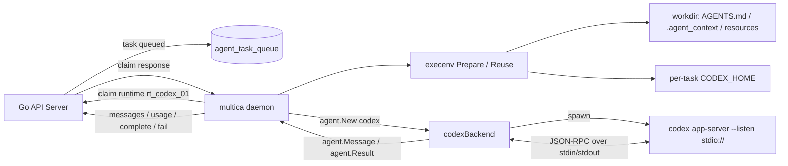
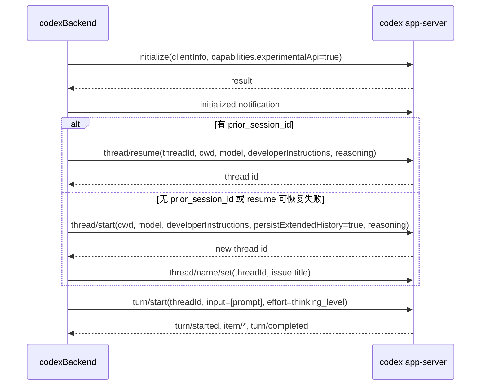
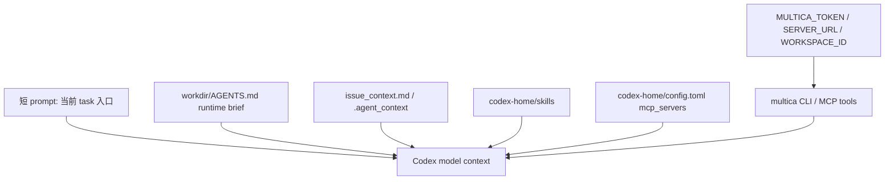
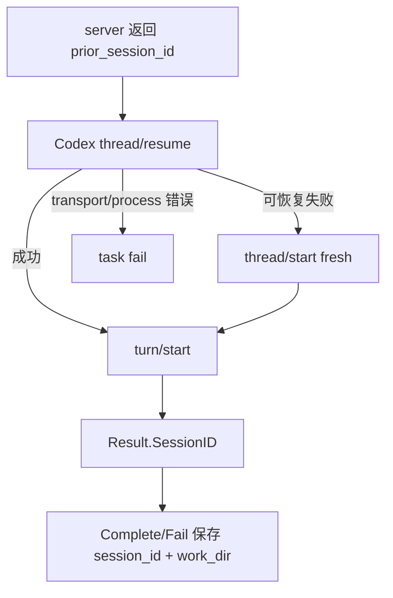

# Codex Provider 流程细节拆解

这篇文档只拆 Codex 这一条 provider 链路。重点不是“Codex 怎么写代码”，而是 Multica 后端和 daemon 如何把一个 Agent task 转成一次 `codex app-server` 执行，再把 Codex 的 thread、turn、消息、usage 和结果收回到 Multica 的 task 状态机里。

先明确一句话：

```text
Codex 不是一种 daemon。
Multica daemon 只有一套执行框架；当 runtime.provider == "codex" 时，daemon 选择 codexBackend 这个 provider adapter。
```

## 0. 锚点数据

继续用前面文档里的例子：

| 名称 | 示例值 | 本质 |
| --- | --- | --- |
| Workspace | `acme-ai` / `ws_7f3a` | 租户边界 |
| 用户 | `chen@example.com` / `usr_chen` | daemon/runtime owner |
| Agent | `CodeSmith` / `agt_codesmith` | 绑定 Codex runtime 的 AI teammate |
| Runtime | `rt_codex_01` | daemon 注册出来的 Codex 可执行点 |
| Provider | `codex` | 本文主角，provider adapter key |
| Issue | `ACME-42` / `iss_42` | 用户可见任务 |
| Comment | `cmt_501` | @CodeSmith 的评论 |
| Task | `task_9001` | 一次 Codex 执行 |
| Codex thread | `codex-thread-abc` | Codex app-server 的会话 ID，Multica 存为 `session_id` |
| Workdir | `~/multica_workspaces/ws_7f3a/task_9001/workdir` | Codex 的 cwd |
| CODEX_HOME | `~/multica_workspaces/ws_7f3a/task_9001/codex-home` | 单次任务隔离的 Codex home |

用户评论：

```markdown
[@CodeSmith](mention://agent/agt_codesmith) 请定位验证码过期时 toast 不显示的问题。
```

最终 Multica 不是直接调用：

```bash
codex "请定位..."
```

而是变成：

```text
server 入队 task_9001
daemon claim task_9001
daemon 准备 workdir + CODEX_HOME + AGENTS.md + skills + MCP
codexBackend 启动 codex app-server --listen stdio://
codexBackend 用 JSON-RPC 初始化 thread/resume 或 thread/start
codexBackend turn/start 发送 prompt
daemon 收流式消息并上报 task_message
daemon 收最终 Result 并 complete/fail task
```

## 1. Codex 在整体架构里的位置



核心代码入口：

| 关注点 | 文件 |
| --- | --- |
| provider 统一接口 | `server/pkg/agent/agent.go` |
| Codex backend | `server/pkg/agent/codex.go` |
| daemon 执行主链路 | `server/internal/daemon/daemon.go` |
| prompt 构造 | `server/internal/daemon/prompt.go` |
| per-task 执行环境 | `server/internal/daemon/execenv/execenv.go` |
| Codex home 准备 | `server/internal/daemon/execenv/codex_home.go` |
| Codex skills 注入 | `server/internal/daemon/execenv/codex_user_skills.go` |
| Codex sandbox 配置 | `server/internal/daemon/execenv/codex_sandbox.go` |
| Codex multi-agent 配置 | `server/internal/daemon/execenv/codex_multi_agent.go` |
| Codex memory 配置 | `server/internal/daemon/execenv/codex_memory.go` |
| thinking/model catalog | `server/pkg/agent/thinking.go`, `server/pkg/agent/models.go` |

## 2. 前置条件：用户安装的是 Codex CLI，Multica 注册的是 runtime

官方中文文档里的 Codex 安装要点：

| 项 | 值 |
| --- | --- |
| daemon 扫描命令 | `codex` |
| 常见安装方式 | npm 包 `@openai/codex` |
| 认证方式 | `codex login`，或 `OPENAI_API_KEY` |
| Multica 集成方式 | JSON-RPC 2.0，`codex app-server` |
| 会话续接 | 可用，走 `thread/resume`，失败后回退新 thread |

daemon 启动时会扫描 PATH 上的 agent CLI。如果发现 `codex`，就向 server 注册一个 runtime：

```text
runtime.id = rt_codex_01
runtime.provider = codex
runtime.owner_id = usr_chen
runtime.status = online
```

这一步仍然没有执行任何任务，只是告诉 server：

```text
这台机器有一个 Codex 可执行点，可以被 Agent 绑定。
```

Agent `CodeSmith` 绑定这个 runtime 后，配置可以理解为：

```text
agent.id = agt_codesmith
agent.runtime_id = rt_codex_01
agent.instructions = 默认用中文回复...
agent.model = ""              # 留空时让 Codex 自己选默认
agent.thinking_level = medium # 可选
agent.custom_args = [...]
agent.mcp_config = {...}
```

## 3. 触发到 claim：Codex task 和其它 provider 共用同一条队列

用户 `@CodeSmith` 后，server 创建 task：

```text
task.id = task_9001
task.agent_id = agt_codesmith
task.runtime_id = rt_codex_01
task.issue_id = iss_42
task.trigger_comment_id = cmt_501
task.status = queued
```

daemon 轮询或被 wakeup 后调用：

```text
POST /api/daemon/runtimes/rt_codex_01/tasks/claim
```

claim response 会把执行所需信息一次性给 daemon：

```json
{
  "task": {
    "id": "task_9001",
    "workspace_id": "ws_7f3a",
    "runtime_id": "rt_codex_01",
    "agent_id": "agt_codesmith",
    "issue_id": "iss_42",
    "trigger_comment_id": "cmt_501",
    "trigger_comment_content": "请定位验证码过期时 toast 不显示的问题。",
    "thread_name": "修复登录验证码过期提示",
    "repos": [
      { "url": "https://github.com/acme/web-app", "ref": "main" }
    ],
    "prior_session_id": "codex-thread-abc",
    "prior_work_dir": ".../old-task/workdir",
    "auth_token": "mat_xxx",
    "agent": {
      "id": "agt_codesmith",
      "name": "CodeSmith",
      "instructions": "默认用中文回复。优先先读 issue 和最近评论。",
      "custom_args": ["--some-codex-flag"],
      "custom_env": {
        "OPENAI_API_KEY": "sk-..."
      },
      "mcp_config": {
        "mcpServers": {
          "fetch": {
            "command": "uvx",
            "args": ["mcp-server-fetch"]
          }
        }
      },
      "model": "",
      "thinking_level": "medium"
    }
  }
}
```

这个 response 里的 `auth_token=mat_xxx` 很关键。daemon 后面会把它注入 Codex 子进程：

```text
MULTICA_TOKEN=mat_xxx
```

Codex 运行过程中调用 `multica issue get`、`multica issue comment add` 时，用的是这个 task-scoped token，而不是 daemon owner 的个人 token。

## 4. daemon runTask：从 provider=codex 进入 Codex adapter

daemon claim 到 task 后，`runTask` 会从 runtime index 取 provider：

```text
task.runtime_id = rt_codex_01
runtime.provider = codex
```

然后做几件和 Codex 直接相关的事：

1. 找到 codex 可执行文件路径。
   - 默认是 PATH 上的 `codex`。
   - 也可以用 `MULTICA_CODEX_PATH` 指定。
   - custom runtime profile 可以把 protocol family 仍设为 `codex`，但实际 command 换成公司 wrapper。

2. 解析 daemon-wide Codex 配置。
   - `MULTICA_CODEX_MODEL` 作为 daemon 默认 model。
   - `MULTICA_CODEX_ARGS` 作为 daemon 默认额外参数。
   - `MULTICA_CODEX_SEMANTIC_INACTIVITY_TIMEOUT` 控制 Codex 语义无进展超时，默认 `10m`。

3. 准备 `execenv`。
   - fresh task 走 `execenv.Prepare`。
   - 有 `prior_work_dir` 时优先 `execenv.Reuse`。
   - local directory 任务不复用历史 workdir。

4. 准备 `ExecOptions`：

```text
Cwd = env.WorkDir
Model = agent.model 或 MULTICA_CODEX_MODEL 或 ""
ThreadName = issue title / chat title / autopilot title
Timeout = MULTICA_AGENT_TIMEOUT
SemanticInactivityTimeout = MULTICA_CODEX_SEMANTIC_INACTIVITY_TIMEOUT
ResumeSessionID = task.prior_session_id
ExtraArgs = MULTICA_CODEX_ARGS + runtime profile fixed args
CustomArgs = agent.custom_args
McpConfig = agent.mcp_config
ThinkingLevel = agent.thinking_level
```

模型选择有一个重要原则：如果 Agent 没显式选 model，daemon 把空字符串传给 backend，让 Codex CLI 使用自己的默认。Multica 不在 Go 侧猜一个“推荐默认模型”，避免和用户账号、Codex CLI 版本、上游默认值漂移。

## 5. execenv 为 Codex 准备了什么

Codex 和多数 provider 不同：daemon 会给它设置一个 per-task `CODEX_HOME`。这让 Codex 本次任务读写自己的隔离配置和 skills，而不是直接污染用户全局 `~/.codex`。

### 5.1 目录结构

一次普通 Codex task 的目录大致是：

```text
~/multica_workspaces/ws_7f3a/task_9001/
  workdir/
    AGENTS.md
    issue_context.md
    .agent_context/
    .multica/
  codex-home/
    auth.json -> ~/.codex/auth.json
    sessions -> ~/.codex/sessions
    config.toml
    config.json
    instructions.md
    skills/
      code-review/
        SKILL.md
      ...
  output/
  logs/
```

其中：

- `workdir` 是 Codex 的 `cwd`。
- `codex-home` 会通过环境变量 `CODEX_HOME` 传给 Codex。
- `output/logs` 给 daemon 留执行产物和日志。
- `sessions` 被链接到共享 `~/.codex/sessions`，方便用户和 usage scanner 找到 Codex session JSONL。
- `auth.json` 被链接到共享 `~/.codex/auth.json`，让 Codex 复用用户登录态。
- `config.toml/config.json/instructions.md` 是从共享 home 复制出来的 per-task 隔离副本。

### 5.2 为什么 auth 是 symlink，config 是 copy

`auth.json` 用 symlink：

```text
codex-home/auth.json -> ~/.codex/auth.json
```

原因是认证状态要跟随用户全局 Codex 登录态刷新。如果用户重新 `codex login`，per-task home 应该看到新 token。

`config.toml/config.json/instructions.md` 用 copy：

```text
~/.codex/config.toml -> codex-home/config.toml
```

原因是 daemon 要在 per-task config 里写 Multica 管理的 sandbox、MCP、memory、multi-agent 等配置，不能改用户全局文件。

Reuse 时会重新同步这些 copy 文件，所以用户在两次任务之间改了 `~/.codex/config.toml`，下一次 task 会拿到新配置，而不是一直用旧副本。

### 5.3 Codex skills 如何注入

Codex 的 skills 在 `CODEX_HOME/skills` 下被 CLI 原生发现。daemon 会先清空：

```text
codex-home/skills/
```

然后两步写入：

1. 从共享 `~/.codex/skills` 复制用户本机已安装 skills。
2. 写入 Multica workspace/Agent 绑定的 skills。

如果用户本机 skill 和 workspace skill 同名，workspace skill 优先。这样管理员给 `CodeSmith` 配的技能不会被用户本机同名技能覆盖。

### 5.4 AGENTS.md 和 runtime brief

Codex 使用 `AGENTS.md` 作为工作流/上下文入口。daemon 会在 `workdir/AGENTS.md` 里注入 Multica runtime brief，例如：

- 当前 Agent 名字和 instructions。
- workspace context。
- issue/chat/autopilot/quick-create 上下文。
- project title、description、resources。
- 可用 `multica` CLI 命令。
- comment 回复规则。
- skills 摘要和发现提示。

本次 task 的短 prompt 仍然由 `BuildPrompt` 生成；长期规则放在 `AGENTS.md`。

## 6. Codex 的 per-task config.toml 管理

`codex-home/config.toml` 是 Codex 集成里最关键的文件之一。daemon 和 backend 会往里面写多个 Multica-managed block。

### 6.1 Sandbox block

daemon 会写 sandbox 配置：

```toml
# BEGIN multica-managed (do not edit; regenerated by daemon)
sandbox_mode = "workspace-write"
sandbox_workspace_write.network_access = true
# END multica-managed
```

Linux 等非 macOS 平台默认使用 `workspace-write + network_access=true`。

macOS 有特殊处理：代码里记录了 Codex Seatbelt sandbox 在 `workspace-write` 下可能忽略 `network_access=true`，导致 `multica issue get` 这类网络请求 DNS 失败。因此在已知修复版本之前，macOS 会 fallback 到：

```toml
sandbox_mode = "danger-full-access"
```

这不是为了放宽所有任务，而是为了保证 Codex 进程能访问 Multica API。相关说明也在 `docs/codex-sandbox-troubleshooting.md`。

### 6.2 Multi-agent block

daemon 默认禁用 Codex native multi-agent：

```toml
features.multi_agent = false
```

原因是 Multica 当前把一个 task 建模成一个父 Codex thread。如果 Codex 在内部再 spawn subagent，父 thread 的 `turn/completed` 可能先到，Multica 会以为 task 完成，但子 agent 还没结束，输出可能丢失。

用户可以通过 daemon 环境变量显式打开：

```text
MULTICA_CODEX_MULTI_AGENT=1
```

但这是接受生命周期风险的 opt-in。

### 6.3 Memory block

daemon 默认禁用 Codex native auto-memory：

```toml
features.memories = false
memories.generate_memories = false
memories.use_memories = false
```

原因是 Multica 已经用 issue、comment、session resume、workspace context、skills 等显式机制维护上下文。Codex 的 auto-memory 是隐藏状态，可能从 `~/.codex/memories` 或 per-task memories 中带入其它项目/其它 workspace 的内容，形成跨任务或跨 workspace 泄漏。

用户可以显式打开：

```text
MULTICA_CODEX_MEMORY=1
```

但默认禁用是为了保持 Multica 的上下文可审计、可解释。

## 7. MCP：为什么 Codex 不把 MCP 放在 argv

Agent 的 `mcp_config` 可能长这样：

```json
{
  "mcpServers": {
    "fetch": {
      "command": "uvx",
      "args": ["mcp-server-fetch"],
      "env": {
        "FETCH_TOKEN": "secret-token"
      }
    }
  }
}
```

Codex backend 不把它作为命令行参数传给 Codex，因为：

- MCP env 里可能有密钥。
- argv 可能被系统 `ps` 看到。
- daemon 日志会记录 `agent command`，如果密钥在 argv 中就会泄露。

所以 Codex backend 在 `Execute` 开始时调用 `ensureCodexMcpConfig`，把 MCP 写入：

```text
codex-home/config.toml
```

渲染成：

```toml
# BEGIN multica-managed mcp_servers (do not edit; regenerated by daemon)
[mcp_servers.fetch]
args = ["mcp-server-fetch"]
command = "uvx"
env = { FETCH_TOKEN = "secret-token" }
# END multica-managed mcp_servers
```

同时做这些保护：

- 文件权限强制 `0600`。
- 如果 Agent 有 managed `mcp_config`，会移除从用户全局 config 复制来的 `[mcp_servers.*]`，避免和 Agent 配置混用。
- 即使 `mcp_config={}`，也会写一个空 managed block，表示“管理态但空配置”。
- 如果 `mcp_config` 存在但没有 `CODEX_HOME`，直接 fail closed，不让 Codex 继承用户全局 MCP 伪装成成功应用了 Agent MCP。
- 当 managed MCP 存在时，`MULTICA_CODEX_ARGS` 和 Agent `custom_args` 里对 `mcp_servers.*` 的 `-c/--config` 覆盖会被过滤，避免 last-wins 覆盖 UI 保存的 MCP 配置。

这里的设计核心是：**Agent MCP 配置一旦由 Multica 管理，就应该是本次 task 的唯一 MCP 真相，不能和用户全局配置静默合并。**

## 8. 启动 Codex：命令、环境变量和参数顺序

Codex backend 最终启动：

```bash
codex app-server --listen stdio://
```

这不是普通交互式 `codex`，而是 app-server 模式。Multica 通过 stdin/stdout 与它进行 JSON-RPC 2.0 通信。

关键环境变量：

| 变量 | 示例 | 作用 |
| --- | --- | --- |
| `CODEX_HOME` | `.../task_9001/codex-home` | 让 Codex 读取 per-task auth/config/skills/sessions |
| `MULTICA_TOKEN` | `mat_xxx` | task-scoped API token |
| `MULTICA_SERVER_URL` | `https://api.multica.ai` | `multica` CLI 调 server |
| `MULTICA_WORKSPACE_ID` | `ws_7f3a` | 强制 workspace |
| `MULTICA_AGENT_ID` | `agt_codesmith` | 当前 Agent 身份 |
| `MULTICA_TASK_ID` | `task_9001` | 当前 task |
| `PATH` | 前置 multica 二进制目录 | 确保 Codex 里能执行 `multica` |
| Agent `custom_env` | `OPENAI_API_KEY=...` | 用户配置的 provider 环境变量 |

参数来源顺序：

```text
硬编码参数: app-server --listen stdio://
  -> daemon-wide MULTICA_CODEX_ARGS
  -> runtime profile fixed args
  -> Agent custom_args
```

`--listen` 是 Multica 必须控制的参数，用户不能通过 custom args 覆盖。否则 backend 就无法通过 stdio 连接 Codex app-server。

## 9. JSON-RPC 生命周期：initialize -> thread -> turn

Codex backend 启动 app-server 后，走这条 JSON-RPC 生命周期：



### 9.1 initialize

backend 先发：

```json
{
  "method": "initialize",
  "params": {
    "clientInfo": {
      "name": "multica-agent-sdk",
      "title": "Multica Agent SDK",
      "version": "0.2.0"
    },
    "capabilities": {
      "experimentalApi": true
    }
  }
}
```

成功后再发 `initialized` notification。

### 9.2 thread/resume 或 thread/start

如果 task 有历史 session：

```text
task.prior_session_id = codex-thread-abc
```

backend 会先尝试：

```text
thread/resume
```

传入：

```text
threadId = codex-thread-abc
cwd = env.WorkDir
model = agent.model 或 nil
developerInstructions = opts.SystemPrompt 或 nil
model_reasoning_effort = thinking_level
```

如果 resume 因为 thread 不存在、schema 漂移等可恢复协议错误失败，backend 会 fallback 到 `thread/start`，让任务继续推进。

但如果是 transport/process 错误，比如 app-server 已经退出或 stdin 写失败，就不会 fallback，因为这说明 Codex 进程本身不可用了。

没有历史 session 时，走：

```text
thread/start
```

并设置：

```text
cwd = env.WorkDir
model = agent.model 或 nil
developerInstructions = opts.SystemPrompt 或 nil
persistExtendedHistory = true
model_reasoning_effort = thinking_level
```

新 thread 启动后，backend 会尽力调用：

```text
thread/name/set
```

把 Codex 原生 thread 名称设为 issue title，例如：

```text
修复登录验证码过期提示
```

失败不阻断任务，只记录 warning。

### 9.3 turn/start

真正把任务发给 Codex 的是：

```text
turn/start
```

抽象 payload：

```json
{
  "threadId": "codex-thread-abc",
  "input": [
    {
      "type": "text",
      "text": "You are running as a local coding agent..."
    }
  ],
  "effort": "medium"
}
```

注意 `thinking_level` 在 Codex 里有两个注入点：

- `thread/start` / `thread/resume`：写到 `config.model_reasoning_effort`。
- `turn/start`：写到顶层 `effort`。

这样新 thread 和 resumed thread 都能尊重 Agent 当前配置，而不是沿用旧 session 里的 reasoning level。

## 10. Prompt 到 Codex 后，Codex 会如何拿上下文

以 comment-triggered task 为例，`BuildPrompt` 发给 Codex 的短 prompt 大致是：

```text
你是 Multica workspace 的本地 coding agent。
你的 issue 是 ACME-42。

[NEW COMMENT] 陈同学刚留下新评论，请聚焦这条：
> 请定位验证码过期时 toast 不显示的问题。

先运行 multica issue get ACME-42 --output json。
再读取相关评论。
最后回复 cmt_501。
```

但 Codex 拿到的完整上下文不只来自 prompt，还来自：

```text
workdir/AGENTS.md
workdir/issue_context.md
workdir/.agent_context/
codex-home/skills/
codex-home/config.toml
环境变量 MULTICA_*
```

所以 Codex 执行时的实际信息来源是：



这也是为什么文档里一直强调：prompt 只是当前回合指令，稳定规则和上下文主要由 execenv 注入。

## 11. Codex 事件如何变成 Multica task messages

Codex app-server 的 stdout 是一行一条 JSON-RPC 消息。backend 支持两类通知协议：

- legacy：`codex/event`。
- raw v2：`turn/started`、`turn/completed`、`item/*`、`thread/status/changed` 等。

backend 将 Codex 事件映射成统一 `agent.Message`：

| Codex 事件 | Multica `agent.Message` | 最终 task_message |
| --- | --- | --- |
| `turn/started` / `task_started` | `MessageStatus{status=running, session_id=threadID}` | 不一定写 task_message，但会 pin session |
| `item/started commandExecution` | `MessageToolUse{tool=exec_command}` | `tool_use` |
| `item/completed commandExecution` | `MessageToolResult{tool=exec_command}` | `tool_result` |
| `item/started fileChange` | `MessageToolUse{tool=patch_apply}` | `tool_use` |
| `item/completed fileChange` | `MessageToolResult{tool=patch_apply}` | `tool_result` |
| `item/completed agentMessage` | `MessageText` | `text` |
| `turn/completed status=failed` | turn error | fail/block 结果 |
| `turn/completed status=cancelled/aborted` | aborted | cancelled/blocked 结果 |

daemon 的 `executeAndDrain` 会读取 `Session.Messages`：

- text/thinking 做 500ms 批量 flush。
- tool_use/tool_result 立即转成 task message 批次。
- tool_result 输出超过 8192 字符会截断上报，避免消息太大。
- 收到 `MessageStatus` 里的 session id 后，会调用 `PinTaskSession`，尽早保存 resume 指针。

早 pin session 很重要：如果 daemon 在 Codex 已建立 thread 后崩溃，server 仍能保存：

```text
session_id = codex-thread-abc
work_dir = .../task_9001/workdir
```

下一次 retry 或 follow-up 才有机会续接。

## 12. Codex 的权限请求如何处理

Codex app-server 可能向客户端发 server request，要求批准命令、文件变更或权限。Multica 在 daemon 模式没有人类交互，所以 backend 自动处理：

| Codex request | Multica 行为 |
| --- | --- |
| command execution approval | accept |
| file change approval | accept |
| permissions request | 只回传认识的 `network` / `fileSystem` 权限，scope=`turn` |
| MCP elicitation request | accept with empty content |
| 未知 request | 返回 JSON-RPC error，并记录 turn error |

这个策略依赖前面 per-task sandbox 和 workspace/workdir 隔离：approval 自动通过，但 Codex 仍应该在 daemon 准备的目录、token、config 边界内运行。

## 13. 超时和卡住检测：Codex 有两层 watchdog

Codex backend 有几类停止条件。

### 13.1 全局 agent timeout

`MULTICA_AGENT_TIMEOUT` / `--agent-timeout` 控制硬 wall-clock deadline。默认是 `0`，表示没有固定上限，主要靠 watchdog 判断活性。

### 13.2 Codex semantic inactivity timeout

`MULTICA_CODEX_SEMANTIC_INACTIVITY_TIMEOUT` 默认 `10m`。

Codex 进程可能还活着，但长时间没有“语义进展”。backend 会监听这些活动：

- tool use。
- tool result。
- status。
- text。
- item progress。
- terminal error。

如果超过阈值没有进展，结果会变成：

```text
Status = timeout
Error 包含 "codex semantic inactivity timeout"
```

daemon 后续会把它转成 blocked/fail 路径，并保留 session/workdir。

### 13.3 first-turn no-progress timeout

还有一种特殊卡住：Codex 接受 `turn/start` 后，只报告 running，但不产生任何 item/message/tool/turn completed/error。backend 用一个更短的 first-turn no-progress timer 捕获这个情况，默认最多 30 秒。

错误形态类似：

```text
codex app-server no progress timeout after 30s
```

### 13.4 daemon idle watchdog

在 Codex backend 外层，daemon 的 `executeAndDrain` 还有通用 idle watchdog。如果 backend 消息流长时间完全沉默，会 cancel agent context，并把结果标成 `idle_watchdog`。

区别可以这样理解：

| 类型 | 谁判断 | 本质 |
| --- | --- | --- |
| semantic inactivity | Codex backend | Codex 有事件，但长时间没有有意义进展 |
| first-turn no-progress | Codex backend | turn/start 后第一回合卡住 |
| idle watchdog | daemon 通用层 | backend 消息流完全沉默 |

## 14. 结果和 usage 如何回写

Codex backend 最终返回统一 `agent.Result`：

```text
Status = completed / failed / aborted / timeout / cancelled
Output = Codex 最终文本输出
SessionID = codex thread id
Usage = map[model]TokenUsage
```

usage 有两条来源：

1. Codex JSON-RPC notification 里的 usage/token_usage/tokens。
2. 如果 notification 没给 usage，fallback 扫描 Codex session JSONL：

```text
CODEX_HOME/sessions/YYYY/MM/DD/*.jsonl
```

因为 `codex-home/sessions` 链接到共享 `~/.codex/sessions`，scanner 能找到 Codex 写的 token_count events。

token 会被拆成：

```text
InputTokens
OutputTokens
CacheReadTokens
CacheWriteTokens
```

其中 cached input 会从 input tokens 里扣出，避免 dashboard 成本计算重复计费。

daemon 拿到 `agent.Result` 后再转成 `TaskResult`：

| `agent.Result.Status` | daemon 处理 |
| --- | --- |
| `completed` 且无 poisoned output | `TaskResult{Status=completed}` |
| `completed` 但输出命中特定 fallback marker | 作为 blocked/fail，并标 failure_reason |
| `timeout` | blocked/fail，保留 session/workdir |
| `idle_watchdog` | blocked/fail，failure_reason=`idle_watchdog` |
| `cancelled` | cancelled |
| 其它 failed/aborted | blocked/fail，按错误分类 |

最后 `reportTaskResult` 调：

```text
CompleteTask(task_9001, comment, branch, session_id, work_dir)
```

或：

```text
FailTask(task_9001, error, session_id, work_dir, failure_reason)
```

成功和失败都会尽量带 `session_id/work_dir`。这对 Codex 很重要：下一次评论或 chat follow-up 需要用 `thread/resume` 续接上下文。

## 15. Codex resume 的完整链路

第一次执行成功后：

```text
codexBackend Result.SessionID = codex-thread-abc
daemon CompleteTask(... session_id=codex-thread-abc, work_dir=.../workdir)
server 写回 agent_task_queue.session_id / work_dir
```

下一次同一个 Agent + issue 被评论触发：

```text
ClaimTaskByRuntime 查 GetLastTaskSession(agent_id, issue_id)
如果 runtime_id 一致，返回 prior_session_id = codex-thread-abc
daemon ExecOptions.ResumeSessionID = codex-thread-abc
codexBackend 先 thread/resume
```

如果 `thread/resume` 失败：

- 可恢复协议错误：fallback `thread/start`，任务继续。
- transport/process 错误：直接失败，因为 app-server 已经不可用。

daemon 还有一个额外保护：如果第一次 backend 执行失败，且是 resume 失败导致没建立新 session，`runTask` 会清空 `ResumeSessionID` 再试一次 fresh session。



## 16. Codex thinking level 和 model

Codex 的 thinking/reasoning level 使用 Codex 原生值，不和 Claude 统一：

```text
none / minimal / low / medium / high / xhigh
```

模型列表来自两层：

- 静态 catalog：`codexStaticModels()`。
- 动态 thinking catalog：`codex debug models --bundled`。

Multica 的原则：

- API 创建/更新 Agent 时，只校验 `thinking_level` 是不是 Codex 已知枚举。
- daemon 执行时，再用本机 Codex catalog 检查这个 level 是否适合当前 model。
- 如果组合不适合，daemon 记录 warning 并跳过 thinking 注入，而不是让 task 直接失败。

Codex 注入位置：

| RPC | 字段 |
| --- | --- |
| `thread/start` | `config.model_reasoning_effort` |
| `thread/resume` | `config.model_reasoning_effort` |
| `turn/start` | `effort` |

这保证用户调整 Agent 的 thinking level 后，即使复用旧 thread，新配置也会进入本次 turn。

## 17. Codex 相关配置速查

| 配置 | 作用 |
| --- | --- |
| `MULTICA_CODEX_PATH` | 指定 `codex` 可执行文件路径 |
| `MULTICA_CODEX_MODEL` | daemon 级默认 Codex model |
| `MULTICA_CODEX_ARGS` | daemon 级 Codex 额外参数 |
| `MULTICA_CODEX_SEMANTIC_INACTIVITY_TIMEOUT` | Codex 语义无进展超时，默认 `10m` |
| `MULTICA_AGENT_TIMEOUT` | agent 全局 wall-clock timeout，默认 `0` |
| `MULTICA_CODEX_MULTI_AGENT=1` | opt-in 保留 Codex native multi-agent |
| `MULTICA_CODEX_MEMORY=1` | opt-in 保留 Codex native memory |
| `CODEX_HOME` | 用户全局 Codex home 的来源；daemon 执行子进程时会覆盖成 per-task home |
| Agent `model` | 优先于 `MULTICA_CODEX_MODEL` |
| Agent `thinking_level` | 注入 Codex reasoning effort |
| Agent `custom_args` | 追加到 Codex app-server 参数后面，受 block/filter 规则约束 |
| Agent `custom_env` | 注入 Codex 子进程环境，blocklist 内部变量 |
| Agent `mcp_config` | 写入 per-task `codex-home/config.toml` |

## 18. 常见问题怎么定位

### 18.1 daemon 没注册 Codex runtime

先确认：

```bash
which codex
codex --version
codex login
```

再看：

```text
MULTICA_CODEX_PATH 是否指错
daemon 日志里是否探测到 codex
agent_runtime 是否有 provider=codex 且 status=online
```

### 18.2 Codex 能启动但无法调用 Multica API

看：

```text
workdir 是否有 MULTICA_SERVER_URL / MULTICA_TOKEN / MULTICA_WORKSPACE_ID
PATH 是否包含 multica 二进制目录
macOS 是否触发 Codex sandbox network_access 问题
codex-home/config.toml 的 sandbox block 是 workspace-write 还是 danger-full-access
```

### 18.3 MCP 没生效

看：

```text
Agent mcp_config 是否非 null
claim response 里 agent.mcp_config 是否存在
子进程是否设置 CODEX_HOME
codex-home/config.toml 是否有 BEGIN multica-managed mcp_servers block
mcp server name 是否只包含 ASCII 字母数字、_、-
custom_args 里是否试图用 -c mcp_servers.* 覆盖，已被过滤
```

### 18.4 Codex 一直卡住

区分三种日志：

```text
codex app-server no progress timeout
codex semantic inactivity timeout
idle_watchdog
```

再看：

```text
codex stderr tail
codex_version
thread_id / turn_id
model
最后一条 semantic activity
是否卡在模型 catalog refresh
```

### 18.5 follow-up 没有续接上下文

看：

```text
上一次 task 是否保存 session_id 和 work_dir
本次 claim response 是否有 prior_session_id / prior_work_dir
runtime_id 是否一致
是否 ForceFreshSession
上一次失败是否被 classified 为 resume-unsafe poisoned session
Codex thread/resume 是否失败并 fallback fresh
```

## 19. 一句话心智模型

Codex 这条链可以记成：

```text
runtime.provider=codex
  -> daemon 准备 workdir + per-task CODEX_HOME
  -> CODEX_HOME 复用 auth/sessions，隔离 config/skills/MCP/sandbox/memory
  -> codexBackend 启动 codex app-server --listen stdio://
  -> JSON-RPC initialize
  -> thread/resume 或 thread/start
  -> turn/start(prompt + thinking_level)
  -> Codex item/turn events 映射成 task_message
  -> Result.SessionID/Usage/Output 回写 task
  -> 下一次通过 prior_session_id 续接
```

如果以后排查 Codex 问题，先判断问题在这五层中的哪一层：

1. runtime 注册：有没有 `codex`，runtime 是否 online。
2. claim 契约：server 是否把 Agent 配置、MCP、custom env、prior session 给了 daemon。
3. execenv：`workdir/AGENTS.md` 和 `codex-home/config.toml/skills` 是否正确。
4. backend RPC：`initialize/thread/turn` 是否成功，事件是否正常。
5. task 回写：messages、usage、session_id、complete/fail 是否落库。
