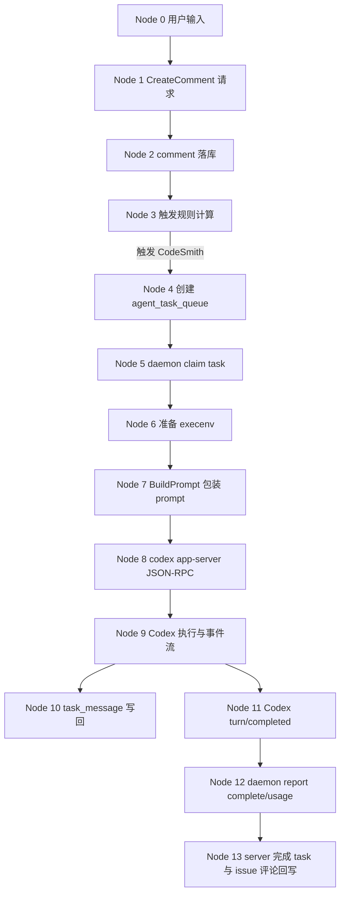
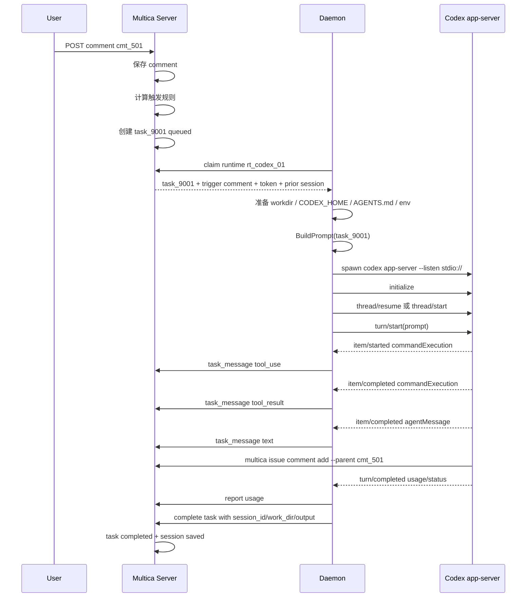

# Codex Prompt 与结果回写节点链路

本文只讲单 Agent 场景：

```text
用户 -> Multica -> CodeSmith -> Codex
```

不考虑 team / squad / leader。主例子使用 issue 底部“留下评论...”触发；文末补充“回复...”场景的差异。

核心问题是：

```text
用户输入长什么样
Multica 包装后的 prompt 长什么样
真正发给 Codex 的 JSON-RPC 长什么样
Codex 返回给 Multica 的事件和结果长什么样
```

## 0. 锚点数据

| 名称 | 示例值 | 含义 |
| --- | --- | --- |
| Workspace | `ws_7f3a` / `acme-ai` | 工作区 |
| Issue | `iss_42` / `ACME-42` | 用户协作任务 |
| Agent | `agt_codesmith` / `CodeSmith` | 单个智能体 |
| Runtime | `rt_codex_01` | CodeSmith 绑定的本地 runtime |
| Provider | `codex` | runtime 后端类型 |
| Comment | `cmt_501` | 用户本次输入 |
| Task | `task_9001` | 本次派给 Agent 的最小执行单元 |
| Codex thread | `codex-thread-abc` | Codex app-server 的会话 ID |
| Workdir | `.../task_9001/workdir` | Codex 的 cwd |
| CODEX_HOME | `.../task_9001/codex-home` | Codex 本次运行配置目录 |

用户在 issue 底部“留下评论...”：

```text
验证码过期时移动端没有 toast，接口返回 TOKEN_EXPIRED，帮我修一下。
```

## 1. 总览节点图



这条链路里，最重要的分界是：

```text
Node 0-4: server 决定要不要派工，以及派给谁。
Node 5-8: daemon 把 task 变成一次 Codex app-server turn。
Node 9-13: Codex 事件流和最终结果被 Multica 收回。
```

## 2. Node 0：用户输入

用户看到的是 issue 页面里的输入框。

评论场景：

```text
UI: 底部“留下评论...”
parent_id = null
```

用户输入：

```text
验证码过期时移动端没有 toast，接口返回 TOKEN_EXPIRED，帮我修一下。
```

这句话此时还不是 Codex prompt。它只是一次产品层输入。

## 3. Node 1：CreateComment 请求

前端或 CLI 调后端创建 comment，请求本质类似：

```json
{
  "issue_id": "iss_42",
  "content": "验证码过期时移动端没有 toast，接口返回 TOKEN_EXPIRED，帮我修一下。",
  "type": "comment",
  "parent_id": null
}
```

评论场景的关键字段：

```text
parent_id = null
```

这表示它是 issue 级新输入，而不是某条评论下面的 reply。

## 4. Node 2：comment 落库

后端先记录事实，生成 comment：

```json
{
  "id": "cmt_501",
  "issue_id": "iss_42",
  "workspace_id": "ws_7f3a",
  "author_type": "member",
  "author_id": "usr_chen",
  "content": "验证码过期时移动端没有 toast，接口返回 TOKEN_EXPIRED，帮我修一下。",
  "type": "comment",
  "parent_id": null
}
```

到这里仍然没有调用 Codex。Multica 只是保存了：

```text
谁，在什么 issue 下，说了什么。
```

## 5. Node 3：触发规则计算

创建 comment 后，后端用确定性代码规则判断是否触发 Agent，不是让 LLM 判断。

单 Agent 简化模型：

```text
有 @CodeSmith
  -> 强路由给 CodeSmith

没有 @，但 issue assignee = CodeSmith，且这是底部评论
  -> 默认路由给 CodeSmith

同一个 issue + CodeSmith 已经有 queued/dispatched task
  -> 不重复创建 task
```

本例假设：

```text
issue.assignee_type = agent
issue.assignee_id = agt_codesmith
没有已有 queued/dispatched task
```

所以触发结果是：

```text
cmt_501 -> enqueue task for CodeSmith
```

## 6. Node 4：创建 agent task

server 创建一条 `agent_task_queue` 记录：

```json
{
  "id": "task_9001",
  "workspace_id": "ws_7f3a",
  "issue_id": "iss_42",
  "agent_id": "agt_codesmith",
  "runtime_id": "rt_codex_01",
  "trigger_comment_id": "cmt_501",
  "status": "queued"
}
```

这里的 `task` 是给 Agent 派发的一次最小执行单元。

注意：

```text
task 不是 prompt。
task 是派工单。
```

## 7. Node 5：daemon claim task

本地 daemon 持续向 server claim 当前 runtime 可执行的 task。

claim 成功后，daemon 拿到的 task payload 可以理解为：

```json
{
  "task": {
    "id": "task_9001",
    "workspace_id": "ws_7f3a",
    "issue_id": "ACME-42",
    "agent_id": "agt_codesmith",
    "runtime_id": "rt_codex_01",
    "provider": "codex",
    "trigger_comment_id": "cmt_501",
    "trigger_comment_content": "验证码过期时移动端没有 toast，接口返回 TOKEN_EXPIRED，帮我修一下。",
    "trigger_thread_id": "cmt_501",
    "prior_session_id": "codex-thread-abc",
    "auth_token": "mat_task_scoped_token",
    "agent": {
      "name": "CodeSmith",
      "model": "",
      "thinking_level": "medium",
      "instructions": "默认用中文回复，先读 issue 和评论，再修改代码。",
      "custom_args": [],
      "mcp_config": null
    }
  }
}
```

如果是首次执行，`prior_session_id` 可能为空；如果同一 Agent 之前处理过这个 issue，server 会尽量返回上次保存的 Codex thread ID，供 daemon 后面 `thread/resume`。

## 8. Node 6：准备 execenv

daemon 还不能直接发 prompt。它先准备 Codex 的运行现场：

```text
task_9001/
  workdir/
    AGENTS.md
    .agent_context/
    repo files...

  codex-home/
    config.toml
    auth.json -> ~/.codex/auth.json
    sessions -> ~/.codex/sessions
    skills/
```

同时给 Codex 子进程注入环境变量：

```text
CODEX_HOME=.../task_9001/codex-home
MULTICA_TOKEN=mat_task_scoped_token
MULTICA_SERVER_URL=https://api.multica.ai
MULTICA_WORKSPACE_ID=ws_7f3a
MULTICA_AGENT_ID=agt_codesmith
MULTICA_TASK_ID=task_9001
PATH=<multica binary dir>:...
```

`PATH` 和 `MULTICA_*` 的组合让 Codex 能运行：

```bash
multica issue get ACME-42 --output json
multica issue comment list ACME-42 --thread cmt_501 --tail 30 --output json
multica issue comment add ACME-42 --parent cmt_501 --content-file ./reply.md
```

`AGENTS.md` 则告诉 Codex：

```text
你是 Multica 里的本地 coding agent。
要用 multica CLI 读取 issue/comment。
完成后把结果回复到 issue/comment。
```

## 9. Node 7：BuildPrompt 包装 prompt

`BuildPrompt` 会把 comment-triggered task 包装成一次明确的 Codex turn prompt。

近似内容：

```text
You are running as a local coding agent for a Multica workspace.

Your assigned issue ID is: ACME-42

[NEW COMMENT] A user just left a new comment. Focus on THIS comment — do not confuse it with previous ones:

> 验证码过期时移动端没有 toast，接口返回 TOKEN_EXPIRED，帮我修一下。

Start by running `multica issue get ACME-42 --output json` to understand your task, then decide how to proceed.

Read the triggering conversation first:
`multica issue comment list ACME-42 --thread cmt_501 --tail 30 --output json`
(that thread's root + its 30 newest replies).
Need cross-thread background? `multica issue comment list ACME-42 --recent 10 --output json`
(resolved threads come back folded — `--full` to expand).

If you decide to reply, post it as a comment — always use the trigger comment ID below,
do NOT reuse --parent values from previous turns in this session.

Write the reply body to a UTF-8 file with your file-write tool first, then post it with `--content-file`.

Use this form, preserving the same issue ID and --parent value:

    # 1. Write the reply body to a UTF-8 file (e.g. reply.md) with your file-write tool.
    # 2. Post the comment:
    multica issue comment add ACME-42 --parent cmt_501 --content-file ./reply.md
    # 3. Remove the temp file so a later run does not pick up stale content:
    rm ./reply.md
```

这段 prompt 做了四件事：

```text
1. 明确本次 task 属于哪个 issue。
2. 直接嵌入触发 comment，避免 Codex 错过本次核心输入。
3. 指示 Codex 用 multica CLI 拉取最新 issue/comment 状态。
4. 指定最后回复时应该挂到哪个 comment 下面。
```

## 10. Node 8：发给 Codex 的 JSON-RPC

Multica 不是运行：

```bash
codex "验证码过期时移动端没有 toast..."
```

而是启动：

```bash
codex app-server --listen stdio://
```

然后走 JSON-RPC。

初始化：

```json
{
  "method": "initialize",
  "id": 1,
  "params": {
    "clientInfo": {
      "name": "multica-agent-sdk",
      "title": "Multica Agent SDK",
      "version": "0.2.0"
    },
    "capabilities": {
      "experimentalApi": true
    }
  }
}
```

如果有历史 Codex thread：

```json
{
  "method": "thread/resume",
  "id": 2,
  "params": {
    "threadId": "codex-thread-abc",
    "cwd": ".../task_9001/workdir",
    "config": {
      "model_reasoning_effort": "medium"
    }
  }
}
```

没有历史 thread，或者 resume 可恢复失败，则走：

```json
{
  "method": "thread/start",
  "id": 2,
  "params": {
    "cwd": ".../task_9001/workdir",
    "persistExtendedHistory": true,
    "config": {
      "model_reasoning_effort": "medium"
    }
  }
}
```

真正把包装 prompt 发给 Codex：

```json
{
  "method": "turn/start",
  "id": 3,
  "params": {
    "threadId": "codex-thread-abc",
    "input": [
      {
        "type": "text",
        "text": "You are running as a local coding agent for a Multica workspace.\n\nYour assigned issue ID is: ACME-42\n\n[NEW COMMENT] ..."
      }
    ],
    "effort": "medium"
  }
}
```

这里 `text` 字段就是 Node 7 的包装 prompt。

## 11. Node 9：Codex 执行与事件流

Codex 会一边执行，一边向 app-server client 输出事件。

比如它先读取 issue：

```json
{
  "method": "item/started",
  "params": {
    "item": {
      "type": "commandExecution",
      "command": "multica issue get ACME-42 --output json"
    }
  }
}
```

然后读取评论线程：

```json
{
  "method": "item/started",
  "params": {
    "item": {
      "type": "commandExecution",
      "command": "multica issue comment list ACME-42 --thread cmt_501 --tail 30 --output json"
    }
  }
}
```

接着修改代码：

```json
{
  "method": "item/started",
  "params": {
    "item": {
      "type": "fileChange",
      "path": "apps/mobile/src/login/verify-code.ts"
    }
  }
}
```

最后可能写回复文件并调用 CLI 回帖：

```json
{
  "method": "item/started",
  "params": {
    "item": {
      "type": "commandExecution",
      "command": "multica issue comment add ACME-42 --parent cmt_501 --content-file ./reply.md"
    }
  }
}
```

注意这个 comment 是 Codex 通过 `multica` CLI 主动写回 server 的。Multica 不是只等最终 stdout 再生成 UI 文本；Agent 在执行中就可以调用 CLI 产生真实业务副作用。

## 12. Node 10：事件映射成 task_message

`codexBackend` 会把 Codex 事件映射成统一的 `agent.Message`，daemon 再上报成 `task_message`。

示例：命令开始。

Codex event：

```json
{
  "method": "item/started",
  "params": {
    "item": {
      "type": "commandExecution",
      "command": "multica issue get ACME-42 --output json"
    }
  }
}
```

Multica task message：

```json
{
  "task_id": "task_9001",
  "type": "tool_use",
  "tool": "exec_command",
  "input": "multica issue get ACME-42 --output json"
}
```

示例：命令完成。

```json
{
  "task_id": "task_9001",
  "type": "tool_result",
  "tool": "exec_command",
  "output": "{ \"id\": \"iss_42\", \"identifier\": \"ACME-42\", \"title\": \"登录验证码过期后 toast 不显示\" }"
}
```

示例：模型文本。

```json
{
  "task_id": "task_9001",
  "type": "text",
  "content": "我定位到移动端 TOKEN_EXPIRED 分支没有调用 toast，正在补修复和测试。"
}
```

这些 task messages 用于前端执行日志、transcript、实时进度展示。

## 13. Node 11：Codex turn/completed

当本次 turn 结束，Codex 发完成事件：

```json
{
  "method": "turn/completed",
  "params": {
    "turn": {
      "id": "turn_456",
      "status": "completed",
      "usage": {
        "input_tokens": 12000,
        "output_tokens": 1800,
        "cached_input_tokens": 3000
      }
    }
  }
}
```

`codexBackend` 汇总成 provider-agnostic 的 `agent.Result`：

```json
{
  "status": "completed",
  "output": "我定位到移动端 TOKEN_EXPIRED 分支没有调用 toast，已补充处理并更新测试。",
  "session_id": "codex-thread-abc",
  "usage": {
    "gpt-5-codex": {
      "input_tokens": 12000,
      "output_tokens": 1800,
      "cache_read_tokens": 3000,
      "cache_write_tokens": 0
    }
  }
}
```

这里的 `session_id` 是后续 resume 的关键。

## 14. Node 12：daemon report complete/usage

daemon 把 usage 和完成结果报回 server。

usage：

```json
{
  "task_id": "task_9001",
  "usage": [
    {
      "model": "gpt-5-codex",
      "input_tokens": 12000,
      "output_tokens": 1800,
      "cache_read_tokens": 3000,
      "cache_write_tokens": 0
    }
  ]
}
```

complete：

```json
{
  "task_id": "task_9001",
  "output": "我定位到移动端 TOKEN_EXPIRED 分支没有调用 toast，已补充处理并更新测试。",
  "session_id": "codex-thread-abc",
  "work_dir": ".../task_9001/workdir"
}
```

如果 Codex 在执行中已经用 `multica issue comment add` 发过回复，server 完成 task 时不会再无意义重复发一条。若没有任何 Agent comment，`CompleteTask` 有兜底逻辑，可以用 final output 生成一条 issue comment。

## 15. Node 13：server 完成 task 与 issue 评论回写

server 最终把 task 标记为 completed：

```json
{
  "id": "task_9001",
  "status": "completed",
  "session_id": "codex-thread-abc",
  "work_dir": ".../task_9001/workdir",
  "result": {
    "output": "我定位到移动端 TOKEN_EXPIRED 分支没有调用 toast，已补充处理并更新测试。"
  }
}
```

同时，用户在 issue 页面能看到 Agent 的评论，例如：

```text
CodeSmith:
已定位：移动端登录验证码过期时，`TOKEN_EXPIRED` 分支只更新了错误状态，没有调用 toast。

已处理：
1. 在 mobile login 错误处理分支补充 toast 展示。
2. 增加 TOKEN_EXPIRED 的回归测试。
3. 本地验证相关测试通过。
```

这个评论可能来自两种路径：

```text
优先路径：Codex 执行中主动运行 `multica issue comment add ...`
兜底路径：task complete 时，server 用 final output 补一条评论
```

## 16. 节点级时序图



## 17. 回复场景的差异

如果用户不是底部“留下评论...”，而是在某条评论下点“回复...”：

```text
用户回复：
继续检查移动端登录页的错误处理。
```

底层 comment 变成：

```json
{
  "id": "cmt_502",
  "issue_id": "iss_42",
  "content": "继续检查移动端登录页的错误处理。",
  "parent_id": "cmt_agent_123"
}
```

差异点：

```text
1. parent_id 不为空，表示这是 thread 级输入。
2. 后端触发规则会参考 parent/thread 关系。
3. claim response 会带 trigger_comment_id = cmt_502。
4. prompt 会直接嵌入 cmt_502 的内容。
5. prompt 会引导 Codex 优先读取 cmt_502 所在 thread。
6. Codex 最后回复时使用 --parent cmt_502，而不是复用旧 parent。
```

回复场景的 prompt 近似：

```text
[NEW COMMENT] A user just left a new comment. Focus on THIS comment — do not confuse it with previous ones:

> 继续检查移动端登录页的错误处理。

Start by running `multica issue get ACME-42 --output json` to understand your task, then decide how to proceed.

Read the triggering conversation first:
`multica issue comment list ACME-42 --thread cmt_agent_123 --tail 30 --output json`

If you decide to reply:
multica issue comment add ACME-42 --parent cmt_502 --content-file ./reply.md
```

注意：

```text
--thread 用于读讨论串。
--parent 用于把 Agent 的结果挂到本次触发 comment 下面。
```

## 18. 一句话心智模型

```text
用户输入不是直接给 Codex。

用户输入先变成 comment；
comment 触发 task；
daemon 用 task 准备 workdir/CODEX_HOME/env；
BuildPrompt 把 trigger comment 包装成当前 turn prompt；
codexBackend 用 JSON-RPC turn/start 发给 Codex；
Codex 通过 multica CLI 拉取最新 issue/comment 并回写评论；
Multica 把 Codex 事件转成 task_message，把最终 result/usage/session_id 写回 task。
```

如果只记一个链路：

```text
comment
  -> task
  -> execenv
  -> wrapped prompt
  -> JSON-RPC turn/start
  -> Codex events
  -> task_message
  -> issue comment + task complete
```
