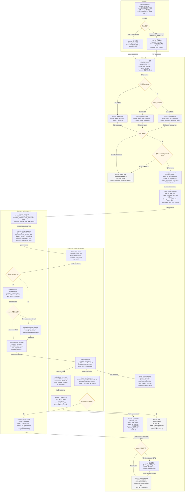

```mermaid
flowchart TD
    classDef decision fill:#fff7e6,stroke:#c47f00,stroke-width:1px,color:#2f2100;
    classDef terminal fill:#f4f4f5,stroke:#a1a1aa,color:#18181b;

    subgraph UI["User / UI"]
        direction TB
        U0["User/UI | 用户输入<br/>{&quot;issue&quot;:&quot;ACME-42&quot;, &quot;text&quot;:&quot;验证码过期时移动端没有 toast，接口返回 TOKEN_EXPIRED，帮我修一下。&quot;}"]
        D0{"输入类型?"}
        U1["User/UI | 评论请求<br/>{&quot;issue_id&quot;:&quot;iss_42&quot;, &quot;content&quot;:&quot;验证码过期...&quot;, &quot;parent_id&quot;:null}"]
        U2["User/UI | 回复请求<br/>{&quot;issue_id&quot;:&quot;iss_42&quot;, &quot;content&quot;:&quot;继续检查移动端...&quot;, &quot;parent_id&quot;:&quot;cmt_parent&quot;}"]
    end

    subgraph SERVER["Multica Server"]
        direction TB
        S1["Server | comment 落库<br/>{&quot;id&quot;:&quot;cmt_501&quot;, &quot;issue_id&quot;:&quot;iss_42&quot;, &quot;author_type&quot;:&quot;member&quot;, &quot;parent_id&quot;:null, &quot;content&quot;:&quot;验证码过期...&quot;}"]
        D1{"有显式 @Agent?"}
        D2{"parent_id 为空?"}
        R1["Server | @ 路由结果<br/>{&quot;target_agent&quot;:&quot;@Agent&quot;, &quot;source&quot;:&quot;mention&quot;}"]
        R2["Server | 评论默认路由<br/>{&quot;target_agent&quot;:&quot;agt_codesmith&quot;, &quot;source&quot;:&quot;issue_assignee&quot;}"]
        R3["Server | 回复线程路由<br/>{&quot;target_agent&quot;:&quot;agt_codesmith&quot;, &quot;source&quot;:&quot;thread_or_assignee_rule&quot;}"]
        D3{"触发 Agent?"}
        D4{"已有 queued/dispatched task?"}
        S2["Server | 不新建 task<br/>{&quot;comment_saved&quot;:true, &quot;new_task&quot;:false, &quot;reason&quot;:&quot;coalesce_into_pending_task&quot;}"]
        S3["Server | queued task<br/>{&quot;id&quot;:&quot;task_9001&quot;, &quot;agent_id&quot;:&quot;agt_codesmith&quot;, &quot;runtime_id&quot;:&quot;rt_codex_01&quot;, &quot;trigger_comment_id&quot;:&quot;cmt_501&quot;, &quot;status&quot;:&quot;queued&quot;}"]
        S4["Server | claim response<br/>{&quot;task_id&quot;:&quot;task_9001&quot;, &quot;trigger_comment&quot;:&quot;验证码过期...&quot;, &quot;prior_session_id&quot;:&quot;codex-thread-abc&quot;, &quot;auth_token&quot;:&quot;mat_task_token&quot;}"]
        S5["Server | task_message<br/>{&quot;task_id&quot;:&quot;task_9001&quot;, &quot;type&quot;:&quot;tool_use&quot;, &quot;tool&quot;:&quot;exec_command&quot;, &quot;input&quot;:&quot;multica issue get ACME-42 --output json&quot;}"]
        S6["Server | Agent 评论<br/>{&quot;id&quot;:&quot;cmt_777&quot;, &quot;author_type&quot;:&quot;agent&quot;, &quot;parent_id&quot;:&quot;cmt_501&quot;, &quot;content&quot;:&quot;已定位并修复 TOKEN_EXPIRED toast。&quot;}"]
        D8{"Agent 已主动评论?"}
        S7["Server | 兜底评论<br/>{&quot;author_type&quot;:&quot;agent&quot;, &quot;parent_id&quot;:&quot;cmt_501&quot;, &quot;content&quot;:&quot;&lt;final output&gt;&quot;}"]
        S8["Server | task completed<br/>{&quot;id&quot;:&quot;task_9001&quot;, &quot;status&quot;:&quot;completed&quot;, &quot;session_id&quot;:&quot;codex-thread-abc&quot;, &quot;work_dir&quot;:&quot;.../workdir&quot;}"]
        S9["Server | task failed/cancelled<br/>{&quot;id&quot;:&quot;task_9001&quot;, &quot;status&quot;:&quot;failed|cancelled&quot;, &quot;reason&quot;:&quot;&lt;classified_reason&gt;&quot;}"]
    end

    subgraph DAEMON["Daemon / codexBackend"]
        direction TB
        M0["Daemon | execenv<br/>{&quot;workdir&quot;:&quot;.../task_9001/workdir&quot;, &quot;CODEX_HOME&quot;:&quot;.../task_9001/codex-home&quot;, &quot;MULTICA_TOKEN&quot;:&quot;mat_task_token&quot;}"]
        M1["Daemon | wrapped prompt<br/>{&quot;issue_id&quot;:&quot;ACME-42&quot;, &quot;trigger_comment_id&quot;:&quot;cmt_501&quot;, &quot;prompt&quot;:&quot;[NEW COMMENT] 验证码过期...; run multica issue get; reply --parent cmt_501&quot;}"]
        D5{"有 prior_session_id?"}
        M2["codexBackend | thread/resume<br/>{&quot;method&quot;:&quot;thread/resume&quot;, &quot;threadId&quot;:&quot;codex-thread-abc&quot;, &quot;cwd&quot;:&quot;.../workdir&quot;}"]
        D6{"resume 可恢复失败?"}
        M3["codexBackend | thread/start<br/>{&quot;method&quot;:&quot;thread/start&quot;, &quot;cwd&quot;:&quot;.../workdir&quot;, &quot;persistExtendedHistory&quot;:true}"]
        M4["codexBackend | turn/start<br/>{&quot;method&quot;:&quot;turn/start&quot;, &quot;threadId&quot;:&quot;codex-thread-abc&quot;, &quot;input.text&quot;:&quot;&lt;wrapped prompt&gt;&quot;}"]
        M5["Daemon | agent.Result<br/>{&quot;status&quot;:&quot;completed&quot;, &quot;output&quot;:&quot;已定位并修复...&quot;, &quot;session_id&quot;:&quot;codex-thread-abc&quot;, &quot;usage&quot;:&quot;12000/1800&quot;}"]
    end

    subgraph CODEX["Codex app-server / multica CLI"]
        direction TB
        C0["Codex | app-server<br/>{&quot;process&quot;:&quot;codex app-server --listen stdio://&quot;, &quot;transport&quot;:&quot;JSON-RPC over stdio&quot;}"]
        C1["Codex | tool event<br/>{&quot;method&quot;:&quot;item/started&quot;, &quot;type&quot;:&quot;commandExecution&quot;, &quot;command&quot;:&quot;multica issue get ACME-42 --output json&quot;}"]
        C2["Codex | reply command<br/>{&quot;command&quot;:&quot;multica issue comment add ACME-42 --parent cmt_501 --content-file ./reply.md&quot;}"]
        C3["multica CLI | API 写回<br/>{&quot;api&quot;:&quot;POST issue comment&quot;, &quot;parent_id&quot;:&quot;cmt_501&quot;, &quot;content_file&quot;:&quot;reply.md&quot;}"]
        C4["Codex | turn/completed<br/>{&quot;status&quot;:&quot;completed|failed|cancelled&quot;, &quot;threadId&quot;:&quot;codex-thread-abc&quot;, &quot;usage&quot;:{&quot;in&quot;:12000, &quot;out&quot;:1800}}"]
        D7{"turn status completed?"}
    end

    U0 -- "点击发送" --> D0
    D0 -- "评论：parent_id=null" --> U1
    D0 -- "回复：parent_id=comment_id" --> U2
    U1 -- "POST /comments" --> S1
    U2 -- "POST /comments" --> S1

    S1 -- "解析 mention" --> D1
    D1 -- "是：强路由" --> R1
    D1 -- "否" --> D2
    D2 -- "是：评论场景" --> R2
    D2 -- "否：回复场景" --> R3
    R1 -- "得到 target_agent" --> D3
    R2 -- "得到 target_agent" --> D3
    R3 -- "得到 target_agent 或 null" --> D3
    D3 -- "否：只保留 comment" --> S2
    D3 -- "是" --> D4
    D4 -- "是：合并唤醒信号" --> S2
    D4 -- "否：enqueue" --> S3

    S3 -- "daemon claim runtime" --> S4
    S4 -- "claim response" --> M0
    M0 -- "InjectRuntimeConfig + env" --> M1
    M1 -- "spawn process" --> C0
    C0 -- "initialize / initialized" --> D5
    D5 -- "是" --> M2
    D5 -- "否" --> M3
    M2 -- "thread/resume" --> D6
    D6 -- "否：resume 成功" --> M4
    D6 -- "是：fallback fresh thread" --> M3
    M3 -- "thread/start" --> M4
    M4 -- "JSON-RPC turn/start" --> C1

    C1 -- "emit item event" --> S5
    C1 -- "Codex 决定回复" --> C2
    C2 -- "执行 multica CLI" --> C3
    C3 -- "POST comment API" --> S6
    C1 -- "继续执行/修改/测试" --> C4
    C4 --> D7
    D7 -- "否" --> S9
    D7 -- "是" --> M5
    M5 -- "report usage + complete task" --> D8
    D8 -- "是：不补评论" --> S8
    D8 -- "否：用 final output 补评论" --> S7
    S7 -- "create fallback comment" --> S8

    class D0,D1,D2,D3,D4,D5,D6,D7,D8 decision;
    class S2,S8,S9 terminal;
```
