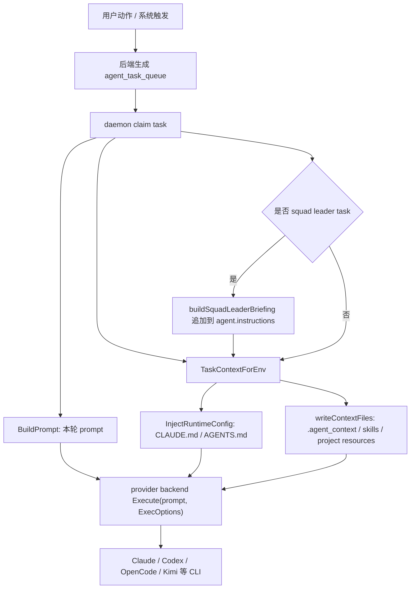

# Agent Prompt 与运行指令分类目录

这份文档只整理“代码里写死、并可能进入 agent 运行上下文”的 prompt / instruction。它不是 UI 文案清单，也不是把所有变量名里带 `prompt` 的地方都列出来。

要点：

- Multica 给 provider 的直接输入不是只有一段 prompt，而是多层上下文叠加。
- 每次 task 启动时，daemon 会先构造一段“本轮 prompt”，再把运行时规则写入 `CLAUDE.md` / `AGENTS.md`，再写 `.agent_context/issue_context.md` 和 skills。
- Codex 路径下，本轮 prompt 通过 `codex app-server` 的 `turn/start.input` 发送；运行时大说明主要靠工作目录里的 `AGENTS.md` 被 Codex 自己读取。
- Claude 路径下，本轮 prompt 通过 stream-json stdin 发送；运行时大说明主要靠工作目录里的 `CLAUDE.md` 被 Claude Code 自己读取。
- `openclaw` / `kimi` / `kiro` 额外会把运行时 brief 作为 inline system prompt 传进去，因为这些 provider 的 cwd 文件加载不够可靠。

## Prompt 分层图



上图里最容易混淆的是两条线：

- `BuildPrompt` 是“这一轮用户到底让 agent 干什么”的短 prompt。
- `InjectRuntimeConfig` 是“Multica 运行协议、CLI 用法、怎么回复、怎么读评论、怎么避免 mention loop”的长说明。

## 一、本轮 task prompt

源码入口：`server/internal/daemon/prompt.go`

`BuildPrompt(task, provider)` 按 task 类型分发。优先级是：

```text
chat -> comment-triggered -> autopilot run_only -> quick-create -> assignment/default
```

也就是说，传给 `agent.Backend.Execute(ctx, prompt, opts)` 的 `prompt` 只来自这里。

| 类型 | 触发条件 | prompt 入口 | 进入 agent 的关键内容 | 要点 |
| --- | --- | --- | --- | --- |
| assignment/default | issue 被分配给 agent，且不是 comment/chat/autopilot/quick-create | `BuildPrompt` default branch | issue id、可选 handoff note、要求先 `multica issue get`、再读最近活跃评论 thread | 这是“接到一个 issue”的普通执行 prompt |
| comment-triggered | `task.TriggerCommentID != ""` | `buildCommentPrompt` | issue id、触发 comment 正文、触发者是 user/agent、读 thread 的命令、回复时必须用当前 `--parent` | 评论 / 回复最终都进入这个路径，区别在 trigger comment / thread / parent |
| quick-create | `task.QuickCreatePrompt != ""` | `buildQuickCreatePrompt` | 用户自然语言输入、如何生成 title/description/priority/assignee/project/parent、只能执行一次 `issue create` | 这是“把一句话转成 issue”的 prompt，不存在旧 issue 可读 |
| chat | `task.ChatSessionID != ""` | `buildChatPrompt` | 用户 chat message、显式选择的 slash skills、附件 id | 这是直接聊天，不要求发 issue comment |
| autopilot run_only | `task.AutopilotRunID != ""` | `buildAutopilotPrompt` | autopilot run id/source/payload/description，禁止 `issue get` | run_only 没有 issue，最终输出被捕获为 autopilot run result |

### 1. Assignment / 默认 issue prompt

典型形态：

```text
You are running as a local coding agent for a Multica workspace.

Your assigned issue ID is: <issue-id>

Start by running `multica issue get <issue-id> --output json` to understand your task, then complete it.
For comment history ... `multica issue comment list <issue-id> --recent 10 --output json` ...
```

如果存在 `HandoffNote`，中间会插入：

```text
You were handed this issue with a handoff note. Treat it as the assigner's scoping instruction for this run...

> <handoff note>
```

作用：告诉 agent“你现在被分配了一个 issue，先用 CLI 读 issue，再干活”。issue title / description / comments 不直接塞进这段 prompt，而是要求 agent 通过 `multica issue get` 和 `multica issue comment list` 拉取。

### 2. Comment-triggered prompt

典型形态：

```text
You are running as a local coding agent for a Multica workspace.

Your assigned issue ID is: issue-123

[NEW COMMENT] A user just left a new comment. Focus on THIS comment — do not confuse it with previous ones:

> 登录后跳回首页，帮我修一下，优先看 auth callback。

Start by running `multica issue get issue-123 --output json` to understand your task, then decide how to proceed.
Read the triggering conversation first: `multica issue comment list issue-123 --thread cmt-456 --tail 30 --output json` ...

If you decide to reply, post it as a comment — always use the trigger comment ID below...
multica issue comment add issue-123 --parent cmt-456 --content-file ./reply.md
rm ./reply.md
```

这里有几个硬规则：

- 触发 comment 正文会被直接嵌入 prompt，避免 agent 漏看当前新消息。
- 如果触发者是另一个 agent，会额外提示避免“谢谢 / 收到 / 不用回复”这类 agent-to-agent loop。
- 如果当前 agent 是 squad leader，会额外提示 `no_action` 时只调用 `multica squad activity ... no_action`，不要再发一条“我不处理”的噪声评论。
- 回复必须用当前触发 comment 的 id 作为 `--parent`，不能复用旧轮次的 parent。

### 3. Quick-create prompt

quick-create 是约束较多的一类 prompt，因为它要把用户一句话变成结构化 issue。

典型用户输入：

```text
让 @前端小队 review PR #123，优先看登录跳转问题，P1
```

agent 收到的 prompt 会强调：

- 当前没有 existing issue。
- 只能执行一次 `multica issue create --output json`。
- title 要简洁但保留语义。
- description 是后续执行 agent 的主要上下文，要高保真复述用户意图。
- 去掉“创建 issue / 分配给 X / 让 @X 处理”这类路由包装，但保留任务内容。
- 如果用户写的是 `cc @Y`，要把 member mention 作为 `CC: [@Y](mention://member/<uuid>)` 放进 description。
- 如果用户指定 assignee，要查 `workspace member list` / `agent list` / `squad list` 找 UUID。
- 如果 quick-create picker 选的是 squad，默认 assignee 是 squad id，不是 leader agent id。
- 不允许 `issue get`，也不允许 `issue comment add`。

作用：quick-create 的 prompt 是“自然语言到 issue create 命令”的编译器说明。

### 4. Chat prompt

典型形态：

```text
You are running as a chat assistant for a Multica workspace.
A user is chatting with you directly. Respond to their message.

Explicitly selected skills:
- <skill name>

User message:
<chat message>

Attachments on this message:
- id=<attachment-id> filename="error.png" content_type=image/png
Use `multica attachment download <id>` to fetch each file locally before referring to it.
```

chat 和 issue task 的关键区别：

- chat 的最终回复直接回 chat 窗口。
- issue task 的最终结果必须通过 `multica issue comment add` 发到 issue 上。

### 5. Autopilot run_only prompt

典型形态：

```text
You are running as a local coding agent for a Multica workspace.

This task was triggered by an Autopilot in run-only mode. There is no assigned Multica issue for this run.

Autopilot run ID: run-123
Autopilot ID: autopilot-456
Autopilot title: Daily repo summary
Trigger source: schedule
Trigger payload:
{ ... }

Autopilot instructions:
<autopilot.description>

Do not run `multica issue get`; this run does not have an issue ID.
```

作用：run_only 是“无 issue 的一次 agent run”。如果需要产生长期可见结果，必须由 autopilot description 自己要求写到某个地方，否则最终输出只作为 run result 捕获。

## 二、运行时 brief: CLAUDE.md / AGENTS.md

源码入口：

- `server/internal/daemon/execenv/runtime_config.go`
- `server/internal/daemon/execenv/runtime_config_sections.go`
- `server/internal/daemon/execenv/runtime_config_kind.go`

`InjectRuntimeConfig(workDir, provider, ctx)` 会生成 `# Multica Agent Runtime` 这份大说明，并写入 provider 对应文件：

| Provider | 写入文件 | 备注 |
| --- | --- | --- |
| `claude`, `codebuddy` | `CLAUDE.md` | Claude-family 原生读取 |
| `codex`, `copilot`, `opencode`, `openclaw`, `hermes`, `pi`, `cursor`, `kimi`, `kiro`, `antigravity`, `qoder` | `AGENTS.md` | 大多数 provider 读取 `AGENTS.md` 或工作目录指令 |
| unknown provider | 不写文件 | 退化为 prompt-only |

这份 brief 的作用不是描述具体任务，而是定义 Multica 环境中的工作规则。主要 section：

| Section | 作用 |
| --- | --- |
| `# Multica Agent Runtime` | 声明 agent 在 Multica 平台内工作，使用 `multica` CLI |
| `## Background Task Safety` | 不要在后台任务、子 agent、异步工具还没收敛时结束本轮 |
| `## Agent Identity` | 注入 agent 名字、id、`agent.instructions` |
| `## Requesting User` | 注入 runtime owner 的用户画像，作为背景，不覆盖 task |
| `## Task Initiator` | 注入当前触发者是谁，用于多人 workspace 的归因和权限判断 |
| `## Workspace Context` | 注入 workspace owner 设置的 workspace-level system prompt |
| `## Available Commands` | 告诉 agent 可用的 `multica` CLI 命令和推荐 `--output json` |
| `## Comment Formatting` | 强制 agent-authored comment 先写 UTF-8 文件，再用 `--content-file` |
| `## Repositories` | workspace/project 可 checkout 的 repo |
| `## Project Context` | project description 和 project resources |
| `## Issue Metadata` | 什么时候读/写 issue metadata，什么不该写 |
| `### Workflow` | 按 assignment/comment/chat/quick-create/autopilot 分类的工作流 |
| `## Sub-issue Creation` | 子 issue 的 `todo`/`backlog`/`stage` 语义 |
| `## Skills` | 已安装 skill 名称和描述 |
| `## Mentions` | `mention://issue/member/agent` 的含义和何时不要 mention |
| `## Attachments` | 附件通过 CLI 下载，不直接访问 URL |
| `## Important: Always Use the multica CLI` | 禁止绕过 CLI 用 curl/wget 直接打 Multica API |
| `## Output` | 最终结果的交付位置：issue comment / chat reply / stdout / autopilot result |

### legacy brief 与 slim brief

代码里有两套 brief：

- `runtime_config.go` 里的 legacy verbose brief，当前注释说 production 默认仍是这个。
- `runtime_config_sections.go` 里的 slim brief，由 `runtime_brief_slim` feature flag 控制，按 task kind 做 section gating。

slim brief 的分类矩阵在代码里写得很明确：

| Section | comment | assignment | autopilot | quick-create | chat |
| --- | --- | --- | --- | --- | --- |
| Available Commands | full | full | full | minimal | full |
| Comment Formatting | yes | yes | no | no | no |
| Repositories | data-driven | data-driven | data-driven | no | data-driven |
| Project Context | data-driven | data-driven | no | no | no |
| Issue Metadata | yes | yes | no | no | no |
| Instruction Precedence | no | yes | no | no | no |
| Sub-issue Creation | yes | yes | no | no | no |
| Skills | yes | yes | yes | no | yes |
| Mentions | yes | yes | no | no | no |
| Attachments | yes | yes | no | no | no |

作用：slim brief 不改变规则，只是减少无关 section，降低上下文体积。

## 三、`.agent_context/issue_context.md`

源码入口：`server/internal/daemon/execenv/context.go`

`writeContextFiles` 会写 sidecar 文件，其中包括：

```text
.agent_context/issue_context.md
```

它是“任务事实摘要”，不是主要行为规则。行为规则仍在 `AGENTS.md` / `CLAUDE.md` 和本轮 prompt 里。

| task 类型 | issue_context 内容 |
| --- | --- |
| issue assignment / comment | `# Task Assignment`、issue id、trigger 是 Comment Reply 还是 New Assignment、handoff note、quick start、agent skills |
| quick-create | `# Quick Create`、trigger 是 quick-create modal、用户输入、agent skills |
| autopilot run_only | `# Autopilot Run`、run id、autopilot id/title/source/payload、quick start、autopilot instructions、agent skills |

交给 agent 的上下文可以分三层：

```text
本轮 prompt: 当前这次要做什么
AGENTS.md/CLAUDE.md: 在 Multica 里必须怎么做
.agent_context/issue_context.md: 当前 task 的事实索引
```

## 四、comment / reply 专用指令

源码入口：`server/internal/daemon/execenv/reply_instructions.go`

这里有两类指令：

### 1. 读 comment 的 hint

根据是否有 prior session / since cursor / new comment count，生成不同提示：

| 函数 | 场景 | 指令含义 |
| --- | --- | --- |
| `BuildNewCommentsHint` | warm path，有新评论计数和 since cursor | 先读触发 comment 所在 thread；只有需要时再 issue-wide catch up |
| `BuildResumedCommentsHint` | 复用 prior session，且没有其他新评论 | 触发 comment 已在本轮 prompt；如果依赖 thread context，再用 `--thread ... --tail 30` 拉一下 |
| `BuildColdCommentsHint` | cold path，没有 prior run | 先读触发 conversation：`--thread <id> --tail 30`，跨 thread 背景再用 `--recent 10` |

重点：server 不把 cmt2/cmt3 正文主动塞进 prompt，只给数量、cursor、thread anchor。agent 需要时用 CLI 拉。

### 2. 发 reply 的硬规则

`BuildCommentReplyInstructions` 每次 comment-triggered prompt 都会重新注入：

```text
If you decide to reply, post it as a comment — always use the trigger comment ID below,
do NOT reuse --parent values from previous turns in this session.

Write the reply body to a UTF-8 file with your file-write tool first,
then post it with `--content-file`.

multica issue comment add <issue-id> --parent <trigger-comment-id> --content-file ./reply.md
rm ./reply.md
```

为什么这么强：

- inline `--content` 会被 shell 改写反引号、`$()`、变量、引号和换行。
- heredoc / stdin 在多 flag 场景容易吞掉后续 flag。
- Windows PowerShell 5.1 管道可能把非 ASCII 变成 `?`。
- resumed session 可能复制上一轮的 `--parent`，所以必须重复提醒当前 parent。

## 五、Squad leader briefing

源码入口：`server/internal/handler/squad_briefing.go`

当 task 是 squad leader task，并且存在 `squad_id` 时，后端会把一段 hard-coded briefing 追加到 leader 的 `agent.instructions` 里。这个 briefing 之后又会通过 `## Agent Identity` 注入运行时 brief。

完整结构：

```text
## Squad Operating Protocol

<硬编码协议>

## Squad Roster

Leader (you):
- <leader> — agent — `[@Leader](mention://agent/<leader-id>)`

Members:
- <member> — agent/member — role/skills — `[@Name](mention://agent|member/<id>)`

## Squad Instructions (<squad name>)

<squad.instructions，可选>
```

`Squad Operating Protocol` 的核心规则：

- leader 是 coordinator，不是默认执行者。
- 先读 issue 和评论，按 roster 的 role / skills 选择成员。
- delegation 必须发一条包含完整 mention markdown 的 comment。
- 不能写普通 `@name`，必须写 `[@Name](mention://agent/<UUID>)` 或 roster 中给出的格式。
- delegation comment 要短，只写“选谁、为什么、额外约束”，不要复述 issue。
- 每次 trigger 都要调用 `multica squad activity <issue-id> action|no_action|failed --reason "..."`。
- dispatch 后停止，不继续写代码。
- 没有合适成员时才可以说明 gap，不能静默自己做。
- 创建 child issue 并分配 agent 与在父 issue @mention agent 二选一，不要双触发。

作用：这是 squad 模式里约束最重的一段 prompt。它把 leader 固定成“协调者”，并用 mention link 把任务送给 teammate。

## 六、Skills: 内置技能和用户技能

源码入口：

- `server/internal/service/builtin_skills.go`
- `server/internal/service/builtin_skills/*/SKILL.md`
- `server/internal/daemon/execenv/context.go`

代码注释写得很明确：每个 agent 除了 workspace-bound skills，还会拿到 built-in skills。这些 skill 是 prompt-like instruction assets，但不是每一轮都完整塞进本轮 prompt。

存储和物化方式要分开看：

```text
server DB:
  skill.content      = 主 SKILL.md 内容
  skill_file.path    = 支持文件相对路径，例如 scripts/check.sh
  skill_file.content = 支持文件内容
  agent_skill        = 哪些 agent 绑定了这个 skill

daemon 执行时:
  claim 拿到 skill_refs 或 skill bundle
  bundle 里带完整 content/files
  daemon 再把它们写成 provider 能发现的真实文件
```

所以 `skill` / `skill_file` 存的是内容，不只是“记录一个本地文件路径”。`SKILL.md`、脚本、模板文件是在 task 准备阶段物化出来的。

这和 `CLAUDE.md` / `AGENTS.md` 不冲突：后者是 Multica runtime brief，用 managed block 写入工作目录根部；skill 则写到 provider 的 skills 目录下。skill 自己如果也带一个 `SKILL.md` 支持文件，代码会把它视为保留路径并跳过，因为主内容已经来自 `skill.content`。如果 Multica skill 的目录名和用户本机已有 skill 重名，daemon 会分配 `-multica` / `-multica-2` 这类 sibling 目录，不覆盖用户文件。

内置 skills：

| Skill | 文件 | 什么时候用 |
| --- | --- | --- |
| `multica-working-on-issues` | `server/internal/service/builtin_skills/multica-working-on-issues/SKILL.md` | 在 issue 上工作时，理解 PR link、metadata、status side effects、sub-issue enqueue 等产品契约 |
| `multica-mentioning` | `server/internal/service/builtin_skills/multica-mentioning/SKILL.md` | 需要构造 mention link、触发 agent/squad/human notification 时 |
| `multica-squads` | `server/internal/service/builtin_skills/multica-squads/SKILL.md` | 创建、检查、更新、debug squad 时 |
| `multica-creating-agents` | `server/internal/service/builtin_skills/multica-creating-agents/SKILL.md` | 创建/检查/debug agent 字段、runtime_config、custom_env、skills 绑定时 |
| `multica-autopilots` | `server/internal/service/builtin_skills/multica-autopilots/SKILL.md` | 创建、更新、触发、debug autopilot 时 |
| `multica-projects-and-resources` | `server/internal/service/builtin_skills/multica-projects-and-resources/SKILL.md` | 管理 project/resource，理解 project context 怎么进入 future tasks |
| `multica-runtimes-and-repos` | `server/internal/service/builtin_skills/multica-runtimes-and-repos/SKILL.md` | debug runtime、daemon claim、repo checkout、workdir/session reuse |
| `multica-skill-importing` | `server/internal/service/builtin_skills/multica-skill-importing/SKILL.md` | 导入/install skill、处理 conflict、绑定 skill 到 agent |

provider 发现方式：

| Provider | skills 写入位置 |
| --- | --- |
| Claude / CodeBuddy | `{workDir}/.claude/skills/<name>/SKILL.md` |
| Codex | per-task `CODEX_HOME` 管理，非 `writeContextFiles` 直接写 workdir |
| Copilot | `{workDir}/.github/skills/<name>/SKILL.md` |
| OpenCode | `{workDir}/.opencode/skills/<name>/SKILL.md` |
| OpenClaw | `{workDir}/skills/<name>/SKILL.md` |
| Pi | `{workDir}/.pi/skills/<name>/SKILL.md` |
| Cursor | `{workDir}/.cursor/skills/<name>/SKILL.md` |
| Kimi | `{workDir}/.kimi/skills/<name>/SKILL.md` |
| Kiro | `{workDir}/.kiro/skills/<name>/SKILL.md` |
| Qoder | `{workDir}/.qoder/skills/<name>/SKILL.md` |
| Antigravity | `{workDir}/.agents/skills/<name>/SKILL.md` |
| fallback/Hermes | `{workDir}/.agent_context/skills/<name>/SKILL.md` |

## 七、Provider transport 包装

源码入口：`server/pkg/agent/*`

同一段 `BuildPrompt` 输出，进入不同 provider 的包装方式不同。

### Codex

源码入口：`server/pkg/agent/codex.go`

启动：

```text
codex app-server --listen stdio://
```

线程：

- 有 `ResumeSessionID` 时先 `thread/resume`。
- resume 失败但不是 transport 失败时，fallback 到 `thread/start`。
- `thread/start` / `thread/resume` 支持 `developerInstructions` 字段，但 Multica 的 Codex 路径通常不把 runtime brief 放这里，而是靠 `AGENTS.md`。

本轮 prompt 进入 `turn/start`：

```json
{
  "threadId": "codex-thread-id",
  "input": [
    {
      "type": "text",
      "text": "<BuildPrompt 生成的本轮 prompt>"
    }
  ]
}
```

### Claude / CodeBuddy

源码入口：`server/pkg/agent/claude.go`、`server/pkg/agent/codebuddy.go`

启动参数：

```text
claude -p --output-format stream-json --input-format stream-json --verbose --strict-mcp-config --permission-mode bypassPermissions --disallowedTools AskUserQuestion
```

本轮 prompt 通过 stdin 写入：

```json
{
  "type": "user",
  "message": {
    "role": "user",
    "content": [
      {
        "type": "text",
        "text": "<BuildPrompt 生成的本轮 prompt>"
      }
    ]
  }
}
```

`AskUserQuestion` 被禁用，因为 daemon 没有交互式 UI 承接这个工具；需要问用户时应该发 issue comment。

### OpenClaw / Kimi / Kiro

源码入口：

- `server/internal/daemon/daemon.go` 的 `providerNeedsInlineSystemPrompt`
- `server/pkg/agent/openclaw.go`
- `server/pkg/agent/kimi.go`

这三类 provider 会额外把 runtime brief inline 进执行参数。原因是代码注释里写明：它们的 cwd 文件加载路径不够可靠，不能只依赖 `AGENTS.md`。

这意味着它们看到的内容更接近：

```text
<Multica Agent Runtime brief>

<BuildPrompt 生成的本轮 prompt>
```

而 Codex / Claude 主要是：

```text
工作目录文件: AGENTS.md / CLAUDE.md
本轮消息: BuildPrompt prompt
```

## 八、代码内置的 agent 模板 prompt

这一类不是 daemon 每次执行时临时包装出来的 prompt，但会被写入 `agent.instructions`。一旦这个 agent 后续执行 task，这些 instructions 会进入 `## Agent Identity`。

### 1. Curated agent templates

源码入口：

- `server/internal/agenttmpl/types.go`
- `server/internal/agenttmpl/templates/*.json`
- `server/internal/handler/agent_template.go`

`Template.Instructions` 注释写明：这是 verbatim 写入 created agent 的 `agent.instructions`，runtime 原样接收。

当前模板包括：

```text
adr-writer
brainstormer
bug-fixer
code-explainer
code-reviewer
commit-message
email-reply
frontend-builder
frontend-designer
html-slides
jd-writer
okr-drafter
one-pager
pr-description
prd-critic
prd-drafter
rca-writer
release-notes
summarizer
translator-zh-en
tutor
user-story-writer
ux-copywriter
webapp-tester
writing-critic
```

例子：`frontend-builder.json` 的 instructions 会要求 agent：

- 按 design specs 做生产级 UI。
- 使用附带的 frontend-design / web-artifacts-builder skills。
- 处理 accessibility、performance、loading/empty/error states。
- 不要交 TODO stub 或白屏代码。

作用：这是“创建某种专长 agent 时的默认 persona / behavior prompt”。

### 2. Onboarding StepAgent 四类模板

源码入口：

- `packages/views/onboarding/steps/step-agent.tsx`
- `packages/views/locales/*/onboarding.json`

onboarding 第一次创建 agent 时，前端会根据问卷选择四个模板之一，并把 locale 文案里的 `instructions` 传给 `api.createAgent`。

中文四类：

| 模板 | 默认名 | instructions 作用 |
| --- | --- | --- |
| coding | Atlas | 产品团队编码智能体，接 coding issue，读仓库、遵循规范、保持 diff 聚焦 |
| planning | Orion | 规划智能体，把想法/open issue 拆成可执行工作、验收标准、负责人和顺序 |
| writing | Mira | 写作智能体，起草文档、总结长文、必要时调研并引用来源 |
| assistant | Vega | 通用队友，处理轻度编码/写作/调研/规划，任务模糊先问一个澄清问题 |

### 3. Multica Helper instructions

源码入口：`packages/views/onboarding/templates/helper-instructions.ts`

这是自动创建的 `Multica Helper` agent 的 system prompt，写入 `agent.instructions`。中文版本核心：

- 你是 Multica workspace 内置 AI 助手。
- 帮成员理解和使用 Multica，回答问题、给建议、执行 workspace 操作。
- 概念细节以 `https://multica.ai/docs` 为权威。
- 你的工具箱是 `multica` CLI，先看 `multica --help`，不要编造命令。
- 能创建 issue、发评论、创建/迭代 agent、管理 project/squad/autopilot/skill/runtime。
- 用用户语言回复，简洁直接，不编造 URL/flag/path。
- 如果 CLI/docs/GitHub 与自身 instruction 冲突，先提示用户并提出更新，不要静默改。

## 九、代码内置的种子 issue prompt

这一类也会进入 agent 上下文，但路径是“先变成 issue description/comment”，再由后续 assignment/comment prompt 要求 agent 通过 CLI 读取。

### 1. Helper starter prompts

源码入口：`packages/views/onboarding/templates/helper-starter-prompts.ts`

三张 starter task card 会创建 issue：

| card | title zh | description/prompt 作用 |
| --- | --- | --- |
| `intro` | 简单介绍一下 Multica | 用 1-2 段解释 Multica 是什么、核心概念、和 Linear/Jira 的区别 |
| `tour` | 带我熟悉每个功能 | 用一个真实场景串起 issue/agent/squad/autopilot/chat |
| `welcome_page` | 用 slides 介绍 Multica 能为我做什么 | 生成单文件 HTML slide deck，按用户角色定制，并把完整 HTML 贴到 issue 评论 |

这类内容不是平台运行协议，而是用户初次体验时自动生成的真实任务。

### 2. Skip path guide issues

源码入口：

- `packages/views/onboarding/templates/install-runtime-issue.ts`
- `packages/views/onboarding/templates/create-agent-guide-issue.ts`
- `packages/views/onboarding/templates/user-context.ts`

如果用户跳过 runtime path，系统会创建引导 issue：

- `install-runtime-issue`：教用户连接 runtime。中文用户默认推荐 Kimi CLI，其他语言多用 Codex。
- `create-agent-guide-issue`：教用户创建第一个 Multica Helper，并把 Helper 的 name/description/instructions 放进 markdown block。
- `user-context`：把 onboarding 问卷中的角色和使用场景追加到 starter issue 描述后面，作为 Helper 的背景。

## 十、哪些不算这里的 agent prompt

排除项：

- Electron renderer reload prompt：这是桌面 app 崩溃/无响应提示，不进入 agent。
- Lark binding card prompt：这是飞书绑定交互卡片，不进入 coding agent。
- CLI help template：只是命令行帮助格式。
- 前端 placeholder、按钮文案、toast、marketing 文案：不是 agent runtime context。
- 测试里的 mock prompt：只用于测试断言。

判断标准很简单：

```text
会不会进入 agent.instructions / AGENTS.md / CLAUDE.md / issue_context.md / SKILL.md / provider Execute(prompt)?
```

会，才纳入本目录。

## 一个真实流转例子

用户在 issue 里评论：

```text
登录后跳回首页，帮我修一下，优先看 auth callback。
```

如果这是对单个 Codex agent 的评论触发，大致上下文如下：

1. 后端保存 comment，创建/复用 `(issue, agent)` 对应 task。
2. daemon claim task，得到 `TriggerCommentID=cmt-456`、`TriggerCommentContent=登录后...`、`IssueID=issue-123`。
3. `BuildPrompt` 生成 comment-triggered prompt，把这条 comment 正文直接嵌进去。
4. `InjectRuntimeConfig` 写 `AGENTS.md`，里面有 Multica CLI、comment formatting、workflow、mentions、output 规则。
5. `writeContextFiles` 写 `.agent_context/issue_context.md`，里面有 issue id、trigger comment id、quick start。
6. Codex backend 启动 `codex app-server --listen stdio://`。
7. daemon 调 `turn/start`，`input[0].text` 就是 `BuildPrompt` 生成的本轮 prompt。
8. Codex 按 prompt 先 `multica issue get issue-123 --output json`，再按 hint 拉 comment thread。
9. 如果完成修复，Codex 应该把回复写入 `reply.md`，调用：

```bash
multica issue comment add issue-123 --parent cmt-456 --content-file ./reply.md
rm ./reply.md
```

用户最终在 issue 上看到的是这条 comment，而不是 Codex terminal output。

## 查代码入口速查

| 问题 | 入口 |
| --- | --- |
| 本轮 prompt 怎么构造 | `server/internal/daemon/prompt.go` |
| comment/reply 的 parent 和读 thread 规则 | `server/internal/daemon/execenv/reply_instructions.go` |
| `AGENTS.md` / `CLAUDE.md` 怎么生成 | `server/internal/daemon/execenv/runtime_config.go` |
| slim brief 怎么按 task kind 裁剪 | `server/internal/daemon/execenv/runtime_config_sections.go`、`runtime_config_kind.go` |
| `.agent_context/issue_context.md` 怎么写 | `server/internal/daemon/execenv/context.go` |
| squad leader prompt 协议 | `server/internal/handler/squad_briefing.go` |
| built-in skills | `server/internal/service/builtin_skills/*/SKILL.md` |
| 从模板创建 agent 的 instructions | `server/internal/agenttmpl/templates/*.json` |
| onboarding 首个 agent 模板 | `packages/views/locales/*/onboarding.json`、`packages/views/onboarding/steps/step-agent.tsx` |
| Multica Helper instructions | `packages/views/onboarding/templates/helper-instructions.ts` |
| Helper starter issue prompts | `packages/views/onboarding/templates/helper-starter-prompts.ts` |
| Codex prompt transport | `server/pkg/agent/codex.go` |
| Claude prompt transport | `server/pkg/agent/claude.go` |
