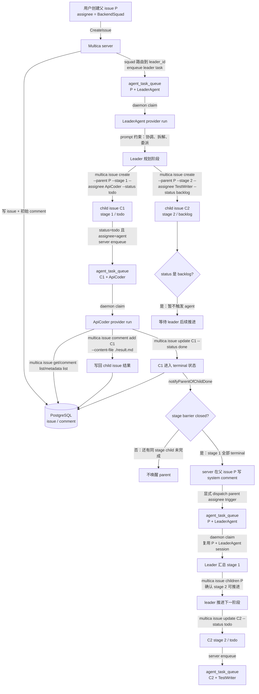
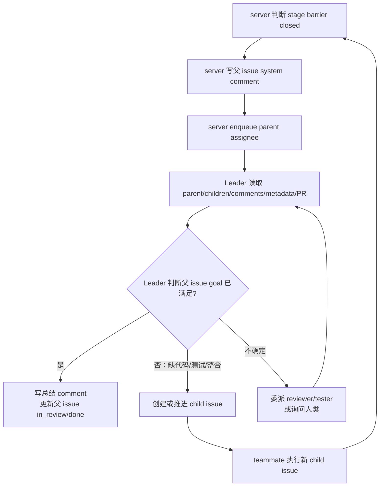

# Squad Child Issue 生命周期

这篇文档只拆一条主线：

```text
用户创建 squad 父 issue
-> leader 拆 child issue
-> teammate 执行 child issue
-> child issue 完成
-> server 判断 stage barrier
-> 唤醒 leader 汇总并推进下一 stage
```

这里不讨论普通单 agent comment，也不展开前端交互。目标是把 squad 模式下“任务如何被拆开、执行、记录、再推进”说清楚。

## 先给结论

- `squad` 本身不是 provider agent，真正执行的是 squad 的 `leader_id`。
- `leader` 主要靠 prompt / squad protocol 被约束为协调者：优先拆解、委派、汇总，不直接实现，除非没有可用 teammate。
- 大任务拆解出来的 child issue 是真实 `issue` 记录，通过 `parent_issue_id` 归到父 issue 下。
- `stage` 是 child issue 上的字段，不是单独的对象。它用于把 child issue 分成有顺序的阶段。
- 同一个 stage 内的 child issue 可以并行；后续 stage 通常先放 `backlog`，等前一 stage 完成后由 leader 推进到 `todo`。
- child issue 完成后，server 根据 DB 状态判断 stage barrier 是否关闭；不是靠 teammate 自己提醒 leader。
- server 只负责“发现阶段完成并唤醒父 issue assignee”，下一步要不要推进、推进哪些 child issue，仍由 leader 决策。
- stage barrier 关闭不等于父 issue 的最终 goal 已达成。server 不做语义验收，最终是否满足用户目标主要由 leader 判断；reviewer/tester agent 只是 leader 可选择委派的角色，不是固定的系统裁判。

## 锚点例子

后面都用这个例子：

```text
父 issue P：
  title = "新增手机号验证码登录，并补测试"
  assignee_type = squad
  assignee_id = BackendSquad

BackendSquad:
  leader = LeaderAgent
  teammates = ApiCoder, TestWriter
```

Leader 拆出来两个 child issue：

```text
C1:
  parent_issue_id = P
  stage = 1
  assignee = ApiCoder
  status = todo
  title = "实现手机号验证码登录接口"

C2:
  parent_issue_id = P
  stage = 2
  assignee = TestWriter
  status = backlog
  title = "补充登录接口测试"
```

这个例子里的含义是：

```text
stage 1 先执行接口实现。
stage 2 暂不执行，等 stage 1 完成后再由 leader 决定是否推进。
```

## 总流程图



## 1. 父 issue 创建后，为什么执行的是 leader

父 issue `P` 的 assignee 是 squad：

```text
assignee_type = squad
assignee_id = BackendSquad
```

但是 squad 不是一个能直接运行 provider CLI 的实体。server 在需要触发执行时，会把 squad 转换成它的 leader：

```text
BackendSquad -> leader_id -> LeaderAgent
```

于是进入队列的是：

```text
agent_task_queue:
  issue_id = P
  agent_id = LeaderAgent
  is_leader_task = true
  status = queued
```

这一步的本质是：

```text
squad 是组织结构；
leader agent 才是实际运行的 agent。
```

## 2. Leader 拆任务时创建的 child issue 是真实 issue

Leader 拆大任务不是在自己脑子里记一个 TODO list，也不是写一个 markdown 看板。它会通过 Multica CLI 创建真实 child issue：

```bash
multica issue create \
  --parent P \
  --stage 1 \
  --assignee ApiCoder \
  --status todo \
  --description-file /tmp/c1.md
```

创建后，DB 里会有一条新的 issue：

```text
issue:
  id = C1
  parent_issue_id = P
  stage = 1
  assignee_type = agent
  assignee_id = ApiCoder
  status = todo
```

所以 child issue 的身份很明确：

```text
它是 issue 表里的一行；
它通过 parent_issue_id 指向父 issue；
它通过 stage 表达阶段；
它通过 assignee/status 决定是否触发 agent。
```

## 3. Stage 是 child issue 的分组字段

容易混淆的一点是：

```text
不是 stage 包含 issue；
而是 child issue 带着 stage 字段。
```

逻辑上可以这样看：

```text
父 issue P
  stage 1
    C1: 实现接口
    C1b: 修改数据库字段
  stage 2
    C2: 补测试
    C2b: review 边界场景
```

但代码/DB 本质是：

```text
C1.parent_issue_id = P, C1.stage = 1
C1b.parent_issue_id = P, C1b.stage = 1
C2.parent_issue_id = P, C2.stage = 2
C2b.parent_issue_id = P, C2b.stage = 2
```

`stage` 的作用是 stage barrier：

```text
同 stage 内可以并行；
stage N 没完成前，stage N+1 通常保持 backlog；
stage N 全部 done/cancelled 后，server 唤醒 parent assignee；
leader 再决定是否把下一 stage 的 backlog child issue 推到 todo。
```

## 4. `todo` 和 `backlog` 的触发差异

child issue 创建出来后，是否马上触发 teammate，关键看状态。

```text
C1.status = todo
=> server 会为 C1 + ApiCoder 创建 agent_task_queue
=> ApiCoder 开始执行

C2.status = backlog
=> server 不会触发 TestWriter
=> C2 只是被记录为后续阶段任务
```

这就是为什么 leader 拆多阶段任务时，通常这样做：

```text
第一阶段 child issue：status = todo
后续阶段 child issue：status = backlog
```

这样能避免后续阶段提前启动。

## 5. Teammate 执行 child issue 时看到什么

ApiCoder 执行 `C1` 时，不是只收到一句“实现登录接口”。它会收到包装后的任务上下文，大意是：

```text
你是 ApiCoder。
当前分配的 issue 是 C1。
你可以用 multica CLI 查看任务、评论、metadata、附件。
完成后必须通过 multica issue comment add 把结果写回 issue。
```

典型 CLI 读取链路：

```bash
multica issue get C1 --output json
multica issue get P --output json
multica issue comment list C1 --recent 10 --output json
multica issue metadata list C1 --output json
```

完成后写回：

```bash
multica issue comment add C1 --content-file ./result.md
multica issue update C1 --status done
```

这里的关键点是：

```text
teammate 的执行状态写回 DB；
leader 后续通过 CLI 读取 DB 状态；
不是靠一个共享 markdown 文件同步进度。
```

## 6. Child issue 完成后，server 怎么唤醒 leader

当 `C1` 从非 terminal 状态变成 terminal 状态时：

```text
todo / in_progress / blocked
-> done / cancelled
```

server 会进入 child-done 逻辑。核心判断在 `notifyParentOfChildDone` 和 `stageBarrierClosed`：

```text
1. child 必须有 parent_issue_id。
2. child 必须是刚刚进入 done/cancelled。
3. parent 不能是 done/cancelled/backlog。
4. parent 不能是 human assignee。
5. 当前完成的 child 必须关闭一个 stage barrier。
```

对于 staged child issue，barrier 规则是：

```text
如果 C1.stage = 1，
那么所有 stage <= 1 的 staged child issue 都 terminal，
stage 1 才算关闭。
```

关闭后，server 会在父 issue `P` 上写一条 system comment，内容大意是：

```text
Stage 1 of this issue is complete.
Stage 2 is next.
Review with `multica issue children P`, then promote backlog sub-issues to todo if dependencies are satisfied.
```

然后 server 显式 dispatch parent assignee trigger，把 leader 再次放进队列：

```text
agent_task_queue:
  issue_id = P
  agent_id = LeaderAgent
  status = queued
```

## 7. Leader 被唤醒后怎么推进下一 stage

Leader 再次运行时，通常会读取父 issue 和 children：

```bash
multica issue get P --output json
multica issue children P --output json
multica issue comment list C1 --recent 10 --output json
multica issue metadata list C1 --output json
```

如果确认 stage 1 结果足够，leader 会推进 stage 2：

```bash
multica issue update C2 --status todo
```

这一步会触发：

```text
C2.status = todo
C2.assignee = TestWriter
=> server enqueue C2 + TestWriter
=> TestWriter 开始执行 stage 2
```

如果 leader 发现需要补一步，它可以创建新的 child issue：

```bash
multica issue create \
  --parent P \
  --stage 2 \
  --assignee ApiCoder \
  --status todo \
  --description-file /tmp/fix-gap.md
```

也就是说，动态调整不是修改一个独立 DAG 配置，而是继续操作 issue tree：

```text
新增 child issue；
调整 child issue status；
调整 child issue stage；
补充 comment / metadata。
```

## 8. 父 issue 的最终 goal 谁判断

Stage barrier 关闭只说明一个结构性事实：

```text
某个 stage 下应该完成的 child issue 已经进入 terminal 状态。
```

它不说明：

```text
用户最初的业务目标已经真的完成；
代码质量已经足够；
测试已经覆盖关键路径；
多个 child issue 的结果已经整合好了。
```

父 issue 的语义完成主要由 leader 判断。leader 被唤醒后通常会做这几件事：

```bash
multica issue get P --output json
multica issue children P --output json
multica issue comment list P --recent 20 --output json
multica issue comment list C1 --recent 10 --output json
multica issue metadata list C1 --output json
```

然后 leader 会在几条路里选择：

```text
满足目标：
  写 summary comment，说明完成内容、PR、验证结果；
  把父 issue 推到 in_review 或 done。

不满足目标：
  创建新的 child issue；
  推进后续 stage；
  调整已有 child issue 的 status/stage/assignee；
  指派 reviewer/tester agent 检查；
  请求人类判断。
```

图上可以这样理解：



所以不要把 “stage done” 理解为 “父 issue done”。server 是阶段唤醒器，leader 才是语义协调者。

## 9. Session 复用规则在这条链路里的位置

每次触发 agent 都是新的 Multica task：

```text
agent_task_queue 新增一行
```

但 provider session 通常按下面的维度复用：

```text
issue_id + agent_id
```

套到这个例子：

```text
P + LeaderAgent
  leader 第一次规划和后续被 stage barrier 唤醒，通常复用同一 provider session。

C1 + ApiCoder
  ApiCoder 在 C1 上的后续 comment/reply，通常复用同一 provider session。

C2 + TestWriter
  这是另一个 child issue + 另一个 agent，通常是新的 provider session。
```

所以不要把父子 issue 关系误解成 provider session 继承：

```text
child issue 是新的 issue_id；
即使它属于父 issue，provider session 也不会天然复用父 issue 的 session。
```

## 10. 哪些是代码硬规则，哪些是 prompt 约束

这条链路里有两类规则。

代码硬规则：

| 规则 | 含义 |
| --- | --- |
| child issue 是真实 issue | `parent_issue_id` 存在 DB 中 |
| `stage` 是 issue 字段 | 用于 stage barrier 判断 |
| `backlog` 不触发 agent | backlog issue 只记录，不自动执行 |
| child terminal 后判断 barrier | `done` / `cancelled` 才参与关闭 stage |
| barrier 关闭后 server 写 system comment | 不是 teammate 手写提醒 |
| server 显式唤醒 parent assignee | 不依赖普通 mention parser |
| parent 是 human assignee 时不唤醒 | server 跳过 child-done system comment 和 agent trigger |
| session 复用按 `issue_id + agent_id` | 不按 `parent_id` 或 comment thread |
| server 不做父 issue 语义验收 | server 只判断 stage barrier，不判断最终 goal 是否达成 |

Prompt / protocol 约束：

| 规则 | 含义 |
| --- | --- |
| leader 优先委派，不直接实现 | 主要靠 squad briefing 和 runtime prompt 约束 |
| leader 用 stage 表达有序阶段 | prompt 强烈建议，不是 DB 强制所有 child 都必须有 stage |
| teammate 完成后写清楚结果 | prompt 要求通过 `comment add` / status / metadata 写回 |
| 后续 stage 是否推进 | leader 决策，不是 server 自动把所有 backlog 推 todo |
| 结果说明用 `--content-file` | runtime brief 强约束 agent 行为，CLI 也支持该输入方式 |
| 父 issue 最终是否完成 | leader 根据原始目标、child 结果、PR、测试和 review 情况判断 |
| reviewer/tester 是否参与 | leader 可委派，不是 server 硬编码的最终裁判 |

## 11. 易混点

**`stage` 和 `child issue` 谁包含谁？**

逻辑上可以说“stage 下有多个 child issue”，但 DB 上是 child issue 带 `stage` 字段。

**child issue 完成后是不是 teammate 通知 leader？**

不是主机制。teammate 写回 child issue 状态；server 根据 DB 判断 stage barrier；barrier 关闭后 server 在 parent 写 system comment 并唤醒 leader。

**stage 之间是不是严格串行？**

设计意图是通过 `backlog -> todo` 形成阶段推进。server 不会自动执行 backlog child issue。leader 负责在合适时机推进下一 stage。

**stage barrier 关闭是不是父 issue 完成？**

不是。stage barrier 只是 server 能机械判断的阶段完成信号。父 issue 是否真的达到用户目标，要由 leader 汇总 child issue、comment、metadata、PR 和测试结果后判断。

**squad 是不是多 agent 共享一个 session？**

不是。session 通常是 `issue_id + agent_id` 维度。父 issue 的 leader session、child issue 的 teammate session 是不同链路。

**这是 DAG 吗？**

不是完整 DAG 引擎。更准确是：

```text
issue tree + stage barrier + leader 通过 CLI 动态调整
```

如果需要表达复杂依赖，leader 通常通过 child issue 描述、status、metadata、comment 和 stage 组合来管理，而不是写一个独立 DAG 定义。

## 代码入口

| 关注点 | 入口 |
| --- | --- |
| squad leader briefing | `server/internal/handler/squad_briefing.go` |
| issue create / update 请求 | `server/internal/handler/issue.go` |
| issue 创建服务 | `server/internal/service/issue.go` |
| child done / stage barrier | `server/internal/handler/issue_child_done.go` |
| issue SQL，包括 `parent_issue_id` / `stage` | `server/pkg/db/queries/issue.sql` |
| runtime brief 中的 issue create / stage / comment 指令 | `server/internal/daemon/execenv/runtime_config_sections.go` |
| comment-trigger prompt | `server/internal/daemon/prompt.go` |
| task 生命周期与 session 复用 | `server/internal/service/task.go`、`server/internal/daemon/daemon.go`、`server/pkg/db/queries/agent.sql` |
