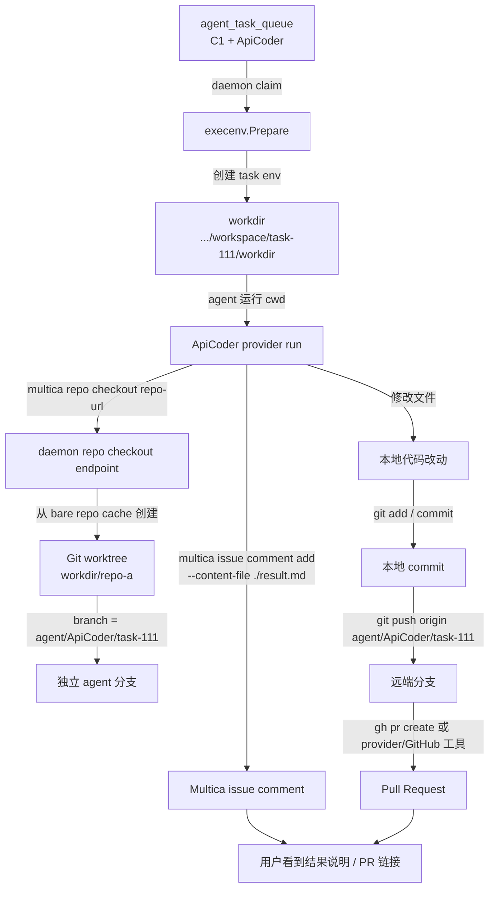

# Agent Workdir 与 Git Worktree 协作模型

本文只解释一件事：

```text
多个 agent 修改同一个项目时，代码文件到底放在哪里、分支怎么来、用户最后看什么。
```

先把最容易混淆的概念拆开：

| 名词 | 是什么 | 谁管理 |
| --- | --- | --- |
| `workdir` | 一次 agent task 的本地执行目录 | Multica daemon |
| Git worktree | `workdir` 里的某个 repo checkout 目录 | daemon 通过 bare repo cache 创建 |
| branch | 这个 Git worktree 当前所在的独立分支 | daemon 命名，agent 后续使用 |
| commit / push / PR | 把本地改动提交到远端、发起 review | agent 自己执行 Git/GitHub 命令 |
| issue comment | 用户在 Multica 里看到的结果说明 | agent 通过 `multica issue comment add` 写回 |

简化说：

```text
Multica 给每个 agent task 一个隔离 workdir；
agent 在 workdir 里 checkout repo；
checkout 得到的是独立 Git worktree + 独立分支；
agent 改完后自己 commit/push/PR；
最后通过 issue comment 把结果和 PR 链接告诉用户。
```

一个重要边界：

```text
本地 workdir / Git worktree 不是最终交付物。
可持久交付的东西通常是远端 branch、PR、issue comment、metadata。
```

## 总流程图



## 1. `workdir` 不是 Git 概念

标准 task 启动时，daemon 会先创建一个本地目录：

```text
<workspacesRoot>/<workspace-id>/<task-short-id>/workdir
```

例如：

```text
~/multica_workspaces/ws-001/a1b2c3d4/workdir
```

这个目录是 provider 的运行目录，也就是 Codex / Claude Code / OpenCode 进程的 `cwd`。它一开始不等于某个 Git 仓库，只是一个空的任务工作区，里面会被注入：

```text
AGENTS.md / CLAUDE.md
.agent_context/issue_context.md
.multica/project/resources.json
provider-specific skills
```

代码入口：

```text
server/internal/daemon/execenv/execenv.go
```

其中 `Prepare` 的注释说得很直接：

```text
The workdir starts empty.
The agent checks out repos on demand via `multica repo checkout <url>`.
```

## 2. repo 是 agent 自己按需 checkout 的

agent 如果需要改代码，会调用：

```bash
multica repo checkout <repo-url>
```

这个命令不是普通 `git clone`。它会请求本机 daemon：

```text
multica CLI -> daemon /repo/checkout -> repo cache -> git worktree
```

daemon 内部维护 bare repo cache。checkout 时，它从 bare cache 创建一个 Git worktree 到当前 task 的 `workdir` 下：

```text
workdir/
  repo-a/   # 这里才是 Git worktree
```

CLI 会把 worktree 路径输出给 agent：

```text
/Users/.../multica_workspaces/ws-001/a1b2c3d4/workdir/repo-a
```

stderr 还会提示分支：

```text
Checked out <repo-url> -> <path> (branch: agent/ApiCoder/a1b2c3d4)
```

代码入口：

```text
server/cmd/multica/cmd_repo.go
server/internal/daemon/health.go
server/internal/daemon/repocache/cache.go
```

## 3. 每个 task 有自己的 worktree 和分支

Git worktree 分支名按 agent 和 task 生成，形态类似：

```text
agent/<agent-name>/<task-short-id>
```

例如：

```text
agent/ApiCoder/a1b2c3d4
agent/TestWriter/e5f6g7h8
```

如果同一个父 issue 下有两个 child issue：

```text
C1 -> ApiCoder：实现登录接口
C2 -> TestWriter：补测试
```

默认会得到两个隔离目录：

```text
ApiCoder task:
  workdir = .../a1b2c3d4/workdir
  repo worktree = .../a1b2c3d4/workdir/multica-main
  branch = agent/ApiCoder/a1b2c3d4

TestWriter task:
  workdir = .../e5f6g7h8/workdir
  repo worktree = .../e5f6g7h8/workdir/multica-main
  branch = agent/TestWriter/e5f6g7h8
```

所以，多 agent 并行时不是这样：

```text
多个 agent 共用一个本地目录
多个 agent 都 commit 到同一个分支
```

而是这样：

```text
每个 agent task 一个 workdir；
每个 workdir 里一个或多个 repo worktree；
每个 repo worktree 一个独立 agent 分支。
```

## 4. commit、push、PR 不是 server 自动做的

Multica 提供的是执行环境和 CLI 能力，不会在 task 完成时自动把改动提交到 GitHub。

agent 要把改动提交给用户看，通常需要自己执行：

```bash
git status
git diff
git add .
git commit -m "Implement phone OTP login"
git push origin agent/ApiCoder/a1b2c3d4
gh pr create --head agent/ApiCoder/a1b2c3d4 --base main
```

这个动作是否发生，取决于：

```text
用户需求；
agent prompt；
agent skill；
repo/GitHub 凭据；
agent 自己的执行判断。
```

如果 agent 只在本地改了文件，但没有 commit/push/PR，那么 Multica server 不会凭空生成一个 PR。

也不要把“文件还在某个本地 workdir 里”当成可靠交付。标准 workdir 是 daemon 管理的任务目录，后续可能被清理；同一 `(issue_id, agent_id)` 复用旧 workdir 时，再次 `multica repo checkout` 遇到已有 Git worktree，会先把 worktree reset/clean 到新分支基线。未提交、未推送、未写入 issue 的本地改动不应该被当成 durable artifact。

## 5. 用户最终看到什么

用户在 Multica 里主要看到三类东西。

第一类是 issue comment：

```text
已完成手机号验证码登录接口。

修改文件：
- server/internal/auth/login.go
- server/internal/auth/login_test.go

验证：
- go test ./server/internal/auth

PR:
https://github.com/acme/app/pull/123
```

这个 comment 是 agent 通过 CLI 写回的：

```bash
multica issue comment add <issue-id> --content-file ./result.md
```

第二类是 task transcript：

```text
provider message
tool call
command output
task completed / failed
```

它用于看 agent 运行过程，不等于代码 diff 本身。

第三类是 workdir 信息：

```text
relative_work_dir = <workspace-id>/<task-short-id>/workdir
```

前端展示的是脱敏后的路径，方便定位这次 task 的本地工作目录。真实绝对路径不会直接渲染在 UI 里，避免泄露用户 home 路径。

## 6. 多个 child issue 的代码结果怎么整合

Multica 没有把多个 agent 的 worktree 自动合并成一个“最终大分支”。

更常见的方式是：

```text
1. 每个 teammate 在自己的分支上完成一个 child issue。
2. teammate 把 PR 链接、文件列表、测试结果写回 child issue comment。
3. leader 被 stage barrier 唤醒。
4. leader 查看 child issues / comments / metadata / PR links。
5. leader 判断是否需要：
   - 直接汇总并关闭父 issue；
   - 推进下一 stage；
   - 新建 integration child issue；
   - 指派某个 agent 合并多个 PR；
   - 要求人类 review。
```

如果需要“把多个 child issue 的代码合到一起”，通常会出现一个 integration 任务：

```text
C3:
  title = "整合 ApiCoder 和 TestWriter 的改动"
  assignee = IntegratorAgent
  stage = 3
  status = todo
```

IntegratorAgent 再 checkout repo，拉取/参考其他分支或 PR，把最终结果整理到一个新分支或 PR。

## 7. `local_directory` 是例外

标准模式下：

```text
task workdir 是 daemon 创建的隔离目录；
repo 是 workdir 下的 Git worktree。
```

但如果项目资源是 `local_directory`，agent 会直接在用户指定的本机目录中工作：

```text
WorkDir = /Users/bytedance/proj/some-repo
```

这时不会创建新的隔离 repo worktree。为了避免两个 task 同时改同一个真实目录，daemon 会用路径锁：

```text
第一个 task 运行中
第二个 task 等待 same local_directory lock
状态可能表现为 waiting_local_directory
```

所以可以记成：

```text
默认模式：并行靠隔离 worktree。
local_directory：共享真实目录，但 daemon 串行化写入。
```

## 8. 和 session 复用的关系

provider session 复用通常按：

```text
issue_id + agent_id
```

workdir 也会跟着 task 保存到 DB：

```text
agent_task_queue.session_id
agent_task_queue.work_dir
```

下一次同一个 agent 在同一个 issue 上被触发时，daemon 会尝试复用上次的 `work_dir` 和 provider session。

但这只发生在同一个 `(issue_id, agent_id)` 链路里：

```text
C1 + ApiCoder 后续评论
=> 可能复用 C1 的 ApiCoder workdir/session

C2 + TestWriter
=> 是另一个 issue + agent 链路，不复用 C1 的 workdir/session
```

如果旧 workdir 不存在，daemon 会丢弃旧 session，重新 prepare 新环境。

即使旧 workdir 存在，repo checkout 也不是“接着使用上次未提交的本地文件”。代码里的 `updateExistingWorktree` 会对已有 worktree 做：

```text
git reset --hard
git clean -fd
git checkout -b <new-agent-branch> <base-ref>
```

所以 session 复用服务的是 provider 对话上下文，workdir 复用服务的是执行环境复用；两者都不等于“保留未交付代码改动”。

## 关键代码入口

| 关注点 | 入口 |
| --- | --- |
| task workdir 创建 / 复用 | `server/internal/daemon/execenv/execenv.go` |
| daemon task 执行前 Prepare/Reuse | `server/internal/daemon/daemon.go` |
| `multica repo checkout` CLI | `server/cmd/multica/cmd_repo.go` |
| daemon `/repo/checkout` 处理 | `server/internal/daemon/health.go` |
| bare repo cache + Git worktree 创建 | `server/internal/daemon/repocache/cache.go` |
| task 完成时保存 `session_id/work_dir` | `server/internal/service/task.go` |
| task response 的 `relative_work_dir` | `server/internal/handler/agent.go` |
| local_directory 路径锁 | `server/internal/daemon/local_directory.go` |
