# 架构与流程图

本文档中的图用 Mermaid 编写，可在支持 Mermaid 的 Markdown 预览器中查看。

## 1. 总体框架图

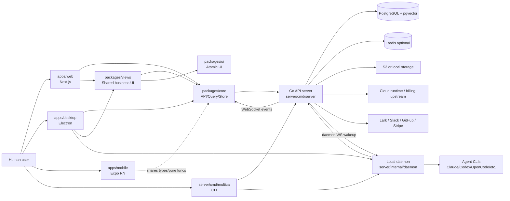

## 2. Monorepo 分层图

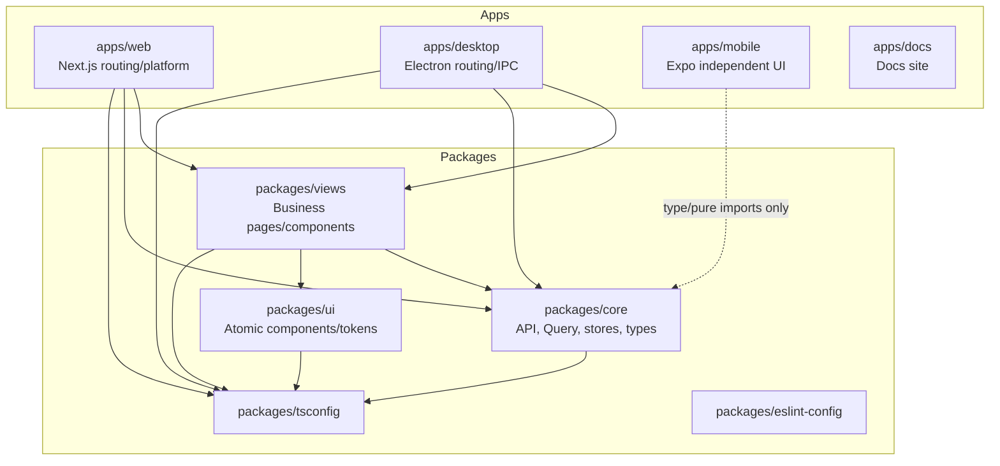

## 3. 后端组件图

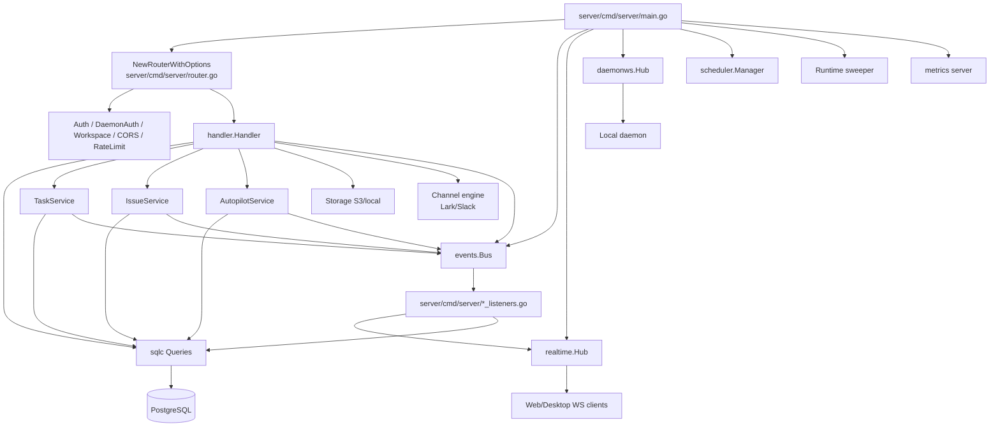

## 4. Server 启动流程图

```mermaid
flowchart TD
  A[main()] --> B[Init logger and env defaults]
  B --> C[Load feature flags]
  C --> D[Create pgxpool and ping DB]
  D --> E[Create events.Bus + realtime.Hub + daemonws.Hub]
  E --> F{REDIS_URL set?}
  F -- no --> G[Use in-memory hub single-node mode]
  F -- yes --> H[Create Redis clients]
  H --> I{REALTIME_RELAY_MODE}
  I --> I1[legacy relay]
  I --> I2[sharded relay]
  I --> I3[dual mirrored relay]
  G --> J[register realtime listener]
  I1 --> J
  I2 --> J
  I3 --> J
  J --> K[Create analytics, queries, authorizer]
  K --> L[Register subscriber/activity/notification listeners]
  L --> M[Build metrics registry optional]
  M --> N[Create heartbeat scheduler]
  N --> O[NewRouterWithOptions]
  O --> P[Create TaskService and AutopilotService]
  P --> Q[Register autopilot listeners]
  Q --> R[Start sweepers, scheduler, channel supervisor]
  R --> S[Start HTTP server]
  S --> T[Wait SIGINT/SIGTERM]
  T --> U[Graceful shutdown HTTP, workers, metrics, relay]
```

## 5. HTTP 请求处理时序图

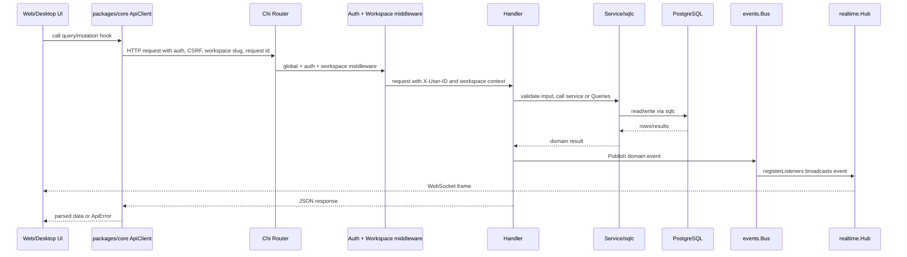

## 6. Issue 更新后的事件副作用

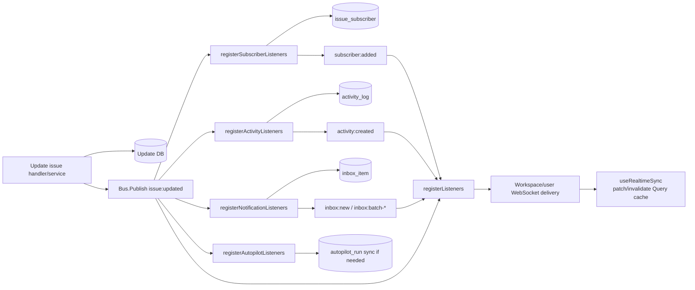

## 7. Realtime 架构图

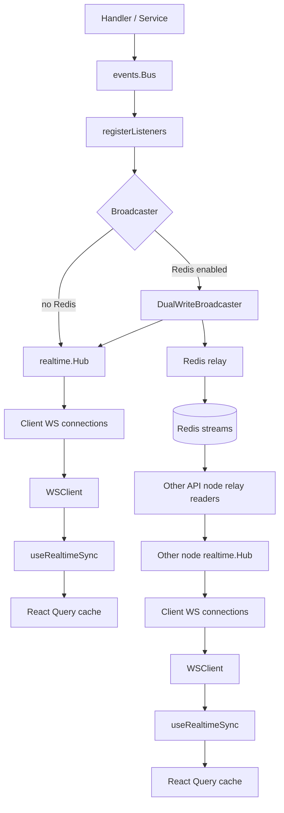

## 8. Agent 任务执行时序图

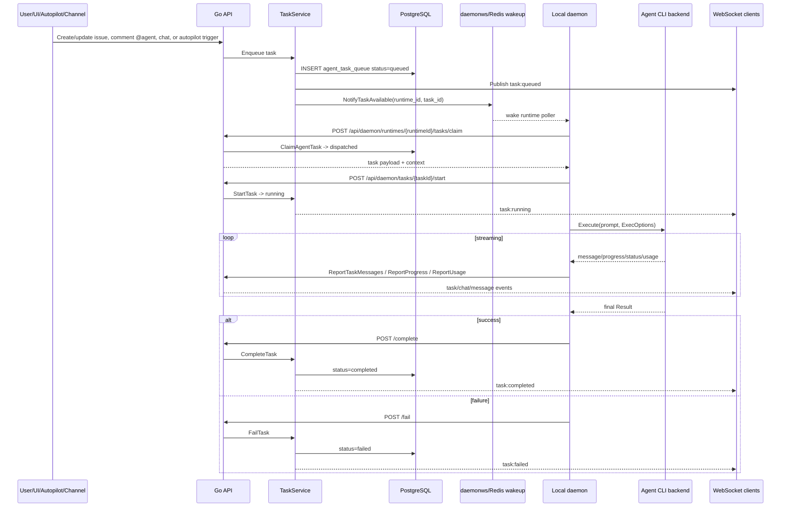

## 9. Frontend Boot 和数据流

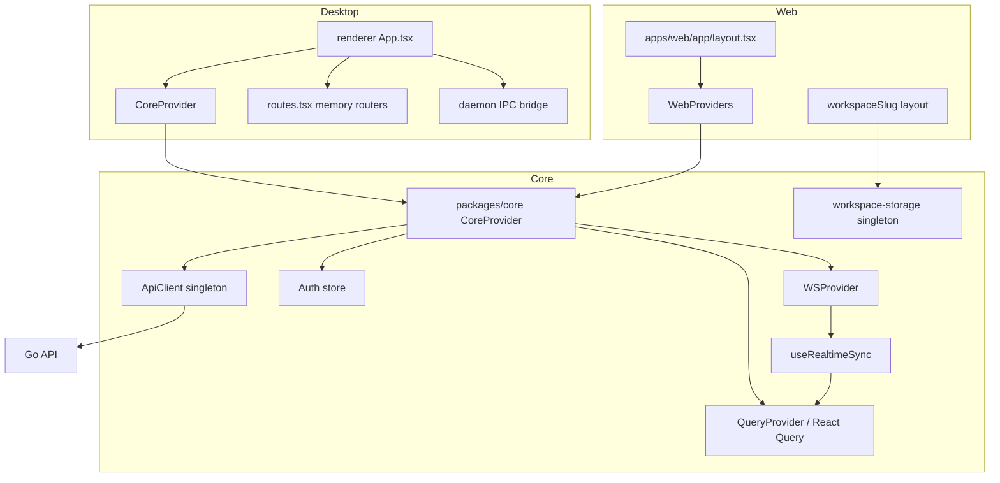

## 10. Web 与 Desktop 页面复用图

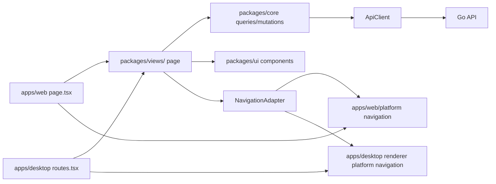

## 11. 数据关系简图

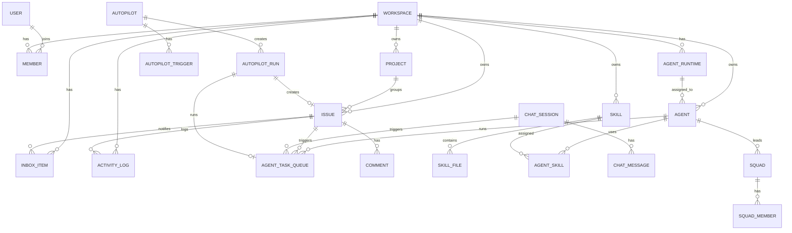

## 12. API 分组图

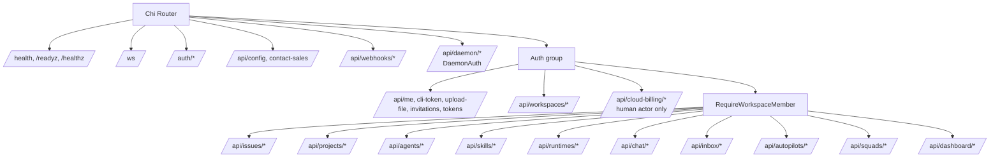

## 13. 文档站产品心智模型

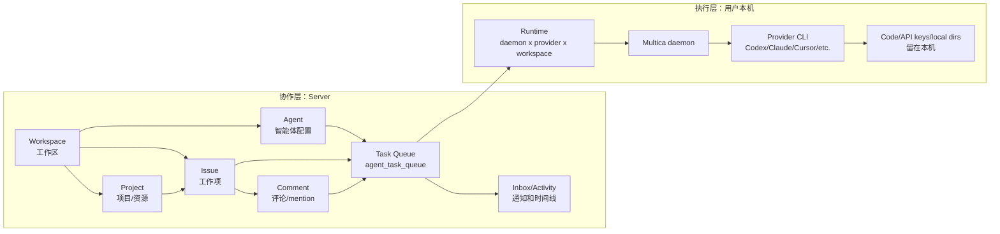

## 14. 四种智能体触发方式

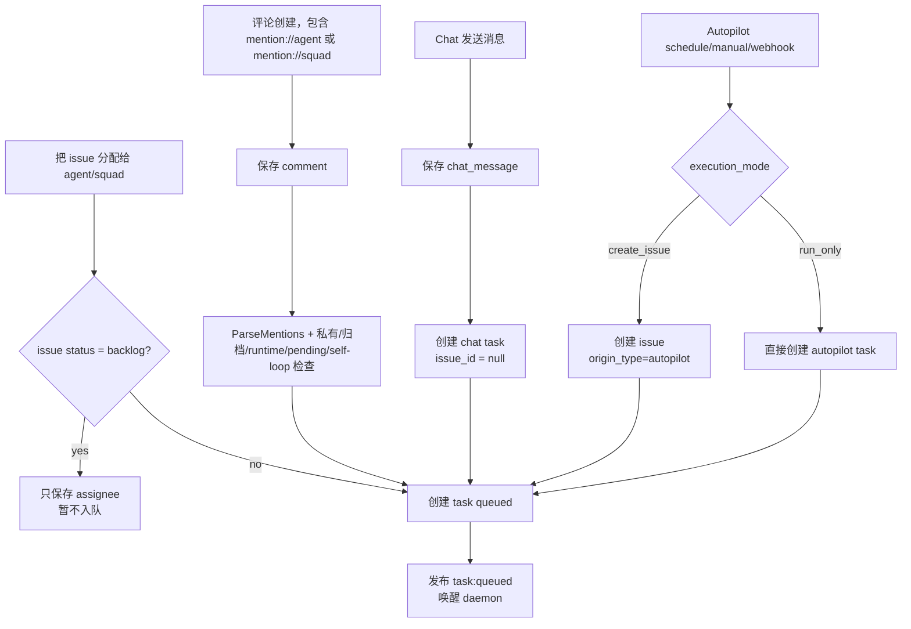

## 15. ACME-42 分配给 CodeSmith 的完整时序

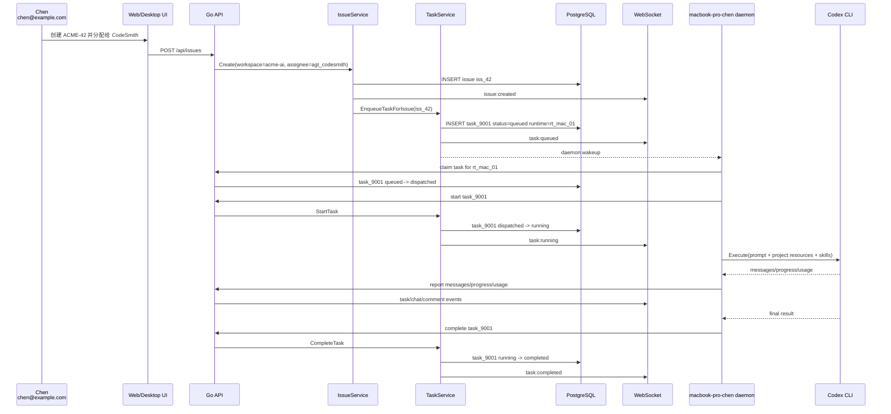

## 16. 评论 Mention 触发链路

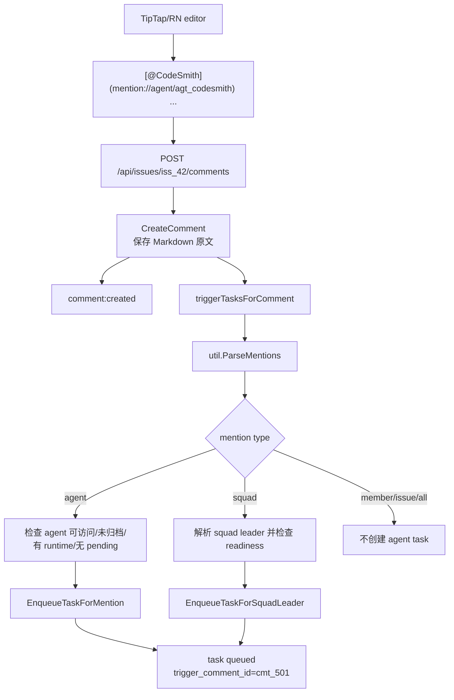

## 17. Chat 沙盒链路

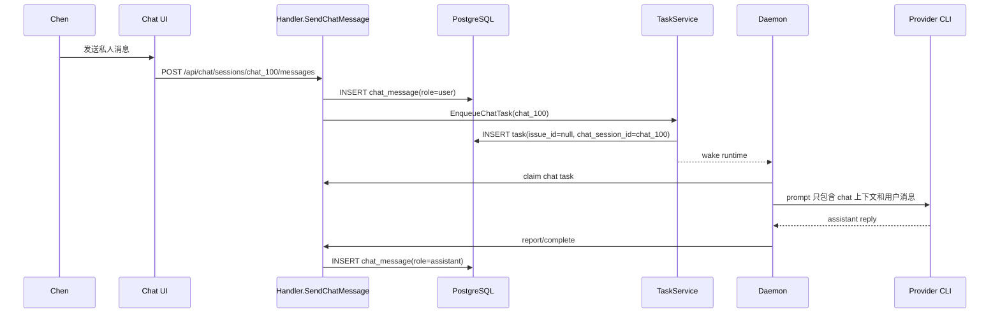

## 18. Autopilot Schedule/Webhook 流程

```mermaid
flowchart TB
  Schedule[DB scheduler<br/>cron due] --> Dispatch[AutopilotService.DispatchAutopilot]
  Manual[POST /api/autopilots/{id}/trigger] --> Dispatch
  Webhook[POST /api/webhooks/autopilots/awt_xxx] --> WH[限流/token/body/event filter/delivery]
  WH --> Dispatch

  Dispatch --> Run[INSERT autopilot_run]
  Run --> Mode{execution_mode}
  Mode -- create_issue --> Issue[CreateIssueWithOrigin<br/>origin_type=autopilot]
  Issue --> Link[run.status=issue_created<br/>run.issue_id=...]
  Link --> IssueTask[EnqueueTaskForIssue<br/>或 EnqueueTaskForSquadLeader]
  Mode -- run_only --> DirectTask[CreateAutopilotTask<br/>run.task_id=...]
  IssueTask --> Daemon[daemon claim and execute]
  DirectTask --> Daemon
  Daemon --> Sync[SyncRunFromIssue/SyncRunFromTask]
  Sync --> Done[autopilot_run completed/failed/skipped]
```

## 19. Project Resource 进入执行环境

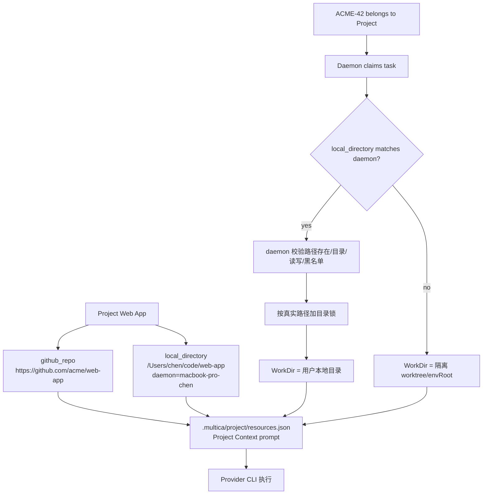

## 20. 认证与 Token 使用范围

```mermaid
flowchart LR
  Browser[Browser Web UI] --> Cookie[JWT Cookie<br/>multica_auth<br/>30 days]
  CLI[CLI / scripts] --> PAT[PAT<br/>mul_...]
  Daemon[Daemon] --> MDT[Daemon Token<br/>mdt_...]

  Cookie --> UserAPI[/api/user + workspace APIs]
  Cookie --> WS[/ws cookie auth]
  PAT --> UserAPI
  PAT --> DaemonAPI[/api/daemon bootstrap/control]
  PAT --> WS2[/ws token auth]
  MDT --> DaemonAPI

  DaemonAPI --> Limited[注册 runtime<br/>心跳<br/>claim task<br/>上报结果]
  UserAPI --> Full[代表完整用户身份]
```

## 21. GitHub PR 自动关联

```mermaid
sequenceDiagram
  participant GH as GitHub
  participant API as /api/webhooks/github
  participant DB as PostgreSQL
  participant Bus as events.Bus
  participant UI as Issue UI

  GH->>API: pull_request webhook<br/>branch/title/body contains ACME-42
  API->>API: verify X-Hub-Signature-256
  API->>DB: upsert github_pull_request
  API->>API: extract issue key by workspace prefix
  API->>DB: upsert issue_pull_request(iss_42, pr, close_intent?)
  alt PR merged/closed and auto-close gate passes
    API->>DB: update issue ACME-42 -> done unless cancelled
    API->>Bus: issue:updated actor=system
    Bus-->>UI: WebSocket update
  else PR open/sync
    API-->>UI: PR sidebar updates via realtime/cache refresh
  end
```

## 22. 飞书/Lark Bot 到 Chat/Issue

```mermaid
flowchart TB
  LarkMsg[飞书私聊或群 @ Bot] --> Inbound[Lark connector/channel engine]
  Inbound --> Bind{飞书身份已绑定<br/>且是 workspace member?}
  Bind -- no --> Drop[丢弃或返回绑定卡片<br/>不保存消息内容]
  Bind -- yes --> Kind{消息类型}
  Kind -- 普通消息 --> Chat[创建/复用 chat_session<br/>写 chat_message]
  Chat --> ChatTask[EnqueueChatTask]
  ChatTask --> AgentRun[daemon + provider 执行]
  AgentRun --> Done[chat:done]
  Done --> LarkReply[飞书卡片/文本回复]
  Kind -- /issue --> Issue[IssueService.Create]
  Issue --> Board[Multica issue 看板]
```
