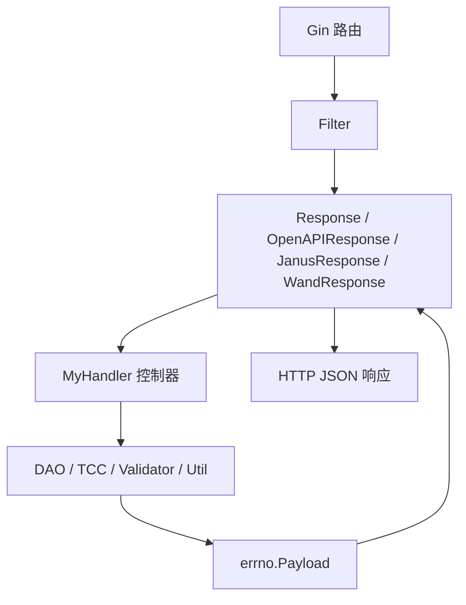

# API Controllers and Middleware

## 模块概览

`API Controllers and Middleware` 模块负责把 Gin HTTP 请求转换为统一的业务处理入口，并在控制器外层集中处理鉴权、限流、响应封装、指标、日志、链路追踪和跨域头。

核心约定是 `middleware.MyHandler`：

```go
type MyHandler func(c *gin.Context, ctx context.Context) *errno.Payload
```

业务控制器只返回 `*errno.Payload`，不直接写 HTTP 响应。`Response`、`OpenAPIResponse`、`JanusResponse`、`WandResponse` 等包装器负责把 `errno.Payload` 转成不同调用方需要的 HTTP/JSON 形态。

## 请求处理主链路



典型内部接口使用 `Filter` 设置调用方 PSM，再通过 `Response(mkey, handler)` 包装控制器。`Response` 会从 `ginex.RPCContext(c)` 取 RPC 上下文，并写入 `gorm.ContextSkipStressForRead = true`，让测试流量的读请求访问原表。

## 账号控制器

`src/controllers/account.go` 定义 `AccountsController`，目前提供两个查询接口。

### `AccountsController.Search`

`Search(c, ctx)` 是 V2 账号分页查询入口，使用 `dto.PageGetAccountRequest` 承载查询参数。它支持分页参数 `Offset`、`Limit`，也支持通过 `AccountIds` 和 `QueryName` 做筛选或模糊查询。

处理流程：

1. 使用 `c.BindQuery(pageGetAccountRequest)` 绑定 query 参数，失败返回 `errno.CodeBadRequest`。
2. 调用 `validator.RefinePageParams` 修正分页参数。
3. 通过 `util.EmitThroughput` 和 `util.EmitLatency` 上报 `AccountsController.Search` 指标。
4. 调用 `dao.Db.GetVideoAccountAmount(ctx, pageGetAccountRequest)` 查询总数。
5. 总数为 0 时返回空的 `dto.SearchAccountsResponse`。
6. 调用 `dao.Db.PageGetVideoAccount(ctx, pageGetAccountRequest)` 查询分页账号。
7. 返回前将每个 `VideoAccount.SecretKey` 清空，避免密钥泄露。
8. 将结果包装为 `[]dto.MGetVideoAccountResponse`，其中 `VideoConfigs` 当前置为 `nil`。

返回数据结构是 `dto.SearchAccountsResponse`：

```go
resp.TotalCount = amount
resp.VideoAccounts = items
return errno.OK(resp)
```

错误统一通过 `errno.ErrorWithCode` 返回，例如参数错误使用 `errno.CodeBadRequest`，数据库错误使用 `errno.CodeDbErr`。

### `AccountsController.SearchTopAccountIds`

`SearchTopAccountIds(c, ctx)` 查询去重后的 `TopAccountID` 列表，同样使用 `dto.PageGetAccountRequest` 和 `validator.RefinePageParams`。

它先调用 `dao.Db.GetVideoAccountDistinctTopAccountIdAmount` 获取总数，再调用 `dao.Db.PageGetVideoAccountDistinctTopAccountIds` 获取分页数据，最后从 `VideoAccount.TopAccountID` 中提取 `[]int64`，填入 `dto.PageGetTopAccountIdsResponse.TopAccountIds`。

## 统一响应包装

### `Response`

`Response(mkey, f)` 是普通内部 API 的主要包装器。它负责：

- 提取 `PSM`，默认值为 `"unknown"`。
- 读取 SDK 版本头：优先 `X-TT-Account-Sdk-Version`，其次 `X-TT-Biz-Callback-Sdk-Version`。
- 通过反射获取 handler 方法名，并写入 `c.Set("K_METHOD", method)`。
- 执行两级限流：`interface_limiter.Allow(mkey)` 和 `util.HardenCli.Allow(psm + ":" + mkey)`。
- 设置 CORS 和禁用缓存相关响应头。
- 使用 `c.JSON(http.StatusOK, data)` 输出 `errno.Payload`。
- 上报延迟、吞吐、错误指标。
- 将方法名、来源服务、业务状态码、错误状态写入 bytedtrace span。

`Response` 还会读取 Gin context 中的 `ISGetAllAccounts` 和 `LocalCacheHit`，如果存在则追加到 metrics tag 中。

错误日志分级规则：

- `data.Code >= errno.CodeInternalErr`：使用 `logs.CtxError`。
- 其他非成功码：使用 `logs.CtxWarn`。
- 成功码包括 `errno.CodeOK` 和 `errno.CodeOKZero`。

### `OpenAPIResponse`

`OpenAPIResponse(mkey, f)` 面向 OpenAPI 调用场景，除了普通响应封装外，还会执行 IAM 鉴权。

处理流程：

1. 调用 `iamsdk.VerifyV4WithKms(context.Background(), c.Request)` 验签。
2. 从 `constant.OpenapiMethodPermission[mkey]` 获取当前接口需要的权限。
3. 从路由参数中读取 `account`。
4. 调用 `iamsdk.GetIamPermissionsProject(ctx, Account.Name, projectId, []string{permission})` 校验项目权限。
5. 鉴权通过后执行业务 handler。

响应体仍然是 `errno.Payload` 的 JSON，但这里使用 `json.Marshal(data)` 后通过 `c.Data` 写出。错误指标会额外带上 IAM `account` tag。

注意：当前实现中，项目权限校验失败后会设置 `data = errno.CodeUnauthorized`，但随后仍会继续执行 `data = f(c, ctx)`。维护这段代码时需要特别关注该分支是否符合预期。

### `JanusResponse`

`JanusResponse(mkey, f)` 面向 Janus 调用方，将内部 `errno.Payload` 转换为 `JanusPayload`：

```go
type JanusPayload struct {
    Code      int         `json:"code"`
    Message   string      `json:"message"`
    ReqeustId string      `json:"trace_id"`
    Response  interface{} `json:"response"`
}
```

`toJanusPayload` 会把 `errno.CodeOK` 映射为 `JanusOkCode`，即 `0`；其他错误码保持原值。业务数据放在 `response` 字段中。

### `WandResponse`

`WandResponse(mkey, f)` 面向 Wand 服务。它与普通响应最大的区别是：

- 响应体只返回 `errno.Payload.Data`，不返回 `code`、`message` 等包装字段。
- 使用 `X-Verification-Code` 做轻量校验。
- 校验失败时返回 HTTP `403`，业务 payload 使用 `errno.ErrUnauthorized`。

验证码格式是：

```text
毫秒时间戳|HMAC-SHA1(毫秒时间戳)
```

`checkCode` 会校验格式、时间窗口和签名。时间戳与当前时间相差超过 60 秒会失败。`genCode` 生成新的验证码并通过响应头 `X-Verification-Code` 返回。签名密钥来自 `config.Conf.Wand.Token`。

## 前置中间件

### `Filter`

`Filter(c)` 负责提取调用方来源：

```go
psm := c.GetHeader("X-TT-From")
c.Set(PSM, psm)
```

对于非 GET 请求，它会检查 `tcc.GetAllowList(c)[psm]`。如果调用方不在写权限白名单中，直接返回 `errno.ErrNoWriteAuth`，HTTP 状态码仍为 `200`。

`DuplicateStringFilter` 是一个简单的字符串去重工具，返回顺序取决于 map 遍历，不保证保持输入顺序。

### `ACL`

`NewACL()` 从 `tcc.GetACLConfigs(context.Background())` 加载 Basic Auth 配置，构造 `ACL.Check` 中间件。

`ACL.Check` 的逻辑是：

- 如果 `ACLConfig.IsEnabled()` 为 false，直接放行。
- 读取 `constant.HeaderAuthorization`。
- 使用 `util.ParseBaseAuth` 解析用户名和密码。
- 校验 `ACL.Pairs[u] == p`。
- 失败时调用 `HandleACLUnauthorized`，返回 HTTP `401` 和 `errno.ErrUnauthorized`。

### `RateLimiter`

`NewRateLimiter()` 基于 `config.Conf.RateLimiter` 初始化内存限流器：

- 限流格式由 `config.Conf.RateLimiter.Rate` 提供。
- 存储使用 `github.com/ulule/limiter/drivers/store/memory`。
- 默认 key 由 `GetIP` 生成，优先使用 `constant.HeaderRealIP`，否则使用 `c.ClientIP()`。

`RateLimiter.RateLimit` 会写入标准限流响应头：

```go
c.Header(constant.HeaderRateLimitLimit, strconv.FormatInt(ctx.Limit, 10))
c.Header(constant.HeaderRateLimitRemaining, strconv.FormatInt(ctx.Remaining, 10))
c.Header(constant.HeaderRateLimitReset, strconv.FormatInt(ctx.Reset, 10))
```

超过限流时 `HandleRateLimiterReached` 返回 HTTP `429` 和 `errno.ErrTooManyRequests`。

### `LogRequest`

`LogRequest(c)` 读取请求 body、恢复 `c.Request.Body`，然后记录方法、路径、请求头、JSON body 和 query 参数。因为它会调用 `c.GetRawData()`，恢复 body 的步骤对后续 handler 正常读取请求体是必要的。

## 熔断器

`InitCircuitBreaker()` 从 `tcc.GetCircuitBreakersConfigs(context.Background())` 读取熔断配置，并初始化全局变量 `CircuitBreakers`。

`GetDBCircuitBreaker()` 获取名为 `"DB"` 的熔断器。只有同时满足以下条件时才返回有效的 `*gobreaker.CircuitBreaker`：

- `CircuitBreakers["DB"]` 已初始化。
- `etcdutil.GetWithDefault(cb.Switch, "0") == "1"`。

否则返回 `nil`。DAO 层多个数据库操作会调用 `GetDBCircuitBreaker`，因此这里是数据库访问熔断能力的统一入口。

## 与其他模块的连接

该模块位于 HTTP 边界层，主要依赖以下内部模块：

- `dto`：定义请求和响应结构，例如 `PageGetAccountRequest`、`SearchAccountsResponse`、`PageGetTopAccountIdsResponse`。
- `errno`：统一业务错误码和响应 payload。
- `dao`：执行账号查询和数据库访问。
- `validator`：修正分页参数，当前使用 `RefinePageParams`。
- `util`：指标上报、Harden 限流、Basic Auth 解析、工具函数。
- `tcc` / `config` / `constant`：动态配置、限流配置、ACL 配置和请求头常量。
- `interface_limiter`：接口级本地限流。
- `iamsdk`：OpenAPI IAM 验签和权限校验。
- `bytedtrace`：链路 span 命名、来源服务、业务状态码和错误标记。

新增 API 时，推荐复用现有模式：业务函数实现为 `MyHandler`，只返回 `*errno.Payload`；路由层根据调用方选择 `Response`、`OpenAPIResponse`、`JanusResponse` 或 `WandResponse` 包装；需要写权限的接口依赖 `Filter` 和 TCC allowlist；需要独立 IP 限流的链路使用 `NewRateLimiter()`。