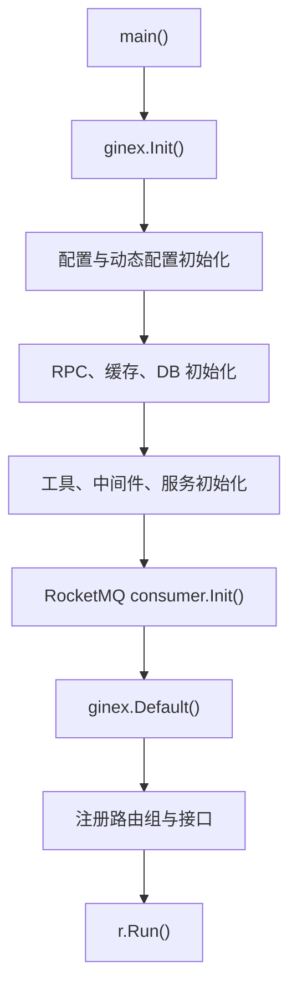

# Application Runtime

## 模块概览

`main.go` 是服务的应用运行时入口，负责完成进程级初始化、HTTP 引擎创建、中间件装配、路由注册以及最终启动 Gin 服务。该模块本身不承载业务逻辑，业务处理通过 `service` 包和 `controllers` 包暴露，运行时横切能力由 `middleware` 包统一包装。

入口函数只有 `main()`，没有内部调用方，是整个进程的根执行点。

## 启动流程



`main()` 的初始化顺序是运行时契约的一部分：

1. `ginex.Init()` 初始化 Gin 扩展运行环境。
2. `defer logs.Stop()` 确保进程退出时刷新并停止日志组件。
3. `config.InitConf()` 加载基础配置，后续 TCC、RPC、缓存、DAO 初始化都依赖配置可用。
4. `tcc.SetDefaultValuesAndStartRefresh()` 设置动态配置默认值并启动刷新任务，其中执行流会到达 `SetStorageConfigCheckWhitelist`。
5. `rpc.Init()` 初始化外部 RPC 客户端，并触发 DECC 元数据缓存刷新链路：`initDecc` → `startDeccMetaCacheRefresh` → `refreshDeccAccountCategoryEmbeddedMetadata` → `getBucketEmbeddedMetadata` → `getAllChannels` / `getAllChannelData`。
6. `remote_cache.Init()` 初始化远端缓存，内部通过 `newRedisCli` 判断 `config.IsCIEnvironment`。
7. `dao.InitDb()` 初始化数据库连接。
8. `util.InitCheckSuffix()` 初始化后缀校验相关工具状态。
9. `middleware.InitCircuitBreaker()` 初始化熔断器。
10. `service.Init()` 初始化业务服务层所需的进程内状态。
11. `util.InitRateLimiter()` 初始化限流器。
12. `consumer.Init()` 初始化 RocketMQ 消费者。
13. `ginex.Default()` 创建 HTTP router。
14. 注册路由和中间件。
15. `r.Run()` 启动 HTTP 服务。

文件中的两个空导入也属于运行时初始化：

- `_ "code.byted.org/lidar/agent/init"`：通过包初始化接入 Lidar agent。
- `_ "code.byted.org/videoarch/vda-mysql-driver"`：注册 VDA MySQL driver，供 DAO 层初始化数据库连接时使用。

## HTTP 路由组织

核心 API 使用 `accountapi := r.Group("")` 作为基础分组，并统一挂载三个中间件：

```go
accountapi.Use(middleware.Filter)
accountapi.Use(middleware.NewACL())
accountapi.Use(middleware.LogRequest)
```

挂在 `accountapi` 下的 `/account-api/v1`、`/account-api/v2`、`/account-api/v3` 会继承 `Filter`、`NewACL()` 和 `LogRequest`。其他直接从 `r.Group(...)` 创建的分组不会继承这些中间件，它们依赖各自的 response wrapper 实现访问控制或协议适配。

## 响应包装模式

路由处理函数统一使用中间件 wrapper 绑定指标名和业务 handler：

```go
v1.POST("/accounts", middleware.Response("accounts.post", service.CreateAccount))
```

常见模式如下：

- `middleware.Response(name, handler)`：普通 account API 使用的响应包装。
- `middleware.JanusResponse(name, handler)`：Janus/BPM 类内部调用方使用的响应包装。
- `middleware.OpenAPIResponse(name, handler)`：OpenAPI 使用，注释说明该分组“不使用白名单 filter 而使用签名验签”。
- `middleware.WandResponse(name, handler)`：Wand 系统回调用接口使用。

第一个字符串参数如 `"accounts.post"`、`"domain.rel.list"` 是运行时标识，通常用于日志、监控、埋点或错误定位。新增接口时应保持命名稳定、可读，并与接口语义一致。

## API 分组

### `/account-api/v1`

`v1 := accountapi.Group("/account-api/v1")` 是主要的管理接口分组，覆盖账号、配置、计费实例、授权、同步规则、域名、ID Generator 和 schema 配置等能力。

主要业务入口包括：

- 账号管理：`service.CreateAccount`、`service.UpdateAccountStatus`、`service.UpdateAccount`、`service.MGetAccountWithConfig`、`service.PageGetAccount`、`service.CountAccounts`、`service.MGetAllAccountWithConfig`
- 存储 bucket 查询：`service.GetAccountStorageBuckets`、`service.GetAccountStorageBucket`
- 配置管理：`service.MCreateConfig`、`service.MCopyConfig`、`service.DeleteConfig`、`service.MUpdateConfig`、`service.GetConfig`、`service.ListConfigsByCondition`
- 计费实例：`service.CreateInstance`、`service.DeleteInstance`、`service.UpdateInstance`、`service.UpdateInstanceByInstanceID`、`service.GetInstance`、`service.ListInstances`
- 授权模型：`service.CreateCondition`、`service.DeleteCondition`、`service.GetCondition`、`service.CreateAccess`、`service.DeleteAccess`、`service.GetAccess`、`service.CreateAuthority`、`service.DeleteAuthority`、`service.UpdateAuthorityStatus`、`service.MGetAuthority`
- 文件同步规则：`service.CreateVideoRule`、`service.UpdateRuleStatus`、`service.UpdateRuleById`、`service.MGetRule`、`service.PageGetRule`、`service.MGetCategory`
- 文件同步规则 V2：`service.CreateVideoRuleV2`、`service.UpdateRuleStatusV2`、`service.UpdateRuleByIdV2`、`service.MGetRuleV2`
- 域名与回源鉴权：`service.CreateDomainAuthInfo`、`service.GetDomainAuthInfos`、`service.UpdateDomainAuthStatus`、`service.DeleteDomainAuth`、`service.CreateDomain`、`service.GetDomain`、`service.DeleteDomain`
- 域名和账号关系：`service.CreateDomainAccountRel`、`service.DeleteDomainAccountRel`、`service.UpdateDomainAccountRel`、`service.ListDomainAccountRel`
- ID Generator 配置：`service.ListIdFetchers`、`service.UpdateIdFetcher`、`service.CreateIdFetcher`
- account category schema：`service.CreateAccountCategorySchema`、`service.UpdateAccountCategorySchema`、`service.DeleteAccountCategorySchema`、`service.ListAccountCategorySchema`、`service.GetAccountCategoryEmbeddedSchema`、`service.GetDeccEmbeddedSchema`

### `/account-api/v1/remote`

`v1Remote := r.Group("/account-api/v1/remote")` 直接挂在 root router 上，不继承 `accountapi.Use(...)` 的 `Filter`、`NewACL()`、`LogRequest`。

当前接口包括：

- `POST /configs` → `service.RemoteDeleteConfig`
- `PUT /accounts` → `service.RemoteUpdateAccountStatus`

维护这组接口时需要特别注意访问控制来源，因为它没有使用 `accountapi` 的统一中间件链。

### `/account-api/v2`

`v2 := accountapi.Group("/account-api/v2")` 仍继承 account API 的通用中间件。账号查询部分使用 controller 风格：

```go
accountsController := new(controllers.AccountsController)
accountGroup.GET("", middleware.Response("accounts.search", accountsController.Search))
```

当前 V2 接口包括：

- `controllers.AccountsController.Search`：分页查询 accounts 列表，参数 `needConfigs` 控制是否返回每个 account 的配置信息。
- `controllers.AccountsController.SearchTopAccountIds`：分页查询 `top_account_id` 列表。
- `service.UpdateAccountV2`：全量更新账号字段。

### `/account-api/v3`

`v3 := accountapi.Group("/account-api/v3")` 提供 V3 查询接口：

- `GET /accounts` → `service.MGetAccountV3`
- `GET /accounts/space/count` → `service.CountRegionSpacesV3`

### `/account-janus/v1`

`janus := r.Group("/account-janus/v1")` 面向 Janus 调用方，主要使用 `middleware.JanusResponse`：

- `service.ListDomainAccountRel`
- `service.GetDeccEmbeddedSchema`

其中 `POST /domain-account-rel/copy` 使用 `middleware.Response("domain_rel.copy", service.CopyDomainAccountRel)`，这与同分组其他接口不同，修改时应确认调用方期望的响应格式。

### `/account-bpm/v1`

`bpm := r.Group("/account-bpm/v1")` 面向 BPM 流程调用，全部使用 `middleware.JanusResponse`：

- `service.CheckAccountExist`
- `service.CreateAccount`
- `service.BPMCreateDomainAccountRel`
- `service.BPMCreateConfigs`
- `service.BPMUpsertMetadataClean`
- `service.BPMMigrateDomainAccountRel`

### `/account-openapi/v1`

`openapi := r.Group("/account-openapi/v1")` 面向通用文件类型租户。代码注释明确说明该分组“不使用白名单 filter 而使用签名验签”，因此接口使用 `middleware.OpenAPIResponse`：

- `GET /accounts/:account` → `service.GetAccountInfo`
- `PUT /accounts/:account` → `service.ModifyAccount`

### `/account-wand/v1`

`wand := r.Group("/account-wand/v1")` 提供给 Wand 系统回调，用于处理离职、转岗导致的负责人 username 变更：

- `GET /vod/assets` → `service.GetAccountVodAssets`
- `POST /vod/assets` → `service.UpdateAccountVodAssets`

## 与其他模块的连接

Application Runtime 只编排模块，不实现业务规则。主要依赖关系如下：

- `config`：提供启动配置和环境判断，例如 `InitConf`、`IsCIEnvironment`。
- `tcc`：提供动态配置默认值和后台刷新任务。
- `rpc`：初始化外部 RPC 客户端，并启动 DECC 元数据缓存刷新。
- `remote_cache`：初始化 Redis 等远端缓存客户端。
- `dao`：初始化数据库连接。
- `middleware`：提供访问控制、日志、熔断、响应包装、OpenAPI 验签、Janus/Wand 协议适配。
- `service`：承载大部分业务 handler。
- `controllers`：承载 V2 controller 风格入口，目前使用 `controllers.AccountsController`。
- `consumer`：初始化 RocketMQ 消费者。
- `util`：初始化后缀校验、限流器和缓存过期时间等工具能力。

## 新增接口的开发方式

新增普通 account API 时，优先挂在 `accountapi` 的版本分组下，例如：

```go
v1.GET("/example", middleware.Response("example.get", service.GetExample))
```

开发时需要同时确认三点：

1. 是否应该继承 `middleware.Filter`、`middleware.NewACL()`、`middleware.LogRequest`。如果需要，接口应挂在 `accountapi.Group(...)` 下。
2. 是否需要特殊调用方协议。Janus/BPM 使用 `JanusResponse`，OpenAPI 使用 `OpenAPIResponse`，Wand 使用 `WandResponse`。
3. 初始化依赖是否已经在路由注册前完成。需要配置、缓存、DB、RPC、限流或消费者状态的 handler，应确认对应 `Init` 调用顺序满足运行期要求。

## 维护注意事项

`main()` 的启动顺序不应随意调整。特别是 `config.InitConf()` 必须早于依赖配置的初始化逻辑，`dao.InitDb()` 应早于依赖数据库连接的服务处理，`util.InitRateLimiter()` 应早于可能依赖限流配置的消费者和接口运行。

直接从 `r.Group(...)` 创建的分组不会继承 `accountapi` 上的通用中间件。`v1Remote`、`janus`、`bpm`、`openapi`、`wand` 都属于这种模式。调整访问控制或日志策略时，应逐组检查 wrapper 和 middleware，而不是只修改 `accountapi.Use(...)`。

`middleware.Response` 的 name 参数是接口运行期可观测性的关键标识。复制路由时不要复用不相关的 name，否则会影响日志、监控或问题定位的准确性。