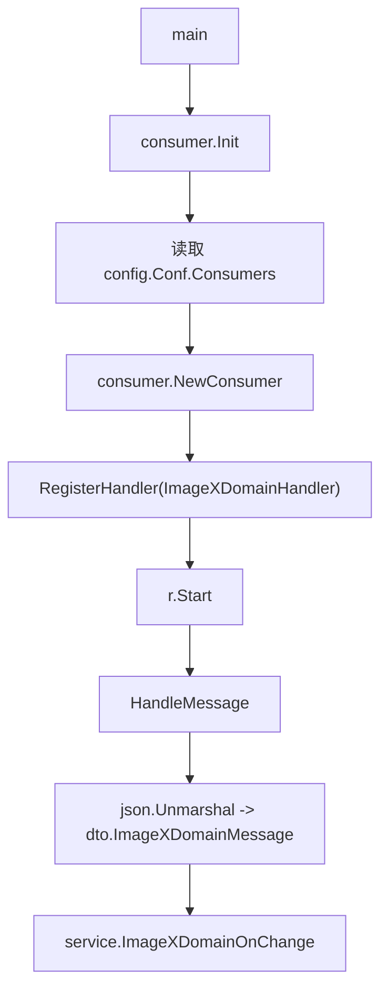

# Async Messaging

## 模块概览

Async Messaging 模块位于 `src/rocketmq/consumer/handler.go`，负责初始化 RocketMQ 消费者，并把异步消息分发到具体业务处理器。当前模块只注册了一个业务处理器：`ImageXDomainHandler`，用于消费 ImageX 域名接入变更消息，并调用 `service.ImageXDomainOnChange` 执行业务处理。

该模块的入口是 `Init()`，由 `main` 调用。消息到达后，RocketMQ proxy SDK 会回调 `ImageXDomainHandler.HandleMessage`。

## 执行链路



## 初始化流程：`Init`

`Init()` 会遍历 `config.Conf.Consumers` 中的消费者配置，为每一项配置创建一个 RocketMQ consumer。

核心流程如下：

1. 从配置中读取 `Topic`、`ClusterName`、`ConsumerGroup`、`WorkerNum` 和 `Name`。
2. 调用 `rocketConfig.NewDefaultConsumerConfig(consumerGroup, topic, clusterName)` 创建默认消费者配置。
3. 设置消费并发数：`rmqCfg.WorkerNum = conf.WorkerNum`。
4. 设置消费起点：`rmqCfg.ConsumeFromWhere = pb.SubscribeRequest_CONSUME_FROM_LATEST`。
5. 调用 `consumer.NewConsumer(rmqCfg)` 创建消费者实例。
6. 根据 `conf.Name` 注册对应 handler。
7. 在 goroutine 中调用 `r.Start()` 启动消费。

当前只支持一个消费者名称：

```go
switch conf.Name {
case constant.TopicImageXDomain:
    r.RegisterHandler(&ImageXDomainHandler{})
}
```

这意味着只有当配置项的 `Name` 等于 `constant.TopicImageXDomain` 时，才会注册 `ImageXDomainHandler`。如果新增异步消息类型，应沿用这个分发模式，在 `switch conf.Name` 中增加新的 case，并注册新的 handler。

## 消费配置约定

模块依赖 `config.Conf.Consumers` 提供 RocketMQ 消费者配置。代码中使用到的字段包括：

- `Topic`：RocketMQ topic。
- `ClusterName`：RocketMQ 集群名。
- `ConsumerGroup`：消费者组。
- `WorkerNum`：消费 worker 数量。
- `Name`：业务消费者名称，用于决定注册哪个 handler。

消费起点固定为：

```go
pb.SubscribeRequest_CONSUME_FROM_LATEST
```

因此消费者启动后默认从最新消息开始消费，而不是回溯历史消息。

## `ImageXDomainHandler`

`ImageXDomainHandler` 是当前模块唯一的业务消息处理器。

```go
type ImageXDomainHandler struct {
}
```

它通过实现 `HandleMessage(ctx context.Context, msg *pb.ConsumeMessage) error` 接入 RocketMQ consumer 的 handler 机制。

### `HandleMessage`

`HandleMessage` 负责完成三件事：

1. 将 RocketMQ 消息体反序列化为 `dto.ImageXDomainMessage`。
2. 记录收到的消息日志。
3. 调用 `service.ImageXDomainOnChange(ctx, recMsg)` 执行业务处理。

处理逻辑如下：

```go
func (r *ImageXDomainHandler) HandleMessage(ctx context.Context, msg *pb.ConsumeMessage) error {
    recMsg := &dto.ImageXDomainMessage{}
    if err := json.Unmarshal(msg.GetMsg().GetMsgBody(), recMsg); err != nil {
        logs.CtxError(ctx, "unmarshal message failed, msg:%s, err:%v", string(msg.GetMsg().GetMsgBody()), err)
        return err
    }

    logs.CtxInfo(ctx, "[ImageXDomainHandler] rec: %v", recMsg)

    if err := service.ImageXDomainOnChange(ctx, recMsg); err != nil {
        logs.CtxError(ctx, "[TopicDomainHandler] error - %v", err)
        return err
    }

    logs.CtxInfo(ctx, "[ImageXDomainHandler] rec: %v, handle success", recMsg)
    return nil
}
```

如果 JSON 反序列化失败，函数会返回错误。  
如果 `service.ImageXDomainOnChange` 返回错误，函数也会返回错误。  
只有消息解析和业务处理都成功时，才返回 `nil`。

返回错误的语义由 RocketMQ proxy SDK 决定，通常会影响消息是否被判定为消费失败以及后续重试行为。

## 与业务层的连接

Async Messaging 模块不直接实现 ImageX 域名变更的业务逻辑。它只负责消息接入和协议转换。

边界关系如下：

- 消息协议 DTO：`dto.ImageXDomainMessage`
- 消息处理入口：`ImageXDomainHandler.HandleMessage`
- 业务处理函数：`service.ImageXDomainOnChange`

这种划分让 consumer 层保持较薄：它只关心 RocketMQ、反序列化、日志和错误返回；真正的领域逻辑集中在 `service/domain.go` 的 `ImageXDomainOnChange` 中。

## 日志与错误处理

模块使用 `code.byted.org/gopkg/logs` 记录日志。

初始化阶段：

- `consumer.NewConsumer` 失败时调用 `logs.Fatalf("initConsumer: %v", err)`，随后 `panic(err)`。
- `r.Start()` 的返回值会被记录为 error 日志：`logs.Error("initConsumer: %v", r.Start())`。

消费阶段：

- 反序列化失败时，记录原始消息体和错误。
- 业务处理失败时，记录错误并返回。
- 消费成功时，记录成功日志。

需要注意，`HandleMessage` 中业务失败日志使用的 tag 是 `[TopicDomainHandler]`，而其他日志使用 `[ImageXDomainHandler]`。如果排查日志时按 handler 名称过滤，需要同时注意这两个前缀。

## 新增消息消费者的推荐方式

新增异步消息类型时，建议保持现有模式：

1. 定义消息 DTO，例如当前的 `dto.ImageXDomainMessage`。
2. 新增 handler 类型，并实现 `HandleMessage(ctx context.Context, msg *pb.ConsumeMessage) error`。
3. 在 `Init()` 的 `switch conf.Name` 中增加对应 `case`。
4. 在配置中增加一项 `Consumers` 配置，并确保 `Name` 与代码中的常量匹配。
5. 在 handler 中只做消息解析、日志和服务层调用，避免把复杂业务逻辑写进 consumer 层。

当前模块的扩展点就是这段分发逻辑：

```go
switch conf.Name {
case constant.TopicImageXDomain:
    r.RegisterHandler(&ImageXDomainHandler{})
}
```

## 测试入口

调用图中显示，测试代码通过 `handleMessage` 调用 `ImageXDomainHandler.HandleMessage`。因此该模块的单元测试重点应覆盖：

- 合法 JSON 消息能反序列化为 `dto.ImageXDomainMessage`。
- 非法 JSON 消息会返回错误。
- `service.ImageXDomainOnChange` 返回错误时，`HandleMessage` 会向上返回错误。
- 成功处理时返回 `nil`。