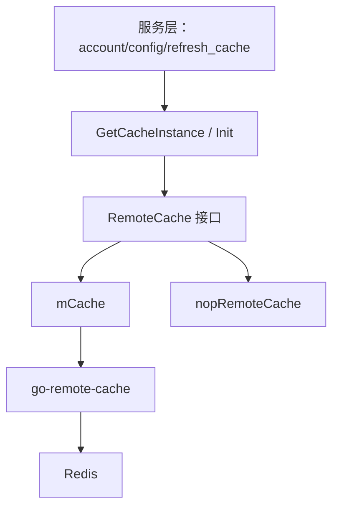

# Caching Layer

## 缓存层职责

`remote_cache` 包封装账号服务对 Redis 远端缓存的访问，核心目标是把服务层的缓存读写、失效、互斥锁和降级行为集中在一个模块内。外部代码主要通过 `GetCacheInstance()` 获取 `RemoteCache` 接口，而不是直接操作 `go-remote-cache` 或 Redis。

该模块覆盖三类数据：

- 视频账号查询缓存：`MGetVideoAccount`、`SetVideoAccounts`、`SetQueryResult`、`RemoveAccount`
- 域名账号关系缓存：`MListDomainAccountRel`、`SetDomainAccountRel`
- CDN 调度域名缓存：`SetCDNScheduleDomains`、`GetCDNScheduleDomains`、`AcquireCDNScheduleDomainsLock`

此外，模块还提供查询级互斥锁：`Lock`、`Unlock`、`Locked`，用于降低缓存击穿时的并发回源压力。

## 入口与实现

`RemoteCache` 是模块对服务层暴露的接口。当前有两个实现：

- `mCache`：真实缓存实现，内部包装 `g.RemoteCache`
- `nopRemoteCache`：降级实现，读写大多返回 `nopRemoteCacheErr`，让上层走兜底逻辑或直接跳过缓存



`mCache` 的定义很薄：

```go
type mCache struct {
    c g.RemoteCache
}
```

所有真实读写最终都通过 `r.c.GetOnce`、`r.c.Get`、`r.c.Set`、`r.c.PipelineGet`、`r.c.PipelineSet`、`r.c.PipelineAdd`、`r.c.Delete`、`r.c.GetMembers` 等方法完成。

## 初始化流程

### `Init()`

`Init()` 是服务启动时的显式初始化入口。`main` 和测试入口 `TestMain` 会调用它。

当 `tcc.CheckRedisCacheSwitch()` 返回 `true` 时，`Init()` 会：

1. 调用 `newRedisCli()` 创建 Redis 客户端
2. 使用 `g.NewCacheBackend(redisCli)` 构造缓存后端
3. 使用 `g.NewRemoteCache(...)` 创建 `g.RemoteCache`
4. 将全局 `cacheInstance` 设置为 `&mCache{c: cache}`

`Init()` 对 Redis 初始化失败采取强失败策略：如果 Redis 客户端创建失败或 `g.NewRemoteCache` 失败，会直接 `panic`。代码注释说明这是为了避免启动后大量流量直接穿透到数据库。

### `GetCacheInstance()`

`GetCacheInstance()` 是运行期获取缓存实例的入口。调用方包括：

- `mgetAccountWithConfig`
- `setAccountRedisCache`
- `MCreateConfig`
- `MUpdateConfig`
- `DeleteConfig`
- `refreshDomainRel`
- `refreshCDNScheduleDomainCache`

如果 `cacheInstance` 已经存在，函数直接返回。否则通过 `sync.Once` 延迟初始化：

```go
initOnce.Do(func() {
    redisCli, err := newRedisCli()
    if err != nil {
        cacheInstance = nopRemoteCacheInstance
    } else {
        cache, err := g.NewRemoteCache(...)
        if err != nil {
            cacheInstance = nopRemoteCacheInstance
        } else {
            cacheInstance = &mCache{c: cache}
        }
    }
})
```

和 `Init()` 不同，`GetCacheInstance()` 对初始化失败采取降级策略：返回 `nopRemoteCacheInstance`，使请求继续执行并由上层兜底。

需要注意的是，`GetCacheInstance()` 本身不检查 `tcc.CheckRedisCacheSwitch()`。如果启动时没有通过 `Init()` 建立实例，后续第一次调用 `GetCacheInstance()` 仍会尝试创建 Redis 缓存。

### `newRedisCli()`

`newRedisCli()` 根据环境构造 `goredis.Client`：

- 普通环境使用 `config.Conf.Redis.Cluster`
- CI 环境使用固定 Redis 地址 `redis://10.37.83.202:6380`，并设置密码与 `DisableGDPRVerify`

超时配置来自：

```go
config.Conf.Redis.ReadTimeout
config.Conf.Redis.WriteTimeout
config.Conf.Redis.DialTimeout
```

缓存默认 TTL 和重试次数来自 TCC：

```go
tcc.GetRedisCacheTtl()
tcc.GetRedisCacheRetryTimes()
```

## 视频账号缓存

视频账号缓存分为两层 key：

1. 查询结果 key：缓存一次查询对应的账号存储 key 列表
2. 账号存储 key：缓存具体的 `dto.MGetVideoAccountResponse`

这种设计避免同一个账号对象在不同查询条件下被重复存储，同时允许按 `accessKey` 批量删除所有相关实体缓存。

### Key 结构

`toQueryResultKey(req)` 根据 `dto.MGetAccountWithConfigRequest` 的查询条件生成查询结果 key，字段包括：

- `ID`
- `AccountName`
- `QueryName`
- `AccessKey`
- `Module`
- `Status`
- `UserName`
- `TopAccountID`
- `TopInstanceID`
- `VolcAccountID`
- `VolcInstanceID`
- `Type`
- `AccountType`
- `Region`
- `WithDeleted`
- `VRegion`

末尾追加 `versionTag`，当前为 `@v2`。

`toAccountStoreKey(accessKey, region, module)` 生成实体缓存 key：

```go
strings.Join([]string{accessKey, region, module, versionTag}, ".")
```

`toStoreKeySetKey(accessKey)` 生成账号到实体 key 集合的索引 key：

```go
accessKey + ":key_set" + "@v2"
```

该集合用于 `RemoveAccount` 删除某个账号的所有实体缓存。

### 读取：`MGetVideoAccount`

`MGetVideoAccount(ctx, req)` 的读取流程：

1. 通过 `toQueryResultKey(req)` 读取查询结果中的 `storeKeys`
2. 对每个 `storeKey` 构造 `g.Item`
3. 使用 `PipelineGet(ctx, batch, items...)` 批量读取实体缓存
4. 如果所有实体命中，直接返回 `[]dto.MGetVideoAccountResponse`
5. 如果某个实体 key 缺失，则解析 `storeKey`，从 DB 回源：
   - `dao.Db.GetAccountByAK(ctx, &ak)`
   - `dao.Db.MGetVideoConfig(ctx, ak, module, region)`
6. 回源结果写入响应数组
7. 异步将缺失的实体缓存和索引集合补回 Redis

这里的缺失补偿逻辑是为了处理账号创建、更新、删除期间可能出现的查询结果 key 仍存在但实体 key 已被删除的情况。代码会记录 warn 日志，然后按实体 key 中解析出的 `accessKey`、`region`、`module` 回源。

补偿写入是异步执行的：

```go
go func() {
    err := r.c.PipelineAdd(ctx, batch, toAddSets...)
    ...
    err = r.c.PipelineSet(ctx, batch, toSetItems...)
    ...
}()
```

这意味着主请求不等待缓存修复完成。调用方需要把 `MGetVideoAccount` 的返回值视为本次请求的权威结果，而不是缓存修复完成的信号。

### 写入实体：`SetVideoAccounts`

`SetVideoAccounts(ctx, req, resp)` 写入账号实体缓存，并维护 `accessKey -> storeKey` 集合。

对每个 `dto.MGetVideoAccountResponse`：

1. 使用 `toAccountStoreKey(acct.AccessKey, req.Region, req.Module)` 生成实体 key
2. 使用 `toStoreKeySetKey(acct.AccessKey)` 生成集合 key
3. 将实体写入 `PipelineSet`
4. 将实体 key 加入集合 `PipelineAdd`

实体缓存 TTL 为：

```go
tcc.GetRedisCacheTtl() + 30*time.Second
```

实体缓存比查询结果缓存多 30 秒，是为了降低查询结果 key 仍存在但实体缓存先过期导致的短时间不一致概率。

### 写入查询结果：`SetQueryResult`

`SetQueryResult(ctx, req, resp)` 只缓存查询结果到实体 key 的映射，不缓存实体本身。

它会从 `resp` 中提取每个账号的实体 key：

```go
toAccountStoreKey(response.AccessKey, req.Region, req.Module)
```

然后写入 `toQueryResultKey(req)`，TTL 为 `tcc.GetRedisCacheTtl()`。

典型写入顺序应当是先调用 `SetVideoAccounts` 写实体，再调用 `SetQueryResult` 写查询结果。这样查询结果 key 出现时，对应实体更可能已经存在。

### 删除：`RemoveAccount`

`RemoveAccount(ctx, accessKey)` 用于账号变更后的缓存失效：

1. 通过 `toStoreKeySetKey(accessKey)` 读取该账号关联的所有实体 `storeKeys`
2. 立即删除这些实体 key
3. 启动 goroutine，等待 10 秒后再次删除同一批 key

第二次删除是延迟双删，用于降低并发写入旧值造成脏缓存的概率。

需要注意：`RemoveAccount` 删除的是实体缓存 key，不直接删除所有查询结果 key。旧查询结果 key 如果还在，后续 `MGetVideoAccount` 读取到缺失实体时会回源 DB，并异步补齐实体缓存。

## 查询互斥锁

视频账号查询锁围绕 `toLockKey(req)` 构建。锁 key 是查询结果 key 后追加 `"_lock"`。

### `Lock`

`Lock(ctx, req)` 使用随机 UUID 作为锁值，并通过 `SetNX` 获取锁：

```go
g.SetOptions{SetNX: true, TTL: 30 * time.Second}
```

返回值包括：

- `key`：实际锁 key
- `value`：本次锁持有者的随机值
- `err`：底层 `Set` 返回的错误

调用方应保存 `value`，后续释放锁时传给 `Unlock`。

### `Unlock`

`Unlock(ctx, req, value)` 先读取当前锁值，只有 Redis 中的值与传入 `value` 一致时才删除锁：

```go
if _, err := r.c.Get(ctx, &g.Item{...}); err == nil && curVal == value {
    return r.c.Delete(ctx, key)
}
```

这可以避免误删其他请求刚获得的新锁。

### `Locked`

`Locked(ctx, req)` 只判断锁 key 是否可读。如果 `Get` 成功返回 `true`，否则返回 `false`。

## 域名账号关系缓存

域名账号关系缓存处理 `dto.ListDomainAccountRelRequest` 到 `[]*dto.DomainAccountRel` 的结果缓存。

### Key 结构

`toDomainAccountRelStoreKeySetKey(req)` 使用请求字段生成 key，包含：

- `ID`
- `Domain`
- `DomainType`
- `AccountName`
- `Region`
- `Module`
- `Category`
- `NeedSubDomains`

这个 key 保存的不是最终结果，而是分片数据 key 列表。

### 写入：`SetDomainAccountRel`

`SetDomainAccountRel(ctx, req, resp)` 会先将 `resp` JSON 序列化，然后按 4096 字节切片：

```go
grouped := groupBytes(rawBytes, 4096)
```

每个分片写入独立 store key：

```go
fmt.Sprintf("%s_%s_%d", keySetKey, uuid, i)
```

其中 `uuid.New().String()` 用于区分不同批次的写入，避免新旧分片 key 混淆。

写入流程是：

1. `json.Marshal(resp)`
2. `groupBytes(rawBytes, 4096)`
3. `PipelineSet(ctx, batch, items...)` 写入所有分片
4. `Set(ctx, keySetKey -> storeKeys)` 写入分片 key 列表

### 读取：`MListDomainAccountRel`

`MListDomainAccountRel(ctx, req)` 的读取流程：

1. 通过 `toDomainAccountRelStoreKeySetKey(req)` 读取分片 key 列表 `storeKeys`
2. 使用 `PipelineGet(ctx, batch, items...)` 批量读取所有分片
3. 如果任一分片返回 `g.ErrCacheMiss`，整体返回 `g.ErrCacheMiss`
4. 按顺序拼接所有分片字节
5. 使用 `json.Unmarshal(rawBytes, &resp)` 还原 `[]*dto.DomainAccountRel`

这个缓存对分片完整性要求较高：只要有一个分片缺失，就不会返回部分结果，而是让调用方走回源逻辑。

## CDN 调度域名缓存

`cdn_domain.go` 提供一组全局缓存 key：

```go
const (
    CDNScheduleDomainsKey     = "cdn_schedule_domains"
    CDNScheduleDomainsLockKey = "cdn_schedule_domains_lock"
)
```

### `SetCDNScheduleDomains`

`SetCDNScheduleDomains(ctx, result)` 将 `map[string][]string` 写入固定 key `cdn_schedule_domains`。

写入时设置：

```go
g.SetOptions{TTL: -1}
```

表示该数据不过期，刷新由业务流程主动控制。

### `GetCDNScheduleDomains`

`GetCDNScheduleDomains(ctx)` 从固定 key 读取 `map[string][]string`。如果底层 `GetOnce` 返回错误，函数返回 `nil, err`。

### `AcquireCDNScheduleDomainsLock`

`AcquireCDNScheduleDomainsLock(ctx)` 使用固定锁 key `cdn_schedule_domains_lock`，随机 UUID 作为锁值，并通过 `SetNX` 获取 30 秒锁。

该函数只负责加锁，不提供对应的显式 unlock 方法。锁释放依赖 TTL 自动过期。

## 降级实现：`nopRemoteCache`

`nopRemoteCache` 实现完整的 `RemoteCache` 接口，用于 Redis 不可用时维持调用方代码路径稳定。

大多数读取和写入方法返回：

```go
var nopRemoteCacheErr = errors.New("nop remote cache")
```

包括：

- `MGetVideoAccount`
- `SetVideoAccounts`
- `SetQueryResult`
- `MListDomainAccountRel`
- `SetDomainAccountRel`
- `SetCDNScheduleDomains`
- `GetCDNScheduleDomains`
- `AcquireCDNScheduleDomainsLock`

部分方法是无害空操作：

- `RemoveAccount` 返回 `nil`
- `Lock` 返回空 key、空 value、`nil`
- `Unlock` 返回 `nil`
- `Locked` 返回 `false`

因此调用方不应把 `Lock` 成功返回等价理解为真实 Redis 锁已建立；在降级实现下，锁相关方法会表现为无锁运行。

## 与服务层的关系

执行流显示，账号查询链路会经过缓存层：

```text
GetAccountInfo
-> mGetAccountWithConfig0
-> mgetAccountWithConfig
-> GetCacheInstance
-> newRedisCli / mCache / TCC 配置
```

批量查询也会经过同一入口：

```text
MGetAllAccountWithConfig
-> mGetAccountWithConfig1
-> mgetAccountWithConfig
-> GetCacheInstance
```

配置变更链路通过 `GetCacheInstance()` 调用 `RemoveAccount` 或写入相关缓存，使账号配置变化能够影响缓存实体。

刷新任务链路也依赖该模块：

- `refreshDomainRel` 使用域名账号关系缓存
- `refreshCDNScheduleDomainCache` 使用 CDN 调度域名缓存
- `setAccountRedisCache` 使用视频账号实体缓存和查询结果缓存

这意味着 `remote_cache` 既在在线查询路径上，也在后台刷新路径上。修改 key 结构、TTL、删除策略或降级行为时，需要同时考虑在线请求和刷新任务。

## 一致性与并发特性

该模块采用的是缓存旁路模式，而不是强一致缓存。

关键特性包括：

- 查询结果 key 和实体 key 分离，便于实体复用和按账号删除
- 实体 TTL 比查询结果 TTL 多 30 秒，减少查询结果存在但实体过期的问题
- `RemoveAccount` 使用延迟双删降低并发旧值回写风险
- `MGetVideoAccount` 在实体缺失时会回源 DB，并异步修复缓存
- 查询锁使用 `SetNX + TTL`，释放时校验 value，避免误删其他请求的锁
- CDN 调度域名锁没有显式释放，依赖 30 秒 TTL

这些策略提升了可用性，但不提供严格的读后写一致性。调用方需要能处理缓存未命中、缓存错误和短暂旧数据。

## 修改时需要特别注意

修改 `toQueryResultKey`、`toAccountStoreKey`、`toStoreKeySetKey` 或 `toDomainAccountRelStoreKeySetKey` 会改变 Redis key 空间。当前视频账号 key 使用 `versionTag = "@v2"` 做版本隔离；如果调整 key 语义，应考虑是否需要提升版本号，避免新旧结构混用。

修改 `parseAccountStoreKey` 时要保持它与 `toAccountStoreKey` 的格式一致。当前解析逻辑假设实体 key 由点号分隔，并且前三段分别是 `accessKey`、`region`、`module`。

修改 `SetVideoAccounts` 和 `SetQueryResult` 的调用顺序或 TTL 时，需要保证查询结果 key 不会长期指向不存在的实体 key。

修改 `RemoveAccount` 时要保留按 `accessKey` 获取 store key 集合的能力，否则配置更新和删除流程无法可靠失效实体缓存。

修改 `nopRemoteCache` 时要确认上层对错误和空操作的预期。当前设计是读写失败让上层兜底，删除和锁释放尽量不阻塞主流程。