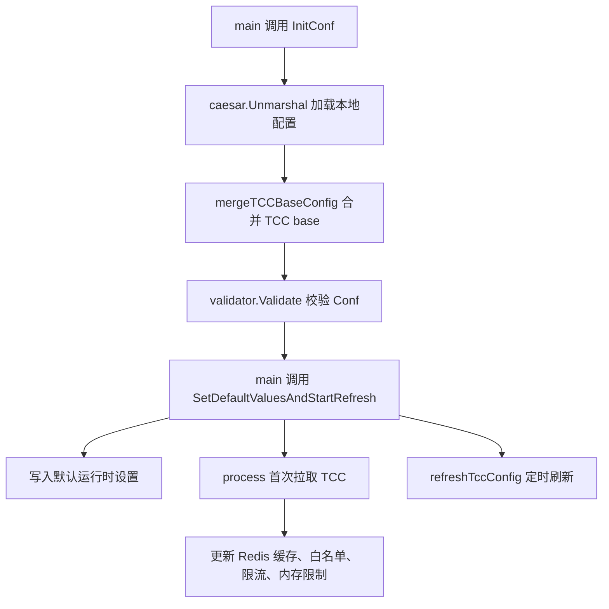

# Configuration and TCC Settings

## 配置与 TCC 设置模块

该模块负责服务启动配置、TCC 动态配置读取、运行时开关刷新，以及部分下游组件的配置初始化。代码主要分为两个包：

- `config`：加载本地配置，合并 TCC `base` 配置，校验配置结构，并提供数据库、熔断器等配置对象。
- `tcc`：封装 TCC 客户端、配置读取函数、热更新任务，以及若干运行时缓存的设置项。



## 启动配置加载

全局配置入口是 `config.Conf`：

```go
var Conf *Config
```

服务启动时调用 `InitConf()`：

1. 创建 `Config` 实例。
2. 通过 `caesar.Unmarshal(Conf, ginex.ConfDir())` 从配置目录加载 YAML。
3. 调用 `mergeTCCBaseConfig()` 尝试合并 TCC 中的 `base` 配置。
4. 使用 `validator.Validate(Conf)` 执行结构校验。
5. 使用 `pretty.Println(Conf)` 打印最终配置。

`Config` 是静态配置的总结构，包含数据库、白名单、限流、熔断器、Redis、TCC、ID 生成器、远程写入等配置：

```go
type Config struct {
    Meta                 Meta
    WriteDB              *Mysql
    ReadDB               *Mysql
    RetryTimes           int
    ACL                  ACL
    RateLimiter          RateLimiter
    InterfaceRateLimiter InterfaceRateLimiterConfig
    CircuitBreakers      map[string]CircuitBreaker
    WhiteList            map[string]bool
    Redis                Redis
    RedisCache           RedisCache
    TccInfo              TccInfo
}
```

## TCC `base` 配置合并

`mergeTCCBaseConfig()` 在本地 YAML 加载后执行，用于从 TCC 拉取 key 为 `base` 的基础配置，并与本地配置合并。

关键逻辑：

```go
value, err := cli.Get(context.Background(), "base")
yaml.Unmarshal([]byte(value), &tccConf)
mergo.Merge(&tccConf, Conf)
Conf = &tccConf
```

合并方向很重要：

- `tccConf` 先从 TCC `base` 解析而来。
- `mergo.Merge(&tccConf, Conf)` 将本地 `Conf` 中的非零值补充到 `tccConf`。
- 最终 `Conf = &tccConf`。

因此，TCC `base` 中已经设置的字段优先保留；本地配置主要作为补充默认值。

如果以下任一条件发生，函数只记录 warning 并保留本地配置：

- `Conf == nil`
- `Conf.Meta.PSM == ""`
- TCC client 初始化失败
- `base` 拉取失败或为空
- YAML 解析失败
- merge 失败

## 配置校验

`validator.go` 在 `init()` 中注册两个自定义校验函数：

```go
validator.SetValidationFunc("valid_duration", validateDuration)
validator.SetValidationFunc("valid_psm", validatePSM)
```

当前代码中实际使用的是：

```go
type Meta struct {
    PSM string `yaml:"PSM" validate:"valid_psm"`
}
```

`validatePSM()` 要求 PSM 以三段点分格式出现，例如 `a.b.c`。如果 `strings.Split(value, ".")` 的长度不是 3，会返回 `errInvalidPSM`。

`validateDuration()` 使用 `time.ParseDuration()` 校验字符串格式，但当前给出的配置结构中没有字段使用 `validate:"valid_duration"` 标签。需要新增字符串 duration 校验时，可以复用该 validator。

## MySQL 配置

`Mysql` 描述数据库连接参数：

```go
type Mysql struct {
    DSNTemplate  string
    Username     string
    Password     string
    DBName       string
    ConsulName   string
    Timeout      string
    ReadTimeout  string
    WriteTimeout string
    MaxIdle      int
    MaxOpen      int
}
```

`GetDSN()` 根据运行环境返回 DSN：

- CI 环境下返回固定测试库 DSN。
- 非 CI 环境下使用 `DSNTemplate` 和配置字段拼接 DSN。

CI 判断由 `IsCIEnvironment()` 完成：

```go
return len(os.Getenv("CI_REPO_NAME")) > 0 || os.Getenv("IS_SYSTEM_TEST_ENV") == "1"
```

`NewDB()` 基于 `GetDSN()` 创建 GORM 连接：

```go
db, err := gorm.Open("mysql2", m.GetDSN())
db.LogMode(true)
db.DB().SetMaxIdleConns(m.MaxIdle)
db.DB().SetMaxOpenConns(m.MaxOpen)
db.SingularTable(true)
```

数据库初始化链路中，`src/dao/db.go` 会使用 `GetReadDBPassword()`、`GetWriteDBPassword()`、`GetDBRetryTimes()` 和 `GetTccSettingsClient()` 从 TCC 获取动态密码与重试参数。

## 双重开关模式

`DoubleSwitch` 用于需要“本地配置 + etcd 开关”共同生效的场景：

```go
type DoubleSwitch struct {
    Enable bool
    Switch string
}

func (s *DoubleSwitch) IsEnabled() bool {
    return s.Enable && etcdutil.GetWithDefault(s.Switch, "0") == "1"
}
```

只有 `Enable == true` 且 etcd 中 `Switch` 对应值为 `"1"` 时，`IsEnabled()` 才返回 true。

`ACL`、`RateLimiter`、`CircuitBreaker` 都内嵌了 `DoubleSwitch`：

```go
type ACL struct {
    DoubleSwitch `yaml:",inline"`
    Pairs map[string]string
}
```

这意味着这些能力可以通过静态配置启用，再通过 etcd 进行运行时开关控制。

## 熔断器配置

`CircuitBreaker` 描述 `github.com/sony/gobreaker` 的运行参数：

```go
type CircuitBreaker struct {
    DoubleSwitch
    CloseFailures     uint32
    CloseInterval     time.Duration
    OpenTimeout       time.Duration
    HalfOpenSuccesses uint32
}
```

`GetSettings(name string)` 将模块配置转换为 `gobreaker.Settings`：

```go
ReadyToTrip: func(counts gobreaker.Counts) bool {
    return counts.ConsecutiveFailures >= c.CloseFailures
}
```

状态变化会通过 `logs.Warn()` 记录：

```go
OnStateChange: func(name string, from gobreaker.State, to gobreaker.State) {
    logs.Warn("circuit_breaker %s changes state from %s to %s", name, from.String(), to.String())
}
```

TCC 中的熔断器配置由 `GetCircuitBreakersConfigs()` 读取 key `circuit_breakers`。由于 JSON 中的 duration 是字符串，`CircuitBreakerConfig.UnmarshalJSON()` 会显式解析：

- `close_interval` -> `time.Duration`
- `open_timeout` -> `time.Duration`

解析失败时返回本地 `config.Conf.CircuitBreakers`。

## TCC 客户端

`tcc.GetTccSettingsClient()` 是 TCC 客户端的唯一入口，使用 `sync.Once` 保证进程内只初始化一次：

```go
var (
    tccOnce sync.Once
    client  *tccclient.ClientV2
)
```

初始化参数来自 `config.Conf`：

```go
tccConfigV2.Auth = true
tccConfigV2.Confspace = config.Conf.TccInfo.ConfigSpace
tccConfigV2.SetFirstGetTimeout(1 * time.Second)
cli, err := tccclient.NewClientV2(config.Conf.Meta.PSM, tccConfigV2)
```

因此必须先调用 `config.InitConf()`，再调用任何 `tcc` 包读取函数。否则 `config.Conf` 为空会导致 panic 或无效配置。

## 启动后的动态配置刷新

`SetDefaultValuesAndStartRefresh()` 是 TCC 动态配置的启动入口，由 `main.go` 调用。

它先用本地 `config.Conf` 写入默认值：

```go
SetDefaultAllowList(config.Conf.WhiteList)
SetStorageConfigCheckWhitelist(config.Conf.StorageConfigCheckWhitelist)
SetRedisCacheSwitch(config.Conf.RedisCache.Switch)
SetRedisCacheTtl(config.Conf.RedisCache.TTL)
SetRedisCacheRetryTimes(config.Conf.RedisCache.RetryTimes)
SetAccountNoCacheWhitelist(config.Conf.AccountNoCacheWhitelist)
```

然后初始化接口级限流：

```go
initInterfaceRateLimiterFromConfig()
```

`initInterfaceRateLimiterFromConfig()` 调用 `interface_limiter.InitConfig(config.Conf.InterfaceRateLimiter)`，将静态配置转成限流器初始状态。

接着执行一次 `process()`。如果首次 TCC 拉取或解析失败，`SetDefaultValuesAndStartRefresh()` 会 panic：

```go
if !process() {
    panic("can't reach tcc or parse tcc config error")
}
```

首次成功后启动后台刷新协程：

```go
go refreshTccConfig()
```

`refreshTccConfig()` 每分钟调用一次 `process()`：

```go
for range time.Tick(configUpdateInterval) {
    process()
}
```

## `process()` 刷新的配置项

`process()` 是动态配置热更新的核心函数。它会生成 log id，并创建 tracing span：

```go
sp, ctx := bytedtracer.StartCustomSpan(ctx, "TccCron", "RefreshTccConfig", ...)
```

当前刷新项包括：

| TCC key | 处理函数或目标 | 失败影响 |
|---|---|---|
| `redis_cache_switch` | `SetRedisCacheSwitch(val == constant.TrueValue)` | 标记 `success=false` |
| `redis_cache_ttl` | `time.ParseDuration()` 后 `SetRedisCacheTtl()` | 标记 `success=false` |
| `redis_cache_retry_times` | `strconv.Atoi()` 后 `SetRedisCacheRetryTimes()` | 标记 `success=false` |
| `account_nocache_whitelist` | JSON 解析后 `SetAccountNoCacheWhitelist()` | 标记 `success=false` |
| `metadata_clean_black_list` | 仅 `EnableEmbeddedMetadata` 为 true 时读取 | 标记 `success=false` |
| `interface_rate_limiter` | `interface_limiter.UpdateConfigFromTCC(val, nil)` | 解析失败标记 `success=false` |
| `mem_limit_percent` | `mem_limit.ApplyFromPercent(val)` | 不影响启动成功 |

`mem_limit_percent` 是可选项。读取失败、空值或应用失败只记录日志，不会阻塞服务启动。

## Redis 缓存运行时设置

Redis 缓存开关、TTL 和重试次数使用 atomic 变量保存：

```go
var redisCacheSwitch = atomic.NewBool(false)
var redisCacheRetryTimes = atomic.NewInt32(0)
var redisRedisCacheTtl = atomic.NewInt64(0)
```

对外读取函数：

```go
CheckRedisCacheSwitch() bool
GetRedisCacheTtl() time.Duration
GetRedisCacheRetryTimes() int
```

这些值会被账号查询链路使用。例如 `GetAccountInfo`、`MGetAllAccountWithConfig` 会经过 `GetCacheInstance()`，再读取 `GetRedisCacheTtl()` 和 `GetRedisCacheRetryTimes()`。

由于这里使用 atomic，后台刷新协程更新值时，业务请求可以无锁读取。

## 白名单与 ACL

模块中有几类白名单配置：

- `WhiteList`：默认允许写白名单，通过 `SetDefaultAllowList()` 初始化，运行时由 `GetAllowList()` 从 TCC key `allow_list` 读取。
- `StorageConfigCheckWhitelist`：存储配置检查豁免白名单，通过 `SetStorageConfigCheckWhitelist()` 初始化，运行时由 `GetStorageConfigCheckWhitelist()` 从 TCC key `storage_config_check_whitelist` 读取。
- `AccountNoCacheWhitelist`：账号查询不使用缓存的 PSM 白名单，通过 `SetAccountNoCacheWhitelist()` 写入 `sync.Map`，由 `PSMInAccountNoCacheWhiteList()` 查询。
- `ACL`：访问控制配置，通过 `GetACLConfigs()` 从 TCC key `acl` 读取。

`GetAllowList()` 和 `GetStorageConfigCheckWhitelist()` 在 TCC 读取或 JSON 解析失败时返回本地默认值。

`SetAccountNoCacheWhitelist()` 当前只增量写入 `sync.Map`：

```go
for k, v := range whitelist {
    accountNoCacheWhitelist.Store(k, v)
}
```

这意味着 TCC 删除某个 key 后，旧 key 不会自动从本地 map 中删除。贡献代码时如果需要“全量替换”语义，需要显式清理旧值。

## 远程写入配置

远程写入配置结构为：

```go
type WriteRemote struct {
    RemoteSwitch  bool
    InvokeSetting string
    RegionInfo    string
}
```

TCC key 为 `write_remote_setting`。

读取入口：

```go
GetWriteSwitch(ctx)
GetRemoteSetting(ctx)
GetRemoteRegionInfo(ctx)
```

三者都调用内部函数 `getWriteRemoteSetting(ctx)`，后者通过 `GetWithParser()` 使用 `writeRemoteParser()` 解析 JSON。

`writeRemoteParser()` 的容错策略是：

- TCC 读取失败且没有 cache：返回 `config.Conf.WriteRemote`。
- TCC 读取失败且有 cache：返回 cache。
- JSON 解析失败：返回 cache。
- 解析成功：返回新的 `config.WriteRemote`。

这种写法依赖 TCC client 的 parser cache，用于降低配置抖动对业务路径的影响。

## ID 生成器配置

`GetIdGeneratorConfig(ctx)` 读取 TCC key `id_gen_setting`，解析为 `config.IdGenerator`：

```go
type IdGenerator struct {
    Switch                       bool
    Region                       string
    TableSupportSetting          map[string]bool
    TableRemainIdRemindThreshold map[string]int64
}
```

解析函数 `idGenParser()` 的容错行为与远程写入类似：

- TCC 读取失败但有 cache：返回 cache。
- JSON 解析失败但有 cache：返回 cache。
- 无 cache 且失败：返回错误。
- `GetIdGeneratorConfig()` 收到错误或类型不匹配时返回 `config.Conf.IdGenerator`。

## 管理员、缓存、密码等按需读取配置

`tcc/config.go` 提供一组简单的 TCC getter：

```go
GetDBRetryTimes(ctx) int
GetCacheRefreshTime(ctx) time.Duration
GetCacheSize(ctx) int
GetReadDBPassword(ctx) string
GetWriteDBPassword(ctx) string
```

这些函数的模式一致：

1. 从固定 TCC key 读取字符串。
2. 按目标类型解析。
3. 失败时记录日志并返回 `config.Conf` 中的本地默认值，密码读取失败则返回空字符串。

管理员配置由 `GetAdminUsers(ctx)` 读取 key `admin_user`，解析为 `map[string]bool`。失败时返回 `config.Conf.AdminUser`。

本地缓存开关由 `CheckLocalCacheSwitch(ctx)` 读取 key `local_cache_switch`。读取失败时默认返回 true。

## 元数据黑名单

`MetadataBlackList` 用于嵌入式元数据清理：

```go
type MetadataBlackList struct {
    Version   int
    BlackList []string
}
```

当 `config.Conf.EnableEmbeddedMetadata` 为 true 时，`process()` 会读取 TCC key `metadata_clean_black_list`，解析成功后调用 `setMetadataBlackList()`。

业务侧通过 `GetMetadataBlackList()` 获取当前黑名单。

注意：`metadataBlackList` 是普通包级变量，没有锁或 atomic 保护。如果未来读写频率提高，或结构变得更复杂，需要评估并发读写风险。

## 与业务链路的连接

该模块不是孤立配置层，多个业务路径直接依赖它：

- `main.go` 调用 `config.InitConf()` 完成静态配置加载。
- `main.go` 调用 `tcc.SetDefaultValuesAndStartRefresh()` 启动动态配置刷新。
- `src/dao/db.go` 使用 TCC 中的 DB 密码和重试次数初始化数据库。
- `src/middleware/acl.go` 通过 `GetACLConfigs()` 获取 ACL 配置。
- `src/middleware/filter.go` 通过 `GetAllowList()` 判断允许访问的 PSM。
- `src/interface_limiter/interface_limiter.go` 使用 `InterfaceRateLimiterConfig`，并通过 `UpdateConfigFromTCC()` 接收热更新。
- `src/remote_cache/video_account.go` 使用 `GetRedisCacheTtl()` 控制远程缓存写入 TTL。
- 账号查询链路通过 `GetRedisCacheRetryTimes()` 和 `GetRedisCacheTtl()` 影响缓存访问行为。

## 新增配置项的建议模式

新增静态配置时：

1. 在 `config.Config` 或子结构中增加字段，并补充 YAML tag。
2. 如果字段必须存在或有格式要求，增加 validator tag 或自定义校验函数。
3. 确认 `mergeTCCBaseConfig()` 的合并语义是否符合预期：TCC `base` 优先，本地配置补默认。
4. 在启动路径中避免直接使用未初始化的 `config.Conf`。

新增动态 TCC 配置时：

1. 定义明确的 TCC key 常量。
2. 决定配置是按需读取，还是需要在 `process()` 中定时刷新。
3. 为解析失败设计 fallback：本地默认值、上次 cache、还是允许失败。
4. 如果业务高频读取，优先使用 atomic、只读快照或带锁结构保存运行时状态。
5. 如果使用 `GetWithParser()`，parser 应该处理 `err` 和 `cache`，避免短暂 TCC 故障导致业务配置清空。

## 需要注意的实现细节

- `GetTccSettingsClient()` 使用 `sync.Once`，初始化后不会因为 `config.Conf.TccInfo.ConfigSpace` 变化而重建客户端。
- `SetDefaultValuesAndStartRefresh()` 首次 `process()` 失败会 panic，后续定时刷新失败只记录日志。
- `AccountNoCacheWhitelist` 使用增量更新，不会删除旧 key。
- `GetCircuitBreakersConfigs()` 中 duration 字段要求 TCC JSON 使用 Go duration 字符串，例如 `"1s"`、`"500ms"`。
- `GetDSN()` 在非 CI 环境会打印 DSN，注意日志中可能包含用户名、密码等敏感信息。
- `validateDuration()` 直接执行 `v.(string)`，只能用于 string 字段；如果 tag 被加到非 string 字段会 panic。