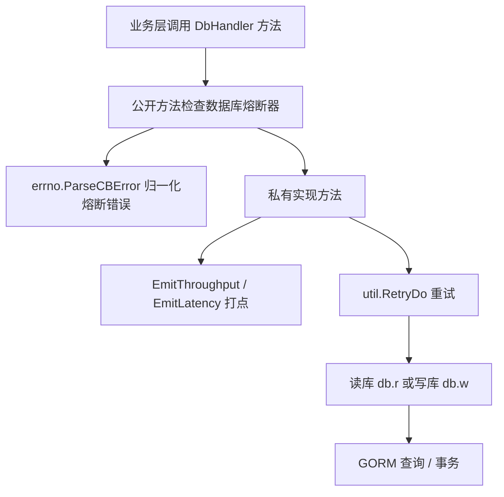

# Data Access Layer

## 数据访问层模块

数据访问层位于 `src/dao`，负责封装账号、配置、域名、规则、实例、权限等核心数据的 MySQL 读写逻辑。模块对外暴露的是 `DbHandler` 方法，调用方主要来自 `service`、`controllers`、测试入口以及 `main.go` 的初始化流程。

核心入口是全局变量 `dao.Db`。`InitDb()` 初始化读写库连接、MySQL 熔断、限流、TCC 密码、重试次数和 ID 生成器：

```go
var Db *DbHandler

type DbHandler struct {
    r          *gorm.DB // 读库连接
    w          *gorm.DB // 写库连接
    retryTimes int
}
```

## 通用调用模型

大多数 DAO 方法都采用同一种结构：公开方法处理熔断器，私有方法执行实际数据库访问。



典型模式如下：

```go
func (db *DbHandler) CreateAccess(ctx context.Context, access *dto.Access) error {
    if cb := middleware.GetDBCircuitBreaker(); cb != nil {
        _, err := cb.Execute(func() (interface{}, error) {
            return nil, db.createAccess(ctx, access)
        })
        return errno.ParseCBError(err)
    }
    return db.createAccess(ctx, access)
}
```

私有方法负责实际访问：

```go
func (db *DbHandler) createAccess(ctx context.Context, access *dto.Access) error {
    retryInfo := "CreateAccess"
    util.EmitThroughput(util.CommandThroughput, metrics.T{Name: util.TagCommand, Value: retryInfo})
    defer util.EmitLatency(util.CommandLatency, time.Now(), metrics.T{Name: util.TagCommand, Value: retryInfo})

    return util.RetryDo(ctx, retryInfo, db.retryTimes, func() error {
        return db.w.Context(ctx).Create(access).Error
    })
}
```

因此新增 DAO 方法时，应该保持三件事一致：公开方法包熔断，私有方法包指标和 `util.RetryDo`，写操作使用 `db.w`，读操作使用 `db.r`。

## 初始化与基础设施

`InitDb()` 在服务启动时由 `main.go` 和测试 `TestMain` 调用。它完成以下工作：

- 通过 `mysqldriver.InitTCCClient(tcc.GetTccSettingsClient())` 配置 TCC Client。
- 使用 `mysqldriver.InitMySQLCircuitBreakerByTccKey` 为读库和写库初始化 MySQL 熔断配置。
- 调用 `mysqldriver.OpenStatistics()` 开启驱动统计。
- 使用 `harden.NewClient` 配置 MySQL 限流客户端，并启用 `mysqldriver.SetMySQLRateLimitEnable(true)`。
- 从 TCC 获取数据库密码：`tcc.GetWriteDBPassword` 和 `tcc.GetReadDBPassword`。
- 调用 `config.Conf.WriteDB.NewDB()` 和 `config.Conf.ReadDB.NewDB()` 创建 GORM 连接。
- 将 `tcc.GetDBRetryTimes` 写入 `DbHandler.retryTimes`。
- 调用 `util.InitIdGenerator(connW)` 初始化 ID 生成器。

`isDuplicateError(err error)` 只判断 `*mysql.MySQLError` 的错误码是否为 `ErrDuplicate`，当前主要用于 `CreateDomainAuth` 把重复创建转换为业务可识别的错误码。

## 账号与配置

账号相关逻辑分布在 `account.go`、`video_account.go` 和 `video_config.go`。

`CreateAccount(ctx, videoAccount, videoConfigs)` 同时创建 `dto.VideoAccount` 和一组 `dto.VideoConfig`。实现使用事务，先写账号，再逐条写配置；任一失败会通过 `util.RollbackTX` 回滚。创建成功后会对每个配置调用 `EmitCreateConfigEvent`，触发配置同步事件。

`UpdateAccount(ctx, account)` 和 `UpdateAccountV2(ctx, account)` 都更新 `v_account`，区别在于字段处理：

- `UpdateAccount` 只更新非零值或非空字符串字段，例如 `Description`、`Extra`、`TopAccountID`、`Type`、`VRegion`。
- `UpdateAccountV2` 会把相关字段全部放入 `attrs`，可用于显式清空字段。

`UpdateAccountStatus(ctx, accessKey, status)` 按 `access_key` 更新 `v_account.status`，使用事务。

查询路径有两套 DTO：

- `PageGetAccount`、`GetAccountAmount`、`MGetAccount` 返回 `dto.Account`。
- `PageGetVideoAccount`、`GetVideoAccountAmount`、`MGetVideoAccount` 返回 `dto.VideoAccount`。

分页查询和计数复用 `queryWithCondition(req, conn)`，支持 `ID`、`AccountIds`、`AccountName`、`QueryName`、`AccessKey`、`Status`、`UserName`、`TopAccountID`、`TopInstanceID`、`VolcAccountID`、`VolcInstanceID`、`Type`、`VRegion` 和 `AccountType` 等条件。默认情况下，`WithDeleted == false` 会过滤为 `enabled`、`unaudited`、`disabled` 三类状态。

`MGetVideoAccount` 对全量查询有特殊处理：当 `dto.IsGetAllAccountsRequest(req)` 为真时，它按 `id >= curID` 和 `pageSize = 200` 分批读取，避免一次性拉取过多数据。状态过滤不是 SQL 条件，而是在内存中过滤，代码注释说明这是为了避免慢 SQL。

配置读取集中在 `video_config.go`：

- `MGetVideoConfig(ctx, accessKey, module, region)` 按账号、模块和地域读取配置；指定模块时会同时包含 `constant.ModuleGlobal`。
- `MGetVideoConfigByKeys(ctx, accessKeys, module, region)` 支持批量 `access_key in (?)`。
- `MGetConfigByProvider(ctx, provider, ckey, region)` 固定查询 `module = 'storage'`。
- `MGetStorageConfigByBucketName(ctx, bucketName, region)` 使用 `cvalue like ?` 按 bucket 名模糊匹配。
- `ListVideoConfigByCondition` 按 `module`、`ckey`、`cvalue`、`region` 查询。
- `GetVideoConfigById` 按 `id` 读取单条 `dto.VideoConfig`。

配置写入在 `account.go`：

- `MCreateConfig` 批量创建配置，重复唯一键但非主键冲突时记录 warn 并跳过；主键冲突会回滚。
- `MUpdateConfig` 按 `access_key/module/ckey/region` 更新 `v_config.cvalue`。
- `DeleteConfig` 按 `id` 删除配置。
- `MCopyConfig` 从源地域复制指定模块配置到多个目标地域，跳过 `constant.ModuleGlobal`。

配置创建、更新、删除都会通过 `EmitCreateConfigEvent`、`EmitUpdateConfigEvent`、`EmitDeleteConfigEvent` 连接到配置同步逻辑。

## 配置同步与域名关系

`sync_config.go` 维护一个异步事件队列：

```go
var configActionEventQueue = make(chan *ConfigActionEvent, 4096)
```

`init()` 中启动 `startHandleConfigActionEvent()`，持续消费队列。事件类型包括：

- `ConfigCreateAction`
- `ConfigUpdateAction`
- `ConfigDeleteAction`

只有域名配置会触发域名同步。判断逻辑在 `isDomainConfig(config)`：

```go
return (config.Module == constant.ModulePlay || config.Module == constant.ModulePicture) && config.CKey == "domains"
```

创建和更新事件都会调用 `createDomainFromConfig(ctx, config)`。该函数先删除当前账号在指定 `region + module` 下的旧域名关系：

```go
Db.DeleteDomainRelByRelType(ctx, config.AccountName, dto.BuildDomainRelTypeFromConfig(config.Region, config.Module))
```

然后通过 `buildDomainsFromConfig` 解析 `config.CValue`。解析过程会先调用 `Db.GetAccountByAK` 获取账号信息，再将 JSON 反序列化为 `dto.AcctConfDomains`，最终构建 `dto.Domain` 和对应的 `dto.DomainAccountRel`。

如果域名不存在，调用 `Db.CreateDomain` 创建域名和关联关系；如果已存在，调用 `Db.UpdateDomain` 更新域名，再逐条调用 `Db.CreateDomainAccountRel` 创建关系。

删除事件会调用 `Db.DeleteDomainRelByRelType` 清理关系，不删除 `dto.Domain` 本身。

## 域名与域名授权

`domain.go` 负责 `dto.Domain` 和 `dto.DomainAccountRel`。

主要方法：

- `CreateDomain`：事务内创建域名，并创建 `domain.AccountRels` 中的关系。
- `DeleteDomain`：事务内删除域名和同域名下的 `dto.DomainAccountRel`。
- `GetDomain`：先查 `dto.Domain`，再查关联的 `dto.DomainAccountRel` 填充 `ret.AccountRels`。
- `UpdateDomain`：按 `domain` 更新证书、厂商、状态、负责人、服务树节点等字段。
- `CreateDomainAccountRel`：创建单条域名账号关系。
- `DeleteDomainRelByRelType`：按 `account_name` 和 `rel_type` 删除关系。
- `DeleteDomainRelById`：按关系 ID 删除。
- `UpdateDomainAccountRel`：更新关系的 `Category`、`InnerExtra`、`BizExtra`。
- `ListDomainAccountRel`：按请求条件读取关系。
- `BatchListDomainAccountRel`：用 `batchSize = 200` 分批读取关系。
- `MCopyDomainAccountRel`：把某账号源地域的关系复制到目标地域，并重建 `RelType`。

`domain_auth.go` 负责 `v_domain_bucket_relation`：

- `CreateDomainAuth` 创建 `dto.DomainAuth`，重复键时返回 `ErrDuplicate` 错误码但不把重复视为数据库错误。
- `GetDomainAuths` 按 `bucket` 和 `domain` 可选过滤读取授权关系。
- `UpdateDomainAuthStatus` 按 `domain` 更新状态。
- `DeleteDomainAuth` 按 `domain/top_account_id/account_name` 删除授权关系。

## 规则数据

规则有两套表和 DTO：`dto.VideoRule` 对应 `v_rule`，`dto.VideoRuleV2` 对应 `v_rule_v2`。

`video_rule.go` 提供旧版规则接口：

- `CreateRule`
- `UpdateVideoRuleById`
- `UpdateVideoRuleStatus`
- `UpdateVideoRuleByProvider`
- `DeleteVideoRule`
- `BatchGetRule`
- `PageGetRule`
- `GetRuleAmount`

分页和计数复用 `queryRuleCondition(req, conn)`，按 `ID`、`Provider`、`Category` 过滤，并固定追加：

```go
conn = conn.Where("local_idc = ? and status not in ('deleted')", req.IDC)
```

`video_rule_v2.go` 提供 V2 规则接口：

- `CreateRuleV2`
- `UpdateVideoRuleByIdV2`
- `UpdateVideoRuleStatusV2`
- `DeleteVideoRuleV2`
- `BatchGetRuleV2`

V2 查询条件使用 `dto.MGetRuleRequestV2`，支持 `ID`、`Provider`、`Type`、`LocalIDC`。

## 实例、权限、访问控制与条件

这些文件是较薄的 CRUD 封装，仍然遵循熔断、指标、重试模式。

`instance.go` 操作 `dto.Instance` 和 `t_instance`：

- `CreateInstance` 创建实例。
- `DeleteInstance` 不是物理删除，而是将 `Status` 更新为 `constant.StatusDeleted`。
- `UpdateInstance` 按内部 `id` 更新实例字段。
- `UpdateInstanceByInstanceID` 按 `instance_id` 更新；如果 `InstanceID` 去空格后为空，直接返回 `nil`。
- `GetInstance` 按 `account_id` 查询未删除实例。
- `ListInstance` 支持 `where map[string]interface{}`、`configuration in (?)`、分页和总数统计。

`authority.go` 操作 `dto.Authority` 和 `t_authority`：

- `CreateAuthority`
- `DeleteAuthority`
- `UpdateAuthorityStatus`
- `MGetAuthorityByGrantor`
- `MGetAuthorityByGrantee`

`access.go` 操作 `dto.Access`：

- `CreateAccess`
- `DeleteAccess`
- `GetAccess`

`condition.go` 操作 `dto.Condition`：

- `CreateCondition`
- `DeleteCondition`
- `GetCondition`

`task.go` 当前只提供 `GetAllConsumers`，读取全部 `dto.ConsumerModel`。

## 账号分类 Schema

`category_schema.go` 管理 `dto.AccountCategorySchema` 和 `dto.AccountCategorySchemaHistory`，重点是变更前写历史。

主要方法：

- `CreateAccountCategorySchema`：创建 schema。
- `DeleteAccountCategorySchema`：删除前调用 `createAccountCategorySchemaHistory` 写历史，历史原因是 `dto.HistoryReasonDelete`。
- `ListAccountCategorySchema`：按 `AccountName`、`SchemaType`、`Category`、`Region` 查询，并为每条结果补充 `SchemaVersion = "{ID}_{Version}"`。
- `UpdateAccountCategorySchema`：更新前写历史，历史原因是 `dto.HistoryReasonUpdate`，然后更新 `SchemaValue` 并将 `Version` 加一。
- `getAccountCategorySchemaById`：按 schema ID 读取当前 schema。
- `createAccountCategorySchemaHistory`：读取当前 schema 后写入历史表，保留原 schema 的版本、内容和更新时间。
- `getAccountCategorySchemaHistory`：按 `schema_id` 和 `version` 读取历史记录。

这里的更新路径依赖当前传入对象的 `Version`，写入时使用 `schema.Version + 1`。调用方需要保证传入版本符合当前业务语义，否则可能产生版本跳跃或覆盖预期之外的数据。

## 事务与错误处理约定

需要多表写入或批量写入的方法通常使用 `util.BeginTX` 开启事务，并在失败时调用 `util.RollbackTX`：

- `createAccount`
- `updateAccountStatus`
- `mCreateConfig`
- `copyConfig`
- `mUpdateConfig`
- `createDomain`
- `deleteDomain`
- `createDomainAccountRel`
- `deleteDomainRel`
- `deleteDomainRelById`
- `updateDomain`
- `updateDomainAccountRel`
- `createAccountCategorySchema`
- `deleteAccountCategorySchema`
- `updateAccountCategorySchema`
- `createAccountCategorySchemaHistory`

重复键处理有三种模式：

- `isDuplicateError`：用于 `CreateDomainAuth`，重复时返回 `ErrDuplicate` 错误码。
- `createAccount`、`mCreateConfig`、`copyConfig`、`copyDomainAccountRel`：识别 MySQL 1062，并对主键冲突输出 ID 生成器告警日志。
- `mCreateConfig`、`copyConfig`、`copyDomainAccountRel`：非主键重复时记录 warn 并跳过当前记录。

## 与业务层的连接

调用关系上，DAO 是服务层的数据边界：

- `main.go` 调用 `InitDb()` 初始化全局 `dao.Db`。
- `service/account.go` 的 `mgetAccountWithConfig` 调用 `MGetVideoAccount` 和 `MGetVideoConfigByKeys` 聚合账号与配置。
- 配置写入方法通过 `EmitCreateConfigEvent`、`EmitUpdateConfigEvent`、`EmitDeleteConfigEvent` 间接驱动域名关系同步。
- 测试包的 `TestMain` 会调用 `InitDb()` 建立数据库环境。

模块没有复杂的业务编排流，主要承担稳定的数据访问、重试、熔断、指标和事务一致性职责。业务含义较强的逻辑集中在两处：账号配置和域名关系的同步，以及账号分类 schema 的历史版本记录。

## 贡献注意事项

新增或修改 DAO 方法时，优先沿用现有结构：

- 公开方法命名为导出形式，例如 `CreateXxx`；实际实现放在私有方法，例如 `createXxx`。
- 公开方法先检查 `middleware.GetDBCircuitBreaker()`，熔断错误通过 `errno.ParseCBError` 返回。
- 私有方法使用 `retryInfo` 作为指标 tag，并调用 `util.EmitThroughput` 和 `util.EmitLatency`。
- 所有数据库操作放入 `util.RetryDo(ctx, retryInfo, db.retryTimes, func() error { ... })`。
- 读操作使用 `db.r.Context(ctx)`，写操作使用 `db.w.Context(ctx)`。
- 多表或批量写入使用 `util.BeginTX`、`util.RollbackTX` 和 `tx.Commit()`。
- 修改 `v_config` 中 `domains` 配置时，需要考虑 `sync_config.go` 的异步副作用。
- 对全量或大结果集查询，参考 `MGetVideoAccount` 和 `BatchListDomainAccountRel` 的分页读取方式，避免一次性无界查询。