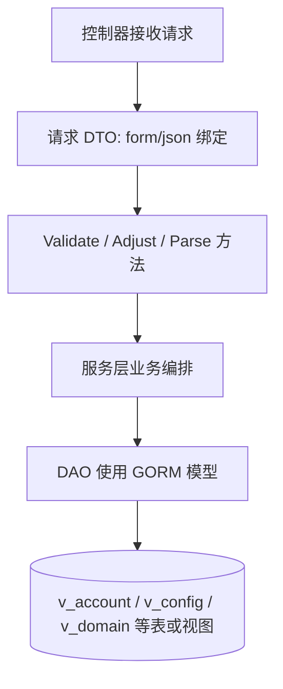
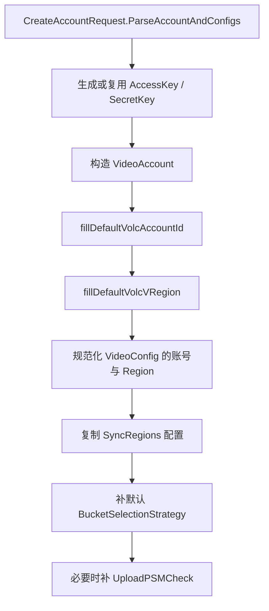

# Data Models and DTOs

## 模块定位

`src/dto` 定义账号系统的数据库模型、请求/响应 DTO、配置值结构和少量解析辅助函数。它位于控制器/服务层与 DAO/GORM 层之间：



这个模块不承载完整业务流程，但会做几类关键的边界处理：

- 定义 GORM 表映射，例如 `VideoAccount.TableName()` 返回 `v_account`。
- 在 `BeforeCreate` / `AfterCreate` 中处理 ID 和默认状态。
- 把外部请求转换成内部模型，例如 `CreateAccountRequest.ParseAccountAndConfigs()`。
- 规范化区域字段，例如 `MGetAccountV3Request.Adjust()` 和 `ListConfigsByConditionRequest.ParseListConfigsReq()` 调用 `util.GetRegion()`。
- 定义 JSON 配置值的结构，例如 `BucketSelectionStrategy`、`UploadPSMCheck`、`EmbeddedMetadataSchema`。

## 核心模型分类

### 账号与配置

账号模型主要分为 `Account` 和 `VideoAccount`。两者都映射到 `v_account`，但创建语义不同：

- `Account`
  - `TableName()` 返回 `v_account`
  - `BeforeCreate()` 调用 `AutoIncrID(&account.ID)`
  - 默认状态为 `constant.StatusUnaudited`
  - 主要用于较通用或历史路径的账号表示

- `VideoAccount`
  - `TableName()` 返回 `v_account`
  - `BeforeCreate()` 调用 `util.GenId(context.TODO(), v.TableName(), 1)`
  - 默认状态为 `constant.StatusEnabled`
  - 带 `msg` tag，用于视频账号相关序列化场景

`VideoConfig` 映射到 `v_config`，表示账号配置项：

```go
type VideoConfig struct {
    ID          int64  `gorm:"column:id" json:"id" msg:"id"`
    AccessKey   string `gorm:"column:access_key" json:"-" msg:"-"`
    AccountName string `gorm:"column:account_name" json:"account_name" msg:"account_name"`
    Module      string `gorm:"column:module" json:"module" msg:"module"`
    CKey        string `gorm:"column:ckey" json:"ckey" msg:"ckey"`
    CValue      string `gorm:"column:cvalue" json:"cvalue" msg:"cvalue"`
    Region      string `gorm:"column:region" json:"region" msg:"region"`
}
```

注意 `VideoConfig.AccessKey` 的 JSON tag 是 `json:"-"`，接口响应不会直接暴露该字段。

### 创建账号请求解析

`CreateAccountRequest.ParseAccountAndConfigs()` 是账号创建链路中最重要的 DTO 方法。它会把请求拆成一个 `VideoAccount` 和一组 `VideoConfig`，并在过程中补齐默认值。

处理顺序如下：



关键行为：

- 如果请求没有传 `AccessKey` / `SecretKey`，使用 `util.GetUUID()` 生成。
- 每个传入的 `VideoConfig` 都会被写入：
  - `AccessKey`
  - `AccountName`
  - `Region = util.GetRegion(req.Region)`
- `ConfSyncRegions` 只会复制非 `constant.ModuleGlobal` 的配置。
- 如果请求中没有全局 `constant.BucketSelectionStrategyCKey`，会自动追加：
  - `BucketSelectionStrategy{DisableAllCategory: false, DisableTerminator: true}`
- 如果处于 BOE 或内部生产环境，会自动追加上传 PSM 检查配置：
  - `UploadPSMCheck{Pct: 100, Mode: 2}`

`ParseAccountAndConfigs()` 会直接修改 `req.VideoConfigs`。调用方应避免对同一个请求对象重复调用，否则同步区域配置和默认配置可能被重复追加。

### 火山账号默认值

`fillDefaultVolcAccountId()` 根据账号类型和 `TopAccountID` 区间补齐 `VolcAccountID`：

- 请求已传 `VolcAccountID` 时不修改。
- `account.Type != constant.TypeSpace` 时不修改。
- 内部账号区间使用 `config.Conf.DefaultVolcAccountID`。
- 火山账号区间使用 `uint64(account.TopAccountID)`。

`fillDefaultVolcVRegion()` 为火山空间补默认 `VRegion`：

- 已有 `VRegion` 时不修改。
- 非空间账号不修改。
- `TopAccountID` 不在火山账号区间时不修改。
- 默认值来自 `config.Conf.DefaultVolcVRegion`。

此外，`ParseAccountAndConfigs()` 在遍历配置时，如果发现全局配置 `constant.SpaceGlobalRegionCKey` 且 `VideoAccount.VRegion` 为空，也会用该配置的 `CValue` 补齐 `VRegion`。

## 请求与响应 DTO

### 账号查询

`MGetAccountWithConfigRequest` 是账号查询的通用过滤 DTO，字段通过 `form` tag 绑定：

- `ID`
- `AccountName`
- `QueryName`
- `AccessKey`
- `Module`
- `Status`
- `UserName`
- `TopAccountID`
- `TopInstanceID`
- `VolcAccountID`
- `VolcInstanceID`
- `Type`
- `AccountType`
- `Region`
- `WithDeleted`
- `NoCache`
- `VRegion`

`IsGetAllAccountsRequest()` 用于判断请求是否缺少主要查询条件。它只检查账号标识类字段，不检查 `Status`、`UserName`、`Type`、`Region` 等过滤字段。

`PageGetAccountRequest` 嵌入 `MGetAccountWithConfigRequest`，额外提供：

- `AccountIds`
- `Offset`
- `Limit`

`MGetAccountV3Request.Adjust()` 会：

- 使用 `util.GetRegion()` 规范化 `Region`
- `strings.TrimSpace()` 清理 `AccountNames`
- 按逗号切分出 `AccountNameList`

对应执行流为：

```text
MGetAccountV3
→ MGetAccountV3Request.Adjust
→ util.GetRegion
→ getDefaultRegion
```

因此新增账号查询入口时，如果接受 region 参数，应尽量在 DTO 解析阶段复用同类规范化逻辑。

### 账号响应

`MGetVideoAccountResponse` 嵌入 `VideoAccount`，并通过 `VideoConfigs` 返回配置列表。

`ParseOpenapiAccountResponse()` 会把内部响应转换为 `MGetVideoAccountOpenapiResponse`，只保留 OpenAPI 需要暴露的账号字段，不包含配置列表。

### 配置创建与更新

`MCreateConfigRequest` 表示批量创建配置请求：

```go
type MCreateConfigRequest struct {
    AccessKey   string         `json:"access_key"`
    AccountName string         `json:"account_name"`
    Region      string         `json:"region"`
    SyncRegions []string       `json:"sync_regions"`
    Configs     []*VideoConfig `json:"configs"`
}
```

`ParseConfigs()` 与账号创建中的配置处理类似：

- 为每个配置补齐 `AccessKey`、`AccountName`。
- 把 `Region` 规范化为 `util.GetRegion(req.Region)`。
- 为非 `constant.ModuleGlobal` 配置复制 `SyncRegions`。

`MUpdateConfigRequest` 只是包装 `*MCreateConfigRequest`，更新配置的校验链路会复用创建配置校验：

```text
MUpdateConfig
→ ValidateMUpdateConfigRequest
→ ValidateMCreateConfigRequest
→ validateConfigs
→ BucketSelectionStrategy
```

这意味着 `BucketSelectionStrategy` 的 JSON 结构不仅用于账号创建默认值，也会被配置更新校验链路识别。

### 条件查询配置

`ListConfigsByConditionRequest` 当前支持按 `Module`、`CKey`、`CValue`、`Region` 查询配置。

- `Validate()` 要求 `Module` 非空。
- `ParseListConfigsReq()` 会调用 `util.GetRegion()` 规范化 `Region`。

执行流：

```text
ListConfigsByCondition
→ ListConfigsByConditionRequest.ParseListConfigsReq
→ util.GetRegion
→ getDefaultRegion
```

## 域名模型

### Domain

`Domain` 映射到 `v_domain`，表示域名主体信息。`DomainType` 定义域名类型枚举：

- `ExternalDomain`
- `InternalDomain`
- `OriginalDomain`
- `ScheduleDomain`
- `InternalRDDomain`
- `ExternalPrivateDomain`
- `InternalPrivateDomain`

`Domain.BeforeCreate()` 使用 `util.GenId(context.TODO(), d.TableName(), 1)` 生成 ID，而不是依赖数据库自增。

`Domain.AccountRels` 使用 `gorm:"-"`，表示它是接口聚合字段，不直接映射数据库列。

### DomainAccountRel

`DomainAccountRel` 映射到 `v_domain_account_rel`，表示域名与账号的绑定关系。核心字段包括：

- `Domain`
- `DomainType`
- `AccountName`
- `Region`
- `Module`
- `Category`
- `InnerExtra`
- `BizExtra`
- `SubDomains`

`RelType` 已标记为历史字段，注释说明它原本表示 `region+module`，现在已拆成 `Region` 和 `Module`。`BuildDomainRelTypeFromConfig(region, module)` 仍会生成 `fmt.Sprintf("%s_%s", region, module)`，用于兼容同步配置等老路径。

`DomainRelInnerExtra` 是 `InnerExtra` 的推荐 JSON 结构，目前只有 `Weight` 字段。

### 点播域名配置结构

`AcctConfDomain`、`AcctConfInstance`、`AcctConfDomainGroup`、`AcctConfDomains` 表示点播配置中的域名数据。

`AcctConfDomains.GetDomains()` 会把 `DomainGroup.ByteStations` 和 `DomainGroup.OtherStations` 下所有实例的 `Domains` 展平成一个列表。调用方包括 `buildDomainsFromConfig`，用于从配置构建域名数据。

## 域名鉴权模型

`DomainAuth` 映射到 `v_domain_bucket_relation`，表示 CDN 域名、空间、bucket 之间的授权关系。

相关 DTO：

- `CreateDomainAuthRequest`
- `UpdateDomainAuthStatusRequest`
- `DeleteDomainAuthStatusRequest`
- `DomainAuthInfo`
- `GetDomainAuthInfos`
- `Bucket`

这些结构主要服务于 DAO 层的 `deleteDomainAuth` 等域名 bucket 关系操作。

## 权限、访问与条件模型

`Access`、`Condition`、`Authority` 是权限相关的基础模型：

- `Access` 映射到 `t_access`
- `Condition` 映射到 `t_condition`
- `Authority` 映射到 `t_authority`

三者都实现了 GORM `TableName()`。`Access` 和 `Condition` 的 `BeforeCreate()` 调用 `AutoIncrID()`，让 ID 归零后交给数据库自增。

`Authority.BeforeCreate()` 额外设置：

```go
authority.Status = constant.StatusUnaudited
```

`GetAuthorityRequest` 通过 `form` tag 接收：

- `Grantor`
- `Space`
- `Grantee`

## 分类 Schema 模型

`AccountCategorySchema` 映射到 `v_account_category_schema`，用于保存账号、category、region 维度下的 schema 配置。

主要字段：

- `AccountName`
- `Category`
- `SchemaType`
- `SchemaValue`
- `Region`
- `Version`
- `SchemaVersion`

`SchemaVersion` 使用 `gorm:"-"`，只参与 JSON 输出，不映射数据库列。

`SchemaType` 当前只有：

```go
const (
    SchemaEmbeddedMetadata = SchemaType("embedded_metadata")
)
```

允许列表由 `SchemaTypeAllowList` 定义。

`EmbeddedMetadataSchema` 是 `SchemaValue` 中 `embedded_metadata` 类型的 JSON 结构：

- `Enabled`
- `GrayMode`
- `GrayPercentage`
- `IgnoreGlobalConf`
- `MetadataBlackList`
- `SchemaVersion`

相关执行流：

```text
UpdateAccountCategorySchema
→ ValidateUpdateAccountCategorySchemaRequest
→ checkEmbeddedMetadataValue
→ EmbeddedMetadataSchema
```

因此修改 `EmbeddedMetadataSchema` 字段时，需要同步检查 validator 中的 JSON 校验逻辑。

`AccountCategorySchemaHistory` 映射到 `v_account_category_schema_history`，保存 schema 的历史版本。`HistoryReasonUpdate` 和 `HistoryReasonDelete` 表示历史产生原因。

## 实例、规则与限流模型

### Instance 与 VideoInstance

`Instance` 映射到 `t_instance`，包含配置、计费项、海外计费项、状态等字段。`UpdateInstanceRequest` 和 `UpdateInstanceByInstanceIDRequest` 用于更新实例。

`VideoInstance` 映射到 `v_instance`，字段更少，主要包含：

- `AccountID`
- `InstanceId`
- `Extra`

两者不是完全等价模型，新增实例逻辑时需要按 DAO 使用的表选择结构。

### VideoRule 与 VideoRuleV2

`VideoRule` 映射到 `v_rule`，使用 `Category` 区分规则。

`VideoRuleV2` 映射到 `v_rule_v2`，使用 `Type` 区分规则。

相关请求/响应：

- `MGetRuleRequest`
- `PageGetRuleRequest`
- `PageGetRuleResponse`
- `MGetRuleRequestV2`
- `MGetRuleResponseV2`

当前 `VideoRule` 的 `BeforeCreate` / `AfterCreate` 被注释掉，规则模型没有启用创建钩子。

### ConsumerModel

`ConsumerModel` 映射到 `t_consumer`，用于消费者限流配置。`GetConsumerRateLimitResponse` 是按消费者名称聚合的限流响应，`QPSStruct` 同时带有 thrift 和 JSON tag。

## ID 生成与 GORM 生命周期

本模块有两种 ID 策略。

第一类是数据库自增策略，`BeforeCreate()` 调用：

```go
AutoIncrID(&model.ID)
```

`AutoIncrID()` 当前只是把 ID 设置为 `0`。使用该策略的模型包括：

- `Access`
- `Authority`
- `Condition`
- `Account`
- `Instance`
- `VideoInstance`

第二类是服务端生成 ID，`BeforeCreate()` 调用 `util.GenId()`：

- `VideoAccount`
- `VideoConfig`
- `Domain`
- `DomainAccountRel`

这些模型会把 `TableName()` 作为 ID 生成参数，因此修改表名、拆表或迁移视图时，需要同时确认 ID 生成器的表名参数是否仍然正确。

`AfterCreate()` 的常见模式是：

```go
model.ID = scope.PrimaryKeyValue().(int64)
```

或 `uint64` 类型版本。它把 GORM 插入后的主键值重新写回结构体。

## 与其他层的连接

这个模块被多个方向依赖：

- 控制器层使用请求/响应 DTO，例如 `Search` 使用 `PageGetAccountRequest`、`MGetVideoAccountResponse`、`SearchAccountsResponse`。
- 服务层调用解析方法，例如 `MGetAccountV3` 调用 `MGetAccountV3Request.Adjust()`。
- Validator 依赖配置值结构，例如 `validateConfigs` 解析 `BucketSelectionStrategy`。
- DAO 层直接使用 GORM 模型，例如 `deleteConfig` 使用 `VideoConfig`，`getDomain` 使用 `Domain`，`listDomainAccountRel` 使用 `DomainAccountRel`。
- 同步配置链路使用域名辅助函数，例如 `createDomainFromConfig` 和 `copyDomainAccountRel` 调用 `BuildDomainRelTypeFromConfig()`。

## 贡献注意事项

新增 DTO 时，先确认它是请求/响应结构还是 GORM 模型。请求查询参数使用 `form` tag，写入请求通常使用 `json` tag；数据库模型应补齐 `gorm` tag 和 `TableName()`。

新增 GORM 模型时，需要明确 ID 策略。使用数据库自增时沿用 `AutoIncrID()`；需要提前生成 ID 的表，沿用 `util.GenId(context.TODO(), model.TableName(), 1)` 模式。

新增 region 字段时，应在 DTO 的 `Adjust()`、`Parse...()` 方法中统一调用 `util.GetRegion()`，不要把 region 规范化分散到 DAO 查询里。

修改 `ParseAccountAndConfigs()` 或 `ParseConfigs()` 时要注意它们会原地修改请求对象，并追加配置。调用链默认它们不是幂等函数。

修改 `EmbeddedMetadataSchema`、`BucketSelectionStrategy`、`UploadPSMCheck` 这类 JSON 配置结构时，需要同时检查 validator 和配置更新执行流，避免旧配置 JSON 无法解析或新字段未被校验。

`Account` 与 `VideoAccount`、`Instance` 与 `VideoInstance` 分别映射相近但语义不同的表或视图。新增逻辑时不要只按字段相似度替换模型，应按现有 DAO 和服务链路选择。