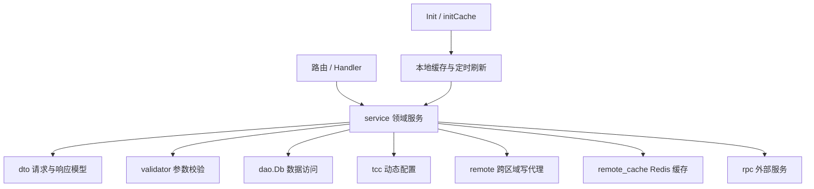
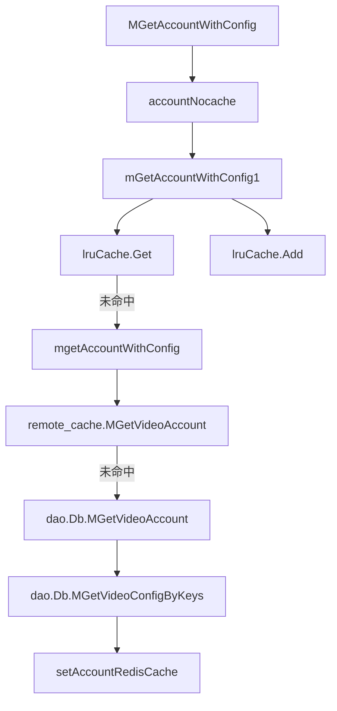

# Domain Services

## 领域服务层（`src/service`）

`src/service` 是 Account 服务的业务编排层。它把 Gin 请求上下文转换为 DTO，请求 `validator` 做参数校验，通过 `dao.Db` 访问数据库，并在需要时调用 `remote`、`remote_cache`、`tcc`、`rpc` 等外部能力。对外返回统一的 `*errno.Payload`，由上层 HTTP/RPC handler 负责序列化响应。

服务函数普遍遵循同一模式：

```go
func Xxx(c *gin.Context, ctx context.Context) *errno.Payload {
    // 读取 path/query/body
    // 反序列化到 dto.*
    // validator 校验
    // dao / remote / cache 编排
    // errno.OK 或 errno.ErrorWithCode
}
```

### 整体架构



## 启动与缓存初始化

`Init` 是服务层初始化入口，由 `main` 调用。它负责：

- 使用 `tcc.GetCacheRefreshTime` 和 `tcc.GetCacheSize` 初始化账号本地 LRU 缓存 `lruCache`
- 注册 `RefreshCache` 作为本地缓存刷新函数
- 延迟随机时间后启动 `lruCache.StartRefresh`
- 调用 `initCache` 初始化规则、权限、实例、域名关系、账号分类 Schema、CDN 调度域名等缓存
- 调用 `iamsdk.MustInitKms(constant.PSM)` 初始化 KMS

`initCache` 位于 `cache.go`，会创建多个本地缓存并启动刷新协程：

| 缓存 | 用途 | 刷新函数 |
|---|---|---|
| `ruleCache` | `MGetRule` 查询结果 | `refreshRule` |
| `authorityCache` | `MGetAuthority` 查询结果 | `refreshAuthority` |
| `instanceCache` | `GetInstance` 查询结果 | `refreshInstance` |
| `ruleIDCCache` / `ruleIDCSCache` | 规则同步 IDC 映射 | `refreshRule` 后重建映射 |
| `ruleIDCSCacheV2` | V2 规则同步 IDC 映射 | 定期置空，下次请求重建 |
| `domainRelCache` | `ListDomainAccountRel` 查询结果 | `refreshDomainRel` |
| `accountCategorySchemaCache` | 账号分类 Schema 全量快照 | `refreshAccountCategorySchema` |
| `cdnScheduleDomainCache` | CDN 主域名到子域名列表 | `refreshCDNScheduleDomainCache` |

刷新协程使用 `newAccountCronSpan` 创建 cron trace，并用 `util.RandomWaitTime` 错峰启动，避免多实例同时打满 DB 或远端服务。

## 账号服务

账号相关逻辑主要在 `account.go`。核心写接口包括：

- `CreateAccount`
- `UpdateAccount`
- `UpdateAccountV2`
- `ModifyAccount`
- `UpdateAccountStatus`
- `RemoteUpdateAccountStatus`

读接口包括：

- `MGetAccountWithConfig`
- `MGetAllAccountWithConfig`
- `GetAccountInfo`
- `CheckAccountExist`
- `PageGetAccount`
- `CountAccounts`
- `CountRegionSpacesV3`
- `GetAccountStorageBuckets`
- `GetAccountStorageBucket`
- `MGetAccountV3`

### 跨区域写代理

`CreateAccount`、`UpdateAccount`、`UpdateAccountStatus`、`MCreateConfig`、`MCopyConfig`、`DeleteConfig` 等写接口都有类似判断：

```go
if util.GetRegion(env.IDC()) == tcc.GetRemoteRegionInfo(ctx) {
    if tcc.GetWriteSwitch(c) {
        setting := tcc.GetRemoteSetting(ctx)
        // 调用 remote.CallRemote*
    }
    return errno.ErrNotSupportCreate // 或 ErrNotSupportUpdate / ErrNotSupportDelete
}
```

含义是：当前 IDC 属于远端写区域时，本地不直接写 DB，而是按 TCC 配置转发到远端 Account 服务。`tcc.GetWriteSwitch` 关闭时直接拒绝写入，避免海外或非主写区域误写。

### 账号查询主路径

`MGetAccountWithConfig` 和 `MGetAllAccountWithConfig` 最终都会走 `mGetAccountWithConfig1`，后者再调用核心函数 `mgetAccountWithConfig`。



`mgetAccountWithConfig` 同时处理本地缓存、Redis 缓存、DB 回源、批量配置补齐和异步刷新：

1. 根据 `tcc.CheckRedisCacheSwitch` 和 `skipCache` 判断是否使用 Redis。
2. 优先调用 `remote_cache.GetCacheInstance().MGetVideoAccount`。
3. 对全量请求或异步刷新请求，使用 Redis 锁减少缓存击穿。
4. 回源 DB 时先通过 `db.MGetVideoAccount` 查询账号，再按 `batch = 50` 分批调用 `db.MGetVideoConfigByKeys` 查询配置。
5. 查询完成后异步调用 `setAccountRedisCache` 写 Redis。
6. `mGetAccountWithConfig0` / `mGetAccountWithConfig1` 再把结果写入本地 `lruCache`。

`accountNocache` 和 `nocache` 用 `X-TT-From` 请求头配合 `tcc.PSMInAccountNoCacheWhiteList` 控制缓存绕过。`MGetAccountWithConfig` 对全量查询还会通过 `util.HardenCli.AllowFallbackShared` 做限流，并打点 `accounts.get.legacy_all`。

### 删除账号限制

`UpdateAccountStatus` 和 `RemoteUpdateAccountStatus` 在将账号状态更新为 `constant.StatusDeleted` 前，会先读取账号并校验：

- `TopAccountID >= 2000000000`
- `Type == constant.TypeSpace`

因此当前删除逻辑只允许删除 TOB VOD 空间。

## 配置服务

配置逻辑在 `config.go`，围绕 `dto.VideoConfig` 提供批量创建、复制、更新、删除和查询：

- `MCreateConfig`
- `MCopyConfig`
- `MUpdateConfig`
- `DeleteConfig`
- `RemoteDeleteConfig`
- `GetConfig`
- `ListConfigsByCondition`

`MCreateConfig` 和 `MUpdateConfig` 会读取 `X-TT-From`，如果 PSM 命中 `tcc.GetStorageConfigCheckWhitelist`，则在调用 `validator.ValidateMCreateConfigRequest` 或 `validator.ValidateMUpdateConfigRequest` 时跳过部分 storage config 校验。正常路径会进入 `validateStorageConfig`、`validateBucket`，并可能调用 `rpc.GetBucket` 验证 bucket。

成功创建、更新或删除配置后，如果 `tcc.CheckRedisCacheSwitch()` 开启，会调用 `remote_cache.GetCacheInstance().RemoveAccount(ctx, accessKey)` 清除账号维度 Redis 缓存，避免旧配置继续被 `mgetAccountWithConfig` 读到。

`GetConfig` 的查询优先级是：

1. 如果 query 中提供 `access_key`，直接使用。
2. 如果未提供 `access_key`，尝试使用 `account_name` 查询账号，再取第一个账号的 `AccessKey`。
3. 使用 `dao.Db.MGetVideoConfig(ctx, accessKey, module, util.GetRegion(region))` 查询配置。

`ListConfigsByCondition` 使用进程内 `sync.Map` 缓存，缓存 key 是解析后的 `dto.ListConfigsByConditionRequest`，过期时间来自 `tcc.GetCacheRefreshTime(ctx)`。

## 域名与域名关系服务

域名相关逻辑在 `domain.go`，维护 `dto.Domain` 和 `dto.DomainAccountRel`：

- `CreateDomain`
- `DeleteDomain`
- `GetDomain`
- `ListAccountsByDomain`
- `CreateDomainAccountRel`
- `DeleteDomainAccountRel`
- `UpdateDomainAccountRel`
- `ListDomainAccountRel`
- `CopyDomainAccountRel`
- `ImageXDomainOnChange`

`GetDomain` 使用 `domainCache` 做本地缓存。DB 返回非 `not found` 错误时，会尝试用过期缓存兜底；DB 返回 `not found` 时，会短暂缓存 `nil` 10 秒，防止缓存穿透。

`ListAccountsByDomain` 使用 `accountsByDomainCache`。当请求带 `module` 时，会用 `dto.BuildDomainRelTypeFromConfig(util.GetRegion(idc), module)` 构造 `relType`，缓存 key 由 `accountsByDomainCacheKey(domain, relType)` 生成。

`ListDomainAccountRel` 走 `listDomainAccountRel`，优先读 `domainRelCache`。当 `req.NeedSubDomains` 为 true 且关系的 `DomainType == dto.ScheduleDomain` 时，会从 `cdnScheduleDomainCache` 补充 `SubDomains`。

`ImageXDomainOnChange` 是 RocketMQ 消费路径调用的领域入口。`HandleMessage` 收到 ImageX 域名事件后调用该函数：

- `constant.EventAddDomain`：不存在域名时创建 `dto.Domain`，随后创建 `dto.DomainAccountRel`
- `constant.EventDeleteDomain`：查询匹配关系并调用 `dao.Db.DeleteDomainRelById` 删除绑定

## 账号分类 Schema 与内嵌元数据

`account_category_schema.go` 管理 `dto.AccountCategorySchema`：

- `CreateAccountCategorySchema`
- `DeleteAccountCategorySchema`
- `UpdateAccountCategorySchema`
- `ListAccountCategorySchema`
- `GetAccountCategoryEmbeddedSchema`
- `GetDeccEmbeddedSchema`

创建和查询时会用 `util.GetRegion` 归一化 region。`ListAccountCategorySchema` 通过 `nocache(c)` 判断是否绕过缓存；未绕过时调用 `listAccountCategorySchemaFromCache`，从 `accountCategorySchemaCache` 中按 `AccountName` 获取全量 Schema，再按 `Category`、`SchemaType`、`Region` 过滤。

`GetAccountCategoryEmbeddedSchema` 查询 `SchemaType == dto.SchemaEmbeddedMetadata`、`Category == "all"` 的 Schema，并反序列化为 `dto.EmbeddedMetadataSchema`。当 `config.Conf.EnableEmbeddedMetadata` 关闭时直接返回空 Schema。若 Schema 未设置 `IgnoreGlobalConf`，会合并 `tcc.GetMetadataBlackList()` 的全局黑名单，并把黑名单版本追加到 `SchemaVersion`。

`GetDeccEmbeddedSchema` 从 `rpc.GetAccountDeccEmbeddedMeta()` 读取 DECC 元数据 key 列表并返回。

## BPM 回调服务

`bpm.go` 处理 BPM 工作流回调，结构体会内嵌 `BPMWorkflowBasic` 保存通用审批字段。

主要入口：

- `BPMCreateDomainAccountRel`
- `BPMMigrateDomainAccountRel`
- `BPMCreateConfigs`
- `BPMUpsertMetadataClean`

`BPMCreateDomainAccountRel` 会先查域名是否存在：

- 已存在：使用 DB 中的 `domain.Type` 创建 `dto.DomainAccountRel`
- 不存在且错误包含 `not found`：构造 `dto.Domain`，把首个 `DomainAccountRel` 放入 `AccountRels`，调用 `dao.Db.CreateDomain`
- 其他错误：返回 DB 错误

随后它会根据 `SyncRegions` 复制跨 region 关系，重复关系错误包含 `Duplicate` 时跳过。

`BPMMigrateDomainAccountRel` 从旧域名读取所有关系，确保新域名存在，然后复制关系到新域名。复制时会清空 `ID`，更新 `Domain` 和 `DomainType`。

`BPMCreateConfigs` 将 BPM 的 `BucketResp` 转换成 storage 模块的 `dto.VideoConfig` 列表，调用 `validator.ValidateMCreateConfigRequest` 后用 `dao.Db.MCreateConfig` 写入。

`BPMUpsertMetadataClean` 查询账号内嵌元数据 Schema，存在则 `UpdateAccountCategorySchema`，不存在则 `CreateAccountCategorySchema`。

## 权限、规则、实例与基础实体

`access.go`、`condition.go`、`authority.go` 是较薄的 CRUD 编排层：

- `CreateAccess` / `DeleteAccess` / `GetAccess`
- `CreateCondition` / `DeleteCondition` / `GetCondition`
- `CreateAuthority` / `DeleteAuthority` / `UpdateAuthorityStatus` / `MGetAuthority`

`MGetAuthority` 根据 `dto.GetAuthorityRequest` 判断查询方向：

- `req.Grantee == ""`：调用 `dao.Db.MGetAuthorityByGrantor(ctx, req.Grantor, req.Space)`
- 否则：调用 `dao.Db.MGetAuthorityByGrantee(ctx, req.Grantee)`

查询结果会写入 `authorityCache`。

规则服务分为 V1 和 V2：

- V1：`CreateVideoRule`、`UpdateRuleById`、`UpdateRuleStatus`、`PageGetRule`、`MGetRule`、`LoadAllSyncIDC`、`LoadAllSyncIDCs`、`MGetCategory`
- V2：`CreateVideoRuleV2`、`UpdateRuleByIdV2`、`UpdateRuleStatusV2`、`MGetRuleV2`、`LoadAllSyncIDCsV2`

V1/V2 都会用 `util.GetRegion` 归一化 IDC，并通过 `util.GetSyncIDCs(rule.SyncInfo)` 把规则中的同步信息转换为 provider 到 IDC 列表的映射。

实例服务在 `instance.go`：

- `CreateInstance`
- `DeleteInstance`
- `UpdateInstance`
- `UpdateInstanceByInstanceID`
- `GetInstance`
- `ListInstances`

`GetInstance` 优先读 `instanceCache`，但命中 `tcc.PSMInAccountNoCacheWhiteList` 的调用方会绕过缓存。函数中还保留了兼容逻辑：如果老账号数据里存在 `TopInstanceID`，会构造单个 `dto.Instance` 返回并写缓存。

## 域名授权、ID 生成、限流与 Wand 资产

`domain_auth.go` 管理域名授权信息：

- `CreateDomainAuthInfo` 校验空间、top account、bucket 后创建 `dto.DomainAuth`
- `GetDomainAuthInfos` 按 bucket 或 domain 查询授权记录
- `UpdateDomainAuthStatus` 校验记录存在后更新状态
- `DeleteDomainAuth` 删除授权记录

`id_gen.go` 是 ID fetcher 管理入口，直接封装 `util.ListIdFetchers`、`util.UpdateIdFetcher`、`util.CreateIdFetcher`。

`task.go` 的 `GetConsumerRateLimit` 查询 consumer 配置并用 `getQPS` 计算当前时间段 QPS。`getQPS` 支持跨天时间段，例如 `23:00-01:00`。

`wand.go` 对接 Wand 资产：

- `GetAccountVodAssets` 根据负责人 `people` 查询账号，把 VOD 空间转换为资产字符串
- `UpdateAccountVodAssets` 解析 Wand 更新事件，校验原负责人后更新账号 `UserName`
- `Asset.EncodeAsset` 使用 `EncodeStr` 移除 `::` 和 `|`，避免资产字段拼接格式被破坏
- `getVodAssetUrl` 根据账号 global 配置中的 `region` 和 `config.Conf.Wand.RegionVConsoleUrl` 拼接 VConsole URL

## 缓存刷新路径

`refresh_cache.go` 放置所有缓存刷新函数。它们通常不直接处理 HTTP 请求，而是由 `cache.go` 的定时器或 `lruCache` 刷新回调调用。

`RefreshCache` 是账号本地 LRU 的刷新函数：

1. 将 key 断言为 `dto.MGetAccountWithConfigRequest`
2. 使用 `newAccountCronSpan("RefreshMGetAccountWithConfigCache")` 创建 trace
3. 通过 `util.HardenCli.Allow("cache.refresh:accounts.get:<idc>")` 限流
4. 调用 `mgetAccountWithConfig(ctx, dao.Db, &req, isAsyncRequest())`
5. 返回刷新后的账号与配置列表

`refreshDomainRel` 先尝试 `remote_cache.GetCacheInstance().MListDomainAccountRel`，失败后回源 `dao.Db.BatchListDomainAccountRel`，并在需要时补充 CDN 子域名，最后写回 Redis。

`refreshCDNScheduleDomainCache` 会根据 `config.Conf.UseCDNCacheAPI` 选择 `SearchMainDomainCached` 或 `SearchMainDomain`。如果 CDN API 失败，会从 Redis 快照 `GetCDNScheduleDomains` 恢复；成功时会把主域名到子域名的快照异步写入 Redis。

## 错误处理与可观测性

服务层统一返回 `errno.Payload`：

- 请求体读取失败：`errno.CodeGetDataErr`
- JSON 解析失败：`errno.CodeParseDataErr`
- 参数校验失败：`errno.CodeBadRequest`
- DB 失败：`errno.CodeDbErr`
- 内部错误：`errno.CodeInternalErr` 或 `errno.ErrServer`
- 成功：`errno.OK(data)`

日志使用 `logs.CtxError`、`logs.CtxWarn`、`logs.CtxInfo`，多数写操作成功后会打 warn 级别日志方便审计。热点查询如 `mgetAccountWithConfig`、`PageGetAccount`、`CountAccounts`、`PageGetRule` 会通过 `util.EmitThroughput` 和 `util.EmitLatency` 打指标。

## 贡献注意事项

新增服务函数时应保持现有约定：入口签名使用 `func(c *gin.Context, ctx context.Context) *errno.Payload`，请求模型放在 `dto`，复杂校验放在 `validator`，数据库访问放在 `dao`。

修改账号或配置写路径时，需要同步考虑缓存失效。账号配置变更后通常要调用 `remote_cache.GetCacheInstance().RemoveAccount`；账号查询变更要检查 `lruCache`、Redis query result、AK 到账号配置映射三层缓存是否一致。

修改跨区域写接口时，要保持 `util.GetRegion(env.IDC()) == tcc.GetRemoteRegionInfo(ctx)`、`tcc.GetWriteSwitch(c)`、`tcc.GetRemoteSetting(ctx)` 这一套判断语义，否则可能造成非主写区域直接写库。

处理 region/idc 字段时，应使用 `util.GetRegion` 归一化；规则、域名关系、账号配置和 Schema 查询都依赖这个约定。

新增缓存刷新逻辑时，应通过 `newAccountCronSpan` 创建可观测上下文，并考虑随机错峰、panic recover、DB 失败时的过期缓存兜底策略。