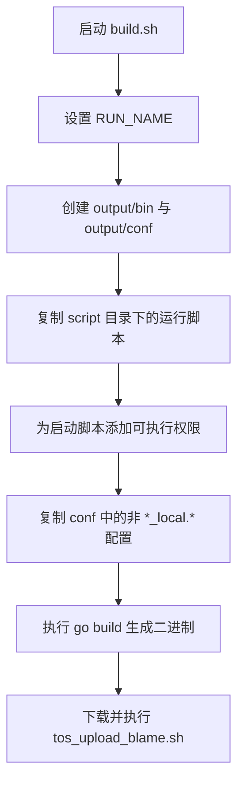

# Other — build.sh

## 模块概览

`build.sh` 是仓库的构建打包脚本，用于把 Go 服务编译成可运行二进制，并整理运行时需要的脚本与配置文件到 `output/` 目录。该模块本身没有 Shell 函数，也没有被代码调用图识别出内部调用、外部调用或执行流；它更像是 CI/CD 或本地构建流程中的独立入口。

脚本最终产物主要包括：

- `output/bin/toutiao.videoarch.account`：由 `go build` 生成的服务二进制。
- `output/bootstrap.sh`、`output/pre_nginx.sh`、`output/settings.py`：从 `script/` 目录复制出的启动与运行配置脚本。
- `output/conf/`：从 `conf/` 目录复制出的非本地配置文件。

## 执行流程



## 构建产物命名

脚本开头定义了构建产物名称：

```bash
RUN_NAME="toutiao.videoarch.account"
```

这个变量只在 `go build` 输出路径中使用：

```bash
go build -v -o output/bin/${RUN_NAME}
```

因此，服务二进制固定生成到：

```text
output/bin/toutiao.videoarch.account
```

如果服务名、发布包名或运行平台约定发生变化，需要同步检查这里的 `RUN_NAME` 是否仍与部署系统期望一致。

## 输出目录结构

脚本首先创建输出目录：

```bash
mkdir -p output/bin output/conf
```

`-p` 允许目录已存在时继续执行，不会因为重复构建而失败。构建完成后，预期目录结构为：

```text
output/
├── bin/
│   └── toutiao.videoarch.account
├── conf/
│   └── ...
├── bootstrap.sh
├── pre_nginx.sh
└── settings.py
```

`output/` 是打包边界：后续部署、镜像构建或发布系统通常只需要消费这个目录，而不需要直接依赖源码目录结构。

## 启动脚本与运行配置复制

脚本会从 `script/` 目录复制三个文件到 `output/` 根目录：

```bash
cp script/bootstrap.sh script/pre_nginx.sh script/settings.py output 2>/dev/null
chmod +x output/bootstrap.sh output/pre_nginx.sh
```

涉及的文件职责通常如下：

- `script/bootstrap.sh`：服务启动入口脚本。
- `script/pre_nginx.sh`：Nginx 或网关相关的预处理脚本。
- `script/settings.py`：运行时配置脚本或配置生成逻辑。

`cp` 命令末尾使用了 `2>/dev/null`，因此复制失败时的错误信息会被隐藏。脚本没有设置 `set -e`，所以即使这些文件缺失，后续命令仍会继续执行；但紧接着的 `chmod` 仍会尝试修改 `output/bootstrap.sh` 和 `output/pre_nginx.sh` 的权限。

`chmod +x` 只作用于两个 Shell 脚本，不作用于 `settings.py`。这说明当前构建约定中，`settings.py` 被当作配置或解释执行文件使用，而不是直接作为可执行入口。

## 配置文件复制规则

配置文件复制逻辑为：

```bash
find conf/ -type f ! -name "*_local.*" | xargs -I{} cp {} output/conf/
```

该命令从 `conf/` 目录递归查找普通文件，并排除文件名匹配 `*_local.*` 的本地配置文件。符合条件的文件会被复制到 `output/conf/`。

需要注意几个行为：

- 只复制文件，不复制目录结构；所有匹配文件都会被平铺到 `output/conf/`。
- 同名配置文件如果位于不同子目录，后复制的文件会覆盖先复制的文件。
- `*_local.*` 文件不会进入构建产物，适合放置本地开发配置、个人配置或不应发布的环境配置。
- 文件名包含空格或特殊字符时，当前 `find | xargs` 写法可能处理不稳；如果未来配置文件命名变复杂，可以考虑改为 `find ... -exec cp {} output/conf/ \;`。

## Go 编译

核心构建命令是：

```bash
go build -v -o output/bin/${RUN_NAME}
```

该命令在仓库根目录执行，默认编译当前 Go module 或当前目录对应的主包。`-v` 会输出编译过程中的包信息，便于在 CI 日志中排查依赖或编译问题。

脚本没有显式设置 `GOOS`、`GOARCH`、`CGO_ENABLED` 等环境变量，因此编译目标由当前执行环境决定。如果该脚本运行在 CI 中，目标平台需要由 CI 环境或外层构建系统保证。

## TOS blame 上传脚本

最后一行会下载并执行远端脚本：

```bash
bash -c "$(curl -fsL https://tosv.byted.org/obj/uitesting/tos_upload_blame.sh)" || echo ""
```

这里的作用是尝试执行 `tos_upload_blame.sh`，通常用于上传构建归因、测试归因或相关元数据。命令失败时会执行 `echo ""`，避免整个脚本以失败状态结束。

`curl` 参数含义：

- `-f`：HTTP 错误状态码时失败。
- `-s`：静默模式。
- `-L`：跟随重定向。

由于该步骤使用 `|| echo ""` 容错，远端脚本不可用、网络失败或上传失败通常不会阻断主构建产物生成。

## 与代码库其他部分的关系

`build.sh` 不参与服务运行时调用链，也不被 Go 代码直接调用。它连接代码库的方式主要体现在文件系统约定上：

- 依赖 `script/bootstrap.sh`、`script/pre_nginx.sh`、`script/settings.py` 作为运行时辅助文件。
- 依赖 `conf/` 目录提供发布配置。
- 依赖仓库根目录的 Go module 或主包结构，由 `go build` 生成服务二进制。
- 产出 `output/` 目录，供部署系统、发布平台或后续打包步骤消费。

因此，修改 `build.sh` 时重点关注构建产物兼容性，而不是业务调用关系。

## 维护注意事项

这个脚本的行为偏宽松：没有 `set -euo pipefail`，部分错误会被忽略或隐藏。这适合兼容历史构建环境，但也会让缺失文件、配置复制异常等问题更晚暴露。

常见修改点包括：

- 修改服务二进制名称时，更新 `RUN_NAME`。
- 增加运行时文件时，扩展 `cp script/... output` 的文件列表。
- 调整配置发布策略时，修改 `find conf/ -type f ! -name "*_local.*"` 过滤条件。
- 需要保留配置目录结构时，不能继续使用当前平铺复制方式。
- 需要让构建在缺失关键文件时立即失败时，应显式引入更严格的错误处理。