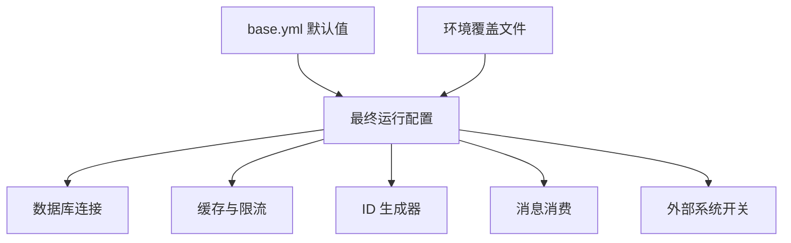

# Other — conf

## conf 模块

`conf/` 是服务的运行时配置目录，本身不包含函数、类或执行逻辑。它的对外契约是 YAML/JSON 配置文件、顶层配置键和按环境命名的覆盖文件。调用图中没有内部调用、外部调用或执行流，说明该模块主要作为配置输入，被服务启动流程和各业务子系统读取。

## 配置组织方式

`base.yml` 提供默认配置，环境文件按机房、区域、环境和租户形态覆盖部分字段，例如：

- `boe.staging.yml`、`boe.test.yml`：BOE 测试/预发环境
- `lf.prod.yml`、`hl.prod.yml`、`lq.prod.yml`：国内生产环境
- `sg1.prod.yml`、`useast2a.prod.yml`、`ie.prod.yml`：海外或 TTP 区域
- `*.default_tob.yml`、`*.default_tob_imagex.yml`、`*.default_tob_bp.yml`：ToB、ImageX、BytePlus 等租户形态
- `toutiao_videoarch_account.yaml`：服务框架层面的 Develop/Product 配置
- `kitex_remote_config.json`：Kitex 远程配置占位，目前为空对象 `{}`

典型加载模型是：先读取 `base.yml`，再按运行环境读取对应的环境配置文件，环境文件只覆盖差异字段。新增配置时应优先放入 `base.yml` 作为默认值，再在具体环境文件中覆盖。



## 核心配置键

### Meta

`Meta.PSM` 在 `base.yml` 中定义为：

```yaml
Meta:
  PSM: "toutiao.videoarch.account"
```

它标识当前服务的 PSM，通常会被日志、监控、权限或服务治理相关逻辑使用。

### 数据库配置

`ReadDB` 和 `WriteDB` 是所有环境中最核心的配置块。`base.yml` 定义完整结构：

```yaml
ReadDB:
  DSNTemplate: "%s:%s@tcp(%s)/%s?charset=utf8&parseTime=True&loc=Local&timeout=%s&readTimeout=%s&writeTimeout=%s&interpolateParams=True"
  Username: ""
  Password: ""
  DBName: ""
  ConsulName: ""
  Timeout: "500ms"
  ReadTimeout: "2s"
  WriteTimeout: "2s"
  MaxIdle: 20
  MaxOpen: 1000
```

`WriteDB` 使用相同字段。环境文件通常覆盖：

- `Username`
- `Password`
- `DBName`
- `ConsulName`
- `Timeout`

`ConsulName` 有两类写法：

- 服务发现名：如 `toutiao.mysql.videoarch_account_write`
- 直连地址：如 `10.227.14.96:3306`

部分环境还存在 `WriteDB-2`、`ReadDB-2`，例如 `boe.test.yml` 和 `boe.test.default_tob.yml`，用于测试环境的备用或直连数据库配置。

需要注意，部分生产文件中存在明文 `Username` 或 `Password` 字段。维护时不要扩大密钥暴露范围，新增敏感信息应优先走平台化密钥或空占位注入方式。

### ACL 与写权限白名单

`ACL` 控制访问控制开关：

```yaml
ACL:
  Enable: true
  Switch: "/web/videoarch/account/acl"
  Pairs:
    test: "test"
```

`WhiteList` 定义允许写操作的 PSM：

```yaml
WhiteList:
  "toutiao.videoarch.account_admin": true
  "toutiao.videoarch.vip_site_bis": true
```

相关白名单还包括：

- `StorageConfigCheckWhitelist`：存储配置校验白名单
- `AccountNoCacheWhitelist`：查询时绕过缓存的 PSM 白名单
- `AdminUser`：管理员用户名白名单

这些配置是布尔 map 模式，新增项应保持：

```yaml
"psm.or.user.name": true
```

### 限流与熔断

`RateLimiter` 是全局限流配置：

```yaml
RateLimiter:
  Enable: true
  Switch: "/web/videoarch/account/rate_limiter"
  Rate: "10-S"
  Prefix: "RateLimiter"
  CleanUpInterval: "1m"
```

`InterfaceRateLimiter` 用于接口级限流，默认关闭：

```yaml
InterfaceRateLimiter:
  Enable: false
  Limits: {}
```

`CircuitBreakers.DB` 控制数据库熔断：

```yaml
CircuitBreakers:
  DB:
    Enable: true
    Switch: "/web/videoarch/account/db_circuit_breaker"
    CloseFailures: 10
    CloseInterval: "10s"
    OpenTimeout: "10s"
    HalfOpenSuccesses: 5
```

这些字段使用字符串形式的时长，例如 `10s`、`1m`、`500ms`，应保持 Go duration 风格，避免写成纯数字。

### 缓存配置

本模块同时配置本地缓存和 Redis 缓存。

本地缓存：

```yaml
CacheSize: 500
CacheRefreshTime: "5m"
```

Redis 连接：

```yaml
Redis:
  Cluster: "toutiao.redis.videoarch_account_cache"
  DialTimeout: "250ms"
  ReadTimeout: "10s"
  WriteTimeout: "10s"
```

Redis 业务缓存开关：

```yaml
RedisCache:
  Switch: false
  TTL: "5m"
  RetryTimes: 3
```

`RedisCache.Switch` 在 `base.yml` 中默认关闭，注释说明需要使用 Redis 的区域应在 TCC 上单独开启。环境文件会覆盖 `Redis.Cluster`，例如 ToB 使用 `toutiao.redis.videoarch_account_cache_tob`，非 TT 区域使用 `toutiao.redis.videoarch_account_cache_nontt`。

### TCC 与 Harden

`Tcc.ConfigSpace` 控制 TCC 配置空间：

```yaml
Tcc:
  ConfigSpace: "default"
```

ToB 和 BytePlus 环境会覆盖为：

```yaml
Tcc:
  ConfigSpace: "tob"
```

或：

```yaml
Tcc:
  ConfigSpace: "tob_bp"
```

`Harden.Cluster` 标识当前服务所在集群：

```yaml
Harden:
  Cluster: "account"
```

常见值包括 `account`、`default_tob`、`default_tob_bp`、`default`。新增环境时，`Tcc.ConfigSpace` 和 `Harden.Cluster` 要与租户形态保持一致，否则会读错动态配置或治理集群。

### Wand

`Wand` 包含区域控制台域名映射和部分环境的访问 token。

`base.yml` 中定义 `RegionVConsoleUrl`：

```yaml
Wand:
  RegionVConsoleUrl:
    "cn-north-1": "vconsole.bytedance.net"
    "ap-singapore-1": "vconsole-sg.bytedance.net"
```

环境文件中常见覆盖：

```yaml
Wand:
  Token: "..."
```

`DefaultVolcAccountID` 和 `DefaultVolcVRegion` 与 Wand/火山区域能力配套使用：

```yaml
DefaultVolcAccountID: 2100331610
DefaultVolcVRegion: "cn-north-1"
```

海外 ToB 环境常将 `DefaultVolcVRegion` 覆盖为 `ap-southeast-1`。

### CDN 与 DECC

CDN 相关开关包括：

```yaml
EnableCDNRefresh: true
CDNGatewayEnv: "cn"
UseCDNCacheAPI: true
```

不同区域配置差异较大：

- 国内生产环境通常开启 `EnableCDNRefresh`，并设置 `CDNGatewayEnv: "cn"`
- BOE 环境可能设置 `CDNGatewayEnv: "boe"`
- 部分海外或 BytePlus 环境显式关闭 `EnableCDNRefresh: false`
- `UseCDNCacheAPI` 在多个国内和 ToB 生产环境中开启

`Decc` 控制 DECC 集成：

```yaml
Decc:
  Switch: true
  Cluster: default
  PSM: "decc.channel.integration"
```

`base.yml` 中默认 `Decc.Switch: false`，只有部分区域文件开启，例如 `boei18n.staging.yml`、`maliva.prod.yml`、`useast5.prod.yml`、`boettp.yml`。

### IdGenerator

`IdGenerator` 控制按区域生成 ID 的能力。生产环境普遍使用如下结构：

```yaml
IdGenerator:
  Switch: true
  Region: "cn6"
  TableSupportSetting:
    v_account: true
    v_config: true
    v_domain: true
    v_domain_account_rel: true
  TableRemainIdRemindThreshold:
    v_account: 1000
    v_config: 1000
    v_domain: 1000
    v_domain_account_rel: 1000
```

字段含义：

- `Switch`：是否开启 ID 生成器
- `Region`：ID 区域标识，如 `cn6`、`sg`、`mya`、`i18n`、`eu-ttp`
- `TableSupportSetting`：启用 ID 生成器的表
- `TableRemainIdRemindThreshold`：表级剩余 ID 告警阈值

单测环境 `boe.ut.yml` 额外包含 `v_unit_test` 和 `v_unit_test_parallel`，用于测试表。

### Consumers

`Consumers` 配置消息消费任务。当前出现的消费者主要是 `imagex_domain_event`：

```yaml
Consumers:
  - Topic: "imagex_domain_event"
    Name: "imagex"
    ConsumerGroup: "toutiao_videoarch_account"
    ClusterName: "videoarch_normal"
    WorkerNum: 4
```

BOE 环境的 `ClusterName` 通常是 `sandbox`，生产环境通常是 `videoarch_normal`。新增消费者时应保持列表结构，避免覆盖已有消费者配置。

### WriteRemote

部分海外生产环境定义 `WriteRemote`：

```yaml
WriteRemote:
  RemoteSwitch: false
  RegionInfo: maliva
```

或：

```yaml
WriteRemote:
  RemoteSwitch: false
  RegionInfo: useast5
```

该配置用于表达跨区域写入或远程写策略的区域信息。当前出现的环境均将 `RemoteSwitch` 设为 `false`。

## 服务框架配置

`toutiao_videoarch_account.yaml` 不是业务配置，而是服务框架运行参数，分为 `Develop` 和 `Product` 两套：

```yaml
Develop:
  ServicePort: "9984"
  DebugPort: "9985"
  EnablePprof: true
  LogLevel: "trace"
  EnableMetrics: false
  ConsoleLog: true
  Mode: "debug"

Product:
  ServicePort: "9984"
  DebugPort: "9985"
  EnablePprof: true
  LogLevel: "trace"
  EnableMetrics: true
  ConsoleLog: false
  Mode: "release"
```

关键差异：

- `Develop.EnableMetrics` 为 `false`，`Product.EnableMetrics` 为 `true`
- `Develop.ConsoleLog` 为 `true`，`Product.ConsoleLog` 为 `false`
- `Develop.Mode` 是 `debug`，`Product.Mode` 是 `release`

端口在两套配置中一致：服务端口 `9984`，调试端口 `9985`。

## 环境族群

### 国内 account 环境

代表文件：

- `lf.prod.yml`
- `hl.prod.yml`
- `lq.prod.yml`
- `zjg.prod.yml`
- `hj.prod.yml`
- `jj.prod.yml`
- `xh.prod.yml`
- `zb.prod.yml`
- `gl2.prod.yml`

这类环境通常使用：

```yaml
DBName: "videoarch_account"
ConsulName: "toutiao.mysql.videoarch_account_write"
```

并常见开启：

```yaml
EnableCDNRefresh: true
CDNGatewayEnv: "cn"
UseCDNCacheAPI: true
```

### ToB 环境

代表文件：

- `lf.prod.default_tob.yml`
- `hl.prod.default_tob.yml`
- `lq.prod.default_tob.yml`
- `mya.prod.default_tob.yml`
- `myb.prod.default_tob.yml`

典型特征：

```yaml
Tcc:
  ConfigSpace: "tob"

Harden:
  Cluster: "default_tob"
```

数据库通常使用 `videoarch_account_tob` 或 `videoarch_account_nontt`，Redis 使用 ToB 专用集群。

### BytePlus 环境

代表文件：

- `mya.prod.default_tob_bp.yml`
- `myb.prod.default_tob_bp.yml`
- `boe.staging.default_tob_bp.yml`

典型特征：

```yaml
Tcc:
  ConfigSpace: "tob_bp"

Harden:
  Cluster: "default_tob_bp"
```

生产环境使用 `videoarch_account_byteplus`，并显式关闭 `EnableCDNRefresh: false`。

### 海外与 TTP 环境

代表文件：

- `sg1.prod.yml`
- `my.prod.yml`
- `my2.prod.yml`
- `my3.prod.yml`
- `useast2a.prod.yml`
- `useast2b.prod.yml`
- `ie.prod.yml`
- `no1a.prod.yml`

常见差异是数据库名可能为 `videoarch_vcloud`，`IdGenerator.Region` 使用 `sg`、`i18n`、`eu-ttp`、`eu-ttp2` 等区域标识。

## 修改配置时的注意事项

新增环境文件时，建议从最接近的现有环境复制结构，再只修改必要字段。至少检查：

- `WriteDB` 和 `ReadDB` 是否指向正确库名与 Consul 服务
- `Tcc.ConfigSpace` 是否匹配租户形态
- `Harden.Cluster` 是否匹配部署集群
- `Redis.Cluster` 是否为对应区域或租户的缓存集群
- `IdGenerator.Region` 是否唯一且符合区域规划
- `EnableCDNRefresh`、`CDNGatewayEnv`、`UseCDNCacheAPI` 是否符合该区域 CDN 接入方式
- `Consumers.ClusterName` 是否在 BOE 使用 `sandbox`、生产使用正确消息集群
- 是否意外把测试库、直连地址或明文密码带入生产配置

修改共享默认值时要优先评估 `base.yml` 的影响范围。`base.yml` 中的字段会影响所有未覆盖该字段的环境，因此适合放稳定默认值，不适合放区域特定逻辑。