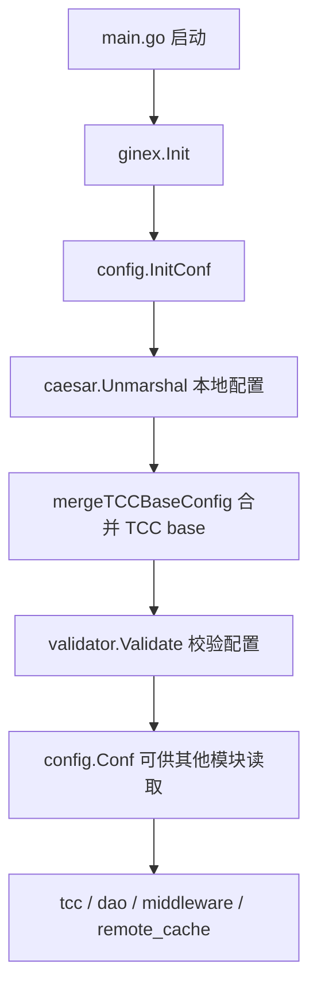

# Other — config

## 配置模块

`src/config` 负责加载服务启动所需的全局配置，并把 YAML、TCC base 配置、运行期开关、数据库连接参数和校验规则统一暴露为 `config.Conf`。服务启动后，大多数模块通过 `config.Conf` 直接读取配置，例如 DAO 初始化、TCC 动态刷新、限流、熔断、Redis 缓存和远端调用配置。

## 启动流程

`main.go` 在 `ginex.Init()` 之后立即调用 `config.InitConf()`：

```go
ginex.Init()
defer logs.Stop()

config.InitConf()
tcc.SetDefaultValuesAndStartRefresh()
rpc.Init()
remote_cache.Init()
dao.InitDb()
```

`InitConf()` 的执行顺序是：

1. 创建全局配置对象：`Conf = new(Config)`
2. 调用 `caesar.Unmarshal(Conf, ginex.ConfDir())` 从配置目录加载 YAML。
3. 调用 `mergeTCCBaseConfig()` 尝试加载 TCC 中 key 为 `base` 的基础配置。
4. 调用 `validator.Validate(Conf)` 执行结构体校验。
5. 使用 `pretty.Println(Conf)` 打印最终配置。



## 全局配置对象

模块通过包级变量暴露配置：

```go
var Conf *Config
```

`Config` 是服务配置的根结构体，主要字段包括：

- `Meta`：服务元信息，目前包含 `PSM`。
- `WriteDB` / `ReadDB`：写库和读库的 `Mysql` 配置。
- `RetryTimes`：通用重试次数，带 `validate:"min=1"` 校验。
- `ACL`：访问控制配置，内嵌 `DoubleSwitch`。
- `RateLimiter`：全局 HTTP 限流配置，内嵌 `DoubleSwitch`。
- `InterfaceRateLimiter`：接口级限流配置，由 `interface_limiter` 模块初始化和更新。
- `CircuitBreakers`：熔断器配置，供 `middleware.InitCircuitBreaker()` 使用。
- `WhiteList`、`StorageConfigCheckWhitelist`、`AccountNoCacheWhitelist`：白名单类配置。
- `CacheSize`、`CacheRefreshTime`：本地缓存容量和刷新时间。
- `WriteRemote`：远端写配置，由 `src/tcc/setting_remote.go` 读取。
- `TccInfo`：TCC 配置空间信息。
- `Harden`：MySQL 限流相关的 Harden 集群配置。
- `IdGenerator`：ID 生成器配置。
- `Wand`：Wand 访问 token 和区域控制台地址配置。
- `Consumers`：RocketMQ consumer 配置列表。
- `Decc`：DECC RPC 开关、集群和 PSM。
- `Redis` / `RedisCache`：Redis 客户端和 Redis 缓存行为配置。

由于 `Conf` 是全局指针，调用方通常不做依赖注入，而是直接读取：

```go
config.Conf.WriteDB.NewDB()
config.Conf.RateLimiter.IsEnabled()
config.Conf.CircuitBreakers
config.Conf.RedisCache.TTL
```

贡献代码时需要注意：`InitConf()` 必须在任何读取 `config.Conf` 的初始化逻辑之前执行，否则会触发 nil pointer 或读取未初始化配置。

## 本地配置加载

`InitConf()` 使用：

```go
caesar.Unmarshal(Conf, ginex.ConfDir())
```

这表示配置文件目录来自 `ginex.ConfDir()`，实际解析由 `code.byted.org/videoarch/caesar_config` 完成。加载失败时，代码会记录 fatal 日志并 panic：

```go
if err := caesar.Unmarshal(Conf, ginex.ConfDir()); err != nil {
    logs.Fatal("load config error: %v", err)
    panic(err)
}
```

因此本地配置文件缺失、格式错误或字段类型不匹配都会阻断服务启动。

## TCC base 配置合并

`mergeTCCBaseConfig()` 在本地配置加载完成后执行，用来读取 TCC 中 key 为 `base` 的基础配置。

执行条件：

- `Conf == nil`：直接返回。
- `Conf.Meta.PSM == ""`：记录 warn 并跳过加载。
- `Conf.TccInfo.ConfigSpace != ""`：将 `ConfigSpace` 写入 `tccCfg.Confspace`。
- TCC client 初始化失败、读取失败、返回空字符串、YAML 反序列化失败或 `mergo.Merge` 失败时，都会记录 warn 并保留原 `Conf`。

核心逻辑：

```go
tccCfg := tccclient.NewConfigV2()
tccCfg.Auth = true
if Conf.TccInfo.ConfigSpace != "" {
    tccCfg.Confspace = Conf.TccInfo.ConfigSpace
}
tccCfg.SetFirstGetTimeout(5 * time.Second)

cli, err := tccclient.NewClientV2(Conf.Meta.PSM, tccCfg)
value, err := cli.Get(context.Background(), "base")

var tccConf Config
yaml.Unmarshal([]byte(value), &tccConf)
mergo.Merge(&tccConf, Conf)

Conf = &tccConf
```

按当前实现，`mergo.Merge(&tccConf, Conf)` 会把本地 `Conf` 合并到 TCC 反序列化得到的 `tccConf` 中。默认合并行为是填充目标对象的零值字段，不覆盖目标对象已有的非零字段。因此：

- TCC `base` 中已有值的字段会保留 TCC 值。
- TCC `base` 中缺失或为零值的字段会从本地配置补齐。
- 合并成功后，全局 `Conf` 指向新的 `tccConf`。

这个行为会影响配置优先级。修改此函数时要特别确认是否希望 TCC base 优先，还是本地环境配置优先。

## 配置校验

`validator.go` 在 `init()` 中注册两个自定义校验器：

```go
validator.SetValidationFunc("valid_duration", validateDuration)
validator.SetValidationFunc("valid_psm", validatePSM)
```

当前实际使用的校验标签包括：

```go
type Meta struct {
    PSM string `yaml:"PSM" validate:"valid_psm"`
}
```

`validatePSM()` 要求 PSM 按 `.` 分割后正好有 3 段：

```go
func validatePSM(v interface{}, param string) error {
    value := v.(string)
    if len(strings.Split(value, ".")) != 3 {
        return errInvalidPSM
    }
    return nil
}
```

例如 `toutiao.videoarch.account` 合法，`toutiao.videoarch` 不合法。

`validateDuration()` 使用 `time.ParseDuration()` 校验字符串格式：

```go
func validateDuration(v interface{}, param string) error {
    value := v.(string)
    _, err := time.ParseDuration(value)
    return err
}
```

当前 `Config` 中多数 duration 字段直接声明为 `time.Duration`，例如 `CacheRefreshTime`、`RateLimiter.CleanUpInterval`、`Redis.TTL`，并没有在源码中使用 `valid_duration` 标签。若后续新增字符串型 duration 配置，可以复用该校验器。

## MySQL 配置

`Mysql` 描述数据库连接参数：

```go
type Mysql struct {
    DSNTemplate  string
    Username     string
    Password     string
    DBName       string
    ConsulName   string
    Timeout      string
    ReadTimeout  string
    WriteTimeout string
    MaxIdle      int
    MaxOpen      int
}
```

`GetDSN()` 有两条路径：

- CI 环境：返回固定测试 DSN。
- 非 CI 环境：用 `DSNTemplate` 格式化用户名、密码、Consul 名称、数据库名和超时时间。

CI 判断由 `IsCIEnvironment()` 实现：

```go
return len(os.Getenv("CI_REPO_NAME")) > 0 || os.Getenv("IS_SYSTEM_TEST_ENV") == "1"
```

`NewDB()` 基于 `GetDSN()` 创建 gorm 连接：

```go
db, err := gorm.Open("mysql2", m.GetDSN())
db.LogMode(true)
db.DB().SetMaxIdleConns(m.MaxIdle)
db.DB().SetMaxOpenConns(m.MaxOpen)
db.SingularTable(true)
```

实际数据库初始化在 `src/dao/db.go` 的 `InitDb()` 中完成。该函数会先通过 TCC 获取读写库密码：

```go
config.Conf.WriteDB.Password = tcc.GetWriteDBPassword(context.Background())
config.Conf.ReadDB.Password = tcc.GetReadDBPassword(context.Background())
```

然后分别调用：

```go
connW, err := config.Conf.WriteDB.NewDB()
connR, err := config.Conf.ReadDB.NewDB()
```

因此 `WriteDB` / `ReadDB` 的静态配置负责连接模板、用户名、库名、Consul 服务名和连接池参数；密码在运行期由 TCC 注入。

## DoubleSwitch 开关模式

`DoubleSwitch` 是多个配置块复用的双重开关模式：

```go
type DoubleSwitch struct {
    Enable bool   `yaml:"Enable"`
    Switch string `yaml:"Switch"`
}

func (s *DoubleSwitch) IsEnabled() bool {
    return s.Enable && etcdutil.GetWithDefault(s.Switch, "0") == "1"
}
```

它要求两个条件同时成立：

1. YAML 中 `Enable` 为 `true`。
2. etcd 中 `Switch` 对应的值为 `"1"`。

使用该模式的配置包括：

- `ACL`
- `RateLimiter`
- `CircuitBreaker`

例如全局限流在 `middleware.RateLimiter.RateLimit()` 中这样判断：

```go
if !config.Conf.RateLimiter.IsEnabled() {
    c.Next()
    return
}
```

这让配置具备“静态启用 + 动态开关”的能力：代码和 YAML 允许某项能力存在，但最终是否生效仍可通过 etcd 开关控制。

## 限流配置

`RateLimiter` 配置全局 HTTP 限流：

```go
type RateLimiter struct {
    DoubleSwitch    `yaml:",inline"`
    Rate            string
    Prefix          string
    CleanUpInterval time.Duration
}
```

`middleware.NewRateLimiter()` 会读取：

- `config.Conf.RateLimiter.Rate`：传给 `limiter.NewRateFromFormatted()`，例如按库支持的格式表达 QPS/窗口。
- `config.Conf.RateLimiter.Prefix`：memory store key 前缀。
- `config.Conf.RateLimiter.CleanUpInterval`：内存 store 清理间隔。

真正拦截请求时仍会调用 `RateLimiter.IsEnabled()`，因此限流配置存在不代表一定生效。

接口级限流由 `InterfaceRateLimiterConfig` 表达：

```go
type InterfaceRateLimiterConfig struct {
    Enable bool
    Limits map[string]InterfaceRateLimit
}

type InterfaceRateLimit struct {
    QPS   float64
    Burst int
}
```

启动时 `tcc.SetDefaultValuesAndStartRefresh()` 会调用 `initInterfaceRateLimiterFromConfig()`，再进入 `interface_limiter.InitConfig(config.Conf.InterfaceRateLimiter)`。之后 TCC key `interface_rate_limiter` 可通过 `interface_limiter.UpdateConfigFromTCC()` 动态更新接口级限流。

## 熔断配置

`CircuitBreaker` 描述 `github.com/sony/gobreaker` 的参数：

```go
type CircuitBreaker struct {
    DoubleSwitch      `yaml:",inline"`
    CloseFailures     uint32
    CloseInterval     time.Duration
    OpenTimeout       time.Duration
    HalfOpenSuccesses uint32
}
```

`GetSettings(name string)` 把配置转换为 `gobreaker.Settings`：

- `Name`：使用传入的熔断器名称。
- `Interval`：来自 `CloseInterval`。
- `ReadyToTrip`：当 `counts.ConsecutiveFailures >= CloseFailures` 时打开熔断。
- `Timeout`：来自 `OpenTimeout`。
- `MaxRequests`：半开状态允许的请求数，来自 `HalfOpenSuccesses`。
- `OnStateChange`：记录状态变化日志。

`middleware.InitCircuitBreaker()` 会从 `tcc.GetCircuitBreakersConfigs()` 获取配置，并只初始化 `Enable == true` 的熔断器。`GetDBCircuitBreaker()` 读取名称为 `"DB"` 的熔断器，并额外检查 etcd switch：

```go
cb := CircuitBreakers["DB"]
if cb != nil && etcdutil.GetWithDefault(cb.Switch, "0") == "1" {
    return cb.CB
}
return nil
```

这里和 `DoubleSwitch.IsEnabled()` 的模式一致：配置中的 `Enable` 控制是否创建实例，etcd switch 控制是否实际使用。

## TCC 动态配置关系

`src/config` 只负责加载启动时配置；运行期动态刷新主要在 `src/tcc` 中完成。

`SetDefaultValuesAndStartRefresh()` 会先把 `config.Conf` 中的默认值写入各类内存状态：

```go
SetDefaultAllowList(config.Conf.WhiteList)
SetStorageConfigCheckWhitelist(config.Conf.StorageConfigCheckWhitelist)
SetRedisCacheSwitch(config.Conf.RedisCache.Switch)
SetRedisCacheTtl(config.Conf.RedisCache.TTL)
SetRedisCacheRetryTimes(config.Conf.RedisCache.RetryTimes)
SetAccountNoCacheWhitelist(config.Conf.AccountNoCacheWhitelist)
```

然后 `process()` 从 TCC 读取以下 key 并更新运行期状态：

- `redis_cache_switch`
- `redis_cache_ttl`
- `redis_cache_retry_times`
- `account_nocache_whitelist`
- `metadata_clean_black_list`
- `interface_rate_limiter`
- `mem_limit_percent`

也就是说，`config.Conf` 是启动默认值来源；部分配置启动后会被 TCC 刷新逻辑复制到独立的运行期状态中。

## Redis 配置

`Redis` 描述 Redis 客户端连接参数：

```go
type Redis struct {
    Cluster      string
    DialTimeout  time.Duration
    ReadTimeout  time.Duration
    WriteTimeout time.Duration
}
```

`remote_cache.Init()` 相关逻辑会读取 `config.Conf.Redis` 创建 remote cache 客户端。

`RedisCache` 描述业务缓存策略：

```go
type RedisCache struct {
    Switch     bool
    TTL        time.Duration
    RetryTimes int
}
```

启动时这些值会通过 `tcc.SetRedisCacheSwitch()`、`tcc.SetRedisCacheTtl()`、`tcc.SetRedisCacheRetryTimes()` 写入 TCC 模块维护的运行期状态。业务侧一般通过 `tcc.CheckRedisCacheSwitch()`、`tcc.GetRedisCacheTtl()`、`tcc.GetRedisCacheRetryTimes()` 读取，而不是直接读 `config.Conf.RedisCache`。

## 测试结构

`src/config/base_test.go` 定义测试入口：

```go
func TestMain(m *testing.M) {
    ginex.Init()
    InitConf()
    code := m.Run()
    os.Exit(code)
}
```

这保证 `config` 包测试运行前已完成配置加载。

主要测试覆盖：

- `TestCircuitBreaker_GetSettings`：验证 `CircuitBreaker.GetSettings()` 返回非空设置。
- `TestDoubleSwitch_IsEnabled`：mock `etcdutil.GetWithDefault()`，验证 `Enable && switch == "1"` 的开关逻辑。
- `TestIsCIEnvironment`：验证 CI 环境判断。
- `TestMysql_GetDSN`：覆盖 CI 固定 DSN 和普通 DSN 生成。
- `TestMysql_NewDB`：验证 `Conf.WriteDB.NewDB()` 可返回数据库连接。
- `Test_mergeTCCBaseConfig_BitsUTGen`：覆盖 `mergeTCCBaseConfig()` 的 nil、空 PSM、TCC client 初始化失败、Get 失败、空返回、YAML 失败、merge 失败和成功路径。
- `Test_validateDuration` / `Test_validatePSM`：覆盖自定义校验器。

测试大量使用 `gomonkey` 和 `mockey` 替换外部依赖，例如 TCC client、etcd 和 `mergo.Merge`，避免测试直接依赖真实远端状态。

## 修改建议

修改 `Config` 字段时，需要同步考虑以下位置：

- YAML tag 是否与配置文件字段一致。
- 是否需要 `validator` 校验标签。
- `mergeTCCBaseConfig()` 合并后零值语义是否符合预期。
- 是否有 TCC 动态刷新逻辑需要从 `config.Conf` 初始化默认值。
- 使用方是否直接读取 `config.Conf`，还是读取 TCC 模块维护的运行期状态。

新增运行期开关时，优先复用 `DoubleSwitch`，可以保持现有“YAML 静态启用 + etcd 动态开关”的一致模式。

新增数据库或外部依赖配置时，应避免在 `config` 包中直接初始化业务客户端。当前模块的边界是“加载和表达配置”；实际连接初始化分别在 `dao.InitDb()`、`remote_cache.Init()`、`rpc.Init()`、`middleware.InitCircuitBreaker()` 等模块完成。