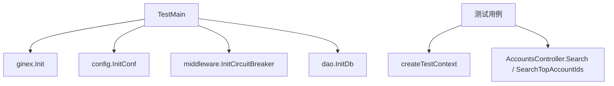

# Other — controllers

## 模块定位

`src/controllers` 下的这组测试代码覆盖 `AccountsController` 的账号查询入口，主要验证两个控制器方法在测试环境初始化后能够返回 `errno.CodeOK`：

- `AccountsController.Search`
- `AccountsController.SearchTopAccountIds`

当前模块没有被业务代码调用，也没有独立的执行流。它是控制器层的测试入口，通过 Gin 测试上下文构造 HTTP 查询参数，再直接调用控制器方法。

## 文件组成

### `src/controllers/base_test.go`

该文件提供测试公共初始化逻辑。

`createTestContext()` 使用 `gin.CreateTestContext` 创建测试用的 `*gin.Context` 和 `*httptest.ResponseRecorder`：

```go
func createTestContext() (*gin.Context, *httptest.ResponseRecorder) {
	resp := httptest.NewRecorder()
	c, _ := gin.CreateTestContext(resp)
	return c, resp
}
```

测试用例通过返回的 `*gin.Context` 手动设置 `c.Request`，再调用控制器方法。当前测试没有通过 Gin 路由分发请求，而是直接调用方法。

`TestMain(m *testing.M)` 是整个 `controllers` 包测试的启动钩子，负责在执行具体测试前初始化运行依赖：

```go
func TestMain(m *testing.M) {
	ginex.Init()
	config.InitConf()
	middleware.InitCircuitBreaker()
	dao.InitDb()
	code := m.Run()
	os.Exit(code)
}
```

初始化顺序很重要：

1. `ginex.Init()` 初始化 Gin 扩展运行环境。
2. `config.InitConf()` 加载并校验配置，设置全局 `config.Conf`。
3. `middleware.InitCircuitBreaker()` 根据 TCC 配置初始化熔断器集合。
4. `dao.InitDb()` 初始化读写数据库连接，并设置全局 `dao.Db`。
5. `m.Run()` 执行当前包内所有测试。

这意味着这些测试不是纯单元测试。它们依赖配置、TCC、数据库连接以及 DAO 层全局状态。

### `src/controllers/account_test.go`

该文件包含两个针对 `AccountsController` 的测试。

`TestAccountsController_Search` 构造一个 GET 请求：

```go
c.Request, _ = http.NewRequest("GET", "/?offset=0&limit=10&account_name=test", nil)
got := accountsController.Search(c, context.TODO())
assert.True(t, got.Code == errno.CodeOK, "Search Account err: "+got.Message)
```

测试关注点是 `Search` 返回的 `errno.Payload.Code` 是否为 `errno.CodeOK`。它不会断言响应体中的账号列表、分页总数或数据库查询结果。

`TestAccountsController_SearchTopAccountIds` 使用相同的查询参数调用 `SearchTopAccountIds`：

```go
c.Request, _ = http.NewRequest("GET", "/?offset=0&limit=10&account_name=test", nil)
got := accountsController.SearchTopAccountIds(c, context.TODO())
assert.True(t, got.Code == errno.CodeOK, "Search TopAccountIds err: "+got.Message)
```

它同样只验证返回码，不验证 `TopAccountIds` 内容。

## 调用关系



测试代码没有内部调用链，也没有上游调用者。它的主要外部连接是控制器实现和全局运行时初始化。

## 被测试控制器的行为边界

`AccountsController.Search` 位于 `src/controllers/account.go`，方法签名为：

```go
func (accountsController *AccountsController) Search(c *gin.Context, ctx context.Context) *errno.Payload
```

主要流程是：

1. 使用 `c.BindQuery(pageGetAccountRequest)` 将查询参数绑定到 `dto.PageGetAccountRequest`。
2. 使用 `validator.RefinePageParams` 规范化 `Offset` 和 `Limit`。
3. 通过 `util.EmitThroughput` 和 `util.EmitLatency` 上报指标。
4. 调用 `dao.Db.GetVideoAccountAmount` 查询总数。
5. 总数为 `0` 时直接返回空的 `dto.SearchAccountsResponse`。
6. 调用 `dao.Db.PageGetVideoAccount` 查询分页账号。
7. 返回前将每个账号的 `SecretKey` 清空。
8. 使用 `errno.OK(resp)` 包装成功响应。

`AccountsController.SearchTopAccountIds` 的结构相似，区别是它查询去重后的 `TopAccountID`：

1. 绑定 `dto.PageGetAccountRequest`。
2. 规范化分页参数。
3. 上报吞吐和延迟指标。
4. 调用 `dao.Db.GetVideoAccountDistinctTopAccountIdAmount` 查询总数。
5. 总数为 `0` 时返回空的 `dto.PageGetTopAccountIdsResponse`。
6. 调用 `dao.Db.PageGetVideoAccountDistinctTopAccountIds` 查询账号记录。
7. 从每个 `VideoAccount` 中提取 `TopAccountID`，填充 `resp.TopAccountIds`。
8. 使用 `errno.OK(resp)` 返回。

## 测试方式的含义

当前测试更接近“控制器冒烟测试”，而不是隔离的业务逻辑单元测试。原因是：

- 测试直接依赖 `dao.Db` 的真实初始化。
- `dao.InitDb()` 会建立读写数据库连接。
- 查询结果取决于测试环境中的配置和数据。
- 断言只检查 `errno.CodeOK`，不会覆盖响应结构的完整正确性。
- 请求没有经过 Gin 路由、中间件链或真实 HTTP 服务。

这种方式适合验证控制器在完整基础设施可用时不会直接失败，但不适合精确验证分页、过滤、异常分支或数据脱敏逻辑。

## 依赖关系

该模块直接依赖：

- `github.com/gin-gonic/gin`：构造测试上下文。
- `net/http` 和 `net/http/httptest`：构造请求与响应记录器。
- `github.com/stretchr/testify/assert`：执行测试断言。
- `code.byted.org/gin/ginex`：测试前初始化 Gin 扩展环境。
- `src/config`：加载全局配置。
- `src/middleware`：初始化熔断器。
- `src/dao`：初始化数据库连接。
- `src/errno`：判断控制器返回码。

被测控制器进一步依赖 `dto`、`validator`、`util` 和 DAO 方法。

## 贡献注意事项

修改这组测试时，需要注意它们依赖 `TestMain` 的全局初始化。新增控制器测试如果也访问 `dao.Db`、`config.Conf` 或熔断器状态，应复用现有初始化逻辑，不要在单个测试中重复初始化全局资源。

如果新增测试只需要验证参数绑定或错误分支，优先考虑避免真实数据库依赖，例如让测试覆盖 `BindQuery` 失败、分页参数修正等不需要 DAO 成功返回的路径。当前代码没有为 `dao.Db` 提供注入点，因此涉及数据库结果的精确断言会受环境数据影响。

新增断言时应尽量检查返回 payload 的业务字段，而不只是 `errno.CodeOK`。例如 `Search` 可以关注 `TotalCount`、`VideoAccounts`、`SecretKey` 是否被清空；`SearchTopAccountIds` 可以关注 `TopAccountIds` 的提取结果。但这类断言需要稳定的测试数据或可控的 DAO 替身，否则容易产生环境相关的失败。