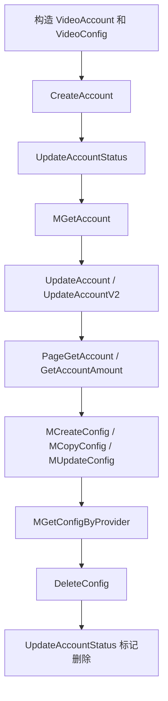

# Other — dao

## 模块概览

`src/dao` 这里展示的是 DAO 层的集成测试集合，覆盖账号、配置、域名、授权、实例、规则等核心数据访问能力。测试代码统一通过包级变量 `Db` 调用 DAO 方法，验证数据库初始化、CRUD、分页查询、批量查询、逻辑删除、配置同步等行为。

这些测试不是纯单元测试，而是依赖真实 DAO 初始化和底层存储的集成测试。公共入口在 `TestMain` 中完成：

```go
func TestMain(m *testing.M) {
	patches := gomonkey.ApplyFunc(etcdutil.GetWithDefault, func(key string, defaultValue string) string {
		return "1"
	})
	defer patches.Reset()
	ginex.Init()
	config.InitConf()
	middleware.InitCircuitBreaker()
	time.Sleep(3 * time.Second)
	InitDb()
	code := m.Run()
	os.Exit(code)
}
```

测试启动顺序是：

1. 使用 `gomonkey.ApplyFunc` mock `etcdutil.GetWithDefault`，避免测试依赖真实 etcd 配置读取结果。
2. 调用 `ginex.Init()` 初始化运行框架。
3. 调用 `config.InitConf()` 加载配置。
4. 调用 `middleware.InitCircuitBreaker()` 初始化熔断器。
5. 等待初始化完成后调用 `InitDb()` 创建 DAO 数据库句柄。
6. 运行所有 `src/dao` 包内测试。

## 主要职责

该测试模块验证 DAO 层对以下数据模型的读写能力：

| 领域 | 主要 DTO | 代表性 DAO 方法 |
| --- | --- | --- |
| 访问能力 | `dto.Access` | `CreateAccess`、`GetAccess`、`DeleteAccess` |
| 条件 | `dto.Condition` | `CreateCondition`、`GetCondition`、`DeleteCondition` |
| 账号 | `dto.VideoAccount`、`dto.VideoConfig` | `CreateAccount`、`UpdateAccount`、`MGetAccount`、`PageGetAccount` |
| 视频账号查询 | `dto.PageGetAccountRequest`、`dto.MGetAccountWithConfigRequest` | `GetAccountByAK`、`PageGetVideoAccount`、`MGetVideoAccount` |
| 配置 | `dto.VideoConfig` | `MCreateConfig`、`MUpdateConfig`、`MGetVideoConfig`、`DeleteConfig` |
| 域名 | `dto.Domain`、`dto.DomainAccountRel` | `CreateDomain`、`GetDomain`、`UpdateDomainAccountRel`、`DeleteDomain` |
| 域名授权 | `dto.DomainAuth` | `CreateDomainAuth`、`UpdateDomainAuthStatus`、`GetDomainAuths` |
| 授权关系 | `dto.Authority` | `CreateAuthority`、`UpdateAuthorityStatus`、`MGetAuthorityByGrantor` |
| 实例 | `dto.Instance` | `CreateInstance`、`UpdateInstance`、`GetInstance`、`ListInstance` |
| 规则 | `dto.VideoRule`、`dto.VideoRuleV2` | `CreateRule`、`BatchGetRule`、`UpdateVideoRuleStatus` |
| 分类 Schema | `dto.AccountCategorySchema` | `CreateAccountCategorySchema`、`UpdateAccountCategorySchema`、`DeleteAccountCategorySchema` |

## 测试结构

### 公共初始化

`base_test.go` 中的 `TestMain` 是整个包测试的基础。所有测试都依赖它初始化 `Db`，因此新增 DAO 测试时不需要在单个测试里重复调用 `InitDb()`。

该测试包默认使用 `context.TODO()` 或 `context.Background()` 调用 DAO 方法。现有代码没有在测试层注入超时控制，新增长耗时测试时应注意避免无限等待。

### 构造测试数据

模块使用小型 helper 构造复杂 DTO：

- `buildNewAccountRequest()` 构造 `*dto.VideoAccount` 和初始 `[]*dto.VideoConfig`
- `buildNewDomainReq()` 构造带 `AccountRels` 的 `*dto.Domain`
- `buildCategorySchema()` 构造 `*dto.AccountCategorySchema`

这些 helper 会用 `time.Now().Unix()` 拼接唯一名称，避免多数测试数据与已有记录冲突。例如：

```go
accountName := strings.Join([]string{
	"account.unittest",
	strconv.FormatInt(time.Now().Unix(), 10),
}, "_")
```

新增测试如果会写入唯一约束字段，应沿用这种模式，或者使用 `util.GetUUID()` 生成唯一值。

## 账号与配置测试

`account_test.go` 是覆盖面最广的测试文件，验证账号主表和配置表之间的组合操作。

核心流程如下：



### `CreateAccount`

`Db.CreateAccount(context.TODO(), acct, configs)` 同时创建账号和初始配置。测试断言 `acct.ID > 0` 且 `configs[0].ID > 0`，说明 DAO 会回填自增主键。

`buildNewAccountRequest()` 设置的关键字段包括：

- `AccountName`
- `AccessKey`
- `SecretKey`
- `UserName`
- `ContentSecurityOwner`
- `TopAccountID`
- `TopInstanceID`
- `VolcAccountID`
- `VolcInstanceID`
- `Type`
- `VRegion`

初始配置使用 `dto.VideoConfig`，其中 `Module` 为 `"storage"`，`CKey` 为 `"all"`，`Region` 为 `"boe"`。

### `UpdateAccountStatus`

测试先将账号状态更新为 `constant.StatusUnaudited`，随后通过 `MGetAccount` 验证返回记录的 `Status` 已同步变化。

逻辑删除也通过同一个方法完成：

```go
err = Db.UpdateAccountStatus(context.TODO(), acct.AccessKey, constant.StatusDeleted)
```

删除后，`MGetAccount` 和 `PageGetAccount` 会受 `WithDeleted` 字段控制：

- `WithDeleted: false` 时查不到逻辑删除账号
- `WithDeleted: true` 时可以查到逻辑删除账号

### `MGetAccount` 和 `PageGetAccount`

`MGetAccount` 使用 `dto.MGetAccountWithConfigRequest` 作为筛选条件，覆盖字段包括账号名、AK、状态、用户名、火山账号、Top 账号、类型、`VRegion` 等。

`PageGetAccount` 在相同筛选条件外增加分页字段：

```go
pageGetReq := &dto.PageGetAccountRequest{
	MGetAccountWithConfigRequest: dto.MGetAccountWithConfigRequest{
		AccountName: acct.AccountName,
		AccessKey:   acct.AccessKey,
		UserName:    acct.UserName,
		Type:        acct.Type,
		VRegion:     acct.VRegion,
	},
	Limit:  10,
	Offset: 0,
}
```

`GetAccountAmount` 与 `PageGetAccount` 使用同类请求，用于统计符合筛选条件的账号数量。

### `UpdateAccount` 和 `UpdateAccountV2`

`UpdateAccount` 测试覆盖账号大多数字段的更新，包括：

- `Description`
- `TopAccountID`
- `TopInstanceID`
- `VolcAccountID`
- `VolcInstanceID`
- `Type`
- `UserName`
- `ContentSecurityOwner`
- `Extra`
- `VRegion`

`UpdateAccountV2` 特别验证空字符串更新场景：

```go
acct.Description = ""
err = Db.UpdateAccountV2(context.TODO(), acct)
```

随后通过 `MGetAccount` 断言 `Description` 确实被更新为空字符串。这个测试说明 `UpdateAccountV2` 应支持零值字段写入，而不是简单忽略空值。

### 配置批量操作

账号测试还覆盖配置生命周期：

- `MCreateConfig` 新增配置
- `MCopyConfig` 将指定区域配置复制到目标区域
- `MUpdateConfig` 更新已有配置
- `MGetConfigByProvider` 查询账号下全部配置
- `DeleteConfig` 删除配置

`MCopyConfig` 的调用方式是：

```go
err = Db.MCopyConfig(
	context.TODO(),
	acct.AccessKey,
	"boe",
	[]string{"boei18n"},
	[]string{"storage"},
)
```

该方法按 `AccessKey`、源区域、目标区域列表和模块列表复制配置。测试随后用 `MGetConfigByProvider(context.TODO(), acct.AccountName, "", util.R_ALL)` 校验复制和更新后的整体结果。

## 视频账号查询

`video_account_test.go` 使用固定 AK：

```go
var ak = "b9c329c103144b0da705252edecfd93a"
```

这些测试依赖测试环境中已存在账号 `terminator_default`。

覆盖的方法包括：

- `GetAccountByAK`
- `PageGetVideoAccount`
- `GetVideoAccountAmount`
- `GetVideoAccountDistinctTopAccountIdAmount`
- `PageGetVideoAccountDistinctTopAccountIds`
- `MGetVideoAccount`

`GetAccountByAK` 接收 `*string`：

```go
account, err := Db.GetAccountByAK(context.TODO(), &ak)
```

分页查询仍然使用 `dto.PageGetAccountRequest`，筛选条件嵌入 `dto.MGetAccountWithConfigRequest`。这些方法和 `account_test.go` 的账号 CRUD 不同，更偏向视频账号列表页和聚合查询能力。

## 视频配置查询

`video_config_test.go` 主要验证只读配置查询能力，也使用固定账号和 bucket：

```go
var (
	provider = "terminator_default"
	bucket   = "tos-boe-o-0000"
	module   = "storage"
	category = "image"
)
```

覆盖的方法包括：

- `MGetVideoConfig(context, ak, module, region)`
- `MGetVideoConfigByKeys(context, []string{ak}, module, region)`
- `MGetConfigByProvider(context, provider, category, region)`
- `MGetStorageConfigByBucketName(context, bucket, region)`
- `ListVideoConfigByCondition(context, req)`
- `GetVideoConfigById(context, id)`

`ListVideoConfigByCondition` 使用 `dto.ListConfigsByConditionRequest`：

```go
req := &dto.ListConfigsByConditionRequest{
	Module: module,
	CKey:   category,
	CValue: bucket,
	Region: "boe",
}
```

测试通过 `strings.Contains(configs[0].CValue, bucket)` 判断配置内容是否匹配 bucket，说明 `CValue` 可能是包含 bucket 信息的结构化字符串，而不是纯 bucket 字段。

## 域名与账号关系

`domain_test.go` 验证 `dto.Domain` 与 `dto.DomainAccountRel` 的组合关系。

`buildNewDomainReq()` 创建一个外部域名：

```go
return &dto.Domain{
	Domain:       domainName,
	Type:         dto.ExternalDomain,
	TopAccountId: 1900000000,
	Vender:       "bytedance",
	Owner:        "wukuanxin",
	Status:       "enabled",
	AccountRels: []*dto.DomainAccountRel{{
		Domain:      domainName,
		AccountName: "terminator_default",
		Region:      "boe",
		Module:      "",
		Category:    "all",
		DomainType:  dto.ExternalDomain,
	}},
}
```

主要流程是：

1. `CreateDomain` 创建域名及初始账号关系。
2. `MCopyDomainAccountRel` 将账号域名关系从 `"boe"` 复制到 `"boei18n"`。
3. `GetDomain` 查询域名并验证 `AccountRels`。
4. `ListAccountRelsByDomain` 按域名查询关系。
5. `UpdateDomainAccountRel` 更新关系字段，例如 `Category`。
6. `ListDomainAccountRel` 和 `BatchListDomainAccountRel` 按条件查询关系。
7. `DeleteDomainRelById` 删除关系。
8. `DeleteDomain` 删除域名。
9. 对比全量 `ListDomainAccountRel` 和 `BatchListDomainAccountRel` 返回结果一致。

`ListDomainAccountRel` 和 `BatchListDomainAccountRel` 都接收 `dto.ListDomainAccountRelRequest`。测试最后将两个结果 JSON 序列化后比较，说明批量查询实现应保持与普通查询一致的返回语义和排序表现。

## 配置同步域名

`sync_config_test.go` 验证 `VideoConfig` 中的域名配置变更会同步到域名表和域名账号关系表。

测试构造的配置满足以下条件：

- `Module` 为 `constant.ModulePicture`
- `CKey` 为 `"domains"`
- `Region` 为 `"boe"`
- `CValue` 是包含 `domain_group.byte_stations[].domains[]` 的 JSON 字符串

创建配置后：

```go
err := Db.MCreateConfig(context.TODO(), []*dto.VideoConfig{videoConfig})
```

测试等待 3 秒后调用 `Db.GetDomain(context.TODO(), domainName)`，验证域名已创建，且账号关系中的 `RelType` 等于：

```go
dto.BuildDomainRelTypeFromConfig(videoConfig.Region, videoConfig.Module)
```

后续测试覆盖三种同步场景：

1. 更新同一个域名的状态：`MUpdateConfig` 后 `Domain.Status` 从 `"enable"` 变为 `"disabled"`。
2. 将配置中的域名替换为新域名：旧域名保留但 `AccountRels` 为空，新域名创建并绑定关系。
3. 删除配置：调用 `DeleteConfig` 后清理测试域名。

这个测试说明配置 DAO 不只是写配置表，还可能触发异步或延迟的域名同步逻辑。新增相关测试时需要给同步过程预留等待时间，现有代码使用 `time.Sleep(3 * time.Second)`。

## 授权、访问与条件

### `access_test.go`

`Test_Access` 覆盖简单的访问资源 CRUD：

- `CreateAccess`
- `GetAccess`
- `DeleteAccess`

测试数据为 `dto.Access{Name, Description}`，创建后通过 `GetAccess` 验证列表非空，再按 `ID` 删除。

### `condition_test.go`

`Test_Condition` 与访问资源测试结构一致，使用 `dto.Condition`：

- `CreateCondition`
- `GetCondition`
- `DeleteCondition`

### `authority_test.go`

`Test_Authority` 覆盖授权关系：

- `CreateAuthority`
- `UpdateAuthorityStatus`
- `MGetAuthorityByGrantor`
- `MGetAuthorityByGrantee`
- `DeleteAuthority`

`dto.Authority` 的关键字段包括：

- `Grantor`
- `GrantorName`
- `Space`
- `Grantee`
- `AccessID`
- `Conditions`

测试先创建授权，再将状态更新为 `constant.StatusEnabled`，随后通过授权方和被授权方两个方向查询，验证状态更新结果。

## 域名授权

`domain_auth_test.go` 验证 `dto.DomainAuth` 的创建、重复创建检测、状态更新、查询和删除。

`CreateDomainAuth` 的返回值是 `(errCode, err)`：

```go
errCode, err := Db.CreateDomainAuth(context.TODO(), domainAuth)
```

测试语义是：

- 首次创建：`err == nil` 且 `errCode == 0`
- 重复创建：`err == nil` 且 `errCode > 0`

这说明重复数据被业务错误码表达，而不是通过 Go `error` 返回。调用方需要同时检查 `errCode` 和 `err`。

状态更新使用域名作为条件：

```go
err = Db.UpdateDomainAuthStatus(context.TODO(), domainAuth.Domain, 1)
```

查询使用 bucket 和 domain：

```go
authList, err := Db.GetDomainAuths(context.TODO(), domainAuth.Bucket, domainAuth.Domain)
```

删除使用 Top 账号、账号名和域名三元组：

```go
err = Db.DeleteDomainAuth(context.TODO(), domainAuth.TopAccountId, domainAuth.AccountName, domainAuth.Domain)
```

## 实例管理

`instance_test.go` 覆盖实例生命周期：

- `CreateInstance`
- `UpdateInstance`
- `GetInstance`
- `DeleteInstance`
- `ListInstance`

实例数据使用 `dto.Instance`，字段包括：

- `AccountID`
- `InstanceID`
- `Configuration`
- `ChargeItemCodes`
- `ChargeItemOversea`

`UpdateInstance` 接收 `dto.UpdateInstanceRequest`：

```go
err = Db.UpdateInstance(context.TODO(), &dto.UpdateInstanceRequest{
	ID:     instance.ID,
	Status: constant.StatusEnabled,
})
```

`ListInstance` 使用通用 `where map[string]interface{}` 加配置列表、分页参数：

```go
where := map[string]interface{}{
	"account_id": instance.AccountID,
}
vs, _, err := Db.ListInstance(
	context.TODO(),
	where,
	[]string{"vod.edit.basic.daily", "vod.daily.bandwidth"},
	10,
	0,
)
```

`DeleteInstance` 后再次 `GetInstance`，测试期望返回空列表而不是错误。

## 规则管理

`video_rule_test.go` 分别覆盖旧版 `dto.VideoRule` 和新版 `dto.VideoRuleV2`。

### `VideoRule`

`TestVideoRule` 覆盖：

- `CreateRule`
- `UpdateVideoRuleById`
- `BatchGetRule`
- `UpdateVideoRuleStatus`
- `UpdateVideoRuleByProvider`
- `PageGetRule`
- `GetRuleAmount`
- `DeleteVideoRule`

`dto.VideoRule` 使用 `Provider`、`LocalIDC`、`Category` 区分规则，`SyncInfo` 保存同步信息 JSON 字符串。

`UpdateVideoRuleByProvider` 通过 `(provider, localIDC, category)` 定位规则：

```go
err = Db.UpdateVideoRuleByProvider(
	context.TODO(),
	videoRule.Provider,
	videoRule.LocalIDC,
	videoRule.Category,
	"{\"boei18n\":\"image\"}",
)
```

### `VideoRuleV2`

`TestVideoRuleV2` 覆盖：

- `CreateRuleV2`
- `UpdateVideoRuleByIdV2`
- `BatchGetRuleV2`
- `UpdateVideoRuleStatusV2`
- `DeleteVideoRuleV2`

`dto.VideoRuleV2` 使用 `Type` 替代旧版中的 `Category` 作为规则维度之一：

```go
videoRule := &dto.VideoRuleV2{
	Provider: "unit-test-provider-" + strconv.FormatInt(time.Now().Unix(), 10),
	LocalIDC: "boe",
	Type:     "encoded_video",
	SyncInfo: "{\"boei18n\":\"all\"}",
	Status:   constant.StatusUnaudited,
}
```

## 分类 Schema

`category_schema_test.go` 验证账号分类 Schema 的版本和历史记录机制。

测试流程：

1. `CreateAccountCategorySchema` 创建 schema。
2. `ListAccountCategorySchema` 按 `AccountName` 查询。
3. `getAccountCategorySchemaById` 按 ID 查询。
4. `UpdateAccountCategorySchema` 更新 `SchemaValue`。
5. 再次列表查询，验证 `Version` 从 `0` 增加到 `1`。
6. `getAccountCategorySchemaHistory` 查询更新历史，验证 `HistoryReasonUpdate`。
7. `DeleteAccountCategorySchema` 删除 schema。
8. 再次查询历史，验证 `HistoryReasonDelete`。

需要注意，`getAccountCategorySchemaById` 和 `getAccountCategorySchemaHistory` 是小写方法，仅在 `dao` 包内可见。测试文件同属 `package dao`，因此可以直接调用这些非导出方法。

## 消费者信息

`task_test.go` 只包含一个测试：

```go
func TestGetConsumersInfo(t *testing.T) {
	infos, err := Db.GetAllConsumers(context.TODO())
	assert.Nil(t, err)
	assert.True(t, len(infos) > 0)
}
```

该测试验证 `GetAllConsumers` 能从数据源返回至少一条消费者信息。它依赖测试环境中已有基础数据。

## 与其他模块的关系

DAO 测试模块主要连接以下包：

- `src/dto`：提供所有数据库模型和请求结构，例如 `VideoAccount`、`VideoConfig`、`Domain`、`PageGetAccountRequest`。
- `src/constant`：提供状态和模块常量，例如 `StatusUnaudited`、`StatusEnabled`、`StatusDeleted`、`ModulePicture`。
- `src/util`：提供工具函数和常量，例如 `GetUUID()`、`R_ALL`。
- `src/config`：在 `TestMain` 中通过 `InitConf()` 初始化配置。
- `src/middleware`：在 `TestMain` 中通过 `InitCircuitBreaker()` 初始化熔断器。
- `src/dao/db.go`：通过 `InitDb()` 初始化包级数据库访问对象 `Db`。

从调用图看，本模块没有被其他代码调用；它是测试入口集合。内部调用也很少，主要是测试函数调用本文件内的构造 helper。绝大多数调用都是从测试直接进入 `Db` 的 DAO 方法，或构造 `dto` 请求对象。

## 新增测试建议

新增 DAO 测试时应遵循现有模式：

1. 在 `src/dao` 包内编写测试，使用 `package dao`，这样可以访问包内非导出方法。
2. 通过 `Db` 调用 DAO 方法，不要重复初始化数据库。
3. 写入数据时使用时间戳或 UUID 构造唯一字段，避免与共享测试环境数据冲突。
4. 测试完成后清理创建的数据，优先使用公开 DAO 删除方法；必要时再使用 `Db.w` 直接清理。
5. 同时断言 `error` 和关键业务返回值，例如 `CreateDomainAuth` 的 `errCode`。
6. 对逻辑删除场景同时验证默认不可见和 `WithDeleted: true` 可见。
7. 如果 DAO 方法触发异步同步，例如配置同步域名，需要等待同步完成后再断言。
8. 对分页查询，成对验证列表方法和数量方法，例如 `PageGetAccount` 与 `GetAccountAmount`。

该模块的测试更关注 DAO 行为是否符合业务语义，而不是 SQL 细节。贡献代码时，应优先保持这些端到端语义稳定。