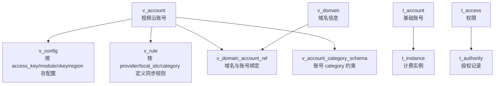

# Other — data

## 模块概览

`data/db.sql` 是账号服务的数据模型定义文件，负责初始化账号、配置、授权、同步规则、域名和账号类目约束相关的数据表。该模块没有函数、类或运行时代码，也没有检测到调用关系或执行流；它通过数据库表结构、唯一索引和普通索引为代码库其他模块提供持久化契约。

该文件包含两类表：

- `t_*`：较基础的账号、配置、实例、权限和授权模型。
- `v_*`：视频云账号体系相关模型，扩展了账号类型、区域配置、同步规则、域名绑定和 category schema 约束。



## 账号模型

### `t_account`

`t_account` 是基础账号信息表，核心字段包括：

- `account_name`：账号名，受 `uniq_account_name` 唯一约束。
- `access_key`：公钥，受 `uniq_access_key` 唯一约束。
- `secret_key`：私钥。
- `user_id`：申请人 ID，通过 `idx_user_id` 支持按申请人查询。
- `status`：账号状态，默认 `unaudited`，注释中定义了 `enabled`、`disabled`、`deleted`、`unaudited`。
- `extra`：扩展信息，使用 `longtext` 保存。

表内没有外键约束，`user_id` 与用户系统的关系需要由业务代码保证。

### `v_account`

`v_account` 是视频云账号信息表，相比 `t_account` 增加了业务线和账号类型相关字段：

- `account_name`：账号名，默认值为 `test`，全表唯一。
- `access_key`：公钥，全表唯一。
- `secret_key`：私钥。
- `status`：账号状态，默认 `unaudited`。
- `user_name`：用户名。
- `top_account_id`：top 账号 ID。
- `top_instance_id`：top 实例 ID。
- `type`：账号类型，注释定义为 `space`、`provider`，空字符串表示 `provider`。
- `extra`：扩展信息。

`v_account` 是多个 `v_*` 表的逻辑中心。虽然 SQL 中没有声明外键，但以下表通过账号名或 access key 与它建立约定关系：

- `v_config.access_key` / `v_config.account_name`
- `v_rule.provider`
- `v_domain_account_rel.account_name`
- `v_account_category_schema.account_name`

## 配置模型

### `t_config`

`t_config` 保存基础配置项，配置维度为：

- `access_key`
- `module`
- `ckey`

唯一索引 `uniq_ak_module_ckey` 保证同一个账号公钥、模块和配置键只能有一条记录。

`module` 的注释列出了常见模块：

- `global`
- `upload`
- `transcode`
- `play`
- `picture`

`cvalue` 使用 `longtext`，说明配置值可能是较大的字符串或 JSON 文本。表结构本身不校验格式，业务代码需要负责解析和校验。

### `v_config`

`v_config` 是视频云账号配置表，在 `t_config` 的基础上增加了：

- `account_name`：账号名，用 `idx_acc_name` 支持按账号名查询。
- `region`：区域，默认 `default`，注释中给出 `CN`、`ALISG`、`MALIVA` 等值。

唯一索引 `uniq_ak_m_k_r` 覆盖：

```sql
access_key, module, ckey, region
```

这意味着同一个 `access_key` 在同一模块、同一配置键下，可以按不同 `region` 保存不同配置。

开发时需要注意：`v_config` 同时保存 `access_key` 和 `account_name`，但没有数据库约束保证二者一定来自同一个 `v_account`。写入和更新配置时，应在业务层保证这两个字段的一致性。

## 计费实例

### `t_instance`

`t_instance` 保存账号与计费实例的关系：

- `account_id`：视频云账号 ID，默认 `0`。
- `instance_id`：计费实例 ID。
- `extra`：扩展信息。

索引 `idx_account_id` 支持按账号 ID 查询实例。该字段没有显式外键，通常应对应账号表中的 `id`，但具体对应 `t_account.id` 还是 `v_account.id` 需要结合业务代码确认。

## 权限与授权

### `t_condition`

`t_condition` 是条件定义表，字段较简单：

- `name`：条件名称。
- `description`：条件描述。
- `extra`：扩展信息。

它用于沉淀可复用的授权条件定义，但表结构中没有与 `t_authority.conditions` 建立外键关系。

### `t_access`

`t_access` 是权限定义表：

- `name`：权限名称。
- `description`：权限描述。
- `extra`：扩展信息。

`t_authority.access_id` 逻辑上引用该表的 `id`。

### `t_authority`

`t_authority` 保存授权记录：

- `grantor`：授权者。
- `grantor_name`：授权者名字。
- `space`：空间。
- `grantee`：被授权者。
- `access_id`：权限 ID，逻辑上对应 `t_access.id`。
- `conditions`：条件集合，默认 `'{}'`。
- `status`：授权状态，默认 `unaudited`。
- `extra`：扩展信息。

索引用于两类主要查询：

- `idx_grantor_space(grantor, space)`：按授权者和空间查询授权记录。
- `idx_grantee(grantee)`：按被授权者查询被授予的权限。

`conditions` 是 `varchar(1024)`，默认值是 JSON 对象字符串 `'{}'`。如果业务层将其作为 JSON 使用，需要考虑长度限制和解析失败场景。

## 同步规则

### `v_rule`

`v_rule` 定义 provider 在不同 IDC 和 category 下的同步规则：

- `provider`：指定用户，注释说明引用 `v_account.account_name`。
- `local_idc`：TOS 文件初始化 IDC。
- `category`：bucket reference key。
- `sync_info`：需要同步的 IDC 和关联 category 信息。
- `status`：规则状态，默认 `unaudited`，注释中定义 `enable`、`disable`、`deleted`、`unaudited`。

唯一索引 `uniq_p_idc_c(provider, local_idc, category)` 保证同一个 provider 在同一个 IDC 和 category 下只有一条同步规则。

辅助索引：

- `idx_provider(provider)`：按 provider 查询规则。
- `idx_idc(local_idc)`：按 IDC 查询规则。

需要注意这里的状态值注释使用 `enable` / `disable`，而其他表多使用 `enabled` / `disabled`。开发时不要假设所有表的状态枚举完全一致。

## 域名模型

### `v_domain`

`v_domain` 保存域名自身的信息：

- `domain`：域名，全表唯一。
- `top_account_id`：业务线 ID。
- `service_tree_node_id`：业务服务树 ID，可为空。
- `vender`：域名提供商。
- `owner`：域名 owner。
- `status`：域名状态，默认 `enabled`，注释包含 `enabled`、`disabled`、`configuring`、`configure_success`。
- `certificate_id`：证书 ID。
- `certificate_name`：证书名称。
- `certificate_status`：证书状态，注释定义为 `off` 或 `on`。
- `certificate_pub`：证书公钥。

`uniq_domain(domain)` 保证域名唯一，适合以域名作为业务查询入口。

### `v_domain_account_rel`

`v_domain_account_rel` 保存域名与账号名之间的绑定关系：

- `domain`：域名。
- `account_name`：账号名称。

唯一索引 `uniq_idx_domain_accountName(domain, account_name)` 保证同一个域名和账号不会重复绑定。

辅助索引 `idx_accountName(account_name)` 支持按账号名查询其绑定域名。

该表没有外键约束到 `v_domain.domain` 或 `v_account.account_name`，因此删除域名或账号时，需要业务代码同步清理关联关系，避免悬挂数据。

## Category Schema 约束

### `v_account_category_schema`

`v_account_category_schema` 保存账号在某个 category 下的 schema 约束：

- `account_name`：账号名。
- `category`：类目。
- `schema_type`：schema 类型。
- `schema_value`：schema JSON，使用 `text` 保存。

唯一索引 `uniq_account_name_category_schema_type(account_name, category, schema_type)` 保证同一个账号、类目和 schema 类型只有一条约束配置。

`schema_value` 的注释说明它保存 JSON，但数据库层没有 JSON 类型或格式校验。读写该字段时，应由业务代码负责序列化、反序列化和兼容旧数据。

## 时间字段约定

所有表都包含类似的时间字段：

```sql
created_at timestamp NOT NULL DEFAULT CURRENT_TIMESTAMP
updated_at timestamp NOT NULL DEFAULT CURRENT_TIMESTAMP ON UPDATE CURRENT_TIMESTAMP
```

这表示：

- 插入记录时，`created_at` 和 `updated_at` 默认写入当前时间。
- 更新记录时，MySQL 自动刷新 `updated_at`。
- 业务代码通常不需要手动维护 `updated_at`，除非有特殊回放、迁移或修复数据的需求。

## 状态字段约定

多个表使用 `status varchar(128)` 或类似字段保存状态，但枚举值并不完全统一：

- `t_account` / `v_account` / `t_authority`：`enabled`、`disabled`、`deleted`、`unaudited`
- `v_rule`：`enable`、`disable`、`deleted`、`unaudited`
- `v_domain`：`enabled`、`disabled`、`configuring`、`configure_success`
- `v_domain.certificate_status`：`off`、`on`

贡献代码时应按具体表的注释和现有业务逻辑处理，不要把某一张表的状态值复用到所有表。

## 索引与查询入口

该 schema 的索引主要服务以下访问模式：

| 表 | 关键索引 | 适合的查询 |
| --- | --- | --- |
| `t_account` | `uniq_account_name` | 按账号名查基础账号 |
| `t_account` | `uniq_access_key` | 按 access key 查基础账号 |
| `t_account` | `idx_user_id` | 查某个申请人的账号 |
| `t_config` | `uniq_ak_module_ckey` | 查某个 access key 下的模块配置 |
| `t_instance` | `idx_account_id` | 查账号关联的计费实例 |
| `t_authority` | `idx_grantor_space` | 查某授权者在某空间下的授权 |
| `t_authority` | `idx_grantee` | 查某被授权者收到的授权 |
| `v_account` | `uniq_account_name` | 按账号名查视频云账号 |
| `v_account` | `uniq_access_key` | 按 access key 查视频云账号 |
| `v_config` | `uniq_ak_m_k_r` | 按 access key、模块、key、region 查配置 |
| `v_config` | `idx_acc_name` | 按账号名查配置 |
| `v_rule` | `uniq_p_idc_c` | 查 provider 在 IDC/category 下的同步规则 |
| `v_domain` | `uniq_domain` | 按域名查域名配置 |
| `v_domain_account_rel` | `uniq_idx_domain_accountName` | 判断域名与账号是否已绑定 |
| `v_account_category_schema` | `uniq_account_name_category_schema_type` | 查账号 category 的指定 schema |

## 与代码库其他部分的连接方式

该模块本身没有运行时代码，因此不会主动调用其他模块，也没有被调用的函数入口。它与代码库其他部分的连接点是数据库契约：

- 业务代码依赖表名和字段名进行 CRUD。
- 唯一索引用于防止重复账号、重复配置、重复绑定和重复 schema。
- 普通索引用于支撑按账号、access key、provider、IDC、域名、授权对象等维度查询。
- `longtext`、`text` 和 JSON 字符串字段由业务代码负责格式约束。
- 逻辑关联没有使用数据库外键，数据一致性主要依赖业务层写入顺序、删除清理和校验逻辑。

修改 `data/db.sql` 时，应把它视为跨模块契约变更。新增字段通常需要同步考虑：

- 是否需要默认值以兼容历史插入逻辑。
- 是否需要索引支持新的查询路径。
- 是否会影响现有唯一约束。
- 是否需要迁移历史数据。
- 业务代码是否已经同时支持新旧字段。