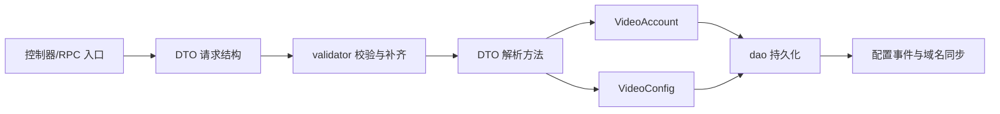

# Other — dto

## DTO 模块

`src/dto` 是账号服务的数据契约层，集中定义 HTTP/RPC 请求响应结构、GORM 表模型、配置 JSON 结构和少量请求归一化逻辑。该包本身不承载完整业务流程；控制器、`validator`、`service` 和 `dao` 会围绕这些结构完成参数绑定、校验、持久化和同步。

### 账号与配置

核心模型在 `model.go` 和 `video_account.go`：

- `VideoAccount` 映射 `v_account`，用于当前账号主模型。`BeforeCreate` 通过 `util.GenId(context.TODO(), v.TableName(), 1)` 生成 ID，并把 `Status` 设为 `constant.StatusEnabled`。
- `VideoConfig` 映射 `v_config`，保存账号配置项：`AccessKey`、`AccountName`、`Module`、`CKey`、`CValue`、`Region`。创建前同样使用 `util.GenId`。
- `VideoInstance` 映射 `v_instance`。
- `Account` 也映射 `v_account`，是旧接口/旧查询路径仍在使用的账号结构；`BeforeCreate` 使用 `AutoIncrID` 并把状态设为 `constant.StatusUnaudited`。
- `Instance` 映射 `t_instance`。

`CreateAccountRequest.ParseAccountAndConfigs()` 是账号创建时最重要的 DTO 转换方法。它会：

1. 使用请求里的 `AccessKey` / `SecretKey`，为空时用 `util.GetUUID()` 生成。
2. 构造 `VideoAccount`，复制账号名、描述、负责人、火山账号、服务树节点、`VRegion` 等字段。
3. 调用 `fillDefaultVolcAccountId` 和 `fillDefaultVolcVRegion` 补齐空间类账号的火山账号 ID 与默认归属区域。
4. 遍历 `VideoConfigs`，统一写入 `AccessKey`、`AccountName`，并用 `util.GetRegion(req.Region)` 归一化配置区域。
5. 对非 `constant.ModuleGlobal` 配置，根据 `ConfSyncRegions` 复制同步区域配置。
6. 如果没有传入 `constant.BucketSelectionStrategyCKey`，追加默认 `BucketSelectionStrategy{DisableAllCategory:false, DisableTerminator:true}`。
7. 在 BOE 或内部生产环境下追加 `UploadPSMCheck{Pct:100, Mode:2}`，对应 `constant.ModuleUpload` / `constant.UploadOpenPsmCheckCKey`。

`MCreateConfigRequest.ParseConfigs()` 是配置创建/更新路径的轻量版本：它只补齐 `AccessKey`、`AccountName`、归一化 `Region`，并复制非 global 配置到 `SyncRegions`，不会补默认 bucket selection strategy 或上传 PSM 检查配置。

查询类 DTO 中需要注意：

- `ListConfigsByConditionRequest.Validate()` 只强制 `Module` 非空；`CKey` 和 `CValue` 可以为空。
- `ListConfigsByConditionRequest.ParseListConfigsReq()` 会把 `Region` 转成内部区域枚举。
- `MGetAccountV3Request.Adjust()` 会归一化 `Region`，并把逗号分隔的 `AccountNames` 拆成 `AccountNameList`。
- `MGetVideoAccountResponse.ParseOpenapiAccountResponse()` 只返回 OpenAPI 需要的账号字段，不包含配置列表、状态、火山账号和 `VRegion`。

### 域名模型

域名相关结构在 `domain.go`：

- `Domain` 映射 `v_domain`，创建前使用 `util.GenId` 生成 `uint64` ID。
- `DomainAccountRel` 映射 `v_domain_account_rel`，表示域名与账号、区域、模块、category 的绑定关系。
- `DomainType` 定义域名类型：`ExternalDomain`、`InternalDomain`、`OriginalDomain`、`ScheduleDomain`、`InternalRDDomain`、`ExternalPrivateDomain`、`InternalPrivateDomain`。
- `DomainDefaultCategory` 为 `"all"`，`DomainDefaultModule` 为 `"none"`。
- `BuildDomainRelTypeFromConfig(region, module)` 返回 `region_module` 格式。虽然 `RelType` 字段标注为 Deprecated，但 DAO 删除、复制和同步逻辑仍依赖它定位一组绑定关系。
- `AcctConfDomains.GetDomains()` 会把 `DomainGroup.ByteStations` 和 `DomainGroup.OtherStations` 下所有实例的 `Domains` 拉平成一个列表。

配置同步中，`dao/sync_config.go` 会识别 `Module` 为 `constant.ModulePlay` 或 `constant.ModulePicture` 且 `CKey == "domains"` 的 `VideoConfig`，把 `CValue` 反序列化为 `AcctConfDomains`，再构造 `Domain` 与 `DomainAccountRel`。

### 权限、访问与条件

权限类模型较简单：

- `Access` 映射 `t_access`，字段包括 `Name`、`Description`、`Extra`。
- `Condition` 映射 `t_condition`。
- `Authority` 映射 `t_authority`，包含 `Grantor`、`GrantorName`、`Space`、`Grantee`、`AccessID`、`Conditions` 和 `Status`。创建前会把状态设为 `constant.StatusUnaudited`。
- `GetAuthorityRequest` 用于按 `grantor`、`space`、`grantee` 查询授权。

这些结构的 `BeforeCreate` 多数调用 `AutoIncrID(&id)`。当前 `AutoIncrID` 只是把 ID 置为 `0`，让数据库自增或 GORM 后续主键回填接管；`AfterCreate` 统一从 `scope.PrimaryKeyValue()` 写回模型 ID。

### 分类 Schema

`category_schema.go` 定义账号 category 级别的配置 schema：

- `AccountCategorySchema` 映射 `v_account_category_schema`。
- `AccountCategorySchemaHistory` 映射 `v_account_category_schema_history`。
- 当前允许的 `SchemaType` 只有 `SchemaEmbeddedMetadata`，值为 `"embedded_metadata"`，通过 `SchemaTypeAllowList` 控制。
- `EmbeddedMetadataSchema` 是实际的 JSON 配置结构，包含 `Enabled`、`GrayMode`、`GrayPercentage`、`IgnoreGlobalConf`、`MetadataBlackList`、`SchemaVersion`。
- 历史记录原因使用 `HistoryReasonUpdate` 和 `HistoryReasonDelete`。

`validator.ValidateCreateAccountCategorySchemaRequest` 会校验账号存在、schema 类型合法，并在 `SchemaEmbeddedMetadata` 场景下检查 `SchemaValue` 是否能反序列化为 `EmbeddedMetadataSchema`。

### 其他模型

- `DomainAuth` 映射 `v_domain_bucket_relation`，用于 CDN 域名与 bucket/空间授权关系；配套请求包括 `CreateDomainAuthRequest`、`UpdateDomainAuthStatusRequest`、`DeleteDomainAuthStatusRequest`。
- `VideoRule` 映射 `v_rule`，`VideoRuleV2` 映射 `v_rule_v2`，用于同步规则查询和分页响应。
- `ConsumerModel` 映射 `t_consumer`，配合 `GetConsumerRateLimitResponse`、`QPSStruct` 表达消费者限流配置。
- `RequestLiterals` 集中保存常用请求参数名，例如 `account_name`、`access_key`、`region`、`offset`、`limit`，避免控制器里散落字符串常量。

### 与其他层的协作方式

典型账号创建路径是：

`service.CreateAccount` 读取 body → 反序列化为 `CreateAccountRequest` → `validator.ValidateCreateAccountRequest` 校验账号名、区域、配置和重复 AK → `ParseAccountAndConfigs` 生成 `VideoAccount` 与 `VideoConfig` → `dao.Db.CreateAccount` 在事务中写入 `v_account` 和 `v_config`。

典型配置创建/更新路径是：

入口请求绑定到 `MCreateConfigRequest` 或 `MUpdateConfigRequest` → `validator.ValidateMCreateConfigRequest` 校验 AK、区域和配置内容，并根据 AK 回填 `AccountName` → `ParseConfigs` 补齐配置字段和同步区域 → DAO 写入 `VideoConfig`。

典型域名绑定路径是：

请求绑定为 `Domain` 或 `DomainAccountRel` → `validator.ValidateCreateDomainRequest` / `ValidateCreateDomainAccountRelRequest` 归一化 `Region`、补默认 `Category` 和 `Module`、生成 `RelType` → DAO 写入 `v_domain` 或 `v_domain_account_rel`。

### 贡献注意事项

新增 DTO 字段时，需要同时检查 `gorm`、`json`、`msg` 或 `form` tag 是否符合调用方需要。数据库模型字段通常需要 `gorm:"column:xxx"`，请求查询字段通常使用 `form:"xxx"`。

修改 `ParseAccountAndConfigs` 或 `ParseConfigs` 时要特别注意区域同步逻辑：`constant.ModuleGlobal` 配置不会被复制到同步区域，其他模块会根据 `ConfSyncRegions` / `SyncRegions` 复制，并使用 `util.GetRegion` 做内部区域映射。

修改域名关系时不要只改 `Region` 或 `Module`，还要确认 `RelType` 是否通过 `BuildDomainRelTypeFromConfig` 同步更新，因为现有 DAO 仍用它做删除、复制和查询定位。

测试主要覆盖表名、GORM hook 和请求解析行为。涉及默认配置、区域同步、火山账号补齐或域名关系生成的改动，应补充对应 DTO 单测，并在 service/validator/dao 层确认调用方是否依赖这些副作用。