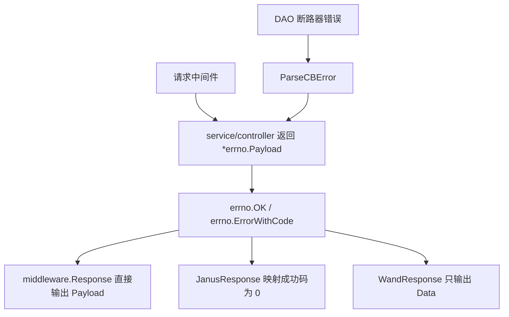

# Other — errno

## errno 模块

`src/errno` 提供项目内统一的业务错误码、错误载荷和响应构造函数。service/controller 层通常返回 `*errno.Payload`，再由 `middleware.Response`、`OpenAPIResponse`、`JanusResponse` 或 `WandResponse` 转成具体 HTTP 响应格式。

这个模块不负责写 HTTP 状态码；大多数接口仍由中间件以 `http.StatusOK` 输出，真正的业务成败由 `Payload.Code` 表达。

## 核心数据结构

```go
type Payload struct {
	Code    int         `json:"code"`
	Message string      `json:"message"`
	Data    interface{} `json:"data,omitempty"`
	Alert   bool        `json:"-"`
}
```

`Payload` 是项目内的标准返回体：

- `Code`：业务状态码，例如 `CodeOK`、`CodeBadRequest`、`CodeDbErr`
- `Message`：给调用方或日志使用的错误描述
- `Data`：成功响应的数据；为空时 JSON 中省略
- `Alert`：不参与 JSON 序列化，目前作为内部标记保留

`Payload` 实现了 Go 的 `error` 接口：

```go
func (p *Payload) Error() string {
	return p.Message
}
```

因此预定义错误如 `ErrStatusInvalid`、`ErrAccountExists` 可以在 validator/dao 这类返回 `error` 的函数中直接返回；上层再通过 `ErrorWithCode(code, err)` 把它包装成响应载荷时，`err.Error()` 会取到 `Payload.Message`。

## 响应构造函数

`OK(data interface{}) *Payload` 用于成功响应，固定返回：

```go
&Payload{
	Code:    CodeOK,
	Message: "ok",
	Data:    data,
}
```

service 层的常见模式是：

```go
if err := dao.Db.UpdateAccount(ctx, account); err != nil {
	return errno.ErrorWithCode(errno.CodeDbErr, err)
}
return errno.OK("update account successfully")
```

`Error(err error) *Payload` 是通用错误包装器：

- `err == nil` 时返回 `OK(nil)`
- 非空错误返回 `Code: 600` 和 `Message: err.Error()`

当前代码中 `Error` 主要用于少量默认错误场景，例如 `src/service/id_gen.go`。新代码如果能判断错误类别，优先使用 `ErrorWithCode`，这样调用方和监控可以拿到更稳定的业务码。

`ErrorWithCode(code int, err error) *Payload` 用指定业务码包装错误：

```go
return &Payload{
	Code:    code,
	Message: err.Error(),
}
```

这是 service/controller 层最常见的错误返回方式，例如参数错误使用 `CodeBadRequest`，数据库错误使用 `CodeDbErr`，请求体读取失败使用 `CodeGetDataErr`。

## 错误码分组

`code.go` 中的常量按大致语义分组：

- 成功类：`CodeOKZero = 0`、`CodeOK = 2000`、`CodeCreated = 2001`、`CodePartialContent = 2006`
- 客户端/鉴权类：`CodeBadRequest = 4000`、`CodeUnauthorized = 4001`、`CodeForbidden = 4003`、`CodeNotFound = 4004`、`CodeTooManyRequests = 4029`
- 配置缺失类：`CodeMissConfig = 4040`、`CodeMissConfigWithCkey = 4041`
- 服务端/依赖类：`CodeInternalErr = 5000`、`CodeServiceUnavailable = 5003`、`CodeRemoteCallErr = 5004`、`CodeGetDataErr = 5012`、`CodeParseDataErr = 5013`、`CodeDbErr = 5014`
- 配置创建专项错误：`CodeCreateConfigError = 6000`、`CodeRegionIsMissing = 6001`、`CodeSuffixIsMissing = 6002`、`CodeSuffixInvalid = 6003`

`CodeOKZero` 是兼容型成功码，实际使用在 `CheckAccountExist` 等接口中；通用中间件把 `CodeOK` 和 `CodeOKZero` 都视为非错误。

## 预定义错误实例

模块中定义了一组全局 `*Payload`，用于复用固定错误语义：

```go
ErrUnauthorized     = &Payload{Code: CodeUnauthorized, Message: "unauthorized"}
ErrTooManyRequests  = &Payload{Code: CodeTooManyRequests, Message: "too many requests"}
ErrNoWriteAuth      = &Payload{Code: CodeUnauthorized, Message: "no write authority"}
ErrRemoteCallFailed = &Payload{Code: CodeRemoteCallErr, Message: "call remote service failed"}
ErrDBCircuitBreaker = &Payload{Code: CodeInternalErr, Message: "db circuit breaker"}
```

这些实例在中间件和校验器中直接返回。例如：

- `middleware.Filter` 在非白名单写请求中返回 `ErrNoWriteAuth`
- `middleware.HandleACLUnauthorized` 返回 `ErrUnauthorized`
- `middleware.Response` 和 `JanusResponse` 限流时返回 `ErrTooManyRequests`
- `validator` 中的 `ValidateStatus`、账号/配置校验函数会返回 `ErrStatusInvalid`、`ErrModuleInvalid`、`ErrAccountExists` 等

这些全局实例应当按只读对象使用。不要在调用处修改 `ErrUnauthorized.Message`、`ErrTooManyRequests.Data` 这类字段，否则会影响后续所有请求。

## 断路器错误处理

`ParseCBError(err error) error` 专门处理 `github.com/sony/gobreaker` 的数据库断路器错误：

```go
func ParseCBError(err error) error {
	switch err {
	case gobreaker.ErrOpenState, gobreaker.ErrTooManyRequests:
		return errors.New(ErrDBCircuitBreaker.Message)
	}
	return err
}
```

DAO 层在使用 `middleware.GetDBCircuitBreaker()` 包裹数据库操作后，会调用 `errno.ParseCBError(err)`。这样 `gobreaker.ErrOpenState` 和 `gobreaker.ErrTooManyRequests` 不会直接暴露给 service 层，而是统一变成 `"db circuit breaker"`。service 层通常再包装为 `CodeDbErr` 或其他依赖错误码。



## 与中间件的连接

`middleware.MyHandler` 定义为：

```go
type MyHandler func(c *gin.Context, ctx context.Context) *errno.Payload
```

这使 `errno.Payload` 成为大多数业务 handler 的统一返回契约。

`middleware.Response` 会直接输出完整 payload：

```json
{
  "code": 2000,
  "message": "ok",
  "data": {}
}
```

`middleware.JanusResponse` 会调用 `toJanusPayload`，其中 `errno.CodeOK` 会被映射成 Janus 协议的 `0`，业务数据放到 `response` 字段。

`middleware.WandResponse` 只返回 `p.Data`，不输出 `code/message`。但它仍然依赖 `Payload.Code` 做限流、鉴权、日志和指标判断。

## 测试覆盖

`src/errno/code_test.go` 覆盖了模块的基础契约：

- `TestError`：`Error(err)` 返回默认 `Code == 600`，消息来自 `err.Error()`
- `TestErrorWithCode`：`ErrorWithCode(code, err)` 保留传入 code
- `TestOK`：`OK(data)` 返回 `CodeOK` 并保留 `Data`
- `TestParseCBError`：普通错误原样返回，`gobreaker.ErrTooManyRequests` 转成 `ErrDBCircuitBreaker.Message`
- `TestPayload_Error`：`Payload.Error()` 返回 `Message`

## 贡献注意事项

新增错误码时，先复用现有分组语义；只有调用方或监控确实需要区分新错误类型时再增加常量。新增预定义错误实例时，保持 `Code` 与 `Message` 的语义一致，并按只读全局变量使用。

新增 handler 时优先返回 `errno.OK(data)` 或 `errno.ErrorWithCode(code, err)`。如果返回预定义 `ErrXxx`，确认调用方不需要附加上下文数据；如果需要动态消息或数据，应创建新的 `Payload` 或使用 `ErrorWithCode` 包装具体错误。