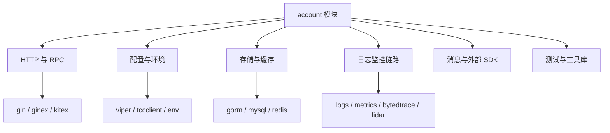

# Other — go.mod

## 模块定位

`go.mod` 是 `code.byted.org/videoarch/account` 服务的 Go Module 清单。它不包含可执行逻辑、函数或类，因此没有内部调用、外部调用、入站调用，也不会出现在运行时执行流中。它的作用是定义：

- 当前仓库的模块路径：`code.byted.org/videoarch/account`
- 编译使用的 Go 语言版本：`go 1.23`
- 直接依赖和间接依赖的版本边界
- 特定依赖的替换规则

```go
module code.byted.org/videoarch/account

go 1.23
```

## 依赖结构

该文件使用两个 `require` 块：

第一个 `require` 块声明当前代码直接依赖的库，例如 Web/RPC 框架、配置、存储、缓存、日志、监控、业务 SDK 和测试工具。

第二个 `require` 块主要是 `// indirect` 依赖，由直接依赖传递引入。它们通常不应被业务代码直接使用，除非确实需要将其提升为直接依赖。



## 核心直接依赖

### 服务框架

`github.com/gin-gonic/gin` 和 `code.byted.org/gin/ginex` 支撑 HTTP 服务能力。`ginex` 是内部封装，通常用于统一接入内部中间件、路由或运行时约定。

`code.byted.org/kite/kitex` 是 RPC 框架依赖，用于服务间通信。间接依赖中还包含 `cloudwego/kitex`、`kite/kitc`、`kite/kite` 等相关运行时和协议支持包。

### 配置与环境

`github.com/spf13/viper` 用于通用配置读取。

`code.byted.org/gopkg/tccclient` 用于接入 TCC 配置。

`code.byted.org/gopkg/env` 和 `code.byted.org/videoarch/env` 提供环境识别、运行环境读取等内部能力。

### 存储、缓存与数据库

`code.byted.org/gopkg/gorm`、`gorm.io/gorm`、`code.byted.org/gopkg/mysql-driver`、`code.byted.org/videoarch/vda-mysql-driver` 共同构成数据库访问相关依赖。该项目同时存在内部 GORM 封装和上游 `gorm.io/gorm` 的间接依赖，修改数据库层代码时需要注意实际 import 的包路径。

`code.byted.org/kv/goredis/v5` 是 Redis 客户端依赖。

`github.com/bluele/gcache`、`code.byted.org/gopkg/refresh_cache`、`code.byted.org/videoarch/go-remote-cache` 提供本地缓存、刷新缓存和远端缓存能力。

### 可观测性

`code.byted.org/gopkg/logs` 和 `code.byted.org/gopkg/logs/v2` 同时存在，说明代码库可能同时使用两个日志版本。新增代码时应优先沿用所在包已有的日志 import 风格，避免在同一模块中混用。

`code.byted.org/gopkg/metrics` 以及间接依赖中的 `metrics/v3`、`metrics/v4` 提供指标上报能力。

`code.byted.org/bytedtrace/interface-go` 和大量 `bytedtrace-*` 间接依赖用于链路追踪。

`code.byted.org/lidar/agent` 以及 `lidar/profiler` 相关间接依赖用于性能采集或运行时 profiling。

### 消息与外部系统

`code.byted.org/rocketmq/rocketmq-go-proxy` 是 RocketMQ 接入依赖，间接依赖中还有 `rocketmq-go-proxy-mqmesh-interceptor`。

业务域 SDK 包括：

- `code.byted.org/videoarch/account-sdk`
- `code.byted.org/videoarch/iamsdk`
- `code.byted.org/videoarch/harden-sdk`
- `code.byted.org/videoarch/bktmeta-simple-sdk`
- `code.byted.org/videoarch/caesar_config`
- `code.byted.org/tiktok/decc_channel_integration_sdk`
- `code.byted.org/ti/cdn_schedule_manager/pkg`

这些依赖通常代表当前服务与账号、权限、加固、配置、调度或外部业务系统之间的边界。

### 测试与辅助库

测试相关依赖包括：

- `github.com/stretchr/testify`
- `github.com/bytedance/mockey`
- `github.com/agiledragon/gomonkey/v2`
- `github.com/kr/pretty`

通用工具包括：

- `github.com/pkg/errors`
- `github.com/google/uuid`
- `dario.cat/mergo`
- `github.com/bitly/go-simplejson`
- `go.uber.org/atomic`
- `gopkg.in/validator.v2`
- `gopkg.in/yaml.v3`

## 替换规则

文件末尾包含一个显式 `replace`：

```go
replace github.com/apache/thrift => github.com/apache/thrift v0.13.0
```

这会强制所有对 `github.com/apache/thrift` 的解析使用 `v0.13.0`，即使依赖图中出现了其他版本声明。当前 `require` 中存在：

```go
github.com/apache/thrift v0.22.0 // indirect
```

但最终生效版本会被 `replace` 降到 `v0.13.0`。修改该规则前需要确认 Kitex/Kite、Thrift 协议生成代码、RPC 序列化链路是否兼容新版本。

## 与代码库的关系

`go.mod` 是整个仓库构建、测试和依赖解析的入口。业务代码通过普通 Go import 引入这里声明的模块，Go 工具链再根据 `go.mod` 和 `go.sum` 解析实际版本。

由于该文件没有函数、方法或类型定义，调用图不会显示任何执行边。它对代码库的影响体现在构建期和依赖解析期，而不是运行时调用链。

## 维护建议

新增业务代码时，如果引入新的 import，优先确认现有依赖是否已经覆盖需求，避免重复引入功能相近的库。

升级依赖时，应关注以下高风险区域：

- RPC 与 Thrift：`kitex`、`kite/*`、`github.com/apache/thrift`
- 数据库驱动：`mysql-driver`、`vda-mysql-driver`、`gorm`
- 可观测性链路：`logs`、`metrics`、`bytedtrace`
- 安全与鉴权 SDK：`iamsdk`、`harden-sdk`、`security/*`

清理依赖时不要手工删除大量 `// indirect` 项。更稳妥的方式是让 Go 工具链根据实际 import 重新整理：

```bash
go mod tidy
```

如果修改了直接依赖版本，应配套运行编译和测试，确认依赖图、生成代码和运行时初始化逻辑没有被破坏。