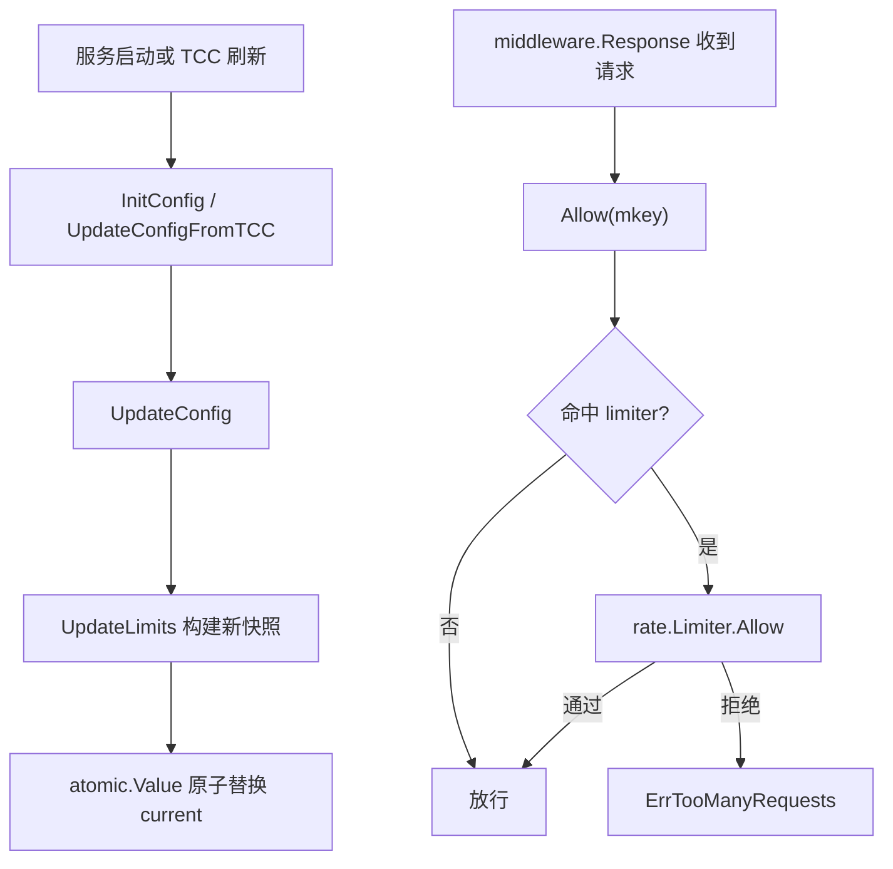

# Other — interface_limiter

## 模块概览

`src/interface_limiter` 提供进程内、本地的接口级限流能力。调用方使用接口标识 `mkey` 调用 `Allow(mkey)`，模块根据当前配置中的 `QPS` 和 `Burst` 判断请求是否放行。

该模块只限制显式配置过的 `mkey`。默认配置、关闭配置、空快照、未命中的 `mkey` 都会放行请求。

## 核心流程



## 关键组件

### `snapshot`

```go
type snapshot struct {
	limiters map[string]*rate.Limiter
}
```

`snapshot` 是一次完整限流配置的不可变视图。`limiters` 以 `mkey` 为键，值为 `golang.org/x/time/rate.Limiter`。

模块通过包级变量保存当前快照：

```go
var current atomic.Value
```

`init()` 会写入一个空快照：

```go
current.Store(&snapshot{limiters: map[string]*rate.Limiter{}})
```

因此在没有任何业务配置时，`Allow` 仍然可以安全读取 `current`，并因找不到对应 `mkey` 而放行。

### `config.InterfaceRateLimiterConfig`

配置结构定义在 `src/config/config.go`：

```go
type InterfaceRateLimiterConfig struct {
	Enable bool                          `yaml:"Enable" json:"enable"`
	Limits map[string]InterfaceRateLimit `yaml:"Limits" json:"limits"`
}

type InterfaceRateLimit struct {
	QPS   float64 `yaml:"QPS" json:"qps"`
	Burst int     `yaml:"Burst" json:"burst"`
}
```

`Enable` 控制整个接口限流开关。`Limits` 按 `mkey` 配置限流参数：

```yaml
InterfaceRateLimiter:
  Enable: true
  Limits:
    accounts.get:
      QPS: 10
      Burst: 20
```

TCC 使用 JSON 字段名：

```json
{
  "enable": true,
  "limits": {
    "accounts.get": {
      "qps": 10,
      "burst": 20
    }
  }
}
```

`QPS` 必须大于 0，`Burst` 必须大于 0。只要启用配置中存在非法值，整次更新会失败，旧快照不会被替换。

## 配置入口

### `InitConfig`

```go
func InitConfig(cfg config.InterfaceRateLimiterConfig) error {
	return UpdateConfig(cfg)
}
```

`InitConfig` 是启动初始化入口。`src/tcc/async_update.go` 中的 `initInterfaceRateLimiterFromConfig` 会从 `config.Conf.InterfaceRateLimiter` 初始化本地限流器。

### `UpdateConfigFromTCC`

```go
func UpdateConfigFromTCC(value string, err error) error
```

该函数用于 TCC 热更新。行为要点：

- `value == ""` 或传入的 `err != nil` 时直接返回 `nil`，不会改动当前快照。
- 使用 `json.Decoder` 解析 `config.InterfaceRateLimiterConfig`。
- 调用 `decoder.DisallowUnknownFields()`，因此 TCC JSON 中出现未知字段会返回错误。
- 解析成功后调用 `UpdateConfig`。

TCC 刷新逻辑位于 `src/tcc/async_update.go`，键名是：

```go
const interfaceRateLimiterKey = "interface_rate_limiter"
```

`process()` 每轮刷新会读取该键，并调用：

```go
interface_limiter.UpdateConfigFromTCC(val, nil)
```

### `UpdateConfig`

```go
func UpdateConfig(cfg config.InterfaceRateLimiterConfig) error {
	if !cfg.Enable {
		return UpdateLimits(nil)
	}
	return UpdateLimits(cfg.Limits)
}
```

`UpdateConfig` 只处理总开关：

- `Enable == false`：调用 `UpdateLimits(nil)`，写入空快照，相当于清空所有接口限流。
- `Enable == true`：使用 `Limits` 构建新的限流器集合。

### `UpdateLimits`

```go
func UpdateLimits(cfg map[string]config.InterfaceRateLimit) error
```

`UpdateLimits` 是快照构建函数。它会先创建新的 `map[string]*rate.Limiter`，逐项校验配置：

```go
if limit.QPS <= 0 {
	return fmt.Errorf("invalid interface rate limiter qps, mkey: %s, qps: %f", mkey, limit.QPS)
}
if limit.Burst <= 0 {
	return fmt.Errorf("invalid interface rate limiter burst, mkey: %s, burst: %d", mkey, limit.Burst)
}
limiters[mkey] = rate.NewLimiter(rate.Limit(limit.QPS), limit.Burst)
```

所有配置校验通过后，才会执行：

```go
current.Store(&snapshot{limiters: limiters})
```

这个顺序很重要：非法配置不会污染当前运行中的限流状态。测试 `TestInterfaceLimiterInvalidEnabledConfigKeepsOldSnapshot` 覆盖了该行为。

## 请求路径中的使用方式

普通请求入口在 `src/middleware/access.go` 的 `Response` 中接入接口限流：

```go
if !interface_limiter.Allow(mkey) {
	logs.Warnf("trigger local interface rate limit: %s", mkey)
	data = errno.ErrTooManyRequests
} else if util.HardenCli.Allow(rateLimitKey) {
	data = f(c, ctx)
} else {
	logs.Warnf("trigger rate limit: %s", rateLimitKey)
	data = errno.ErrTooManyRequests
}
```

执行顺序是：

1. 先执行本地接口限流：`interface_limiter.Allow(mkey)`。
2. 通过后再执行 `util.HardenCli.Allow(rateLimitKey)`。
3. 两层限流任意一层拒绝，都会返回 `errno.ErrTooManyRequests`。
4. 本地接口限流使用纯 `mkey`，不会区分调用方 `psm`。
5. `HardenCli` 使用 `psm:mkey` 组合键，粒度不同。

当前代码中，`OpenAPIResponse`、`janus_access.go`、`wand_access.go` 没有调用 `interface_limiter.Allow`，它们只使用已有的 `HardenCli` 限流路径。

## `Allow` 的放行规则

```go
func Allow(mkey string) bool {
	s, ok := current.Load().(*snapshot)
	if !ok || s == nil {
		return true
	}
	limiter := s.limiters[mkey]
	if limiter == nil {
		return true
	}
	return limiter.Allow()
}
```

`Allow` 的默认策略是 fail-open：

- `current` 不是 `*snapshot`：放行。
- `snapshot` 为 `nil`：放行。
- 当前快照没有配置该 `mkey`：放行。
- 找到对应 `rate.Limiter`：调用 `limiter.Allow()`。

这意味着新增接口不会因为缺少配置而被误限流。只有明确写入 `Limits` 的 `mkey` 才会进入令牌桶判断。

## 并发与热更新模型

模块使用“构建新快照，然后原子替换”的方式支持热更新：

- `Allow` 只读取 `current`，不加全局锁。
- `UpdateLimits` 在本地构建完整的新 `limiters` map。
- 校验全部通过后，通过 `atomic.Value.Store` 一次性替换。
- 已有 `rate.Limiter` 不会被原地修改，新配置会生成新的 limiter 实例。

这个模型避免了读写同一个 map 的并发风险。测试 `TestInterfaceLimiterConcurrentAllowAndConfigUpdate` 会并发执行 `Allow` 和 `UpdateConfig`，覆盖热更新期间的读写安全性。

需要注意的是，热更新会重建 limiter，所以对应 `mkey` 的令牌桶状态也会重置。测试 `TestInterfaceLimiterHotUpdateReplacesSnapshot` 明确验证了新配置替换旧快照后，新的 `Burst` 会立即生效。

## 测试覆盖的行为契约

`src/interface_limiter/interface_limiter_test.go` 覆盖了以下关键行为：

- `TestInterfaceLimiterDefaultAndDisabledConfigPassAllRequests`：默认配置和关闭配置都放行所有请求。
- `TestInterfaceLimiterEnabledConfigLimitsOnlyConfiguredMKey`：只限制配置过的 `mkey`，未配置接口继续放行。
- `TestInterfaceLimiterHotUpdateReplacesSnapshot`：热更新会替换完整快照，新增、修改、删除的 `mkey` 都立即按新快照生效。
- `TestInterfaceLimiterDisabledHotUpdateClearsSnapshot`：关闭配置会清空当前限流快照。
- `TestInterfaceLimiterInvalidEnabledConfigKeepsOldSnapshot`：非法 `QPS` 或 `Burst` 会返回错误，并保留旧快照。
- `TestInterfaceLimiterConcurrentAllowAndConfigUpdate`：并发请求和配置热更新不会产生数据竞争式的共享 map 读写问题。

测试中的辅助函数也表达了模块预期用法：

```go
func exhaustInterface(t *testing.T, mkey string, burst int) {
	for i := 0; i < burst; i++ {
		require.True(t, Allow(mkey))
	}
	assert.False(t, Allow(mkey))
}
```

该模式依赖 `rate.Limiter` 的初始桶容量等于 `Burst`：连续消耗完突发额度后，下一次请求应被拒绝。