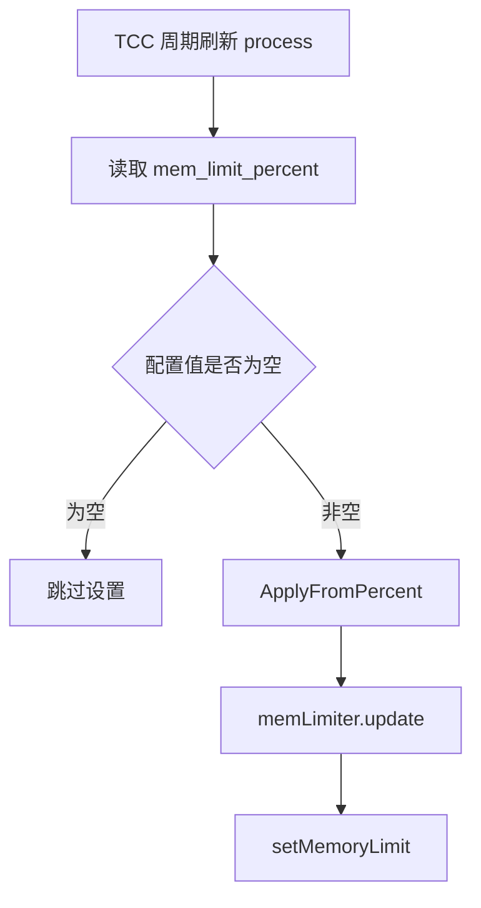

# Other — mem_limit

## 模块概览

`src/mem_limit` 负责根据 TCC 配置的内存百分比动态设置 Go 运行时内存上限。模块读取容器内存环境变量 `MY_MEM_LIMIT`，结合 TCC 下发的 `mem_limit_percent`，计算最终字节数，并通过 `setMemoryLimit` 应用到运行时。

该模块不承载业务请求流程；它作为运行时配置能力接入 `src/tcc/async_update.go` 的配置刷新逻辑。`mem_limit_percent` 是可选配置，读取失败、为空或应用失败都只记录日志，不阻断服务启动或 TCC 刷新。

## 入口与调用关系

主要入口是：

```go
func ApplyFromPercent(percentStr string) error
```

`ApplyFromPercent` 创建内部的 `memLimiter`，然后调用：

```go
func (*memLimiter) update(value string) error
```

在当前代码中，生产路径来自 TCC 配置刷新：

```go
val, err = GetTccSettingsClient().Get(ctx, memLimitPercentKey)
if err != nil {
	logs.CtxWarn(ctx, "get value from tcc failed, err: %v, key: %s", err, memLimitPercentKey)
} else if val == "" {
	logs.CtxInfo(ctx, "tcc %s is empty, skip applying mem limit", memLimitPercentKey)
} else {
	if err := mem_limit.ApplyFromPercent(val); err != nil {
		logs.CtxError(ctx, "apply mem limit from tcc value=%s failed: %v", val, err)
	}
}
```

`process()` 会在 `SetDefaultValuesAndStartRefresh()` 中执行一次，并由 `refreshTccConfig()` 每分钟周期执行。因此内存限制会随 TCC 配置刷新被重新计算和应用。



## 配置来源

模块依赖两个输入：

| 输入 | 来源 | 含义 |
| --- | --- | --- |
| `MY_MEM_LIMIT` | 环境变量 | Pod 或容器可用内存，单位为字节 |
| `mem_limit_percent` | TCC 配置项 | 运行时内存上限占 `MY_MEM_LIMIT` 的百分比 |

`MY_MEM_LIMIT` 必须是非负整数字符串。`mem_limit_percent` 也必须是整数字符串，且不能大于 `100`。

示例：如果 `MY_MEM_LIMIT=8589934592`，TCC 下发 `mem_limit_percent=80`，最终限制为：

```go
8589934592 * 80 / 100
```

也就是约 `6.4 GiB`。

## 核心实现

### `ApplyFromPercent`

`ApplyFromPercent(percentStr string) error` 是包级公开函数，也是外部模块应使用的入口。它只负责创建 `memLimiter` 并委托给 `update`，调用方不需要直接构造 `memLimiter`。

```go
func ApplyFromPercent(percentStr string) error {
	l := &memLimiter{}
	return l.update(percentStr)
}
```

### `memLimiter`

`memLimiter` 是无状态内部结构体：

```go
type memLimiter struct{}
```

它目前没有字段，主要用于承载 `update` 方法。测试中直接构造 `&memLimiter{}` 是因为测试文件与实现同包，可以覆盖内部解析逻辑。

### `(*memLimiter).update`

`update(value string) error` 是实际的配置解析和应用逻辑，执行顺序如下：

1. 读取 `MY_MEM_LIMIT`。
2. 使用 `strconv.ParseInt` 将 `MY_MEM_LIMIT` 解析为 `int64`。
3. 拒绝负数 Pod 内存。
4. 使用 `strconv.ParseInt` 解析传入的百分比字符串。
5. 拒绝大于 `100` 的百分比。
6. 当百分比 `<= 0` 时，将限制设置为 `math.MaxInt64`，等价于关闭显式限制。
7. 当百分比大于 `0` 时，通过 `getMemBytes` 计算最终限制。
8. 记录日志并调用 `setMemoryLimit(limitBytes)`。

需要注意：代码注释里 `ApplyFromPercent` 写的是 `percent < 0 means disable limit`，而 `update` 的实际判断是 `percent <= 0`。因此当前行为是 `0` 和负数都会禁用限制。

### `getMemBytes`

`getMemBytes(total, percent int64) int64` 只做整数百分比换算：

```go
func getMemBytes(total, percent int64) int64 {
	return total * percent / 100
}
```

该函数不会做溢出保护，也不会处理边界校验；调用前的合法性校验由 `update` 完成。

## 运行时设置实现

`setMemoryLimit` 有两个构建版本。

Go 1.19 及以上：

```go
//go:build go1.19

func setMemoryLimit(limitBytes int64) {
	debug.SetMemoryLimit(limitBytes)
}
```

该版本调用 `runtime/debug.SetMemoryLimit`，真正设置 Go 运行时内存限制。

Go 1.19 以下：

```go
//go:build !go1.19

func setMemoryLimit(limitBytes int64) {
	logs.Info("skip setting runtime memory limit on Go < 1.19, limit=%d", limitBytes)
}
```

旧版本 Go 没有 `debug.SetMemoryLimit`，因此这里是 no-op，只记录日志，保证代码可以在旧 Go 版本下编译。

## 错误处理语义

`mem_limit` 模块本身会把解析错误返回给调用方：

| 场景 | 行为 |
| --- | --- |
| `MY_MEM_LIMIT` 不是整数 | 返回解析错误 |
| `MY_MEM_LIMIT` 小于 `0` | 返回 `invalid pod mem` |
| `mem_limit_percent` 不是整数 | 返回解析错误 |
| `mem_limit_percent > 100` | 返回 `invalid tcc mem limit percent` |
| `mem_limit_percent <= 0` | 设置为 `math.MaxInt64`，返回 `nil` |
| `1 <= mem_limit_percent <= 100` | 计算并应用限制，返回 `nil` |

在 TCC 调用方中，这些错误只会被记录：

```go
logs.CtxError(ctx, "apply mem limit from tcc value=%s failed: %v", val, err)
```

不会把 `success` 设置为 `false`，因此不会触发 `process()` 失败，也不会阻断服务启动。

## 与 TCC 刷新流程的关系

`src/tcc/async_update.go` 中定义：

```go
memLimitPercentKey = "mem_limit_percent"
```

该配置项和 Redis 开关、Redis TTL、接口限流配置等一起在 `process()` 中刷新。但它的失败语义更宽松：注释明确说明 `mem_limit_percent is optional: failures should not block service start.`

因此贡献代码时应保持这个特性：内存限制是运行时优化或保护能力，不应该因为配置缺失或格式错误导致核心 Account 服务不可用。

## 测试覆盖

`src/mem_limit/memlimit_test.go` 覆盖了 `update` 的主要分支：

- `MY_MEM_LIMIT=8589934592` 且百分比为 `80` 时成功。
- 百分比为 `110ab` 时返回错误。
- 百分比为 `110` 时返回错误。
- 百分比为 `-1` 时成功，并表示禁用限制。
- `MY_MEM_LIMIT=not-a-number` 时返回错误。

测试没有断言 `debug.SetMemoryLimit` 的实际运行时效果，而是聚焦解析、校验和错误返回。这与模块设计一致：`setMemoryLimit` 的真实行为依赖 Go 构建版本，且 Go 1.19 以下是 no-op。

## 修改注意事项

修改该模块时优先保持以下约束：

- 外部调用入口应继续使用 `ApplyFromPercent`，不要让 TCC 直接依赖 `memLimiter`。
- `mem_limit_percent` 在 TCC 中应继续保持可选，不应让配置错误阻断 `process()`。
- `setMemoryLimit` 的构建标签需要保持互斥：`go1.19` 与 `!go1.19`。
- 如果调整 `percent <= 0` 的语义，需要同步更新注释和测试，因为当前代码实际把 `0` 和负数都视为禁用限制。
- 如果增加新的计算规则，应优先补充 `memlimit_test.go`，尤其是边界值 `0`、`1`、`100` 和非法 `MY_MEM_LIMIT`。