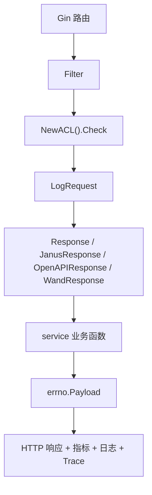

# Other — middleware

## 中间件模块

`src/middleware` 是 Gin 请求进入业务 `service` 前后的统一处理层。它负责路由级鉴权、来源识别、请求日志、限流、响应封装、指标上报、Trace 标记，以及部分对外协议的响应适配。

业务 handler 在本模块中统一表示为：

```go
type MyHandler func(c *gin.Context, ctx context.Context) *errno.Payload
```

也就是说，业务层不直接写 HTTP 响应，而是返回 `*errno.Payload`；`Response`、`OpenAPIResponse`、`JanusResponse`、`WandResponse` 再根据不同入口协议转换成实际 HTTP 输出。



### 路由挂载方式

`main.go` 中主业务入口使用统一的中间件链：

```go
accountapi := r.Group("")
accountapi.Use(middleware.Filter)
accountapi.Use(middleware.NewACL())
accountapi.Use(middleware.LogRequest)
```

随后 `/account-api/v1`、`/account-api/v2`、`/account-api/v3` 下的大部分接口使用：

```go
middleware.Response("accounts.get", service.MGetAccountWithConfig)
```

其他入口按协议选择不同包装器：

- `/account-janus/v1` 和 `/account-bpm/v1` 主要使用 `JanusResponse`
- `/account-openapi/v1` 使用 `OpenAPIResponse`
- `/account-wand/v1` 使用 `WandResponse`
- `/account-api/v1/remote` 直接挂在 `r.Group` 上，不经过 `accountapi.Use(...)` 的全局 `Filter`、`NewACL()`、`LogRequest`

## 请求前置处理

### `Filter`

`Filter` 从请求头 `X-TT-From` 读取调用方 PSM，并写入 Gin context：

```go
c.Set(PSM, psm)
```

`PSM` 常量值为 `"PSM"`，后续 `Response`、`JanusResponse`、`WandResponse` 都会通过 `c.GetString(PSM)` 读取调用方，用于限流 key、指标 tag 和日志。

`Filter` 还承担写接口白名单控制：

```go
if c.Request.Method != http.MethodGet && !tcc.GetAllowList(c)[psm] {
    c.AbortWithStatusJSON(http.StatusOK, errno.ErrNoWriteAuth)
    return
}
```

非 `GET` 请求必须命中 `tcc.GetAllowList(c)` 返回的白名单，否则返回 `errno.ErrNoWriteAuth`。这里 HTTP 状态码是 `200`，业务错误通过 `errno.Payload` 表达。

### `NewACL` 与 `ACL.Check`

`NewACL` 从 TCC 拉取 ACL 配置：

```go
ACLConfig = tcc.GetACLConfigs(context.Background())
```

然后构造 `ACL`：

```go
type ACL struct {
    Pairs          map[string]string
    OnUnauthorized OnUnauthorizedFunc
}
```

实际校验逻辑在 `(*ACL).Check`：

1. 如果 `ACLConfig.IsEnabled()` 为 `false`，直接 `c.Next()`
2. 从 `constant.HeaderAuthorization` 读取认证头
3. 使用 `util.ParseBaseAuth(auth)` 解析用户名和密码
4. 校验 `a.Pairs[u] == p`
5. 失败时调用 `HandleACLUnauthorized`

`HandleACLUnauthorized` 会记录 `"unauthorized"` 日志，并返回：

```go
c.AbortWithStatusJSON(http.StatusUnauthorized, errno.ErrUnauthorized)
```

注意：`NewACL` 只在创建中间件时读取一次 `ACLConfig` 和 `Pairs`。如果 TCC 中 ACL 配置后续发生变化，需要确认外层是否会重建 Gin handler，否则已构造的 `ACL.Pairs` 不会自动替换。

### `LogRequest`

`LogRequest` 读取请求 body、恢复 `c.Request.Body`，并打印请求摘要：

```go
content, err := c.GetRawData()
c.Request.Body = ioutil.NopCloser(bytes.NewReader(content))
_ = json.Unmarshal(content, &body)

logs.CtxInfo(c, "Req:%s:%s Header:%v Body:%v Query:%v", ...)
```

恢复 body 是关键行为：如果不重新写回 `c.Request.Body`，后续业务 handler 就无法再次读取请求体。

`LogRequest` 对 body 的解析是宽松的：`json.Unmarshal` 失败不会中断请求，只会让日志里的 `Body` 保持空 map 或零值。

## 标准响应包装：`Response`

`Response(mkey string, f MyHandler)` 是主业务 API 的核心包装器。它做的事情比简单调用 `f` 多很多：

1. 构造 RPC context
2. 设置读请求压测绕过标记
3. 提取调用方 `psm` 和 SDK 版本
4. 识别业务函数名并写入 `K_METHOD`
5. 执行接口级限流和 Harden 限流
6. 调用业务 handler
7. 统一写 CORS 与禁缓存响应头
8. 返回 `errno.Payload`
9. 上报延迟、吞吐、错误指标
10. 设置 BytedTrace span 信息

核心调用链是：

```go
ctx := ginex.RPCContext(c)
ctx = context.WithValue(ctx, gorm.ContextSkipStressForRead, true)

if !interface_limiter.Allow(mkey) {
    data = errno.ErrTooManyRequests
} else if util.HardenCli.Allow(rateLimitKey) {
    data = f(c, ctx)
} else {
    data = errno.ErrTooManyRequests
}
```

这里有两层限流：

- `interface_limiter.Allow(mkey)`：按接口 `mkey` 做本地限流
- `util.HardenCli.Allow(rateLimitKey)`：按 `psm:mkey` 做 Harden 限流

只有两层限流都通过时，业务 handler 才会被调用。

`Response` 会从 header 中按优先级读取 SDK 版本：

1. `X-TT-Account-Sdk-Version`
2. `X-TT-Biz-Callback-Sdk-Version`
3. `"unknown"`

如果 `psm` 或 SDK 版本为 `"unknown"`，会额外记录一条无 SDK 调用日志：

```go
logs.CtxInfo(c, "invalid request, method:%s, clientIP:%s, sdkVersion:%s, psm: %s", ...)
```

错误判断使用业务 code：

```go
if data.Code != errno.CodeOK && data.Code != errno.CodeOKZero {
    ...
}
```

内部错误码 `>= errno.CodeInternalErr` 记为 error 日志，其他错误记为 warn 日志，并调用 `util.EmitError`。

`Response` 还会读取业务 handler 写入 Gin context 的两个标记并加入指标 tag：

- `ISGetAllAccounts`
- `LocalCacheHit`

例如 `service.MGetAccountWithConfig` 会通过这些 context key 标记是否是全量账号查询、是否命中本地缓存。

## OpenAPI 响应包装：`OpenAPIResponse`

`OpenAPIResponse` 用于 `/account-openapi/v1`，它不依赖 `Filter` 的写白名单，而是进行 IAM 签名与权限校验。

主要流程：

1. 提取 `psm`、SDK 版本、业务函数名
2. 调用 `iamsdk.VerifyV4WithKms(context.Background(), c.Request)` 验签
3. 根据 `constant.OpenapiMethodPermission[mkey]` 找到接口所需权限
4. 从 path 参数中读取 `account`
5. 调用 `iamsdk.GetIamPermissionsProject(ctx, Account.Name, projectId, []string{permission})`
6. 校验通过后执行业务 handler
7. JSON 序列化 `errno.Payload` 并通过 `c.Data` 返回

失败场景包括：

- 验签失败：`errno.CodeBadRequest`
- `mkey` 不在 `constant.OpenapiMethodPermission`：`errno.CodeBadRequest`
- path 中没有 `account` 参数：`errno.CodeBadRequest`
- IAM 权限校验失败：`errno.CodeUnauthorized`

当前实现中，权限校验失败后会给 `data` 赋值为 unauthorized 错误，但随后仍会继续执行：

```go
data = f(c, ctx)
```

因此贡献代码时要特别注意这段控制流：如果目标行为是不允许未授权请求进入业务 handler，需要在权限失败后显式阻断。

## Janus 响应包装：`JanusResponse`

`JanusResponse` 服务 `/account-janus/v1` 和 `/account-bpm/v1` 这类 Janus/BPM 风格入口。它的业务 handler 类型仍然是 `MyHandler`，但响应结构转换为 `JanusPayload`：

```go
type JanusPayload struct {
    Code      int         `json:"code"`
    Message   string      `json:"message"`
    ReqeustId string      `json:"trace_id"`
    Response  interface{} `json:"response"`
}
```

转换函数是 `toJanusPayload`：

```go
func toJanusPayload(p *errno.Payload) JanusPayload {
    if p.Code == errno.CodeOK {
        jp.Code = JanusOkCode
    } else {
        jp.Code = p.Code
    }
    jp.Message = p.Message
    jp.Response = p.Data
    return jp
}
```

也就是说，标准成功码 `errno.CodeOK` 会被转换为 Janus 期望的 `0`；业务数据从 `Payload.Data` 移到 `response` 字段。

`JanusResponse` 也会做 Harden 限流、CORS/禁缓存 header、延迟/吞吐/错误指标和错误日志，但没有 `Response` 中的 `interface_limiter.Allow(mkey)` 和 BytedTrace span 标记。

## Wand 响应包装：`WandResponse`

`WandResponse` 用于 `/account-wand/v1`，当前路由用于 Wand 系统回调，例如：

```go
wand.GET("/vod/assets", middleware.WandResponse("wand.accounts.get", service.GetAccountVodAssets))
wand.POST("/vod/assets", middleware.WandResponse("wand.accounts.update", service.UpdateAccountVodAssets))
```

Wand 协议有两个特点：

第一，响应体只返回 `errno.Payload.Data`，不返回标准 `code/message/data` 包装：

```go
func toWandPayload(p *errno.Payload) interface{} {
    return p.Data
}
```

第二，请求需要通过 `X-Verification-Code` 做轻量校验：

```go
const XCODE = "X-Verification-Code"
```

`checkCode` 要求 header 格式为：

```text
时间戳毫秒|签名
```

校验规则：

- 必须能按 `|` 切成两段
- 第一段必须能解析为毫秒时间戳
- 与当前时间差不能超过 60 秒
- 第二段必须等于 `hmacSha1(时间戳毫秒)`

`hmacSha1` 使用 `config.Conf.Wand.Token` 作为密钥。业务成功执行后，`WandResponse` 会通过响应头返回新的验证码：

```go
c.Header(XCODE, genCode())
```

如果验证码校验失败，`data = errno.ErrUnauthorized`，HTTP 状态码返回 `403`；其他场景返回 `200`。

## 限流组件

### `NewRateLimiter` 与 `RateLimiter.RateLimit`

`NewRateLimiter` 基于 `github.com/ulule/limiter` 创建一个 Gin 中间件：

```go
rate, err := limiter.NewRateFromFormatted(config.Conf.RateLimiter.Rate)
store := memory.NewStoreWithOptions(limiter.StoreOptions{
    Prefix:          config.Conf.RateLimiter.Prefix,
    CleanUpInterval: config.Conf.RateLimiter.CleanUpInterval,
})
```

它构造的 `RateLimiter` 包含：

- `Limiter`：实际限流器
- `KeyGetter`：默认是 `GetIP`
- `OnError`：默认是 `HandleRateLimiterError`
- `OnReached`：默认是 `HandleRateLimiterReached`

`RateLimiter.RateLimit` 只有在 `config.Conf.RateLimiter.IsEnabled()` 为 true 时生效。通过时会写入标准限流响应头：

- `constant.HeaderRateLimitLimit`
- `constant.HeaderRateLimitRemaining`
- `constant.HeaderRateLimitReset`

达到限流时调用：

```go
c.AbortWithStatusJSON(http.StatusTooManyRequests, errno.ErrTooManyRequests)
```

当前 `main.go` 中没有把 `NewRateLimiter()` 挂到主路由链上；主业务路径实际使用的是 `Response` 内部的 `interface_limiter` 和 `util.HardenCli`。

### `GetIP`

`GetIP` 优先读取：

```go
constant.HeaderRealIP
```

如果没有该 header，则回退到：

```go
c.ClientIP()
```

测试中通过 `RemoteAddr = "127.0.0.1:80"` 验证了回退行为。

## 熔断组件

`InitCircuitBreaker` 从 TCC 获取熔断配置：

```go
for n, cb := range tcc.GetCircuitBreakersConfigs(context.Background()) {
    if cb.Enable {
        CircuitBreakers[n] = &CircuitBreaker{
            CB:     gobreaker.NewCircuitBreaker(cb.GetSettings(n)),
            Switch: cb.Switch,
        }
    }
}
```

本模块定义的熔断结构是：

```go
type CircuitBreaker struct {
    CB     *gobreaker.CircuitBreaker
    Switch string
}
```

`GetDBCircuitBreaker` 只返回名为 `"DB"` 的熔断器，并且还要求对应的 etcd switch 打开：

```go
cb := CircuitBreakers["DB"]
if cb != nil && etcdutil.GetWithDefault(cb.Switch, "0") == "1" {
    return cb.CB
}
return nil
```

因此调用方需要处理返回 `nil` 的情况。`circuit_breaker_test.go` 当前断言默认初始化下 `GetDBCircuitBreaker()` 返回 `nil`。

## 辅助函数

### `DuplicateStringFilter`

`DuplicateStringFilter` 对字符串切片去重：

```go
func DuplicateStringFilter(duplicateSlice []string) []string
```

它通过 map 去重后再组装结果切片。返回顺序不稳定，因为 Go map 遍历顺序不保证固定。调用方不能依赖输出顺序。

该函数被业务层使用，例如 `service.MGetCategory` 会对 category 列表去重后返回。

### `checkCode`、`genCode`、`hmacSha1`

这三个函数只服务 Wand 验证码机制：

- `genCode` 生成 `当前毫秒时间戳|hmacSha1(时间戳)` 字符串
- `checkCode` 校验格式、时间窗口和签名
- `hmacSha1` 使用 `config.Conf.Wand.Token` 做 HMAC-SHA1

## 与配置和外部模块的关系

中间件模块依赖多个配置源和基础设施模块：

- `config.Conf.ACL`：控制 `NewACL` 是否启用以及用户名密码对
- `config.Conf.RateLimiter`：控制 `NewRateLimiter`
- `config.Conf.InterfaceRateLimiter`：由 `interface_limiter` 使用，`Response` 通过 `interface_limiter.Allow(mkey)` 生效
- `config.Conf.CircuitBreakers`：作为 TCC 熔断配置失败时的兜底
- `config.Conf.Harden`：用于 `util.InitRateLimiter` 创建 `util.HardenCli`
- `config.Conf.Wand.Token`：用于 Wand 验证码签名
- `tcc.GetAllowList`：用于 `Filter` 的写接口白名单
- `tcc.GetACLConfigs`：用于 `NewACL`
- `tcc.GetCircuitBreakersConfigs`：用于 `InitCircuitBreaker`
- `errno.Payload`：所有业务 handler 的统一返回类型
- `ginex.RPCContext`：为业务 handler 构造上下文
- `util.EmitLatency`、`util.EmitThroughput`、`util.EmitError`：统一指标上报

## 测试覆盖

`src/middleware/*_test.go` 主要覆盖中间件的基础可调用性和关键转换逻辑：

- `TestResponse`、`TestOpenAPIResponse`：验证响应包装器能构造并执行
- `TestJanusResponse`、`Test_toJanusPayload`：验证 Janus 包装和成功码转换
- `TestWandResponse`、`Test_checkCode`、`Test_genCode`：验证 Wand 包装和验证码生成/校验
- `Test_ACL`：验证 `NewACL` 返回可执行 handler
- `TestDuplicateStringFilter`、`TestFilter`：验证去重和来源过滤基本路径
- `TestLogRequest`：验证请求体读取后不阻断流程
- `TestNewRateLimiter`、`TestGetIP`、`TestHandleRateLimiterError`、`TestHandleRateLimiterReached`：验证限流组件基础行为
- `TestGetDBCircuitBreaker`：验证默认情况下 DB 熔断器为空

`TestMain` 会初始化：

```go
ginex.Init()
config.InitConf()
util.InitRateLimiter()
InitCircuitBreaker()
```

因此新增测试如果依赖 `config.Conf`、`util.HardenCli` 或 `CircuitBreakers`，应复用当前测试初始化模型。