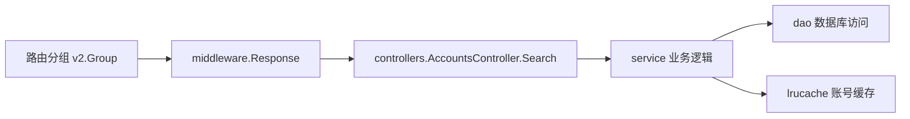

# Other — README.md

## 模块定位

`README.md` 是仓库级开发说明文档，不参与运行时调用链；当前模块没有内部调用、外部调用或执行流。它的主要作用是统一项目开发约定，包括 Go 版本、包管理方式、命名规范、RESTful 路由写法、目录职责、第三方库补丁记录，以及新机房部署注意事项。

## 开发基础

项目使用：

- Go 版本：`go 1.16`
- 包管理：`go mod`

开发和构建时应以 `go.mod` 为依赖来源，避免绕过模块系统直接修改依赖版本。仓库中存在 `vendor/` 修改记录，相关变更需要单独关注，见“对 libs 的修改”。

## 命名规范

### Controller

Controller 使用复数命名：

```go
MembersController
CategoriesController
```

这与 RESTful 资源集合语义一致。新增接口控制器时应保持同样风格，例如账号集合对应 `AccountsController`。

### Model

Model 使用单数命名：

```go
Member
Category
```

Model 表示单个业务实体，不使用复数。

### Routes

Routes 依 RESTful 资源风格组织，资源路径使用复数。README 中的标准模式如下：

```go
accountGroup := v2.Group("accounts")
{
    accountsController := new(controllers.AccountsController)
    accountGroup.GET("", middleware.Response("accounts.search", accountsController.Search))
}
```

这里体现了几个项目约定：

- 路由分组使用复数资源名：`v2.Group("accounts")`
- Controller 使用复数类型：`controllers.AccountsController`
- Handler 方法使用行为动词：`Search`
- 响应包装统一通过 `middleware.Response`
- 路由名称使用 `资源.动作`：`accounts.search`

常见 RESTful 映射：

| 动作 | URI | 行为 | 路由名称 |
| --- | --- | --- | --- |
| `GET` | `/photos` | `search` | `photos.search` |
| `POST` | `/photos` | `create` | `photos.create` |
| `GET` | `/photos/{photo_id}` | `show` | `photos.show` |
| `PUT/PATCH` | `/photos/{photo_id}` | `update` | `photos.update` |
| `DELETE` | `/photos/{photo_id}` | `destroy` | `photos.destroy` |

## 请求处理结构

README 描述的是典型分层结构：路由把请求交给 `middleware.Response` 包装，再进入 `controllers`，由 `service` 承载业务逻辑，必要时通过 `dao` 访问数据库。



该图是 README 中目录职责和示例路由的抽象，不代表某个具体函数的完整调用链。

## 目录职责

README 记录的主要目录约定如下：

| 目录 | 职责 |
| --- | --- |
| `dao` | `data access object`，封装数据库 CRUD 代码 |
| `dto` | `data transfer object`，承载接口或层间传输数据 |
| `errno` | 错误码、错误定义相关逻辑 |
| `middleware` | 中间件，README 特别提到 `access.go` |
| `service` | 业务代码；其中 `service` 的 `lrucache` 存储账号表缓存信息 |
| `controllers` | API 业务入口；V2 开始的 API 业务代码实现在 `controllers` 中 |
| `util` | 通用工具逻辑 |
| `validator` | 请求参数或业务参数校验逻辑 |

新增代码时应优先放入符合职责的目录中：接口编排放 `controllers`，核心业务规则放 `service`，数据库 CRUD 放 `dao`，请求/响应结构放 `dto`，通用辅助逻辑放 `util`。

## 对 libs 的修改

README 记录了对 vendored 依赖 `vendor/code.byted.org/gin/ginex/apimetrics/metrics.go` 的项目内补丁。

修改点位于：

```go
func MetricsWithSuccessDecider(psm string, meshMode bool, successDecider SuccessDecider)
```

补丁从 Gin context 中读取 `PSM`：

```go
from := c.GetString("PSM")
```

并把它加入 metrics tags：

```go
tags := map[string]string{
    "status":        strconv.Itoa(statusCode),
    "from_cluster":  "default",
    "to_cluster":    env.Cluster(),
    "stress_tag":    stressTag,
    "from":          from,
}
```

这个变更会影响 API metrics 上报维度：除了状态码、目标集群、压测标记等字段外，额外上报来源 `from`。维护时需要注意：

- `PSM` 必须在进入 metrics 中间件前被写入 Gin context，否则 `from` 为空字符串。
- 更新 `vendor/code.byted.org/gin/ginex` 或重新生成 `vendor/` 时，需要确认该补丁没有丢失。
- 如果后续改用上游版本，应检查是否已有等价的来源标记能力。

## 新机房部署

部署新机房时 README 记录了两个必要步骤：

1. 更新 `gopkg/env` 包。
2. 在 `util/region.go` 中更新 `regionMapping`。

`regionMapping` 是新 region 接入时的关键配置点。新增机房或 region 后，如果环境包和映射表不一致，可能导致集群、地域或环境识别异常。

## 维护建议

`README.md` 当前更像项目约定索引，而不是完整开发手册。后续更新时建议继续保持它的职责边界：记录全局约定、目录职责、运行环境和特殊补丁；具体业务流程、接口行为和复杂实现细节应放在对应模块文档或代码注释中。