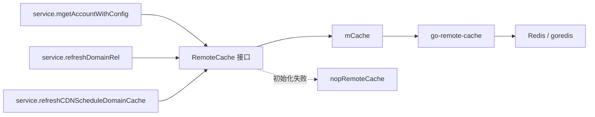

# Other — remote_cache

## remote_cache 模块

`src/remote_cache` 提供跨实例的 Redis 远端缓存封装，主要服务于账号查询、域名账号关系查询和 CDN 调度域名快照。它不是业务入口层，而是 `service` 包在本地缓存和数据库之间使用的一层共享缓存，用来降低 DB 压力、协调异步刷新，并在部分外部依赖失败时提供快照兜底。

## 对外接口

核心接口定义在 `cache.go` 的 `RemoteCache`：

- 账号查询缓存：`MGetVideoAccount`、`SetVideoAccounts`、`SetQueryResult`、`RemoveAccount`
- 账号查询刷新锁：`Lock`、`Unlock`、`Locked`
- 域名账号关系缓存：`MListDomainAccountRel`、`SetDomainAccountRel`
- CDN 调度域名快照：`AcquireCDNScheduleDomainsLock`、`SetCDNScheduleDomains`、`GetCDNScheduleDomains`

真实实现是 `mCache`，内部持有 `go-remote-cache` 的 `g.RemoteCache`。`nopRemoteCache` 是降级实现：大多数读写方法返回 `nop remote cache`，`RemoveAccount`、`Lock`、`Unlock` 为无害空操作，`Locked` 恒为 `false`。

## 初始化与实例选择

`Init()` 会在 `tcc.CheckRedisCacheSwitch()` 为真时主动创建 Redis 远端缓存：

1. `newRedisCli()` 使用 `config.Conf.Redis` 的 `Cluster`、`DialTimeout`、`ReadTimeout`、`WriteTimeout` 创建 `goredis.Client`。
2. CI 环境下改用固定 Redis 地址 `redis://10.37.83.202:6380`，设置测试密码并关闭 GDPR 校验。
3. `g.NewRemoteCache` 绑定 Redis backend，并使用 `tcc.GetRedisCacheTtl()` 和 `tcc.GetRedisCacheRetryTimes()` 配置默认 TTL 与重试次数。
4. 启动阶段 Redis 初始化失败会 `panic`，避免缓存开关打开但大量流量直接穿透 DB。

`GetCacheInstance()` 是惰性兜底入口。若 `cacheInstance` 已存在则直接返回；否则通过 `sync.Once` 创建实例。惰性创建失败时不会 `panic`，而是返回 `nopRemoteCacheInstance`，由调用方继续走 DB 或本地兜底逻辑。

## 账号查询缓存

账号缓存围绕 `dto.MGetAccountWithConfigRequest` 和 `dto.MGetVideoAccountResponse` 设计，使用两层 key：

- 查询结果 key：`toQueryResultKey(req)`，由请求字段拼成，包括 `ID`、`AccountName`、`QueryName`、`AccessKey`、`Module`、`Status`、`UserName`、`TopAccountID`、`TopInstanceID`、`VolcAccountID`、`VolcInstanceID`、`Type`、`AccountType`、`Region`、`WithDeleted`、`VRegion`，末尾带 `@v2`。
- 账号存储 key：`toAccountStoreKey(accessKey, region, module)`，格式为 `accessKey.region.module.@v2`。
- 反向索引 key：`toStoreKeySetKey(accessKey)`，格式为 `accessKey:key_set@v2`，保存该账号关联过的 store key，供失效删除使用。

`MGetVideoAccount` 的读取流程：

1. 先用查询结果 key 读取 store key 列表；这个 key 缺失时直接返回错误，通常是 `go-remote-cache.ErrCacheMiss`。
2. 对 store key 列表执行 `PipelineGet`，批大小为常量 `batch = 50`。
3. 如果某个 store key 缺失，会通过 `parseAccountStoreKey` 拿到 `accessKey`、`region`、`module`，再查询 `dao.Db.GetAccountByAK` 和 `dao.Db.MGetVideoConfig` 修复该条数据。
4. 修复出的数据会异步写回 Redis，同时补回 `accessKey:key_set@v2` 反向索引。

`SetVideoAccounts` 先写账号维度的 store key，并维护反向索引；每个账号数据的 TTL 是 `tcc.GetRedisCacheTtl() + 30*time.Second`。`SetQueryResult` 再写查询结果 key，TTL 是 `tcc.GetRedisCacheTtl()`。这种顺序保证查询结果不会先指向一批尚未写入的 store key。

`RemoveAccount(accessKey)` 通过反向索引取出所有 store key 并删除，随后启动 10 秒后的延迟双删。配置变更路径如 `service.MCreateConfig`、`service.DeleteConfig`、`service.MUpdateConfig` 会在 Redis 开关打开时调用它，使账号配置更新后远端缓存失效。

## 刷新锁

账号查询缓存使用查询粒度的轻量锁避免多个实例同时重建大结果集：

- `toLockKey(req)` 是 `toQueryResultKey(req) + "_lock"`。
- `Lock` 使用 `SetNX` 写入 UUID，TTL 为 30 秒。
- `Unlock` 会先读取当前锁值，只在值与调用方持有的 UUID 一致时删除。
- `Locked` 只判断锁 key 是否存在。

`service.mgetAccountWithConfig` 在远端缓存 miss 时使用这些方法协调刷新。异步请求会尝试抢锁；抢到锁的实例查询 DB 并调用 `setAccountRedisCache`。同步请求如果发现锁存在，会短暂重试 Redis，超过重试次数后仍会回源 DB。

## 域名账号关系缓存

域名关系缓存处理 `dto.ListDomainAccountRelRequest` 到 `[]*dto.DomainAccountRel` 的结果。key 由 `toDomainAccountRelStoreKeySetKey(req)` 构造，包含 `ID`、`Domain`、`DomainType`、`AccountName`、`Region`、`Module`、`Category`、`NeedSubDomains`。

`SetDomainAccountRel` 会先把完整响应 JSON 序列化，再用 `groupBytes(rawBytes, 4096)` 切成多个 4096 字节分片。每个分片写到独立 key：`<查询key>_<uuid>_<序号>`，最后把分片 key 列表写到查询 key。没有显式 TTL 的写入使用 `go-remote-cache` 的默认 TTL。

`MListDomainAccountRel` 先读取分片 key 列表，再 `PipelineGet` 拉取所有分片，按顺序拼接后 `json.Unmarshal`。任意分片缺失都会返回 `go-remote-cache.ErrCacheMiss`，调用方会回源 DB。

该缓存由 `service.refreshDomainRel` 使用：先尝试 `MListDomainAccountRel`，失败后调用 `dao.Db.BatchListDomainAccountRel`，必要时从 `cdnScheduleDomainCache` 补充调度子域名，再通过 `SetDomainAccountRel` 写回远端缓存。

## CDN 调度域名快照

`cdn_domain.go` 维护 CDN 调度主域名到子域名列表的 Redis 快照：

- 数据 key：`CDNScheduleDomainsKey = "cdn_schedule_domains"`
- 锁 key：`CDNScheduleDomainsLockKey = "cdn_schedule_domains_lock"`

`SetCDNScheduleDomains` 写入 `map[string][]string`，并设置 `TTL: -1`，表示快照不按普通缓存 TTL 过期。`GetCDNScheduleDomains` 读取该快照。`AcquireCDNScheduleDomainsLock` 使用 `SetNX` 加 30 秒锁，避免多个实例同时写快照。

`service.refreshCDNScheduleDomainCache` 正常情况下从 CDN schedule API 获取最新主域名和子域名，写入本地 `cdnScheduleDomainCache`，再异步抢锁写 Redis 快照。若 CDN API 失败，则调用 `GetCDNScheduleDomains` 从 Redis 快照恢复本地缓存。

## 错误语义与降级

`remote_cache` 本身不会把所有 miss 都转成 DB 查询。账号查询中，只有 store key 层面的局部缺失会在 `MGetVideoAccount` 内部修复；查询结果 key 缺失、Redis 操作失败、域名关系分片缺失等错误会返回给调用方。

主要调用方的降级策略在 `service` 层：

- `mgetAccountWithConfig`：远端缓存 miss 或错误后按请求类型重试、抢锁或回源 `dao.Db.MGetVideoAccount`。
- `refreshDomainRel`：远端缓存失败后回源 `dao.Db.BatchListDomainAccountRel`。
- `refreshCDNScheduleDomainCache`：CDN API 失败后尝试 Redis 快照；快照也失败时返回错误。

`nopRemoteCache` 的存在是为了让惰性初始化失败时接口仍可调用，并把失败显式暴露给这些服务层兜底逻辑。

## 测试与维护注意事项

测试入口 `base_test.go` 的 `TestMain` 会初始化 `ginex`、配置、TCC 默认值刷新和 `remote_cache.Init()`，因此多数测试依赖可用 Redis 配置。`video_account_test.go`、`domain_rel_test.go`、`cdn_domain_test.go` 会真实读写测试 key。

修改 key 生成逻辑时要同时考虑历史缓存兼容性。目前账号缓存通过 `versionTag = "@v2"` 隔离版本；域名关系 key 没有版本后缀。修改 `toQueryResultKey`、`toAccountStoreKey`、`toDomainAccountRelStoreKeySetKey` 会直接影响缓存命中率和删除能力。

新增缓存类型时优先复用现有模式：先定义稳定 key，再保证写入顺序不会产生悬挂引用，最后明确调用方对 `ErrCacheMiss` 和普通 Redis 错误的兜底行为。