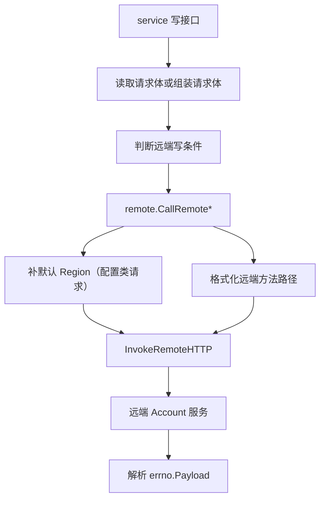

# Other — remote

## 模块定位

`src/remote` 模块提供跨地域写操作的 HTTP 转发封装。它不负责业务校验、数据库写入或路由注册，而是在 `service` 层判断“当前地域需要把写请求转发到远端”之后，接收原始请求体和远端地址模板，调用远端 Account 服务，并把远端统一响应中的 `data` 返回给上层。

核心实现集中在 `src/remote/http_utils.go`，测试集中在 `src/remote/http_utils_test.go`。

## 触发场景

`remote` 模块主要服务于账号和配置写接口。典型调用方位于：

- `service.CreateAccount`
- `service.UpdateAccount`
- `service.UpdateAccountStatus`
- `service.MCreateConfig`
- `service.MCopyConfig`
- `service.DeleteConfig`
- `service.MUpdateConfig`

这些服务函数通常按同一模式决定是否走远端：

```go
if util.GetRegion(env.IDC()) == tcc.GetRemoteRegionInfo(ctx) {
	if tcc.GetWriteSwitch(c) {
		setting := tcc.GetRemoteSetting(ctx)
		if len(setting) != 0 {
			// 调用 remote.CallRemote...
		}
	}
}
```

也就是说，`remote` 模块只在当前 IDC 所属地域命中 `tcc.GetRemoteRegionInfo(ctx)`，且远端写开关 `tcc.GetWriteSwitch(c)` 打开、远端地址模板 `tcc.GetRemoteSetting(ctx)` 非空时参与执行。否则服务层会走本地校验和本地 DAO 写入，或直接返回“不支持跨区写”的错误。

GitNexus 没有为 `src/remote` 检测到独立 execution flow；它更像是服务层写操作流程中的底层转发工具。

## 整体结构



`remote` 模块内部可以分为两层：

- `CallRemote*` 系列函数：面向具体远端方法，负责选择 HTTP method、格式化 path、必要时补默认地域。
- `InvokeRemoteHTTP`：通用 HTTP 执行器，负责继承请求头、发送 JSON 请求、校验 HTTP 状态和业务 `code`。

## 通用执行器：`InvokeRemoteHTTP`

```go
func InvokeRemoteHTTP(ctx *gin.Context, method, path, data string) (interface{}, error)
```

`InvokeRemoteHTTP` 是所有远端调用的公共入口，调用方包括：

- `CallRemoteCreateAccount`
- `CallRemoteUpdateAccount`
- `CallRemoteUpdateAccountStatus`
- `CallRemoteCreateConfig`
- `CallRemoteCopyConfig`
- `CallRemoteUpdateConfig`
- `CallRemoteDeleteConfig`

它的执行过程是：

1. 从 `ctx.Request.Header` 复制所有请求头。
2. 使用 `HttpRequest.NewRequest()` 创建请求对象。
3. 调用 `req.SetHeaders(header)` 把原请求头透传给远端。
4. 根据 `method` 选择 `POST`、`PUT` 或 `DELETE`。
5. 使用 `req.JSON().Post/Put/Delete(path, data)` 发送 JSON 请求。
6. 要求远端 HTTP 状态码为 `http.StatusOK`。
7. 使用 `simplejson.NewJson(body)` 解析响应体。
8. 读取响应中的 `code` 字段，要求等于 `errno.CodeOK`。
9. 返回响应中的 `data` 字段，即 `resp.Get("data")`。

远端响应预期符合本仓库的 `errno.Payload` 风格：

```json
{
  "code": 0,
  "message": "...",
  "data": ...
}
```

其中 `InvokeRemoteHTTP` 只把 `data` 暴露给上层，`code` 用于判断远端业务是否成功。

## 支持的 HTTP 方法

当前只支持三种方法：

- `"POST"`
- `"PUT"`
- `"DELETE"`

其他方法会直接返回：

```go
errors.New(fmt.Sprintf("Unknown HTTP Method: %s", method))
```

测试 `TestInvokeRemoteHTTP` 覆盖了 `POST`、`PUT`、`DELETE` 成功路径，以及 `PATCH` 失败路径。

## 错误语义

模块定义了两个包级错误：

```go
var (
	callErr   = errors.New("http call method failed")
	serverErr = errors.New("server process failed")
)
```

实际含义如下：

- `callErr`：HTTP 调用失败，或远端 HTTP 状态码不是 `200 OK`。`CallRemote*` 函数在捕获任意远端调用错误后，也统一向上返回 `callErr`。
- `serverErr`：HTTP 请求成功，但远端业务响应中的 `code` 不是 `errno.CodeOK`。

`InvokeRemoteHTTP` 在业务失败时会记录：

```go
logs.CtxError(ctx, "remote execute failed, resp: %v", resp)
```

`CallRemote*` 函数还会记录具体业务动作和请求参数，例如：

```go
logs.CtxError(ctx, "call create config method failed, err: %v, param: %s", err, val)
```

服务层通常不会区分 `callErr` 和 `serverErr`，而是统一转换成 `errno.ErrRemoteCallFailed` 返回给 API 调用方。

## 远端方法封装

### 账号写操作

`CallRemoteCreateAccount`：

```go
func CallRemoteCreateAccount(ctx *gin.Context, path string, param []byte) (interface{}, error)
```

行为：

- 将 `param` 转为字符串。
- 用 `fmt.Sprintf(path, "AccountCreateAccount")` 生成最终远端 URL。
- 通过 `InvokeRemoteHTTP(ctx, "POST", path, val)` 调用远端。

`service.CreateAccount` 在远端写分支中调用它，并把远端返回的 `data` 包装为 `errno.OK(resp)` 返回。

`CallRemoteUpdateAccount`：

```go
func CallRemoteUpdateAccount(ctx *gin.Context, path string, param []byte) (interface{}, error)
```

行为：

- 使用远端方法名 `"AccountUpdateAccount"`。
- 使用 HTTP `PUT`。
- 请求体直接透传原始 `dto.VideoAccount` JSON。

`CallRemoteUpdateAccountStatus`：

```go
func CallRemoteUpdateAccountStatus(ctx *gin.Context, path string, param []byte) (interface{}, error)
```

行为：

- 使用远端方法名 `"AccountUpdateAccountStatus"`。
- 使用 HTTP `PUT`。
- `service.UpdateAccountStatus` 会先把 `access_key` 和 `status` 组装为 JSON map，再传入该函数。

### 配置写操作

`CallRemoteCreateConfig`：

```go
func CallRemoteCreateConfig(ctx *gin.Context, path string, param []byte) (interface{}, error)
```

行为：

- 先调用 `AddDefaultRegionToUpdateConfigRequest(param)`。
- 使用远端方法名 `"AccountMCreateConfig"`。
- 使用 HTTP `POST`。

`CallRemoteUpdateConfig`：

```go
func CallRemoteUpdateConfig(ctx *gin.Context, path string, param []byte) (interface{}, error)
```

行为：

- 同样先调用 `AddDefaultRegionToUpdateConfigRequest(param)`。
- 使用远端方法名 `"AccountMCreateConfig"`。
- 使用 HTTP `PUT`。

这里需要注意：创建和更新配置都使用远端方法名 `"AccountMCreateConfig"`，差异由 HTTP method 区分。修改这部分时需要同步确认远端服务的路由或方法映射规则。

`CallRemoteCopyConfig`：

```go
func CallRemoteCopyConfig(ctx *gin.Context, path string, param []byte) (interface{}, error)
```

行为：

- 先调用 `AddDefaultRegionToCopyConfigRequest(param)`。
- 使用远端方法名 `"AccountMCopyConfig"`。
- 使用 HTTP `POST`。

`CallRemoteDeleteConfig`：

```go
func CallRemoteDeleteConfig(ctx *gin.Context, path string, param []byte) (interface{}, error)
```

行为：

- 请求体直接转为字符串。
- 使用远端方法名 `"AccountMDeleteConfig"`。
- 使用 HTTP `POST`。

`service.DeleteConfig` 中传入的请求体是：

```go
json.Marshal(map[string]int64{"id": id})
```

而远端落地函数 `service.RemoteDeleteConfig` 会解析为 `dto.DeleteConfigRequest`，再调用 `dao.Db.DeleteConfig(ctx, request.ID)`。

## 默认 Region 补齐

配置类远端请求有两个辅助函数用于补齐地域字段。

### `AddDefaultRegionToUpdateConfigRequest`

```go
func AddDefaultRegionToUpdateConfigRequest(param []byte) (string, error)
```

该函数将 `param` 解析为 `dto.MUpdateConfigRequest`：

```go
req := &dto.MUpdateConfigRequest{}
if err := json.Unmarshal(param, req); err != nil {
	return "", err
}
```

如果 `req.Region == ""`，则设置为：

```go
req.Region = util.GetRegion(env.IDC())
```

最后重新 `json.Marshal(*req)` 并返回字符串。

它被 `CallRemoteCreateConfig` 和 `CallRemoteUpdateConfig` 使用，用于保证转发到远端前请求体中带有明确的 `Region`。测试 `TestAddDefaultRegionToUpdateConfigRequest` 验证了空 `Region` 会在 BOE 环境中补为 `"boe"`。

### `AddDefaultRegionToCopyConfigRequest`

```go
func AddDefaultRegionToCopyConfigRequest(param []byte) (string, error)
```

该函数将 `param` 解析为 `dto.MCopyConfigRequest`。如果 `req.SourceRegion == ""`，则设置为：

```go
req.SourceRegion = util.GetRegion(env.IDC())
```

它只被 `CallRemoteCopyConfig` 使用。测试 `TestAddDefaultRegionToCopyConfigRequest` 验证了空 `SourceRegion` 会补为 `"boe"`。

这两个函数只处理“缺省地域”问题，不做业务合法性校验。请求结构校验仍由服务层和 `validator` 模块负责，例如 `validator.ValidateMUpdateConfigRequest`、`validator.ValidateMCopyConfigRequest`。

## `path` 参数约定

所有 `CallRemote*` 函数都接收 `path string`，并用 `fmt.Sprintf(path, methodName)` 生成最终调用地址：

```go
path = fmt.Sprintf(path, "AccountCreateAccount")
```

因此，`path` 不是普通固定 URL，而是一个包含格式化占位符的远端地址模板。该模板来自：

```go
tcc.GetRemoteSetting(ctx)
```

贡献新远端调用时，需要确认 TCC 中的 `InvokeSetting` 能正确接收一个远端方法名参数。否则 `fmt.Sprintf` 可能生成错误 URL，或原样返回不含方法名的地址。

## 请求头透传

`InvokeRemoteHTTP` 会遍历 `ctx.Request.Header`，并用 `ctx.GetHeader(k)` 获取每个 header 的值：

```go
header := make(map[string]string)
for k := range ctx.Request.Header {
	header[k] = ctx.GetHeader(k)
}
```

这意味着远端调用会继承原始请求中的调用方标识、链路信息或内部鉴权相关 header。上层服务依赖的一些 header，例如 `X-TT-From`，也可能被继续传给远端。

需要注意的是，`map[string]string` 只能保留每个 header 的单个字符串值；如果某个 header 有多个值，当前实现不会保留完整多值列表。

## 与服务层的职责边界

`remote` 模块保持了较薄的职责边界：

- 不读取 TCC：远端开关、远端地域和地址模板由 `service` 层读取。
- 不判断当前地域：`util.GetRegion(env.IDC()) == tcc.GetRemoteRegionInfo(ctx)` 的判断在 `service` 层完成。
- 不执行业务校验：例如账号参数、配置内容、状态值校验都在 `service` 或 `validator` 中完成。
- 不访问 DAO：远端落地逻辑如 `RemoteDeleteConfig` 在 `service` 层，具体写库仍由 `dao.Db` 完成。
- 不包装 API 响应：`remote` 返回远端 `data`，由服务层决定返回 `errno.OK(...)` 或错误 payload。

这种设计让 `remote` 只关注“把已经决定要转发的写请求按约定发出去”。

## 测试覆盖

`src/remote/http_utils_test.go` 使用 `gomonkey` 对外部依赖进行 patch，重点覆盖以下行为：

- `TestAddDefaultRegionToCopyConfigRequest`：验证 `MCopyConfigRequest.SourceRegion` 为空时会补默认地域。
- `TestAddDefaultRegionToUpdateConfigRequest`：验证 `MUpdateConfigRequest.Region` 为空时会补默认地域。
- `TestCallRemoteCopyConfig`、`TestCallRemoteCreateAccount`、`TestCallRemoteCreateConfig`、`TestCallRemoteDeleteConfig`、`TestCallRemoteUpdateAccount`、`TestCallRemoteUpdateAccountStatus`、`TestCallRemoteUpdateConfig`：通过 patch `InvokeRemoteHTTP` 验证各封装函数能成功返回远端结果。
- `TestInvokeRemoteHTTP`：通过 patch `HttpRequest.Request` 的 `Post`、`Put`、`Delete` 方法和 `HttpRequest.Response` 的 `StatusCode`、`Body` 方法，验证支持的 HTTP method 能解析 `errno.OK("success")`，不支持的 `PATCH` 会返回错误。

测试中远端响应体由：

```go
json.Marshal(errno.OK("success"))
```

构造，因此 `InvokeRemoteHTTP` 返回的 `data` 会被断言为 `"success"`。

## 扩展新远端写操作的步骤

新增一个远端写操作时，优先沿用现有 `CallRemote*` 模式：

1. 在 `service` 层决定是否需要远端转发，保持与现有写接口一致的 `GetRemoteRegionInfo`、`GetWriteSwitch`、`GetRemoteSetting` 判断。
2. 如果请求体需要补默认地域，新增或复用类似 `AddDefaultRegionToUpdateConfigRequest` 的辅助函数。
3. 新增 `CallRemoteXxx(ctx, path, param)`，内部用 `fmt.Sprintf(path, "远端方法名")` 生成地址。
4. 根据远端接口约定选择 `"POST"`、`"PUT"` 或 `"DELETE"`。
5. 调用 `InvokeRemoteHTTP`，失败时记录包含具体动作和参数的日志，并返回 `callErr`。
6. 在 `src/remote/http_utils_test.go` 中 patch `InvokeRemoteHTTP` 覆盖封装函数；必要时补充 `InvokeRemoteHTTP` 的响应解析或错误分支测试。

新增封装时不要在 `remote` 层加入业务校验或数据库逻辑，否则会破坏当前模块与 `service`、`validator`、`dao` 的职责边界。