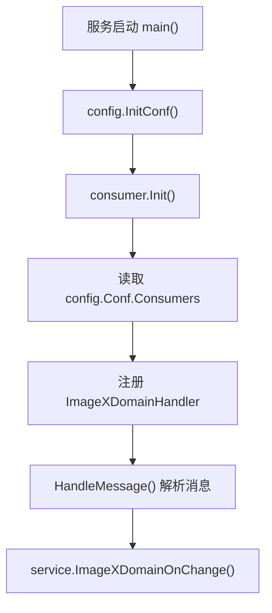

# Other — rocketmq

## RocketMQ 消费模块

`src/rocketmq/consumer` 负责启动 RocketMQ 消费者，并把 ImageX 域名变更消息转交给账号域名服务处理。生产入口是 `main.go` 中的 `consumer.Init()`，测试入口由 `TestMain` 初始化 `ginex` 和配置。



## 核心组件

### `Init()`

`Init()` 遍历 `config.Conf.Consumers`，为每一项消费者配置创建 RocketMQ consumer：

- 使用 `rocketConfig.NewDefaultConsumerConfig(consumerGroup, topic, clusterName)` 构造配置。
- 设置 `rmqCfg.WorkerNum = conf.WorkerNum`。
- 设置 `rmqCfg.ConsumeFromWhere = pb.SubscribeRequest_CONSUME_FROM_LATEST`，只从最新消息开始消费。
- 调用 `consumer.NewConsumer(rmqCfg)` 创建消费者。
- 当 `conf.Name == constant.TopicImageXDomain` 时注册 `&ImageXDomainHandler{}`。
- 通过 goroutine 调用 `r.Start()` 启动消费。

当前配置中 `constant.TopicImageXDomain` 的值是 `"imagex"`，各环境 YAML 通常配置为：

```yaml
Consumers:
  - Topic: "imagex_domain_event"
    Name: "imagex"
    ConsumerGroup: "toutiao_videoarch_account"
    ClusterName: "videoarch_normal"
    WorkerNum: 4
```

BOE 环境的 `ClusterName` 通常是 `"sandbox"`。

### `ImageXDomainHandler`

`ImageXDomainHandler` 是当前模块唯一实际注册的消息处理器。它实现的方法是：

```go
func (r *ImageXDomainHandler) HandleMessage(ctx context.Context, msg *pb.ConsumeMessage) error
```

处理流程：

1. 从 `msg.GetMsg().GetMsgBody()` 读取消息体。
2. 反序列化到 `dto.ImageXDomainMessage`。
3. 记录收到的消息日志。
4. 调用 `service.ImageXDomainOnChange(ctx, recMsg)` 执行业务处理。
5. 反序列化失败或业务处理失败时返回 `error`。

`HandleMessage()` 不直接操作数据库，也不包含域名业务规则；它只负责 MQ 消息到服务层 DTO 的适配和错误传播。

## 消息模型

RocketMQ 消息体对应 `dto.ImageXDomainMessage`：

```go
type ImageXDomainMessage struct {
    Event     string `json:"event"`
    Idc       string `json:"idc"`
    ServiceID string `json:"service_id"`
    AccountID string `json:"account_id"`
    Domain    string `json:"domain"`
    Extra     Extra  `json:"extra"`
    Ts        int    `json:"ts"`
}
```

已被服务层识别的事件类型在 `constant` 中定义：

- `constant.EventAddDomain = "add_domain"`
- `constant.EventDeleteDomain = "delete_domain"`

示例消息：

```json
{
  "event": "add_domain",
  "idc": "lf",
  "service_id": "ExistAccountName",
  "account_id": "1000000155",
  "domain": "ExistDomain",
  "extra": {},
  "ts": 1658739430
}
```

## 与服务层的连接

`ImageXDomainHandler.HandleMessage()` 将消息转交给 `service.ImageXDomainOnChange()`。服务层根据 `event.Event` 分支处理：

- `add_domain`：如果域名不存在，创建 `dto.Domain`；随后创建 `dto.DomainAccountRel`，把域名绑定到 `event.ServiceID` 对应的账号名。
- `delete_domain`：查询 `DomainAccountRel`，并按记录 ID 删除绑定关系。

因此 RocketMQ 模块的职责边界很窄：它不判断域名是否存在、不做参数校验、不决定数据库写入方式；这些都由 `service.ImageXDomainOnChange()`、`validator` 和 `dao.Db` 负责。

## 启动顺序

`main()` 中的初始化顺序会影响消费者是否能正常处理消息：

```go
config.InitConf()
tcc.SetDefaultValuesAndStartRefresh()
rpc.Init()
remote_cache.Init()
dao.InitDb()
util.InitCheckSuffix()
middleware.InitCircuitBreaker()
service.Init()
util.InitRateLimiter()
consumer.Init()
```

`consumer.Init()` 位于 DAO、middleware、service 初始化之后，这使得消息处理进入 `service.ImageXDomainOnChange()` 时可以使用数据库句柄、校验逻辑和相关运行时配置。

## 错误处理

`Init()` 创建 consumer 失败时会：

```go
logs.Fatalf("initConsumer: %v", err)
panic(err)
```

`HandleMessage()` 中有两类错误会向上返回：

- JSON 解析失败：记录 `unmarshal message failed` 并返回解析错误。
- 服务层处理失败：记录 `[TopicDomainHandler] error` 并返回服务层错误。

消息确认、重试或失败投递策略不在本模块中显式实现，由 `rocketmq-go-proxy` 的 consumer 框架根据 `HandleMessage()` 返回值处理。

## 测试覆盖

`base_test.go` 的 `TestMain` 在测试前执行：

```go
ginex.Init()
config.InitConf()
```

`handler_test.go` 覆盖两个主要行为：

- `TestImageXDomainHandler_HandleMessage`：构造 `pb.ConsumeMessage`，并用 `gomonkey.ApplyFunc` 替换 `service.ImageXDomainOnChange`，验证 handler 会把 JSON 消息解析后传入服务层，并正确透传成功或失败。
- `TestInitConsumer`：调用 `config.InitConf()` 和 `Init()`，断言初始化过程不 panic。

测试中的 `handleMessage()` 是测试辅助函数，不是生产代码入口。它手动构造 `pb.ConsumeMessage`：

```go
msg := &pb.ConsumeMessage{}
msg.Msg = new(proto.Message)
msg.Msg.MsgBody = []byte(msgBody)

handler := &ImageXDomainHandler{}
return handler.HandleMessage(ctx, msg)
```

## 扩展新消费者

新增 RocketMQ 消费逻辑时，现有模式是：

1. 在配置文件的 `Consumers` 中增加一项 consumer 配置。
2. 在 `constant` 中定义新的 `Name` 常量。
3. 新增 handler 类型，并实现 `HandleMessage(ctx context.Context, msg *pb.ConsumeMessage) error`。
4. 在 `Init()` 的 `switch conf.Name` 中注册对应 handler。

当前 `switch` 只处理 `constant.TopicImageXDomain`。如果配置中出现未知 `Name`，`Init()` 仍会创建并启动 consumer，但不会注册业务 handler；修改这里时要明确未知配置是否应该被拒绝、告警或保持当前行为。