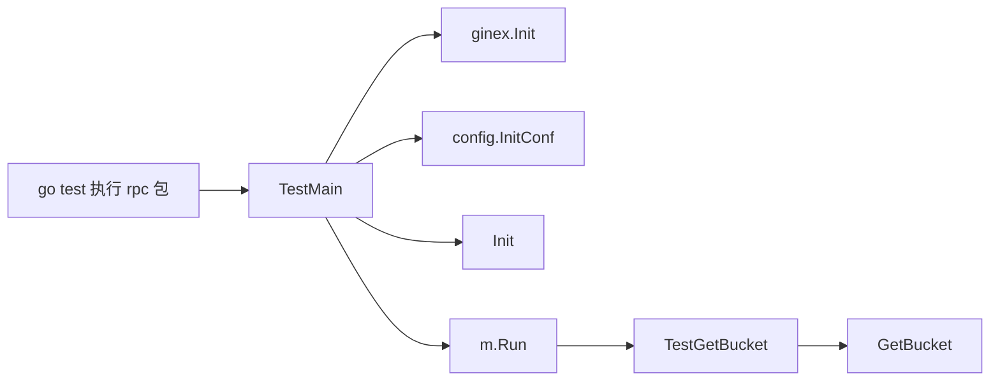

# Other — rpc

## Other — rpc 模块

`src/rpc` 模块承载 RPC 层的初始化和访问能力。当前给出的代码主要是该模块的测试入口与 `GetBucket` 的调用验证，用来保证 RPC 相关依赖在测试执行前完成初始化，并验证 `GetBucket` 能在测试环境中按 bucket 名称取回结果。

## 测试启动流程

`src/rpc/base_test.go` 定义了包级测试入口 `TestMain`：

```go
func TestMain(m *testing.M) {
	ginex.Init()
	config.InitConf()
	Init()
	code := m.Run()
	os.Exit(code)
}
```

`TestMain` 会在 `rpc` 包内所有测试运行前执行一次。它按固定顺序完成三件事：

1. 调用 `ginex.Init()` 初始化 Gin 扩展环境。
2. 调用 `config.InitConf()` 加载项目配置。
3. 调用 `Init()` 初始化 `rpc` 包自身依赖。
4. 执行 `m.Run()` 运行测试，并通过 `os.Exit(code)` 保留测试退出码。

这个顺序很重要：`Init()` 通常依赖已经加载完成的配置，因此 `config.InitConf()` 必须先执行。`TestGetBucket` 等测试不需要重复初始化，只依赖 `TestMain` 提供的全局测试环境。



## Bucket 查询测试

`src/rpc/bucket_test.go` 中的 `TestGetBucket` 验证 `GetBucket` 的基本调用路径：

```go
func TestGetBucket(t *testing.T) {
	got, err := GetBucket(context.TODO(), "tostest")
	assert.Nil(t, err)
	t.Logf("bucket: %v", got)
}
```

从调用方式可以看出，`GetBucket` 接收：

- `context.Context`：这里使用 `context.TODO()`，表示测试当前没有传入超时、取消信号或请求级元数据。
- bucket 名称：测试中使用固定名称 `"tostest"`。
- 返回值：一个 bucket 结果和一个 `error`。

测试只断言 `err == nil`，并通过 `t.Logf` 打印返回的 bucket 内容。它更像是一个集成验证：确认 RPC 初始化、配置加载和远端 bucket 查询链路能够跑通，而不是验证 bucket 结构的具体字段。

## 与其他模块的关系

该模块测试代码直接连接到以下依赖：

- `code.byted.org/gin/ginex`：由 `ginex.Init()` 初始化运行时环境。
- `src/config`：由 `config.InitConf()` 加载配置，是 RPC 初始化前置条件。
- `src/rpc` 包内部生产代码：`Init()` 负责 RPC 层初始化，`GetBucket` 负责 bucket 查询。

调用图中没有检测到来自其他模块对这些测试函数的入边，也没有独立的执行流记录。这符合 Go 测试代码的特点：`TestMain` 和 `TestGetBucket` 由 `go test` 框架发现并调用，而不是由业务代码直接调用。

## 贡献注意事项

修改 `rpc` 包初始化逻辑时，需要关注 `TestMain` 的初始化顺序。新增依赖如果影响 `GetBucket` 或其他 RPC 调用，应放在 `m.Run()` 之前完成初始化。

扩展 bucket 相关测试时，优先在现有 `TestMain` 初始化环境下添加测试函数，避免在单个测试里重复调用 `ginex.Init()`、`config.InitConf()` 或 `Init()`。如果新增测试依赖不同 bucket 名称或环境配置，应明确测试数据来源，避免让测试只能在某个开发者本地环境通过。

当前 `TestGetBucket` 只验证无错误返回。如果 `GetBucket` 的返回结构有稳定字段，后续可以补充字段级断言，让测试从“链路可用”进一步覆盖“结果正确”。