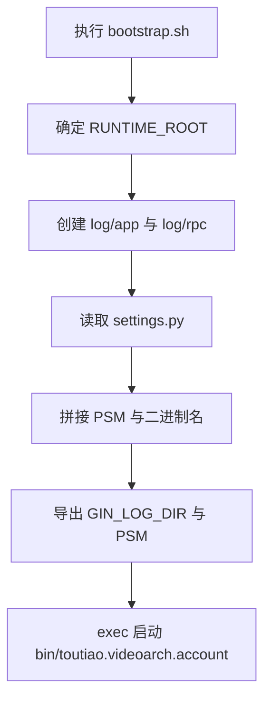

# Other — script

## script 模块

`script` 模块负责服务进程的启动编排。它不包含业务逻辑，也没有被代码图识别出内部调用、外部调用或执行流；它的职责集中在运行时目录初始化、读取部署元信息、组装启动参数，并最终通过 `exec` 启动二进制文件。

核心入口是 [script/bootstrap.sh](/Users/bytedance/videoarch/account/script/bootstrap.sh)，配置来源是 [script/settings.py](/Users/bytedance/videoarch/account/script/settings.py)。[script/pre_nginx.sh](/Users/bytedance/videoarch/account/script/pre_nginx.sh) 当前为空文件，保留给 nginx 启动前扩展使用。



### 启动入口：bootstrap.sh

`bootstrap.sh` 的典型调用形式是：

```bash
./script/bootstrap.sh /path/to/runtime/root 8080
```

第一个参数用于指定 `RUNTIME_ROOT`。如果未传入，则默认使用 `bootstrap.sh` 所在目录。第二个参数会赋给 `PORT`，并在非空时追加到最终启动参数中：

```bash
args="-psm=$SVC_NAME -conf-dir=$CONF_DIR -log-dir=$GIN_LOG_DIR"
if [ "X$PORT" != "X" ]; then
    args+=" -port=$PORT"
fi
```

最终脚本会执行：

```bash
exec $CURDIR/bin/${BinaryName} $args
```

其中当前配置下：

```text
SVC_NAME=toutiao.videoarch.account
BinaryName=toutiao.videoarch.account
```

因此脚本期望二进制文件位于：

```text
script/bin/toutiao.videoarch.account
```

### 运行时目录

脚本会根据 `RUNTIME_ROOT` 推导运行时目录：

```bash
RUNTIME_CONF_ROOT=$RUNTIME_ROOT/conf
RUNTIME_LOG_ROOT=$RUNTIME_ROOT/log
```

其中 `RUNTIME_CONF_ROOT` 当前只被赋值，没有继续参与启动参数。实际传给二进制的配置目录是：

```bash
CONF_DIR=$CURDIR/conf/
```

也就是 `script/conf/`。

日志目录会使用 `RUNTIME_LOG_ROOT`，并确保以下子目录存在：

```text
$RUNTIME_ROOT/log/app
$RUNTIME_ROOT/log/rpc
```

随后导出：

```bash
export GIN_LOG_DIR=$RUNTIME_LOG_ROOT
export PSM=$SVC_NAME
```

二进制进程会通过环境变量 `GIN_LOG_DIR` 获取日志根目录，通过 `PSM` 获取服务标识。

### settings.py 配置

`settings.py` 是启动脚本读取服务身份的唯一配置文件。当前内容为：

```python
PRODUCT="toutiao"
SUBSYS="videoarch"
MODULE="account"
APP_TYPE="binary"
```

`bootstrap.sh` 使用 Python 动态读取这些变量：

```bash
PRODUCT=$(cd $CURDIR; python -c "import settings; print (settings.PRODUCT)")
SUBSYS=$(cd $CURDIR; python -c "import settings; print (settings.SUBSYS)")
MODULE=$(cd $CURDIR; python -c "import settings; print (settings.MODULE)")
```

`PRODUCT`、`SUBSYS`、`MODULE` 三者共同组成服务名和二进制名：

```bash
SVC_NAME=${PRODUCT}.${SUBSYS}.${MODULE}
BinaryName=${PRODUCT}.${SUBSYS}.${MODULE}
```

如果三者任意一个为空，脚本会报错退出：

```text
Support PRODUCT SUBSYS MODULE PORT in settings.py
```

`settings.py` 中还保留了 nginx 相关配置说明：

```python
# REQUIRE_NGINX = True
# PRENGINX_SCRIPT = "pre_nginx.sh"
```

当前这两项被注释，因此 `bootstrap.sh` 读取 `settings.REQUIRE_NGINX` 时会失败，但 stderr 被重定向到 `/dev/null`，变量最终为空。这意味着默认不会进入需要 nginx 的端口分配分支。

### nginx 与 Mesh 相关逻辑

`bootstrap.sh` 包含以下兼容逻辑：

```bash
REQUIRE_NGINX=$(cd $CURDIR; python -c "import settings; print (settings.REQUIRE_NGINX)" 2>/dev/null)

if [ "$REQUIRE_HTTP_MESH" == "True" ]; then
    REQUIRE_NGINX=False
fi
```

这里的 `REQUIRE_HTTP_MESH` 不是在 `settings.py` 中读取的变量，而是依赖外部环境变量。如果运行环境设置了：

```bash
REQUIRE_HTTP_MESH=True
```

脚本会强制关闭 nginx 需求。

在主机网络模式下，脚本还会根据 `REQUIRE_NGINX` 设置服务端口和调试端口：

```bash
if [ "$IS_HOST_NETWORK" == "1" ]; then
    if [ "$REQUIRE_NGINX" == "True" ]; then
        export RUNTIME_SERVICE_PORT=$PORT1
        export RUNTIME_DEBUG_PORT=$PORT2
    else
        export RUNTIME_SERVICE_PORT=$PORT0
        export RUNTIME_DEBUG_PORT=$PORT1
    fi
fi
```

`IS_HOST_NETWORK`、`PORT0`、`PORT1`、`PORT2` 都需要由部署平台或外层启动环境提供。脚本本身不会解析或生成这些端口。

### pre_nginx.sh

`pre_nginx.sh` 当前为空。结合 `settings.py` 中注释掉的：

```python
# PRENGINX_SCRIPT = "pre_nginx.sh"
```

它更像是部署框架预留的扩展点，用于在 nginx 启动前执行自定义准备逻辑。当前模块没有启用该脚本，也没有任何代码直接调用它。

### 与代码库其他部分的连接

`script` 模块是服务进程和部署环境之间的连接层，而不是业务代码的一部分。它通过以下约定连接到其余系统：

- 二进制产物必须放在 `script/bin/${PRODUCT}.${SUBSYS}.${MODULE}`。
- 运行配置默认从 `script/conf/` 读取，并通过 `-conf-dir` 传给二进制。
- 日志根目录来自 `RUNTIME_ROOT/log`，并通过 `-log-dir` 和 `GIN_LOG_DIR` 同时传递。
- 服务标识通过 `-psm` 和 `PSM` 同时传递，当前为 `toutiao.videoarch.account`。
- 端口可以通过启动脚本第二个参数传入，也可以在主机网络模式下通过 `PORT0`、`PORT1`、`PORT2` 环境变量参与派生。

由于代码图没有识别出该模块的内部调用、外部调用或业务执行流，维护时应把它视为部署启动约定的一部分。修改 `PRODUCT`、`SUBSYS`、`MODULE` 会同时影响服务名、二进制名、`PSM` 和启动路径，通常需要同步检查构建产物名称、部署配置和监控标识。