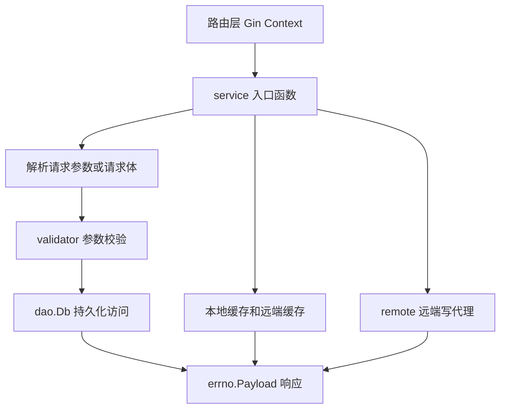

# Other — service

## 模块概览

`src/service` 是账号系统的业务入口层。它承接 Gin 路由传入的 `*gin.Context` 和业务 `context.Context`，把 HTTP 请求解析为 `dto` 对象，调用 `validator` 做参数校验，再通过 `dao.Db` 访问数据库，最终统一返回 `*errno.Payload`。

这个模块不是单一业务流程，而是一组账号域能力的 service 函数集合，覆盖账号、配置、域名、权限、实例、规则、类目 schema、BPM 审批回调、Wand 资产同步和缓存刷新等场景。



## 通用代码模式

大多数入口函数遵循同一结构：

1. 使用 `c.GetRawData()`、`c.BindQuery()`、`util.ParamString()`、`util.ParamInt64()` 或 `util.QueryString()` 获取请求数据。
2. 使用 `json.Unmarshal()` 反序列化请求体到 `dto` 类型。
3. 调用 `validator` 中的校验函数，例如 `ValidateCreateAccountRequest`、`ValidateMCreateConfigRequest`、`ValidateCreateDomainRequest`。
4. 调用 `dao.Db` 执行数据库操作。
5. 使用 `errno.OK(...)` 或 `errno.ErrorWithCode(...)` 返回统一响应。

典型写法如下：

```go
func CreateAccess(c *gin.Context, ctx context.Context) *errno.Payload {
    content, err := c.GetRawData()
    if err != nil {
        return errno.ErrorWithCode(errno.CodeGetDataErr, err)
    }

    access := &dto.Access{}
    if err = json.Unmarshal(content, access); err != nil {
        return errno.ErrorWithCode(errno.CodeParseDataErr, err)
    }

    if err = dao.Db.CreateAccess(ctx, access); err != nil {
        return errno.ErrorWithCode(errno.CodeDbErr, err)
    }
    return errno.OK(nil)
}
```

新增 service 入口时应保持这个返回约定，不要直接写 Gin response。

## 账号与配置

账号主流程在 `account.go` 和 `config.go` 中。

`CreateAccount` 创建账号并写入初始配置。它先判断当前 IDC 是否等于 `tcc.GetRemoteRegionInfo(ctx)`：如果命中远端写入区域，并且 `tcc.GetWriteSwitch(c)` 开启，则通过 `remote.CallRemoteCreateAccount` 代理写入；否则才解析 `dto.CreateAccountRequest`，调用 `validator.ValidateCreateAccountRequest`，再通过 `dao.Db.CreateAccount` 落库。

`UpdateAccountStatus`、`UpdateAccount`、`MCreateConfig`、`MUpdateConfig`、`DeleteConfig`、`MCopyConfig` 也有相同的远端写代理逻辑。远端 URL 来自 `tcc.GetRemoteSetting(ctx)`，为空时返回 `errno.ErrRemoteCallFailed`。

账号读取的核心函数是 `mgetAccountWithConfig`。它会同时返回账号和配置：

- 先尝试 `remote_cache.GetCacheInstance().MGetVideoAccount(ctx, req)` 读取 Redis。
- 缓存未命中时，根据请求类型和 `isAsyncRequest()` 决定是否抢锁刷新。
- 最终回源 `dao.Db.MGetVideoAccount`，再按 `accessKey` 分批调用 `dao.Db.MGetVideoConfigByKeys` 补齐配置。
- 回源成功后异步调用 `setAccountRedisCache` 写入 Redis。

对外读取入口包括：

- `MGetAccountWithConfig`
- `MGetAllAccountWithConfig`
- `GetAccountInfo`
- `PageGetAccount`
- `CountAccounts`
- `CountRegionSpacesV3`
- `MGetAccountV3`
- `GetAccountStorageBuckets`
- `GetAccountStorageBucket`

`MGetAccountWithConfig` 还有本地 `lruCache` 缓存层，由 `mGetAccountWithConfig0` 和 `mGetAccountWithConfig1` 封装。请求包含 `NoCache`，或请求头 `X-TT-From` 在 `tcc.PSMInAccountNoCacheWhiteList` 中时，会穿透本地缓存；账号查询还会继续通过 `skipCache(nocache)` 控制是否穿透 Redis。

## 配置读取与缓存失效

`MCreateConfig`、`MUpdateConfig` 和 `DeleteConfig` 修改配置后，会在 Redis 开关 `tcc.CheckRedisCacheSwitch()` 开启时调用 `remote_cache.GetCacheInstance().RemoveAccount(ctx, accessKey)` 清理账号配置缓存。

`GetConfig` 支持按 `access_key` 查询；如果没有传 `access_key`，会先用 `account_name` 查询账号，再拿账号的 `AccessKey` 查询配置。

`ListConfigsByCondition` 使用包级 `sync.Map` 缓存查询结果，缓存项类型为 `ListConfigCache`，过期时间来自 `tcc.GetCacheRefreshTime(ctx)`。

## 域名与域名关系

域名能力在 `domain.go` 和 `domain_auth.go` 中。

`CreateDomain` 解析 `dto.Domain`，通过 `validator.ValidateCreateDomainRequest` 校验后调用 `dao.Db.CreateDomain`。`GetDomain` 使用 `domainCache` 本地缓存；数据库异常但不是 `not found` 时，会尝试从过期缓存兜底。`not found` 会短暂缓存 `nil`，用于防止缓存穿透。

域名和账号关系由 `dto.DomainAccountRel` 表示：

- `CreateDomainAccountRel` 创建主关系，并按 `SyncRegions` 复制到其他 region。
- `ListDomainAccountRel` 通过 `listDomainAccountRel` 查询，优先读 `domainRelCache`。
- `DeleteDomainAccountRel` 按 query 参数 `id` 删除。
- `UpdateDomainAccountRel` 更新单条关系。
- `CopyDomainAccountRel` 按源 region 和目标 region 批量复制关系。

当 `ListDomainAccountRelRequest.NeedSubDomains` 为 true，且关系类型是 `dto.ScheduleDomain`，`listDomainAccountRel` 会从 `cdnScheduleDomainCache` 补充 `SubDomains`。

`ImageXDomainOnChange` 是消息消费侧调用的域名同步入口。`constant.EventAddDomain` 会确保域名存在并创建 image 类目的账号关系；`constant.EventDeleteDomain` 会查找并删除匹配关系。该函数被 RocketMQ handler 调用，而不是 HTTP 入口。

`domain_auth.go` 处理域名授权信息。`CreateDomainAuthInfo` 会校验空间存在、`TopAccountId` 匹配，并确认 storage 配置里的 bucket 与请求一致，然后创建 `dto.DomainAuth`。`UpdateDomainAuthStatus` 只接受状态 `0` 或 `1`。

## 权限、访问项、条件与实例

`access.go`、`condition.go` 和 `authority.go` 是薄 CRUD 层：

- `CreateAccess`、`DeleteAccess`、`GetAccess`
- `CreateCondition`、`DeleteCondition`、`GetCondition`
- `CreateAuthority`、`DeleteAuthority`、`UpdateAuthorityStatus`、`MGetAuthority`

`MGetAuthority` 根据请求中的 `Grantee` 选择查询路径：为空时调用 `dao.Db.MGetAuthorityByGrantor`，否则调用 `dao.Db.MGetAuthorityByGrantee`。结果会写入 `authorityCache`。

实例入口在 `instance.go`：

- `CreateInstance`
- `DeleteInstance`
- `UpdateInstance`
- `UpdateInstanceByInstanceID`
- `GetInstance`
- `ListInstances`

`GetInstance` 为兼容老数据，会先按 `TopAccountID` 查询账号；如果账号里有 `TopInstanceID`，会构造 `dto.Instance` 返回并写入 `instanceCache`。`ListInstances` 支持 `account_id`、`instance_configs`、`limit`、`offset` 查询，其中 `limit` 大于 100 会返回错误。

## 类目 Schema 与嵌入元数据

`account_category_schema.go` 管理账号类目 schema：

- `CreateAccountCategorySchema`
- `UpdateAccountCategorySchema`
- `DeleteAccountCategorySchema`
- `ListAccountCategorySchema`
- `GetAccountCategoryEmbeddedSchema`
- `GetDeccEmbeddedSchema`

`ListAccountCategorySchema` 默认从 `accountCategorySchemaCache` 读取；如果请求头命中 no-cache 白名单，则直接访问 `dao.Db.ListAccountCategorySchema`。

`GetAccountCategoryEmbeddedSchema` 查询 `dto.SchemaEmbeddedMetadata` 类型的 schema，并反序列化为 `dto.EmbeddedMetadataSchema`。当 `config.Conf.EnableEmbeddedMetadata` 为 false 时，它返回空 schema。若空间 schema 没有设置 `IgnoreGlobalConf`，函数会把 `tcc.GetMetadataBlackList()` 中的全局黑名单追加进去，并拼接更新 `SchemaVersion`。

## 规则与同步 IDC

规则能力分为旧版 `rule.go` 和新版 `rule_v2.go`。

旧版规则使用 `dto.VideoRule`：

- `CreateVideoRule`
- `UpdateRuleById`
- `UpdateRuleStatus`
- `PageGetRule`
- `MGetRule`
- `LoadAllSyncIDC`
- `LoadAllSyncIDCs`
- `MGetCategory`

`CreateVideoRule` 会把 `LocalIDC` 规整为 `util.GetRegion(rule.LocalIDC)`，默认状态为 `constant.StatusUnaudited`。`LoadAllSyncIDCs` 会把每条规则的 `SyncInfo` 解析为 `provider -> localIDC -> syncIDCs` 的映射，并缓存到 `ruleIDCSCache`。

新版规则使用 `dto.VideoRuleV2`：

- `CreateVideoRuleV2`
- `UpdateRuleByIdV2`
- `UpdateRuleStatusV2`
- `MGetRuleV2`
- `LoadAllSyncIDCsV2`

`CreateVideoRuleV2` 额外调用 `validator.ValidateRuleType(rule.Type)`。`LoadAllSyncIDCsV2` 使用 `ruleIDCSCacheV2` 这个带互斥锁的单值缓存，刷新逻辑会定期把缓存置空。

## BPM 入口

`bpm.go` 用于接收审批平台 payload，并转换为内部 DTO。

`BPMCreateDomainAccountRel` 会先检查域名是否存在。存在时只创建关系；不存在时构造 `dto.Domain`，把 `dto.DomainAccountRel` 放入 `AccountRels` 后一起创建。它同样支持 `SyncRegions` 复制关系。

`BPMCreateConfigs` 把 `BPMCreateConfigsWorkflow.BucketResp` 转换为 storage 模块的 `dto.VideoConfig` 列表，然后走 `validator.ValidateMCreateConfigRequest(ctx, req, true)` 和 `dao.Db.MCreateConfig`。

`BPMUpsertMetadataClean` 查询账号 `SchemaEmbeddedMetadata` 配置，存在则保留 `ID` 和 `Version` 更新，不存在则创建新的 `dto.AccountCategorySchema`。

`BPMMigrateDomainAccountRel` 从旧域名读取所有关系，必要时创建新域名，然后把关系复制到新域名下。遇到重复关系会跳过。

## 缓存初始化与刷新

`Init` 是 service 包初始化入口。它会：

- 创建账号查询 `lruCache`，刷新函数是 `RefreshCache`
- 调用 `initCache()` 初始化规则、权限、实例、域名关系、CDN 调度域名、类目 schema 等缓存
- 调用 `iamsdk.MustInitKms(constant.PSM)`

`initCache` 会启动多个后台 goroutine。每类缓存都有对应刷新函数：

- `refreshRule`
- `refreshAuthority`
- `refreshInstance`
- `refreshDomainRel`
- `refreshCDNScheduleDomainCache`
- `refreshAccountCategorySchema`

`RefreshCache` 专门刷新账号配置查询缓存。它会创建 cron span，做 `util.HardenCli.Allow` 限流，然后以 `isAsyncRequest()` 调用 `mgetAccountWithConfig`，让异步刷新路径使用 Redis 锁和指数退避。

## Wand 资产同步

`wand.go` 对接 Wand 资源迁移场景。

`GetAccountVodAssets` 根据 query 参数 `people` 查询账号负责人名下的账号，只返回 `Type` 为 `"space"` 或空字符串的账号。它读取账号 global 配置中的 `region`，通过 `getVodAssetUrl` 根据 `config.Conf.Wand.RegionVConsoleUrl` 拼出 VOD 控制台 URL，然后把资源编码成 Wand 需要的字符串格式。

`Asset.EncodeAsset` 的格式是：

```text
Product::AssetId::AssetUrl::AssetDesc
```

`EncodeStr` 会删除字段中的 `::` 和 `|`，避免破坏分隔格式。`DecodeAssets` 按 `::` 拆回 `Asset`。

`UpdateAccountVodAssets` 接收 `UpdateAssets`，逐条校验当前账号负责人是否等于 `from`，然后把 `UserName` 更新为 `to` 并调用 `dao.Db.UpdateAccount`。

## 测试组织

`base_test.go` 的 `TestMain` 初始化完整运行环境：

```go
ginex.Init()
config.InitConf()
tcc.SetDefaultValuesAndStartRefresh()
middleware.InitCircuitBreaker()
util.InitRateLimiter()
dao.InitDb()
remote_cache.Init()
Init()
```

单元测试混合了两类风格：

- 对薄 service 层做真实集成验证，例如 `Test_Access`、`Test_Condition`、`Test_Rule`、`Test_DomainAllMethod`。
- 使用 `gomonkey` patch 掉 `dao.Db`、`validator`、`tcc`、`remote` 依赖，覆盖远端写代理和错误分支，例如 `Test_CreateAccount`、`Test_MCreateConfig_Normal`、`TestBPMUpsertMetadataClean`。

修改 service 代码时，优先补充对应入口的请求解析、校验失败、DAO 失败、缓存命中或远端代理分支测试。