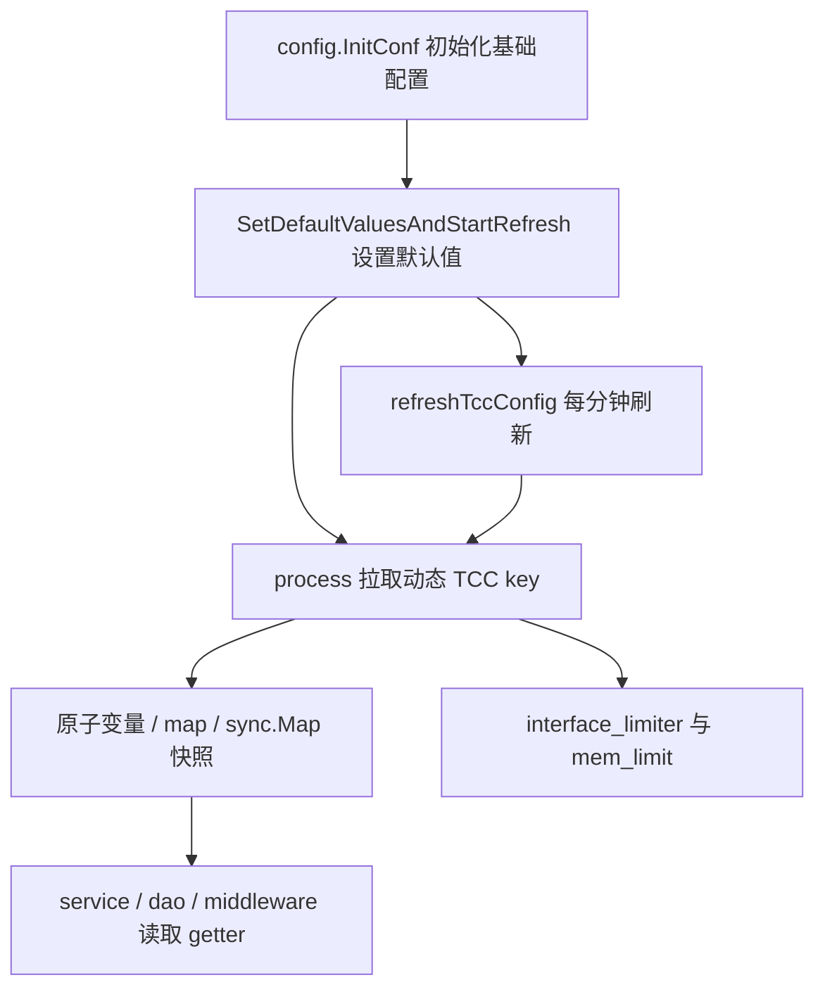

# Other — tcc

## 模块概览

`src/tcc` 是账号服务的 TCC 配置访问层。它把远端 TCC key 转换成代码内可直接使用的 Go 类型，并为部分高频配置维护进程内快照。业务层、DAO、middleware 不直接解析 TCC 字符串，而是通过这里的 getter 读取配置。

模块主要承担四类职责：

1. 初始化 `tccclient.ClientV2`：`GetTccSettingsClient()` 使用 `sync.Once` 创建全局 TCC client。
2. 启动动态配置刷新：`SetDefaultValuesAndStartRefresh()` 先加载本地默认值，再调用 `process()` 拉取 TCC，并启动 `refreshTccConfig()` 每分钟刷新。
3. 提供类型化 getter：例如 `GetACLConfigs()`、`GetCircuitBreakersConfigs()`、`GetWriteSwitch()`、`GetIdGeneratorConfig()`。
4. 维护热更新快照：Redis 缓存开关、TTL、重试次数、Account no-cache 白名单、metadata 黑名单、接口限流、内存限制等由刷新循环更新。



## 启动顺序

主流程在 `main.go` 中按以下顺序初始化：

1. `config.InitConf()`
2. `tcc.SetDefaultValuesAndStartRefresh()`
3. `rpc.Init()`
4. `remote_cache.Init()`
5. `dao.InitDb()`
6. `middleware.InitCircuitBreaker()`
7. `service.Init()`

这个顺序很重要：`remote_cache.Init()`、`dao.InitDb()`、`middleware.InitCircuitBreaker()` 和 `service.Init()` 都会读取 `tcc` 模块中的配置。`SetDefaultValuesAndStartRefresh()` 必须先执行，否则 Redis 缓存、DB 密码、DB retry、缓存大小、断路器等配置可能仍是零值或本地 fallback。

测试入口 `src/tcc/base_test.go` 也保持了同样的核心顺序：

```go
ginex.Init()
config.InitConf()
SetDefaultValuesAndStartRefresh()
```

## TCC client

`GetTccSettingsClient()` 是模块内所有 TCC 读取的入口：

```go
func GetTccSettingsClient() *tccclient.ClientV2
```

它使用 `sync.Once` 确保进程内只创建一个 `ClientV2`：

- `Auth = true`
- `Confspace = config.Conf.TccInfo.ConfigSpace`
- 首次读取超时为 `1 * time.Second`
- PSM 来自 `config.Conf.Meta.PSM`
- 初始化失败会 `panic`

`config.InitConf()` 自身也会读取 TCC 的 `"base"` key，并把远端 base 配置 merge 到本地 `config.Conf`。这属于 `config` 模块的基础配置加载；`src/tcc` 负责后续运行期配置读取和刷新。

## 配置读取模式

`tcc` 模块中有两种主要读取模式。

### 每次调用直接读 TCC

这些函数调用时会直接访问 TCC，解析失败或读取失败时回退到 `config.Conf` 或模块内默认值：

| 函数 | TCC key | 返回类型 | 失败回退 |
|---|---|---|---|
| `GetDBRetryTimes(ctx)` | `retry_times` | `int` | `config.Conf.RetryTimes` |
| `GetCacheRefreshTime(ctx)` | `cache_refresh_time` | `time.Duration` | `config.Conf.CacheRefreshTime` |
| `GetCacheSize(ctx)` | `cache_size` | `int` | `config.Conf.CacheSize` |
| `GetReadDBPassword(ctx)` | `r_db_password` | `string` | `""` |
| `GetWriteDBPassword(ctx)` | `w_db_password` | `string` | `""` |
| `GetACLConfigs(ctx)` | `acl` | `*config.ACL` | `&config.Conf.ACL` |
| `GetCircuitBreakersConfigs(ctx)` | `circuit_breakers` | `map[string]config.CircuitBreaker` | `config.Conf.CircuitBreakers` |
| `GetAdminUsers(ctx)` | `admin_user` | `map[string]bool` | `config.Conf.AdminUser` |
| `GetAllowList(ctx)` | `allow_list` | `map[string]bool` | `defaultAllowList` |
| `GetStorageConfigCheckWhitelist(ctx)` | `storage_config_check_whitelist` | `map[string]bool` | `storageConfigCheckWhitelist` |
| `CheckLocalCacheSwitch(ctx)` | `local_cache_switch` | `bool` | `true` |
| `GetIdGeneratorConfig(ctx)` | `id_gen_setting` | `config.IdGenerator` | `config.Conf.IdGenerator` |
| `GetWriteSwitch(ctx)` | `write_remote_setting` | `bool` | `config.Conf.WriteRemote.RemoteSwitch` |
| `GetRemoteSetting(ctx)` | `write_remote_setting` | `string` | `config.Conf.WriteRemote.InvokeSetting` |
| `GetRemoteRegionInfo(ctx)` | `write_remote_setting` | `string` | `config.Conf.WriteRemote.RegionInfo` |

`GetWriteSwitch()`、`GetRemoteSetting()`、`GetRemoteRegionInfo()` 都通过内部函数 `getWriteRemoteSetting(ctx)` 读取同一个 TCC key：`write_remote_setting`。解析逻辑由 `writeRemoteParser()` 完成，并使用 `GetWithParser()` 的 cache 参数在 TCC 失败时保留上一次成功值。

`GetIdGeneratorConfig()` 同样使用 `GetWithParser()` 和 `idGenParser()`。如果读取或 JSON 解析失败，并且没有可用 cache，则回退到 `config.Conf.IdGenerator`。

### 刷新循环维护进程内快照

`SetDefaultValuesAndStartRefresh()` 会先把本地配置写入内存快照，再调用 `process()` 拉取 TCC：

```go
SetDefaultAllowList(config.Conf.WhiteList)
SetStorageConfigCheckWhitelist(config.Conf.StorageConfigCheckWhitelist)
SetRedisCacheSwitch(config.Conf.RedisCache.Switch)
SetRedisCacheTtl(config.Conf.RedisCache.TTL)
SetRedisCacheRetryTimes(config.Conf.RedisCache.RetryTimes)
SetAccountNoCacheWhitelist(config.Conf.AccountNoCacheWhitelist)
```

随后 `process()` 拉取这些动态 key：

| TCC key | 更新目标 |
|---|---|
| `redis_cache_switch` | `SetRedisCacheSwitch()` |
| `redis_cache_ttl` | `SetRedisCacheTtl()` |
| `redis_cache_retry_times` | `SetRedisCacheRetryTimes()` |
| `account_nocache_whitelist` | `SetAccountNoCacheWhitelist()` |
| `metadata_clean_black_list` | `setMetadataBlackList()`，仅 `config.Conf.EnableEmbeddedMetadata` 为 true 时读取 |
| `interface_rate_limiter` | `interface_limiter.UpdateConfigFromTCC()` |
| `mem_limit_percent` | `mem_limit.ApplyFromPercent()` |

`refreshTccConfig()` 使用 `time.Tick(configUpdateInterval)` 周期执行，当前 `configUpdateInterval` 是 `time.Minute`。

## 关键配置组件

### Redis 远端缓存配置

`setting_redis_cache.go` 使用 `go.uber.org/atomic` 保存 Redis 缓存相关快照：

```go
func CheckRedisCacheSwitch() bool
func SetRedisCacheSwitch(val bool)

func SetRedisCacheTtl(duration time.Duration)
func GetRedisCacheTtl() time.Duration

func SetRedisCacheRetryTimes(retryTimes int)
func GetRedisCacheRetryTimes() int
```

这些值会影响：

- `remote_cache.Init()`：开关打开时初始化 Redis remote cache。
- `remote_cache.GetCacheInstance()`：创建 `go-remote-cache` 时设置默认 TTL 和 retry 次数。
- `service.mgetAccountWithConfig()`：用 `CheckRedisCacheSwitch()` 决定是否查询 Redis。
- config 写路径：`MCreateConfig()`、`MUpdateConfig()`、`DeleteConfig()` 在 Redis 开关打开时清理缓存。

### Account no-cache 白名单

`setting_account_nocache_whitelist.go` 使用 `sync.Map` 保存白名单：

```go
func PSMInAccountNoCacheWhiteList(psm string) bool
func SetAccountNoCacheWhitelist(whitelist map[string]bool)
```

服务层通过请求头 `X-TT-From` 判断调用方 PSM 是否需要跳过缓存：

- `service.accountNocache()`
- `service.nocache()`
- `service/instance.go` 中实例查询路径

注意：`SetAccountNoCacheWhitelist()` 当前只对传入 key 执行 `Store()`，不会清理旧 key。TCC 中删除某个 PSM 后，进程内旧值不会自动消失，除非进程重启或实现显式清理。

### 写权限 allow list

`setting_allowlist.go` 提供：

```go
func SetDefaultAllowList(allowList map[string]bool)
func GetAllowList(ctx context.Context) map[string]bool
```

`middleware.Filter()` 在非 GET 请求中读取 `GetAllowList(c)[psm]`。如果调用方 PSM 不在 allow list 中，请求会返回 `errno.ErrNoWriteAuth`。

### 存储配置校验豁免白名单

`setting_check_storage_config_whitelist.go` 提供：

```go
func SetStorageConfigCheckWhitelist(whitelist map[string]bool)
func GetStorageConfigCheckWhitelist(ctx context.Context) map[string]bool
```

`service.MCreateConfig()` 和 `service.MUpdateConfig()` 会读取请求头 `X-TT-From`，并把白名单结果传入 validator：

```go
ignoreCheckStorageConfig := tcc.GetStorageConfigCheckWhitelist(ctx)[psm]
validator.ValidateMCreateConfigRequest(ctx, req, ignoreCheckStorageConfig)
```

### ACL 配置

`GetACLConfigs(ctx)` 读取 `acl` key 并解析成 `config.ACL`。`middleware.NewACL()` 在初始化时调用它：

```go
ACLConfig = tcc.GetACLConfigs(context.Background())
```

`config.ACL` 内嵌 `DoubleSwitch`，并包含 `Pairs map[string]string`。中间件通过 Basic Auth 的 username/password 与 `Pairs` 比对。ACL 是否启用由 `ACLConfig.IsEnabled()` 决定，该方法会同时看本地 `Enable` 和 etcd switch。

### Circuit breaker 配置

`GetCircuitBreakersConfigs(ctx)` 读取 `circuit_breakers`，返回 `map[string]config.CircuitBreaker`。`middleware.InitCircuitBreaker()` 会遍历配置并为启用项创建 `gobreaker.CircuitBreaker`。

`CircuitBreakerConfig` 是 `config.CircuitBreaker` 的 TCC JSON 适配类型。它自定义 `UnmarshalJSON()`，把 JSON 中的字符串字段解析成 `time.Duration`：

```json
{
  "close_interval": "10s",
  "open_timeout": "10s"
}
```

解析后会写入：

- `CloseInterval`
- `OpenTimeout`

其他字段按 `config.CircuitBreaker` 的 JSON tag 直接解析，例如 `close_failures`、`half_open_successes`。

### 跨地域写 remote setting

`setting_remote.go` 读取 `write_remote_setting`，解析成 `config.WriteRemote`：

```go
type WriteRemote struct {
    RemoteSwitch  bool   `json:"remote_switch"`
    InvokeSetting string `json:"invoke_setting"`
    RegionInfo    string `json:"region_info"`
}
```

业务写路径会先比较当前 IDC 所属 region 与 `GetRemoteRegionInfo(ctx)`：

```go
if util.GetRegion(env.IDC()) == tcc.GetRemoteRegionInfo(ctx) {
    if tcc.GetWriteSwitch(c) {
        setting := tcc.GetRemoteSetting(ctx)
        // 调用 remote 服务
    }
}
```

这影响账号和配置的创建、更新、删除等写操作。典型调用点包括 `service.CreateAccount()`、`service.UpdateAccount()`、`service.MCreateConfig()`、`service.MUpdateConfig()`。

### DB 与本地缓存配置

`dao.InitDb()` 使用：

- `GetTccSettingsClient()`：传给 `mysqldriver.InitTCCClient()`
- `GetWriteDBPassword()`：设置写库密码
- `GetReadDBPassword()`：设置读库密码
- `GetDBRetryTimes()`：设置 `DbHandler.retryTimes`

`service.Init()` 使用：

- `GetCacheRefreshTime()`：设置本地 LRU cache 刷新周期
- `GetCacheSize()`：设置本地 LRU cache 容量

`service.ListConfigsByCondition()` 也用 `GetCacheRefreshTime(ctx)` 计算 `ListConfigCache.ExpireAt`。

### 管理员配置

`GetAdminUsers(ctx)` 读取 `admin_user` key，返回 `map[string]bool`。`service.IsAdmin()` 直接用用户名查询：

```go
return errno.OK(tcc.GetAdminUsers(ctx)[userName])
```

### Embedded metadata 黑名单

`MetadataBlackList` 定义在 `setting_metadata_blacklist.go`：

```go
type MetadataBlackList struct {
    Version   int      `json:"version"`
    BlackList []string `json:"black_list"`
}
```

当 `config.Conf.EnableEmbeddedMetadata` 为 true 时，刷新循环读取 `metadata_clean_black_list` 并调用 `setMetadataBlackList()` 更新全局变量。`service.GetAccountCategoryEmbeddedSchema()` 会读取 `GetMetadataBlackList()`，把全局 metadata 黑名单 merge 到空间级 schema 中，并把 version 拼到 `SchemaVersion`。

当前 `metadataBlackList` 是普通全局变量，不是 atomic 或锁保护结构；读写发生在刷新 goroutine 和请求 goroutine 之间。修改这里时需要特别注意并发安全。

### ID Generator 配置

`GetIdGeneratorConfig(ctx)` 读取 `id_gen_setting`，解析成 `config.IdGenerator`：

```go
type IdGenerator struct {
    Switch                       bool             `json:"switch"`
    Region                       string           `json:"region"`
    TableSupportSetting          map[string]bool  `json:"table_support_setting"`
    TableRemainIdRemindThreshold map[string]int64 `json:"table_remain_id_remind_threshold"`
}
```

`util.GenId()` 使用该配置决定某张表是否启用 ID 生成器、使用哪个 region，以及剩余 ID 阈值告警。

## 错误处理与 fallback 约定

这个模块通常不把 TCC 读取错误向上传递，而是在本层记录日志并返回 fallback：

- 基础数值配置解析失败时回退 `config.Conf`。
- JSON 配置解析失败时回退 `config.Conf` 或上一次 cache。
- Redis 缓存动态配置在 `process()` 中解析失败会让 `success = false`。
- `SetDefaultValuesAndStartRefresh()` 首次调用 `process()` 如果返回 false，会直接 `panic("can't reach tcc or parse tcc config error")`。
- `mem_limit_percent` 是可选项，读取失败或应用失败只记录日志，不阻塞服务启动。
- `interface_rate_limiter` 读取失败不阻塞；JSON 解析或更新失败会让 `process()` 返回 false。

新增配置时需要先判断它是否应该影响启动成功。如果是服务启动必需配置，应在首次 `process()` 失败时返回 false；如果是可选优化项，应像 `mem_limit_percent` 一样只记录日志。

## 与代码库其他模块的关系

`tcc` 模块没有自己的 HTTP 路由，也不是业务执行流入口。调用图中主要表现为其他模块读取它的 getter：

- `middleware.Filter()` 读取 `GetAllowList()` 控制写权限。
- `middleware.NewACL()` 读取 `GetACLConfigs()` 初始化 ACL。
- `middleware.InitCircuitBreaker()` 读取 `GetCircuitBreakersConfigs()` 初始化断路器。
- `dao.InitDb()` 读取 DB 密码、DB retry，并把 TCC client 注入 mysql driver。
- `remote_cache.Init()` 和 `remote_cache.GetCacheInstance()` 读取 Redis cache 开关、TTL、retry。
- `service.Init()` 读取本地缓存大小与刷新周期。
- `service` 写路径读取 remote setting 决定是否转发到远端服务。
- `service.IsAdmin()` 读取 admin user。
- `util.GenId()` 读取 ID generator 配置。
- `interface_limiter` 和 `mem_limit` 由 `process()` 主动推送更新。

从 GitNexus 的执行流看，`src/tcc` 本身没有独立业务流程；它作为配置依赖参与服务初始化、账号查询、配置写入、远端缓存、ACL、限流等流程。

## 添加新 TCC 配置的建议模式

新增配置通常按以下步骤实现：

1. 在对应文件中定义 TCC key 常量。
2. 明确读取模式：每次直接读 TCC，还是由 `process()` 刷新到内存快照。
3. 解析成现有 `config` 类型或新增明确结构体。
4. 读取失败时提供明确 fallback，优先回退 `config.Conf`。
5. 如果配置会被高频请求读取，使用 `atomic.Value`、`go.uber.org/atomic`、`sync.Map` 或带锁结构维护快照。
6. 在 `SetDefaultValuesAndStartRefresh()` 中设置本地默认值，避免 TCC 首次失败时出现零值。
7. 在 `process()` 中拉取远端值，并决定失败是否影响启动。
8. 增加测试覆盖解析、fallback 和 setter/getter 行为。

已有代码中可以参考：

- 简单数值配置：`GetDBRetryTimes()`、`GetCacheSize()`
- duration 字符串解析：`GetCacheRefreshTime()`、`CircuitBreakerConfig.UnmarshalJSON()`
- JSON map 配置：`GetAllowList()`、`GetStorageConfigCheckWhitelist()`
- 热更新原子值：`setting_redis_cache.go`
- `GetWithParser()` 缓存解析：`setting_remote.go`、`id_gen.go`

## 贡献时需要注意的边界

- `GetTccSettingsClient()` 依赖 `config.Conf`，不要在 `config.InitConf()` 之前调用。
- `SetDefaultValuesAndStartRefresh()` 会启动后台 goroutine，测试中重复调用可能产生多个刷新循环。
- `accountNoCacheWhitelist` 当前不会删除旧 key；如果业务需要 TCC 删除立即生效，需要调整 `SetAccountNoCacheWhitelist()` 的替换语义。
- `metadataBlackList` 当前不是并发安全结构；如果扩大使用范围，应改成锁或 atomic 快照。
- `GetAllowList()` 和 `GetStorageConfigCheckWhitelist()` 每次调用都会读 TCC，适合低频或中频路径；如果放到高频路径，需要评估 TCC client cache 行为和延迟。
- `CircuitBreakerConfig.UnmarshalJSON()` 要求 `close_interval` 和 `open_timeout` 是 Go duration 字符串，例如 `"10s"`、`"1m"`，不能是裸数字。