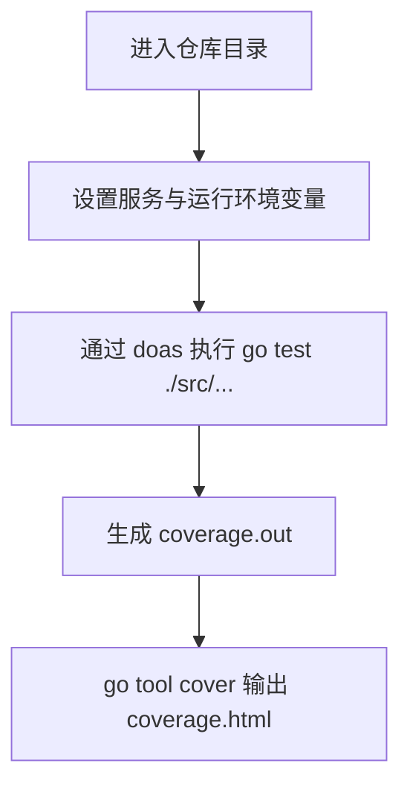

# Other — test.sh

## `test.sh`

`test.sh` 是仓库根目录下的测试入口脚本，用于在一组固定运行环境变量下执行 `./src/...` 的 Go 单元测试，并生成覆盖率报告。

该脚本不定义函数，也不被代码中的其他模块调用。它的作用是作为开发者或 CI 手动触发的测试辅助脚本，把服务运行所需的环境变量、`go test` 参数和覆盖率 HTML 生成步骤集中到一个文件里。

## 执行流程



## 环境变量

脚本在运行测试前导出以下变量：

```sh
export PSM=toutiao.videoarch.account
export GIN_LOG_DIR=/Users/bytedance/go/src/code.byted.org/videoarch/account/output/
export GIN_CONF_DIR=$(pwd)/conf
export GIN_MODE=release
export RUNTIME_IDC_NAME=boe
export TCE_ENV=ut
export CGO_ENABLED=1
export CI_REPO_NAME=toutiao.videoarch.account
```

这些变量用于让测试进程在接近服务运行时的上下文中启动：

- `PSM`：服务标识，当前固定为 `toutiao.videoarch.account`。`doas -p ${PSM}` 会使用该值作为执行上下文。
- `GIN_LOG_DIR`：日志输出目录。当前是开发机上的绝对路径，测试中依赖日志目录存在时需要注意本地路径是否有效。
- `GIN_CONF_DIR`：配置目录，使用 `$(pwd)/conf`，因此脚本应从仓库根目录执行。
- `GIN_MODE`：Gin 运行模式，固定为 `release`。
- `RUNTIME_IDC_NAME`：运行 IDC 名称，固定为 `boe`。
- `TCE_ENV`：运行环境，固定为 `ut`，表示单元测试环境。
- `CGO_ENABLED`：启用 CGO，适用于测试依赖 CGO 的包或底层库。
- `CI_REPO_NAME`：CI 仓库名，固定为 `toutiao.videoarch.account`。

## 测试命令

核心测试命令是：

```sh
doas -p ${PSM} go test -gcflags="all=-l -N" -v -cover -coverprofile coverage.out ./src/...
```

参数含义：

- `doas -p ${PSM}`：在指定 `PSM` 上下文中执行测试命令。
- `go test ./src/...`：递归测试 `src` 目录下的所有 Go package。
- `-v`：输出详细测试日志。
- `-cover`：启用覆盖率统计。
- `-coverprofile coverage.out`：将覆盖率数据写入 `coverage.out`。
- `-gcflags="all=-l -N"`：对所有包关闭内联和优化，常用于调试场景，使断点和堆栈更稳定。

测试完成后，脚本会生成 HTML 覆盖率报告：

```sh
go tool cover -html=coverage.out -o coverage.html
```

输出文件：

- `coverage.out`：Go 覆盖率原始数据。
- `coverage.html`：可在浏览器中查看的覆盖率报告。

## 与代码库的关系

`test.sh` 不参与业务运行时调用链，也没有内部函数、外部函数调用或被其他模块调用的静态关系。它与代码库的连接主要体现在两个方面：

1. 运行范围固定为 `./src/...`，因此只测试 `src` 目录下的 Go 包。
2. 测试进程会读取仓库根目录下的 `conf` 配置目录，因为 `GIN_CONF_DIR` 被设置为 `$(pwd)/conf`。

这意味着脚本更像是仓库级测试适配层，而不是业务模块。它把本地测试所需的服务环境封装起来，避免开发者每次手动设置环境变量。

## 使用方式

应在仓库根目录执行：

```sh
sh test.sh
```

执行后查看覆盖率：

```sh
open coverage.html
```

如果从非根目录执行，`GIN_CONF_DIR=$(pwd)/conf` 会指向错误位置，可能导致测试加载不到配置。

## 注意事项

`GIN_LOG_DIR` 当前写死为 `/Users/bytedance/go/src/code.byted.org/videoarch/account/output/`，在其他机器或不同工作区路径下可能不存在。若测试依赖日志目录可写，需要先创建目录或调整脚本。

`doas` 是脚本运行的前置依赖。如果本地没有 `doas`，或当前用户没有对应 `PSM` 的执行权限，测试会在进入 `go test` 前失败。

`CGO_ENABLED=1` 会使测试依赖本机 C 编译环境。缺少 Xcode Command Line Tools、系统库或 CGO 依赖时，编译阶段可能失败。

`-gcflags="all=-l -N"` 会降低编译优化并影响测试执行性能。它适合调试和可观测性更强的测试场景，但如果只需要最快速度的覆盖率统计，可以考虑在单独脚本中移除该参数。