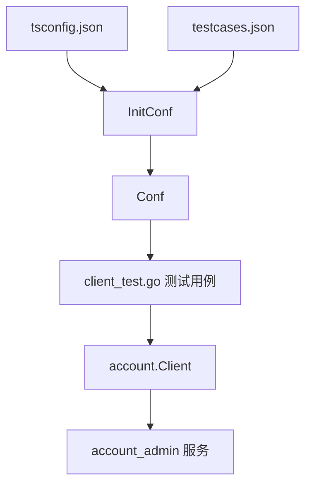

# Other — test

## test 模块

`test` 模块是 `account-sdk/client` 的集成测试与手工验证集合，Go 包名为 `testconfig`。它不实现业务逻辑，而是通过真实的 `account.Client` 调用账号服务 RPC / HTTP 能力，验证账号查询、配置读写、状态更新、缓存一致性、跨区域配置复制以及 storage bucket 约束等行为。

该模块依赖外部测试环境和测试数据，主要入口文件包括：

- `client_test.go`：集成测试主体，直接调用 `account.Client` 的各类方法。
- `config_test.go`：测试配置加载逻辑，读取 `tsconfig.json` 和测试用例 JSON。
- `model_test.go`：测试用例 JSON 的结构定义。
- `iface_test.http`：HTTP 接口的手工调试请求。
- `tsconfig.json`：测试环境、目标服务地址和用例文件路径配置。

## 模块定位

该模块面向 SDK 客户端行为验证，测试对象是 `code.byted.org/videoarch/account-sdk/client` 包暴露的方法，例如：

- `Create`
- `MGetAccount`
- `PageGetAccount`
- `SearchAccounts`
- `ListTopAccountIDs`
- `GetAccountByName`
- `GetAccountByID`
- `GetAccount`
- `GetConfig`
- `GetConfigByName`
- `GetConfigByNameAndRegion`
- `UpdateAccount`
- `UpdateAccountStatus`
- `MCreateConfig`
- `MUpdateConfig`
- `DeleteConfig`
- `MCopyConfig`
- `GetRule`

这些测试多数是集成测试，不是纯单元测试。它们会连接真实或 BOE 环境服务，因此测试结果依赖：

- `account_admin` 服务可用性
- 目标测试环境地址
- 远端测试数据状态
- `testcases.json` 内容
- 指定账号、AccessKey、bucket 等资源是否仍存在

## 配置加载

`config_test.go` 提供全局配置对象：

```go
var Conf *Config
```

`Config` 保存测试运行所需的环境信息：

```go
type Config struct {
	PSM          string
	ServerAddr   string
	ServerRegion string
	TestCases    *TestCaseConfig
}
```

`InitConf()` 的职责是从 `tsconfig.json` 加载运行配置：

1. 使用 `viper.SetConfigFile("./tsconfig.json")` 指定配置文件。
2. 调用 `viper.ReadInConfig()` 读取配置。
3. 根据 `target_server` 从 `servers` 中选择目标服务。
4. 设置 `Conf.PSM`、`Conf.ServerAddr`、`Conf.ServerRegion`。
5. 读取 `test_cases_file` 指向的 JSON 文件。
6. 将测试用例反序列化到 `Conf.TestCases`。

当前 `client_test.go` 的 `init()` 中没有调用 `InitConf()`，相关代码被注释：

```go
// InitConf()
// cli = account.NewClient(Conf.PSM, account.WithTestAddr(Conf.ServerAddr))
```

因此，依赖 `Conf` 的测试在运行前需要确保 `InitConf()` 已被调用，或者由外部测试初始化流程完成配置注入。否则访问 `Conf.TestCases`、`Conf.PSM`、`Conf.ServerAddr` 时会出现空指针问题。

当前默认客户端初始化为：

```go
cli = account.NewClient("toutiao.videoarch.account_admin", account.WithAsyncUpdateCache())
```

这意味着默认测试客户端使用固定 PSM，并启用异步缓存更新。

## 测试用例模型

`model_test.go` 定义了测试用例 JSON 的结构。顶层结构为：

```go
type TestCaseConfig struct {
	Rpcs Rpc
}
```

`Rpc` 按接口类型组织测试用例：

```go
type Rpc struct {
	SearchAccountsCases      []SearchAccountsCase
	PageGetAccountCases      []PageGetAccountCase
	SearchTopAccountIdsCases []SearchTopAccountIdsCase
	GetConfigCases           []GetConfigCase
	MGetAccountCases         []MGetAccountCase
	UpdateAccountCases       []UpdateAccountCase
	UpdateAccountStatusCases []UpdateAccountStatusCases
	MCreateConfigCases       []MCreateConfigCase
}
```

每个测试用例通常由两部分组成：

- `Inputs`：传给 SDK 方法的请求参数。
- `Expects`：期望返回结果。

例如 `SearchAccountsCase`：

```go
type SearchAccountsCase struct {
	Inputs  account.PageGetParam
	Expects account.PageGetResponse
}
```

这种结构使 `client_test.go` 中的测试可以通过循环驱动多组用例：

```go
for _, testCase := range Conf.TestCases.Rpcs.SearchAccountsCases {
	req := &testCase.Inputs
	resp, err := cli.SearchAccounts(ctx, req)
	assert.Nil(t, err)
	assert.Equal(t, &testCase.Expects.PageGetInfo, resp)
}
```

## 运行时结构



该图只描述配置驱动型测试路径。部分测试绕过 `Conf`，直接使用硬编码 PSM、测试地址、AccessKey 或账号名。

## 客户端初始化

`client_test.go` 中定义了共享变量：

```go
var (
	cli    *account.Client
	ctx    = context.TODO()
	testak = "6b796227086646e99b32c371c6ccb428"
)
```

`cli` 是大部分测试共享的 SDK 客户端。`ctx` 使用 `context.TODO()`，说明这些测试没有细分超时或取消策略。

模块还定义了两个默认配置对象：

```go
defaultConfig = account.Config{
	Module: account.ModuleGlobal,
	CKey:   "global_key",
	CValue: "global_value",
}

uploadConfig = account.Config{
	Module: account.ModuleUpload,
	CKey:   "meta",
	CValue: "1",
}
```

它们主要被 `TestCreate` 用于创建账号时携带初始配置。

## 账号相关测试

### 创建账号

`TestCreate` 构造 `account.CreateParam` 并调用 `Create`：

```go
req := &account.CreateParam{
	AccountName:   "lhb_test_t4",
	Description:   "this is client test",
	Extra:         "",
	Configs:       []account.Config{defaultConfig, uploadConfig},
	TopAccountID:  1000,
	TopInstanceID: "Instance100",
}
```

该测试使用带测试地址的临时客户端：

```go
c := account.NewClient("toutiao.videoarch.account_admin", account.WithTestAddr(Conf.ServerAddr))
```

创建成功后，测试会调用 `cli.MGetAccount` 获取账号信息并打印结果。这里存在一个细节：创建使用的是临时客户端 `c`，查询使用的是全局客户端 `cli`，两者可能连接不同环境。

### 分页查询账号

`TestPageGetAccount` 使用 `Conf.TestCases.Rpcs.PageGetAccountCases` 驱动测试：

```go
resp, err := cli.PageGetAccount(ctx, req)
assert.Nil(t, err)
assert.Equal(t, &testCase.Expects.PageGetInfo, resp)
```

该测试验证旧版分页查询接口返回值是否与用例中的 `PageGetInfo` 一致。

### 批量获取账号

`TestMGetAccount` 调用：

```go
resp, err := cli.MGetAccount(ctx, req)
```

并将返回的 `[]account.AccountInfo` 与期望值比较。

### 按名称、ID、AccessKey 获取账号

`TestGetAccount` 先调用 `MGetAccount` 获取账号列表，然后对每个账号分别验证：

- `GetAccountByName(ctx, v.AccountName)`
- `GetAccountByID(ctx, v.ID)`
- `GetAccount(ctx, v.AccessKey)`

同时它创建了一个不带缓存选项的客户端：

```go
noCachecli := account.NewClient("toutiao.videoarch.account_admin")
```

测试会比较缓存客户端与非缓存客户端的查询结果：

```go
noCacheAcct, err := noCachecli.GetAccountByName(ctx, v.AccountName)
assert.Equal(t, acct, noCacheAcct)
```

该测试主要用于验证缓存路径和直接查询路径的一致性。

## 配置相关测试

### 获取配置

`TestGetConfig` 先用 `MGetAccount` 拉取包含配置的账号信息：

```go
infos, err := cli.MGetAccount(ctx, &account.MGetParam{Region: "all"})
```

随后针对每个账号比较缓存客户端与非缓存客户端在以下方法上的结果：

- `GetConfigByName(ctx, v.AccountName, "upload")`
- `GetConfig(ctx, v.AccessKey, "upload")`
- `GetConfigByNameAndRegion(ctx, v.AccountName, "upload", "cn")`

该测试关注配置查询在不同索引方式和缓存模式下的一致性。

### 按名称和区域获取配置

`TestGetConfigByNameAndRegion` 直接调用：

```go
m, err := cli.GetConfigByNameAndRegion(ctx, "lhb_test_t1", account.ModuleUpload, account.R_ALL)
```

该测试依赖硬编码账号名和区域常量，适合手工验证指定账号配置。

### 未命中配置测试

`TestNotFound` 对同一个 AccessKey 和 module 连续调用两次：

```go
c, err := cli.GetConfig(ctx, testak, account.ModuleUpload)
c, err = cli.GetConfig(ctx, testak, account.ModuleUpload)
```

这类测试通常用于观察缓存未命中、空配置或重复读取行为。

### 批量创建与更新配置

`TestMCreateConfig` 依赖 `Conf.TestCases.Rpcs.MCreateConfigCases`，并要求正好 4 条用例：

1. 调用 `MCreateConfig` 插入配置。
2. 调用 `GetConfig` 验证插入结果。
3. 调用 `MUpdateConfig` 更新配置。
4. 再次调用 `GetConfig` 验证更新结果。

验证逻辑只比较期望 map 中出现的 key：

```go
for k, v := range testCase2.Expects {
	assert.Equal(t, v, configs[k])
}
```

这意味着远端返回额外配置项不会导致测试失败。

### 删除配置

`TestDeleteConfig` 当前函数开头直接 `return`：

```go
func TestDeleteConfig(t *testing.T) {
	return
	err := cli.DeleteConfig(ctx, 7)
	assert.Nil(t, err)
}
```

因此该测试默认不会执行删除逻辑。若移除 `return`，它会删除 ID 为 `7` 的配置，风险较高，需要确认目标环境数据。

## 账号更新测试

### 更新账号信息

`TestUpdateAccount` 要求 `UpdateAccountCases` 中必须有 3 条用例：

1. 更新账号。
2. 查询并验证更新结果。
3. 恢复原始数据。

测试中通过 `UpdateAccount` 执行修改：

```go
err := cli.UpdateAccount(ctx, req)
```

验证时通过 `SearchAccounts` 按 `AccessKey` 查询：

```go
resp2, err2 := cli.SearchAccounts(ctx, &account.PageGetParam{
	MGetParam: account.MGetParam{AccessKey: req2.AccessKey},
})
```

由于 `UpdatedAt` 是服务端生成字段，测试会将期望值中的 `UpdatedAt` 替换为实际返回值后再比较：

```go
testCase2.Expects.PageGetInfo.AccountInfos[0].UpdatedAt = resp2.AccountInfos[0].UpdatedAt
```

### 更新账号状态

`TestUpdateAccountStatus` 与 `TestUpdateAccount` 模式相同，也要求 3 条用例：

1. 调用 `UpdateAccountStatus` 修改状态。
2. 查询并验证状态。
3. 调用 `UpdateAccountStatus` 恢复状态。

核心调用为：

```go
err := cli.UpdateAccountStatus(ctx, req.AccessKey, req.Status)
```

这两个测试都会修改远端数据，因此测试用例必须包含恢复步骤，否则会污染共享测试环境。

## storage 配置约束测试

`TestMCreateStorageConfigConstraint` 专门验证 storage bucket 配置的跨 TopAccount 约束。测试注释中描述了核心规则：

1. bucket 如果有 owner，则不允许被跨 TopAccount 的其他空间使用。
2. owner 为空或 owner 不存在时，如果 bucket 已经被某个空间使用，则不允许被跨 TopAccount 的其他空间使用。

该测试围绕账号 `dh-test` 和固定 AccessKey：

```go
AccessKey:   "c0bb4072c0644946b8aca9ad1af5c193"
AccountName: "dh-test"
Region:      "boe"
Module:      "storage"
```

它依次尝试创建不同 key 到 bucket 的映射，并断言是否允许：

- 同 owner 空间：允许。
- 同 TopAccount 下其他空间：允许。
- 不同 TopAccount：拒绝。
- 无 owner 且未被使用：允许。
- 无效 owner 且未被使用：允许。
- 已配置到当前空间：允许。
- 已配置到同 TopAccount 空间：允许。
- 已配置到不同 TopAccount 空间：拒绝。

测试结束后会通过 `MGetAccount` 查出本次创建的 storage 配置，并调用 `DeleteConfig` 清理 `k1` 到 `k8`：

```go
deleteKeys := map[string]string{
	"k1": "", "k2": "", "k3": "", "k4": "",
	"k5": "", "k6": "", "k7": "", "k8": "",
}
```

这个测试会真实写入和删除远端配置，适合在可控 BOE 数据集上运行，不适合随意对生产环境执行。

## 跨区域配置复制

`TestMCopyConfig` 构造 `account.CopyConfigParam`：

```go
params := &account.CopyConfigParam{
	AccessKey:     "3413ace7e2a9a235a9d5807ad78d9bac",
	Modules:       []account.Module{"openapi"},
	SourceRegion:  "cn",
	TargetRegions: []string{"alisg", "maliva"},
}
```

它使用带固定测试地址的客户端：

```go
cli := account.NewClient(Conf.PSM, account.WithTestAddr("10.129.130.91:9474"))
```

然后调用：

```go
err := cli.MCopyConfig(context.Background(), params)
```

该测试会把指定 AccessKey 的 `openapi` 配置从 `cn` 复制到 `alisg` 和 `maliva`。运行前需要确认目标区域数据是否可以被覆盖或更新。

## V2 查询测试

### 搜索账号

`TestSearchAccounts` 遍历 `SearchAccountsCases`：

```go
resp, err := cli.SearchAccounts(ctx, req)
assert.Equal(t, &testCase.Expects.PageGetInfo, resp)
```

它验证新版搜索接口的分页结果。

### 搜索 TopAccount ID

`TestSearchTopAccountIds` 遍历 `SearchTopAccountIdsCases`：

```go
resp, err := cli.ListTopAccountIDs(ctx, req)
assert.Equal(t, &testCase.Expects.SearchTopAccountIdsInfo, resp)
```

该测试验证根据查询条件列出 TopAccount ID 的接口行为。

## 缓存一致性测试

`TestMGetAccountCache` 创建连接 BOE 地址的客户端：

```go
boeCli := account.NewClient(Conf.PSM, account.WithTestAddr("10.225.80.90:9422"))
```

然后组合遍历：

- `accountNames`
- `modules`
- `regions`

每组参数调用两次 `MGetAccount`：

```go
resp, err := boeCli.MGetAccount(ctx, &params)
respBoe, errBoe := boeCli.MGetAccount(ctx, &params)
assert.Equal(t, &respBoe, &resp)
```

该测试主要验证相同查询条件下重复请求的结果一致性，间接覆盖客户端缓存行为。当前模块列表包含：

```go
[]string{"tasks", "storage", "transcode", "upload", "global", "play", "openapi", "picture", "access", ""}
```

区域列表包含：

```go
[]string{"boe", "cn", "alisg", "maliva", ""}
```

## 手工调试测试

`TestSy` 和 `TestGetRule` 更接近临时排查代码。

`TestSy` 中保留了创建账号和创建 storage 配置的注释代码，实际执行部分是通过 BOE 客户端调用 `GetAccount`：

```go
res, err := boeCli.GetAccount(ctx, "3b5971da0535489fae95622b7e6e6e9c")
spew.Dump(res)
spew.Dump(err)
```

`TestGetRule` 调用：

```go
rules, _ := cli.GetRule(ctx, "test", "boe", "")
fmt.Printf("rules: %v", rules)
```

它没有断言错误，适合临时查看规则返回内容，不适合作为稳定自动化测试依据。

## HTTP 调试文件

`iface_test.http` 提供了三个 HTTP GET 请求，用于直接调试账号服务 HTTP 接口：

```http
GET http://10.227.7.243:9984/account-api/v1/accounts/storage/buckets?account_name=test&category=victest2&idc=sg1
Accept: application/json
```

```http
GET http://10.227.7.243:9984/account-api/v1/accounts/storage/bucket?account_name=test&category=victest2&idc=sg1
Accept: application/json
```

```http
GET http://10.227.7.243:9984/account-api/v1/accounts?account_name=test
Accept: application/json
```

这些请求不参与 Go 测试执行，通常由 IDE HTTP Client 或其他 REST 客户端手动发送。

## 与代码库其他部分的关系

该模块主要依赖 `account-sdk/client` 的公开 API，不被主业务流程调用。调用图中只有 `InitConf` 与本模块内的 `Config` 结构存在直接内部关系，没有检测到模块级执行流。

需要注意的是，调用图显示存在外部测试引用 `Config`：

```text
Test_mergeTCCBaseConfig_BitsUTGen -> Config
```

这说明 `test/config_test.go` 中的 `Config` 类型可能被其他测试代码复用。修改 `Config` 字段名、字段类型或包名时，需要考虑外部测试编译兼容性。

## 维护注意事项

该模块中的许多测试是有状态集成测试，会读写远端账号服务数据。维护时需要特别注意：

- 修改类测试应提供恢复步骤，例如 `TestUpdateAccount` 和 `TestUpdateAccountStatus` 的三段式结构。
- 使用硬编码 AccessKey、账号名、bucket、服务地址的测试容易随环境变化失效。
- `UpdatedAt` 等服务端动态字段比较前需要归一化。
- 删除配置类测试应避免默认执行，除非目标环境和配置 ID 明确可控。
- 缓存一致性测试应同时覆盖带缓存客户端和普通客户端。
- 新增用例时应优先通过 `testcases.json` 驱动，减少在测试代码中继续增加环境绑定数据。

## 常见运行风险

`Conf` 未初始化是最常见的本地运行问题。当前 `init()` 没有调用 `InitConf()`，但大量测试直接访问 `Conf`。如果单独运行这些测试，需要先补齐初始化路径。

远端数据漂移也是常见问题。测试期望值来自 `testcases.json`，而实际返回来自共享服务环境。如果账号信息、配置、状态、TopAccount 关系或 bucket owner 发生变化，断言会失败。

此外，部分测试使用固定 IP 和端口，例如：

```go
account.WithTestAddr("10.225.80.90:9422")
account.WithTestAddr("10.129.130.91:9474")
```

这些地址不可用时，测试会因连接失败而失败，而不是因为 SDK 行为回归。