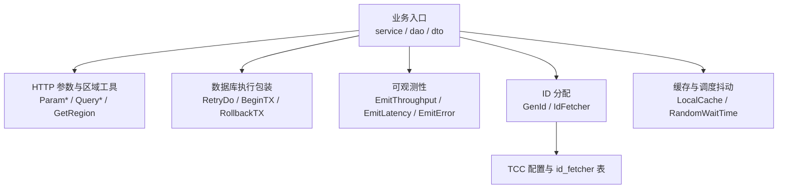
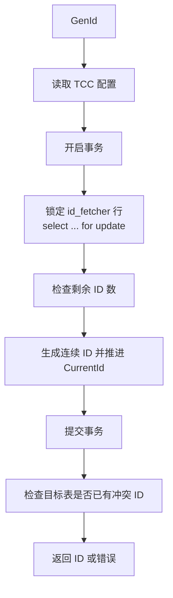

# Other — util

## util 工具模块

`src/util` 是账号服务的公共工具包，不承载独立业务流程，而是被 `service`、`dao`、`dto`、`controllers`、`rpc` 等层复用。GitNexus 未检测到该模块自身的端到端执行流；它更多是横切能力集合，覆盖 HTTP 参数解析、区域归一化、数据库事务和重试、指标上报、本地缓存、ID 段分配以及限流客户端初始化。



## 文件职责

`common.go` 提供 Gin 请求参数解析和随机 TTL 工具。

`tools.go` 提供通用执行工具，包括重试、事务、Basic Auth 解析、UUID、环境开关和 `LocalCache`。

`id_gen_util.go` 实现基于数据库表 `id_fetcher` 的 ID 段分配和管理接口。

`region.go` 负责将 IDC 名称归一化为业务区域，并解析同步规则中的目标 IDC。

`metrics.go` 封装 `code.byted.org/gopkg/metrics` 指标上报。

`rate_limit.go` 初始化 Harden 限流客户端 `HardenCli`。

测试文件覆盖这些工具函数的基础行为；其中 `base_test.go` 的 `TestMain` 会初始化 `ginex`、配置和写库，并调用 `InitIdGenerator(db)`，因此 ID 生成相关测试依赖真实数据库配置。

## HTTP 参数解析

`common.go` 中的 `Query*` 和 `Param*` 函数直接基于 `gin.Context` 读取参数并转换类型：

- `QueryInt64(c, key)`：读取 query string 并用 `strconv.ParseInt(..., 10, 64)` 转成 `int64`。
- `QueryBool(c, key)`：读取 query string 并用 `strconv.ParseBool` 转成 `bool`。
- `QueryInt64Slice(c, key)`：读取同名 query 参数数组，例如 `?k=1000&k=1001`，逐个解析为 `[]int64`。
- `QueryUInt64(c, key)`：读取 query string 并解析为 `uint64`。
- `QueryString(c, key)`：读取 query string；空字符串返回 `ErrEmpty`。
- `ParamInt64(c, key)`、`ParamUInt64(c, key)`、`ParamString(c, key)`：读取路径参数并执行相同类型转换。

`ErrEmpty` 是模块内的错误类型，`Error()` 返回 `"<key> is empty"`。`QueryString` 和 `ParamString` 会把空字符串视为缺失，因此不能区分参数不存在和显式传入空值。

这些函数在服务层较常见，例如 `service/instance.go`、`service/config.go`、`service/account.go`、`service/rule_v2.go` 等入口会用它们将 Gin 参数转换成 DTO 或 DAO 所需类型。

## 随机 TTL 与调度抖动

`RandomCacheExpireTime(cacheExpireTime)` 基于包级 `random` 生成 `ttl*(1-factor)` 到 `ttl*(1+factor)` 的随机过期时间。当前 `randFactor = 0.5`，所以 5 分钟 TTL 会落在约 2.5 到 7.5 分钟之间。

`RandomWaitTime(cacheExpireTime)` 返回 `[0, cacheExpireTime)` 范围内的随机等待时间。代码中主要用于缓存刷新前的启动抖动，例如 `service/cache.go`、`service/account.go` 和 `rpc/decc.go`，避免多个实例同时刷新。

注意：当前 `random` 是包级 `*rand.Rand`，没有显式加锁。如果未来在高并发路径大量调用这些函数，需要关注 Go race detector 下的并发访问风险。

## 重试与事务工具

`RetryDo(ctx, info, times, run, stopErrors...)` 是 DAO 层的常用执行包装。它最多执行 `times` 次 `run()`：

- 第一次之后的重试会通过 `logs.CtxWarn` 记录 `"retry %s for %d times"`。
- 每次失败都会通过 `logs.CtxError` 记录错误。
- `run()` 返回 `nil` 时立即成功返回。
- 命中 `stopErrors` 时提前停止重试。

当前实现使用 `errors.Is(e, err)` 判断停止错误，参数顺序与 Go 常见写法 `errors.Is(err, target)` 相反。新增调用方如果依赖哨兵错误或包装错误，需要先确认匹配行为符合预期。

`BeginTX(db)` 对 `gorm.DB` 调用 `Begin()`，并在 `tx.GetErrors()` 非空时返回 `tx.Error`。

`RollbackTX(tx, err)` 回滚事务，并合并原始错误与回滚错误：

- 回滚没有错误时返回原始 `err`。
- 原始 `err` 为 `nil` 时返回 `tx.Error`。
- 原始错误已经是 `gorm.Errors` 时追加回滚错误。
- 否则返回包含两个错误的 `gorm.Errors`。

DAO 层大量使用统一模式：

```go
err := util.RetryDo(ctx, retryInfo, db.retryTimes, func() error {
    tx, err := util.BeginTX(db.w.Context(ctx))
    if err != nil {
        return util.RollbackTX(tx, err)
    }

    res := tx.Table(table).Create(value)
    if res.Error != nil {
        return util.RollbackTX(tx, res.Error)
    }

    return tx.Commit().Error
})
```

这种模式让重试、事务失败处理和指标上报保持一致。

## 其他通用工具

`GetUUID()` 返回去掉连字符的 UUID 字符串，内部使用 `github.com/google/uuid`。

`ParseBaseAuth(auth)` 解析形如 `Basic <base64(user:password)>` 的 Authorization 值。前缀必须严格是 `"Basic "`；base64 解码失败或内容不包含冒号时返回 `ok=false`。

`FormatKV(key, value)` 返回 `"key=value"` 字符串，常用于拼接标签或日志字段。

`CheckIfSupportCreateProcess()` 根据当前 `env.IDC()` 判断是否支持创建流程。`env.DC_ALISG` 和 `env.DC_MALIVA` 返回 `false`，其他 IDC 返回 `true`。

`InitCheckSuffix()` 将 `config.Conf.CheckSuffix` 写入包级原子变量 `checkSuffix`。`NeedCheckAccountNameSuffix()` 原子读取该值，用于账号名后缀校验开关。

## LocalCache

`LocalCache` 是基于两个 `sync.Map` 的简单本地缓存：

- `m` 保存 key 到 value。
- `t` 保存 key 到 `expiresAt`。
- `Add(key, value, expiresAt)` 写入值和过期时间。
- `Get(key)` 只返回未过期数据；过期时返回 `(nil, false)`。
- `GetIncludeExpired(key)` 不检查过期时间，直接返回缓存值。
- `Delete(key)` 同时删除值和过期时间。

`LocalCache` 不会自动清理过期数据，过期数据仍可通过 `GetIncludeExpired` 读取。`service/domain.go` 使用它维护 `accountsByDomainCache` 和 `domainCache`。

## 区域归一化

`region.go` 将 IDC 或区域别名统一映射到业务区域。核心函数是 `GetRegion(idc)`：

- `idc == R_ALL` 时返回 `"all"`。
- `idc == ""` 时返回当前进程默认区域。
- 已知 IDC 会通过 `regionMapping` 映射到标准区域。
- 未知 IDC 会回退到默认区域。

默认区域由 `getDefaultRegion()` 从 `env.IDC()` 推导，并缓存在 `defaultRegion atomic.Value` 中。进程运行期间一旦缓存，后续环境变化不会自动刷新。

常见映射包括：

- `lf`、`hl`、`lq` 等中国区 IDC 映射到 `R_CN`，即 `"cn"`。
- `useast2a`、`useast2b` 映射到 `R_I18N`，即 `"i18n"`。
- `useast5` 映射到 `"us-ttp"`。
- `alisg` 和 `sg1` 归一到 `env.DC_ALISG`。
- `maliva` 保持为 `env.DC_MALIVA`。

`IsRegionSupported(idc)` 只判断输入是否存在于 `regionMapping`，不会执行默认回退。

`IsInnerProdEnv(idc)` 先调用 `GetRegion(idc)`，再判断归一后的区域是否在 `AllInnerProdRegions` 中。

`GetSyncIDCs(syncInfo)` 将同步配置 JSON 解析为 IDC 列表。它把 JSON key 转成大写后查 `regionIDC`，并展开成具体 IDC。例如包含 `alisg` 时会返回 `env.DC_ALISG` 和 `env.DC_SG1`。JSON 解析错误会被忽略，未知 key 也会被跳过。

`RuleSyncRegion` 列出允许配置同步规则的区域，包括 `R_CN`、`env.DC_ALISG`、`env.DC_MALIVA`、`env.DC_USEAST2A`、`env.DC_USEAST2B`、`env.DC_USEAST5`、`env.DC_USEAST8`。

## ID 生成器

`id_gen_util.go` 实现按表、按区域维护的 ID 段分配。它依赖全局 `idGenDb`，必须先调用 `InitIdGenerator(db)` 注入数据库连接。测试入口在 `base_test.go` 中通过写库初始化它。

`IdFetcher` 对应数据库表 `id_fetcher`：

```go
type IdFetcher struct {
    ID          uint64
    Region      string
    DBTableName string
    CurrentId   int64
    MaxId       int64
    CreateAt    time.Time
    UpdatedAt   time.Time
}
```

`TableName()` 固定返回 `"id_fetcher"`。`BeforeCreate` 会把 `ID` 置为 0，`AfterCreate` 会从 GORM scope 回填主键。`GetRemainingCount()` 返回 `MaxId - CurrentId`。

### GenId

`GenId(ctx, tableName, idCount)` 是主要分配入口。它先读取 `tcc.GetIdGeneratorConfig(ctx)`，并检查：

- 全局 `Switch` 是否开启。
- `TableSupportSetting[tableName]` 是否存在且为 `true`。
- `TableRemainIdRemindThreshold[tableName]` 是否存在。

如果任一条件不满足，函数会返回长度为 `idCount` 的零值 `[]int64`，且错误为 `nil`。调用方必须知道这个兼容行为，不能仅以 `err == nil` 判断一定拿到了有效 ID。

启用后，流程如下：



并发安全依赖数据库行锁：`select * from id_fetcher where region = ? and table_name = ? for update`。锁住当前区域和表名对应的 `id_fetcher` 行后，函数按 `CurrentId+1` 起生成连续 ID，并把 `CurrentId` 推进 `idCount`。

剩余量不足时，函数提交当前事务并返回包含 `"remaining not enough"` 的错误。分配成功后，如果剩余量低于阈值，会用 `logs.Errorf` 输出告警前缀 `IdGeneratorWarningPrefix`。

冲突检测发生在提交事务之后：函数会查询目标业务表 `where id in (?)`。如果目标表已有这些 ID，会返回包含 `"id conflict"` 的错误，但此时 `CurrentId` 已经推进。处理这类错误时不要假设同一段 ID 还能再次分配。

`dto/domain.go` 和 `dto/video_account.go` 在构造模型时会调用 `GenId` 获取业务表 ID。

### 管理接口

`ListIdFetchers(ctx)` 查询全部 `id_fetcher` 记录。`service/id_gen.go` 暴露对应服务层入口。

`UpdateIdFetcher(ctx, fetcher)` 用于调整已有 ID 段：

1. 调用 `validateFetcherParam` 校验 `Region`、`DBTableName` 非空，且 `MaxId > CurrentId`。
2. 查询目标业务表，确认 `[CurrentId, MaxId]` 区间内没有已有 ID。
3. 开启事务并锁定对应 `id_fetcher` 行。
4. 校验数据库记录的 `ID` 与请求中的 `fetcher.ID` 一致。
5. 更新 `CurrentId` 和 `MaxId`。

`CreateIdFetcher(ctx, fetcher)` 用于创建新的表区域配置。它同样校验参数和目标表 ID 区间冲突，然后在事务中 `Create(fetcher)`。如果目标业务表不存在，区间冲突查询会返回数据库错误；如果相同区域和表名已存在，则依赖数据库约束或 GORM create 错误返回失败。

`validateFetcherParam(fetcher)` 是内部校验函数，不检查目标表存在性，也不检查区域是否在 `regionMapping` 中，只做字段非空和 ID 上下界校验。

## 指标上报

`metrics.go` 在 `init()` 中创建默认指标客户端：

```go
metrics.NewDefaultMetricsClientV2("toutiao.videoarch.account", true)
```

封装函数统一为指标名追加后缀：

- `EmitThroughput(name, tags...)` 上报 `name + ".throughput"`，计数值为 1。
- `EmitLatency(name, start, tags...)` 上报 `name + ".latency"`，耗时单位是微秒。
- `EmitStore(name, value, tags...)` 上报 `name + ".store"`。
- `EmitError(mkey, tags...)` 上报 `mkey + ".error"`，计数值为 1。

上报失败只写 `logs.Warn`，不会影响业务返回。

DAO 层通常使用如下模式记录数据库操作吞吐和耗时：

```go
retryInfo := "createAccount"
util.EmitThroughput(util.CommandThroughput, metrics.T{Name: util.TagCommand, Value: retryInfo})
defer util.EmitLatency(util.CommandLatency, time.Now(), metrics.T{Name: util.TagCommand, Value: retryInfo})
```

`CommandThroughput`、`CommandLatency`、`Command`、`TagCommand` 是该模式使用的常量。

## 限流客户端初始化

`InitRateLimiter()` 初始化包级变量 `HardenCli`：

```go
HardenCli = harden.NewClient(
    config.Conf.Meta.PSM,
    harden.WithCluster(config.Conf.Harden.Cluster),
    harden.UseHTTP(),
    harden.WithTimeout(100*time.Millisecond),
    harden.PassOnErr(),
)
```

这表示限流客户端使用当前服务 PSM、配置中的 Harden 集群、HTTP 调用、100ms 超时，并在限流系统错误时放行。新增调用方应复用 `HardenCli`，不要在请求路径中重复创建客户端。

## 与代码库其他模块的关系

`dao` 层是 `RetryDo`、`BeginTX`、`RollbackTX`、`EmitThroughput`、`EmitLatency` 的主要消费者。账号、域名、配置、规则、实例、分类 schema 等 DAO 方法都遵循“指标上报 + RetryDo + 事务”的模式。

`service` 层主要使用参数解析、区域归一化、本地缓存和随机等待。比如 `service/config.go`、`service/domain.go`、`service/account.go` 会用 `GetRegion` 归一化请求区域；`service/cache.go` 用 `RandomWaitTime` 打散后台刷新。

`dto` 层使用 `GenId` 为部分模型生成 ID，并使用 `GetRegion` 在请求解析阶段统一区域字段。

`controllers/account.go` 会直接调用指标封装记录命令类吞吐和耗时。

`remote/http_utils.go` 使用 `GetRegion(env.IDC())` 填充跨区域请求中的区域字段。

## 维护注意事项

新增 HTTP 参数工具时，要保持 `Query*` 和 `Param*` 的错误语义一致；字符串空值当前会返回 `ErrEmpty`，数值和布尔值直接透传 `strconv` 的解析错误。

修改 `regionMapping` 时，需要同步考虑 `AllInnerProdRegions`、`regionIDC`、`RuleSyncRegion` 和相关单测。`GetRegion` 对未知输入会回退默认区域，业务侧如果需要拒绝非法区域，应先调用 `IsRegionSupported`。

修改 `GenId` 时要谨慎处理事务边界。当前 ID 段推进在冲突检查之前已经提交，这是现有行为；如果改为提交前检查，需要重新评估并发写入目标表和行锁范围。

`LocalCache` 是轻量缓存，不负责后台淘汰。缓存值较大或 key 数量可能无限增长的场景，需要在调用方设计删除策略。

指标封装的失败策略是“只记录 warning，不影响业务”。不要在这些函数里引入会改变业务返回的错误传播。