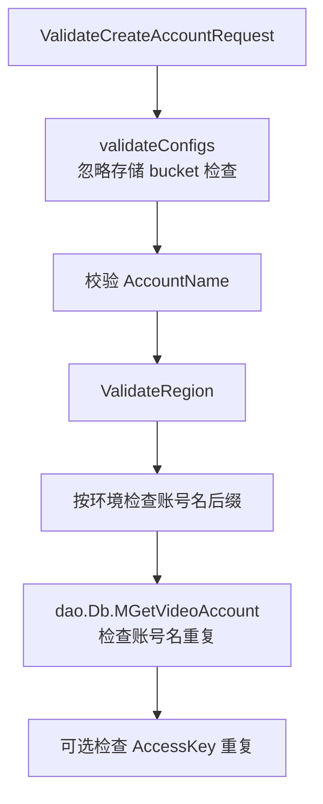
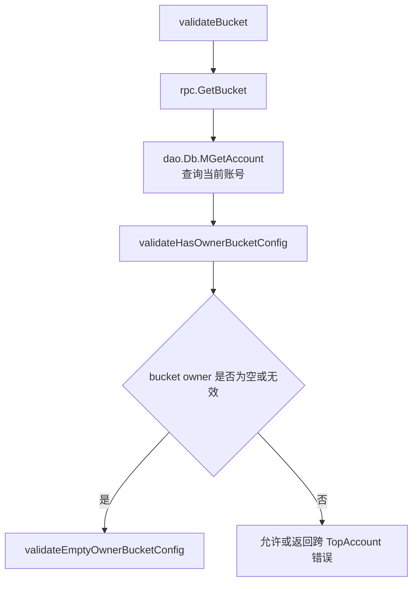

# Other — validator

## validator 模块

`src/validator` 负责集中校验账号、配置、地域、域名和域名账号关系等请求对象。它不是业务执行入口，而是服务层在写入数据库或复制配置前使用的防御层：先检查必填字段、枚举值、账号存在性、地域合法性，再对存储配置中的 bucket 做更严格的跨账号使用校验。

该模块的测试文件覆盖了 `validator.go` 中的主要公开函数和关键私有校验函数。`TestMain` 会初始化 `ginex`、配置、数据库和 RPC 客户端，因此部分测试依赖真实 DAO/RPC 环境，而不是纯内存单元测试。

## 核心职责

`validator` 的校验逻辑主要分为四类：

1. 基础枚举校验：`ValidateStatus`、`ValidateRuleType`、`ValidateModule`、`ValidateRegion`。
2. 账号与配置请求校验：`ValidateCreateAccountRequest`、`ValidateMCreateConfigRequest`、`ValidateMUpdateConfigRequest`、`ValidateMCopyConfigRequest`。
3. 存储配置与 bucket 权属校验：`validateConfigs`、`validateStorageConfig`、`validateBucket`、`validateHasOwnerBucketConfig`、`validateEmptyOwnerBucketConfig`。
4. 域名与账号关系校验：`ValidateCreateDomainRequest`、`ValidateCreateDomainAccountRelRequest`、`ValidateMCopyDomainAccountRelRequest`。

此外，`RefinePageParams` 提供分页参数归一化，`ValidateCreateAccountCategorySchemaRequest` 和 `ValidateUpdateAccountCategorySchemaRequest` 负责账号分类 schema 的输入校验。

## 初始化与测试环境

`src/validator/base_test.go` 中的 `TestMain` 是整个包测试的统一入口：

```go
func TestMain(m *testing.M) {
	ginex.Init()
	config.InitConf()
	dao.InitDb()
	rpc.Init()
	code := m.Run()
	os.Exit(code)
}
```

这意味着测试执行前会加载配置、初始化数据库连接，并初始化 `rpc.BktCli` 等 RPC 依赖。开发者新增测试时需要注意：

- 访问 `dao.Db` 的测试依赖测试环境数据库数据。
- 访问 `rpc.GetBucket` 的测试依赖 bucket meta RPC。
- 需要隔离 RPC 行为时，可以参考 `Test_validateBucket` 使用 `gomonkey.ApplyMethod` patch `rpc.BktCli.GetBucket`。

当前调用图显示测试文件直接覆盖 `validator.go` 中的公开函数和内部函数；该测试模块本身没有被运行时执行流引用。

## 基础校验函数

### `ValidateStatus`

`ValidateStatus(status string) error` 遍历 `constant.StatusList`，只有命中列表中的状态才返回 `nil`，否则返回 `errno.ErrStatusInvalid`。

适用于创建或更新状态字段前的统一检查。测试中 `constant.StatusEnabled` 为合法值，任意未知状态会失败。

### `ValidateRuleType`

`ValidateRuleType(ruleType string) error` 允许以下规则类型：

- `constant.RuleTypeOrigin`
- `constant.RuleTypeEncoded`
- `constant.RuleTypePoster`
- 以 `constant.RuleTypeVideoExtraPre` 开头的扩展类型
- 以 `constant.RuleTypeFileExtraPre` 开头的扩展类型

其他值返回 `errno.ErrRuleTypeInvalid`。

### `ValidateModule`

`ValidateModule(module string) error` 遍历 `constant.ModuleList`。例如测试中 `constant.ModuleStorage` 合法，`unit_test_module` 非法。

配置校验入口 `validateConfigs` 会先对每个 `dto.VideoConfig.Module` 调用该函数，因此新增模块时必须同步维护 `constant.ModuleList`，否则配置创建、更新、复制都会被拒绝。

### `ValidateRegion`

`ValidateRegion(idc string) error` 使用 `util.IsRegionSupported(idc)` 判断地域是否合法。特殊点是空字符串被视为合法：

```go
if idc == "" {
	return nil
}
```

因此调用方如果要求地域必填，不能只依赖 `ValidateRegion`，还需要自己检查空值。当前 `ValidateMCreateConfigRequest`、`ValidateMCopyConfigRequest`、`ValidateMCopyDomainAccountRelRequest` 会在 `ValidateRegion` 返回错误时统一转换为 `errno.ErrRegionMissing`，但空字符串本身不会触发错误。

## 账号创建校验

`ValidateCreateAccountRequest(ctx, req)` 用于校验 `dto.CreateAccountRequest`，主要流程如下：



具体规则：

- 先调用 `validateConfigs(ctx, req.AccountName, req.VideoConfigs, true)`。
- `AccountName` 不能为空，且不能以 `__` 开头，否则返回 `errno.ErrNameInvalid`。
- `Region` 必须通过 `ValidateRegion`，失败时返回 `errno.ErrRegionMissing`。
- 当 `util.NeedCheckAccountNameSuffix() == constant.NeedCheckSuffix` 时，账号名必须以 `env.IDC()` 结尾。
- 使用 `dao.Db.MGetVideoAccount` 按 `AccountName` 和 `WithDeleted: true` 检查账号是否已经存在。
- 如果请求指定了 `AccessKey`，还会按 `AccessKey` 查询重复账号。

注意：这里调用 `validateConfigs` 时传入 `ignoreCheckStorageConfig=true`，新建账号阶段不会检查 storage 配置中的 bucket 是否存在或是否跨 TopAccount 使用。

## 配置创建、更新与复制校验

### `ValidateMCreateConfigRequest`

`ValidateMCreateConfigRequest(ctx, req, ignoreCheckStorageConfig)` 校验 `dto.MCreateConfigRequest`：

1. `AccessKey` 不能为空，否则返回 `errno.ErrAccessKeyInvalid`。
2. `Region` 必须通过 `ValidateRegion`，失败返回 `errno.ErrRegionMissing`。
3. 通过 `dao.Db.MGetVideoAccount` 按 `AccessKey` 查询账号。
4. 如果账号不存在，返回 `errno.ErrAccessKeyNotExists`。
5. 将查询到的 `accounts[0].AccountName` 回填到 `req.AccountName`。
6. 调用 `validateConfigs(ctx, req.AccountName, req.Configs, ignoreCheckStorageConfig)` 校验配置内容。

这个函数会修改请求对象本身：`req.AccountName` 会被回填。调用方如果后续依赖请求中的账号名，可以直接使用该字段。

### `ValidateMUpdateConfigRequest`

`ValidateMUpdateConfigRequest(ctx, req, ignoreCheckStorageConfig)` 是更新配置的薄封装，直接复用创建配置校验：

```go
return ValidateMCreateConfigRequest(ctx, req.MCreateConfigRequest, ignoreCheckStorageConfig)
```

因此更新配置和创建配置在账号查找、地域检查、模块检查、bucket 检查方面保持一致。

### `ValidateMCopyConfigRequest`

`ValidateMCopyConfigRequest(ctx, req)` 用于复制配置请求 `dto.MCopyConfigRequest`：

- `AccessKey` 不能为空。
- `SourceRegion` 必须合法。
- `TargetRegions` 不能为空，且每个目标地域都必须合法。
- `AccessKey` 必须能查询到已有视频账号。
- `Modules` 不能为空。
- `Modules` 中每个 module 都必须通过 `ValidateModule`。

复制场景只校验模块集合和地域集合，不会调用 `validateConfigs` 检查具体 `dto.VideoConfig` 内容。

## 配置内容校验

`validateConfigs(ctx, accountName, videoConfigs, ignoreCheckStorageConfig)` 是配置校验的内部核心。它遍历每个 `*dto.VideoConfig`，执行三类检查：

1. 使用 `ValidateModule(c.Module)` 检查模块合法性。
2. 如果没有忽略存储配置检查，则检查 storage 模块中的 bucket。
3. 对全局模块的 bucket 选择策略做 JSON 结构校验。

关键代码路径：

```go
if c.Module == constant.ModuleStorage {
	c.AccountName = accountName
	if err := validateStorageConfig(ctx, c, existBucketSet); err != nil {
		return err
	}
}

if c.Module == constant.ModuleGlobal && c.CKey == constant.BucketSelectionStrategyCKey {
	if err := json.Unmarshal([]byte(c.CValue), &dto.BucketSelectionStrategy{}); err != nil {
		return &errno.Payload{Code: errno.CodeBadRequest, Message: "invalid bucket selection strategy"}
	}
}
```

`existBucketSet` 是当前账号已有配置中的 bucket 集合，第一次需要检查存储配置时通过 `getAccountExistBucketSet` 懒加载。已有 bucket 会被放行，用于兼容历史上已经存在的错误配置，避免更新其他配置时被旧 bucket 阻断。

## storage 配置与 bucket 校验

### `getAccountExistBucketSet`

`getAccountExistBucketSet(ctx, accountName, c)` 从 `dao.Db.MGetConfigByProvider(ctx, accountName, "", util.R_ALL)` 读取账号现有配置，并提取已经配置过的 bucket 名称。

它兼容两种 `CValue` 形态：

- 普通字符串：`CValue` 本身就是 bucket 名。
- JSON storage 配置：反序列化为 `dto.StorageConfig`，从 `IDC` 和 `Default` 中提取 `bucketAccount.Name`。

参数 `c *dto.VideoConfig` 当前没有被函数体使用，保留它不会影响行为，但新增逻辑时不应假设它参与过滤。

### `validateStorageConfig`

`validateStorageConfig(ctx, videoConfig, existBucketSet)` 只处理 storage 模块的配置值。它有几个特殊兼容规则：

- `CKey == "bucket"` 直接放行。
- `CKey` 包含 `"migrater_rules"` 直接放行。
- `CValue` 不能解析为 `dto.StorageConfig` 时，按单个 bucket 名处理。
- `CValue` 能解析为 `dto.StorageConfig` 时，分别检查 `IDC` 和 `Default` 下的 bucket。

如果 bucket 已存在于 `existBucketSet`，函数会跳过 `validateBucket`。否则会调用 `validateBucket(ctx, videoConfig.AccountName, videoConfig.Region, bucketName)` 做真实 bucket 权属校验。

### `validateBucket`

`validateBucket(ctx, accountName, region, bucketName)` 是 bucket 使用边界的核心校验：



规则：

- 如果 `rpc.BktCli == nil`，直接返回 `nil`，即跳过 bucket meta 校验。
- `rpc.GetBucket` 返回 `bktClient.ErrBucketNotFound` 时，返回 bad request：`bucket: <name> not found`。
- 其他 RPC 错误返回 internal error。
- 查询当前账号时使用 `dao.Db.MGetAccount`，并取 `curAccounts[0]` 作为当前账号。
- 先检查 bucket meta 中的 `Owner`，再在 owner 为空或无效时检查历史配置占用情况。

开发者需要注意：`validateBucket` 默认假设当前账号一定能从数据库查到，并直接访问 `curAccounts[0]`。调用它前应保证 `accountName` 来自已校验过的账号。

### `validateHasOwnerBucketConfig`

`validateHasOwnerBucketConfig(ctx, bucketName, bucketOwner, curAccount)` 用于处理 bucket meta 中有 owner 的情况，返回 `(emptyOwner bool, err error)`。

行为如下：

- `bucketOwner` 为空：返回 `emptyOwner=true`，交给 `validateEmptyOwnerBucketConfig` 继续检查。
- owner 账号查不到或查询失败：也返回 `emptyOwner=true`，表示 bucket meta owner 不可信，改查历史配置。
- owner 账号名等于当前账号名，或 owner 与当前账号 `TopAccountID` 相同：允许使用。
- owner 与当前账号跨 TopAccount：返回 bad request，错误信息包含 `cross top account usage is forbidden 1`。

这里的核心约束是：bucket 如果有有效 owner，不允许被跨 `TopAccountID` 的其他空间使用。

### `validateEmptyOwnerBucketConfig`

`validateEmptyOwnerBucketConfig(ctx, bucketName, region, curAccount)` 处理 bucket meta owner 为空或 owner 账号不存在的情况。

流程：

1. 调用 `getOneExistConfig(ctx, bucketName, region)` 查找已有 storage 配置。
2. 如果没有任何已有配置，说明 bucket 尚未被账号配置过，允许使用。
3. 如果存在配置，按 `bucketConfig.AccountName` 查询已有配置所属账号。
4. 当前账号与已有账号相同，或 `TopAccountID` 相同，允许使用。
5. 否则返回 bad request，错误信息包含 `cross top account usage is forbidden 2`。

这里的约束是：owner 为空的 bucket 如果已经被某个空间配置过，也不能被跨 TopAccount 的其他空间复用。

### `getOneExistConfig`

`getOneExistConfig(ctx, bucketName, region)` 通过 `dao.Db.MGetStorageConfigByBucketName` 查找包含指定 bucket 名的 storage 配置。

因为底层查询使用 `like`，函数会二次精确过滤：

- 普通字符串配置必须 `bktConfig.CValue == bucketName`。
- JSON 配置必须在 `dto.StorageConfig.IDC` 或 `dto.StorageConfig.Default` 中找到 `Name == bucketName`。

如果 DAO 查询报错，函数直接返回 `nil`，表示没有阻断配置创建。

## 域名校验

### `ValidateCreateDomainRequest`

`ValidateCreateDomainRequest(ctx, req)` 校验 `dto.Domain`：

- `Domain` 不能为空。
- `Status` 不能为空。
- `Type` 不能大于 `dto.InternalPrivateDomain`。
- 遍历 `req.AccountRels` 并补齐关系字段：
  - `rel.Region = util.GetRegion(rel.Region)`
  - `rel.DomainType = req.Type`
  - `Category` 为空时使用 `dto.DomainDefaultCategory`
  - `Module` 为空时使用 `dto.DomainDefaultModule`
  - `RelType = dto.BuildDomainRelTypeFromConfig(rel.Region, rel.Module)`

该函数不仅校验，还会规范化请求对象中的账号关系字段。

### `ValidateCreateDomainAccountRelRequest`

`ValidateCreateDomainAccountRelRequest(ctx, req, ignoreCheckAccountName)` 校验单条 `dto.DomainAccountRel`：

- `Domain` 不能为空，并会执行 `strings.TrimSpace`。
- 通过 `dao.Db.GetDomain` 检查域名存在，并将 `domain.Type` 回填到 `req.DomainType`。
- `AccountName` 不能为空。
- 当 `ignoreCheckAccountName == false` 时，通过 `dao.Db.MGetAccount` 检查账号存在。
- 规范化 `Region`、`Category`、`Module`，并生成 `RelType`。

这个函数和 `ValidateCreateDomainRequest` 一样会修改请求对象。调用方应把校验后的 `req` 继续传给后续写入逻辑，而不是丢弃。

### `ValidateMCopyDomainAccountRelRequest`

`ValidateMCopyDomainAccountRelRequest(ctx, req)` 校验域名账号关系复制请求：

- `AccountName` 不能为空。
- `SourceRegion` 必须通过 `ValidateRegion`。
- `TargetRegions` 不能为空。
- 每个目标地域必须通过 `ValidateRegion`。

由于 `ValidateRegion("")` 返回 `nil`，测试中空 `SourceRegion` 是合法的；如果业务要求复制时源地域必须明确，调用方需要额外加必填校验。

## 账号分类 schema 校验

`ValidateCreateAccountCategorySchemaRequest(ctx, req)` 用于创建 `dto.AccountCategorySchema`：

- `AccountName` 不能为空。
- `Category` 不能为空。
- 当 `SchemaType == dto.SchemaEmbeddedMetadata` 时，调用 `checkEmbeddedMetadataValue` 校验 `SchemaValue` 能否解析为 `dto.EmbeddedMetadataSchema`。
- 通过 `dao.Db.MGetAccount` 检查账号存在。
- `SchemaType` 必须存在于 `dto.SchemaTypeAllowList`。

`ValidateUpdateAccountCategorySchemaRequest(ctx, req)` 用于更新 schema：

- `ID` 不能为 0。
- 如果是 embedded metadata schema，同样校验 `SchemaValue` 结构。

`checkEmbeddedMetadataValue(schemaValue)` 只做 JSON 结构解析，不做更深层的业务语义校验。

## 分页参数归一化

`RefinePageParams(offset, limit)` 用于清洗分页参数：

- `offset <= 0` 时重置为 `0`。
- `limit <= 0` 时使用 `constant.DefaultPageSize`。
- `limit > constant.MaxPageSize` 时截断为 `constant.MaxPageSize`。

返回值命名为 `(o, l int64)`，但实际返回的是处理后的 `offset, limit`。

## 与代码库其他模块的连接

`validator` 主要依赖以下包：

- `src/dto`：请求结构、配置结构、域名关系结构和 schema 类型。
- `src/constant`：状态、模块、规则类型、分页大小、bucket selection ckey 等枚举。
- `src/errno`：统一业务错误，例如 `ErrNameInvalid`、`ErrRegionMissing`、`ErrModuleInvalid`。
- `src/dao`：账号、配置、域名的数据库读取。
- `src/rpc`：通过 `rpc.GetBucket` 查询 bucket meta。
- `src/util`：地域判断、默认地域转换、账号名后缀策略。

当前测试调用图集中体现了这种连接方式：测试入口初始化 `config.InitConf`、`dao.InitDb`、`rpc.Init`，随后直接调用 `ValidateCreateAccountRequest`、`ValidateMCreateConfigRequest`、`validateBucket`、`validateStorageConfig` 等函数，验证它们与 DAO/RPC 数据的交互结果。

## 贡献注意事项

新增校验逻辑时应优先复用现有入口，而不是在服务层重复写规则。例如配置相关规则应尽量放进 `validateConfigs` 或 `validateStorageConfig`，账号请求规则放进 `ValidateCreateAccountRequest` 或 `ValidateMCreateConfigRequest`。

需要谨慎处理会修改请求对象的函数：`ValidateMCreateConfigRequest` 会回填 `AccountName`，`ValidateCreateDomainRequest` 和 `ValidateCreateDomainAccountRelRequest` 会补齐 `Region`、`Category`、`Module`、`RelType`、`DomainType`。这些副作用是当前业务流程的一部分。

新增依赖数据库或 RPC 的测试时，应明确测试数据来源。对于 bucket meta 这类外部依赖，优先使用 `gomonkey` patch 目标方法，避免测试结果受远端数据波动影响。