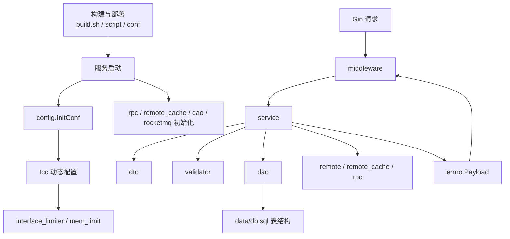

# Other

## 模块概览

`Other` 汇集了账号服务的工程支撑层、运行时基础设施、业务入口层与测试验证入口。它不是单一业务模块，而是把服务从“代码仓库”推进到“可配置、可启动、可观测、可测试的账号系统”的外围与核心胶水层。

其中，[README](readme.md)、[go.mod](go-mod.md)、[build.sh](build-sh.md)、[script](script.md)、[conf](conf.md)、[test.sh](test-sh.md) 定义开发、依赖、构建、部署、配置和测试约定；[config](config.md)、[tcc](tcc.md)、[interface_limiter](interface-limiter.md)、[mem_limit](mem-limit.md) 组成运行时配置和动态开关体系；[middleware](middleware.md)、[service](service.md)、[dto](dto.md)、[validator](validator.md)、[dao](dao.md)、[errno](errno.md) 构成主要请求处理链路；[remote](remote.md)、[remote_cache](remote-cache.md)、[rpc](rpc.md)、[rocketmq](rocketmq.md)、[util](util.md) 提供跨地域转发、共享缓存、RPC 客户端、消息消费和公共工具能力。

## 关键协作关系

开发与交付链路从 [README](readme.md) 和 [go.mod](go-mod.md) 确定工程约定、Go Module 依赖与命名规范，再由 [build.sh](build-sh.md) 编译 `toutiao.videoarch.account` 并整理 `script/` 与 `conf/` 到 `output/`。运行时由 [script](script.md) 中的 `bootstrap.sh` 设置 `PSM`、`GIN_LOG_DIR` 等环境信息并启动二进制，[conf](conf.md) 提供 `base.yml` 与环境覆盖文件作为本地配置来源。

服务启动后，[config](config.md) 先通过 `config.InitConf()` 加载 YAML 和 TCC base 配置；随后 [tcc](tcc.md) 通过 `SetDefaultValuesAndStartRefresh()` 维护动态配置快照，并把接口限流和内存上限分别同步给 [interface_limiter](interface-limiter.md) 与 [mem_limit](mem-limit.md)。这些模块共同决定服务运行时的开关、缓存策略、限流策略、熔断配置和资源边界。

主请求链路由 [middleware](middleware.md) 统一承接 Gin 路由，完成 `Filter`、ACL、日志、限流、响应封装和指标上报。业务函数集中在 [service](service.md)，它把请求解析为 [dto](dto.md) 中的结构体，交给 [validator](validator.md) 做字段、枚举、地域、bucket 和账号关系校验，再通过 [dao](dao.md) 访问持久化数据。[errno](errno.md) 的 `Payload` 是 service 到 middleware 的统一返回契约。

数据模型由 [data](data.md) 中的 `db.sql` 定义，和 [dto](dto.md) 的 `VideoAccount`、`VideoConfig`、`VideoInstance`、域名关系、规则与 category schema 等结构对应。DAO 测试覆盖这些表上的账号、配置、域名、授权、实例和规则操作，保证 service 依赖的持久化契约稳定。

跨实例与跨地域能力分散在几个支撑模块中：[remote_cache](remote-cache.md) 使用 Redis 远端缓存降低查询压力并提供快照兜底；[remote](remote.md) 在写开关和地域条件命中时转发账号与配置写请求；[rpc](rpc.md) 初始化 RPC 依赖并支持如 `GetBucket` 之类的外部查询；[rocketmq](rocketmq.md) 消费 ImageX 域名变更消息并触发 `service.ImageXDomainOnChange()`。

## 测试与验证

测试体系分为两层：[controllers](controllers.md)、[dao](dao.md)、[dto](dto.md)、[validator](validator.md)、[interface_limiter](interface-limiter.md)、[remote](remote.md)、[rpc](rpc.md)、[util](util.md) 等包内测试验证模块内部行为和集成初始化；[test](test.md) 则通过 `account-sdk/client` 面向真实服务做端到端能力验证。[test.sh](test-sh.md) 统一测试环境变量、`go test ./src/...` 和覆盖率报告生成流程。