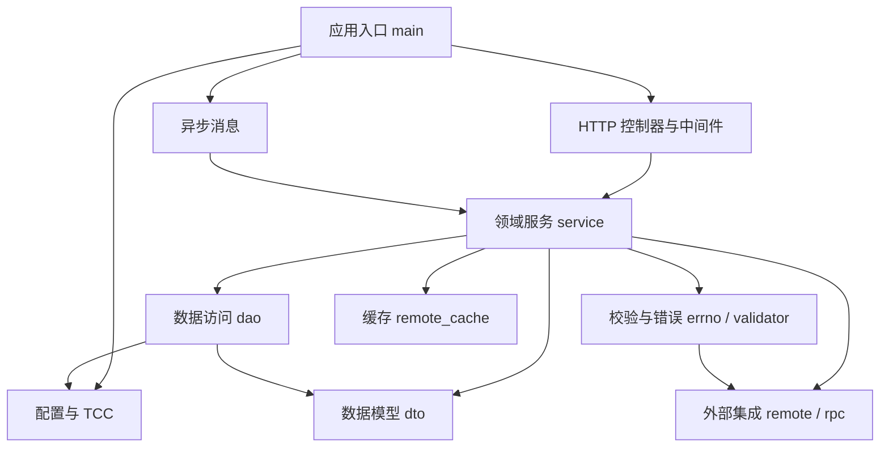

# account — Wiki

# account

`account` 是 VideoArch 账号服务，负责账号、配置、域名、规则、实例和权限等核心数据的 HTTP 接口、业务编排、数据库访问、缓存协同、外部系统集成与异步消息处理。新开发者可以先把它理解为一个以 Gin HTTP 服务为入口、以 `service` 为业务中心、以 `dao` 为数据访问边界的账号管理后端。



服务启动从 [Application Runtime](application-runtime.md) 开始。`main.go` 负责进程级初始化：加载配置、初始化 TCC、RPC、缓存、数据库、工具组件和 RocketMQ consumer，然后创建 Gin 引擎并注册路由。它本身不承载业务规则，而是把运行时能力装配起来。

运行时配置由 [Configuration and TCC Settings](configuration-and-tcc-settings.md) 管理。`config` 负责本地配置加载、TCC `base` 配置合并和结构校验；`tcc` 负责动态配置读取、定时刷新，以及 Redis 缓存、白名单、限流、内存限制等运行时开关更新。服务里的很多保护性能力都依赖这层配置，例如 [Rate and Resource Limits](rate-and-resource-limits.md) 中的接口限流和 Go runtime 内存限制。

请求入口主要在 [API Controllers and Middleware](api-controllers-and-middleware.md)。控制器通过统一的 `middleware.MyHandler` 约定接入 Gin，请求处理函数返回 `*errno.Payload`，由 `Response`、`OpenAPIResponse`、`JanusResponse`、`WandResponse` 等包装器转换成不同调用方需要的 HTTP/JSON 响应。鉴权、限流、日志、指标、链路追踪和响应封装都集中在这层完成。

核心业务逻辑集中在 [Domain Services](domain-services.md)。`src/service` 负责读取请求参数、绑定到 [Data Models and DTOs](data-models-and-dtos.md)、调用 [Validation and Error Handling](validation-and-error-handling.md) 做参数和业务边界校验，再通过 [Data Access Layer](data-access-layer.md) 访问 MySQL，必要时调用 [Caching Layer](caching-layer.md) 或 [Remote Integrations](remote-integrations.md)。服务层返回统一的 `errno.Payload`，让上层入口保持一致的错误和响应模型。

数据访问层位于 `src/dao`，核心入口是全局 `dao.Db`。它封装读写库连接、熔断器、限流、重试、ID 生成器和 GORM 模型访问。`dao` 与 `dto` 的关系非常紧密：`dto` 定义表映射、请求/响应结构和部分转换逻辑，`dao` 则负责实际查询与写入。

外部依赖通过 `remote` 和 `rpc` 隔离。账号和配置变更会通过 `remote` 转发到远端 HTTP 服务；配置校验中的 Bucket 信息由 `rpc.GetBucket` 查询；DECC 相关元数据在启动后通过 RPC 客户端定时刷新。典型链路是 `MUpdateConfig` 进入服务层后，经 `validator` 校验配置，再在校验存储配置时调用 `rpc.GetBucket`，失败时通过 `errno.Payload` 归一化返回。

缓存逻辑由 `remote_cache` 统一封装。服务层不直接操作 Redis，而是通过 `RemoteCache` 读写账号查询缓存、域名账号关系缓存、CDN 调度域名缓存，并使用查询级互斥锁降低缓存击穿时的回源压力。配置不可用时，缓存层也提供降级实现，避免调用方散落降级判断。

异步消息入口在 [Async Messaging](async-messaging.md)。`main` 启动 RocketMQ consumer 后，当前主要由 `ImageXDomainHandler` 消费 ImageX 域名接入变更消息，并调用 `service.ImageXDomainOnChange` 进入同一套业务处理体系。

开发时建议先从这几条端到端链路读起：

- HTTP 请求链路：Gin 路由进入 `middleware.Response`，再到控制器和 `service`，最后访问 `validator`、`dao`、`remote_cache` 或 `remote/rpc`。
- 配置更新链路：`main` 初始化 `config` 和 `tcc`，TCC 首次拉取并定时刷新运行时开关，影响缓存、限流、白名单和内存限制。
- 配置校验链路：`service/config.go` 中的配置创建或更新请求进入 `validator`，存储配置会进一步调用 `rpc.GetBucket` 查询外部 Bucket 元数据。
- 异步域名链路：RocketMQ 消息进入 consumer handler，解析后调用 `service.ImageXDomainOnChange`，复用服务层的数据和校验能力。
- DECC 元数据链路：`main` 初始化 RPC 后启动 DECC 元数据刷新任务，周期性拉取频道与嵌入元数据供后续业务使用。

本仓库使用 Go module，模块名为：

```text
code.byted.org/videoarch/account
```

`go.mod` 当前声明 Go 版本为 `1.23`。README 中历史开发说明提到 Go `1.16`，新环境应优先以 `go.mod` 为准。依赖管理使用 `go mod`，本地开发通常从安装 Go、拉取依赖、准备配置文件，再启动 `main.go` 入口开始。接口命名遵循 RESTful 约定：Controller 使用复数命名，Model 使用单数命名，路由对象使用复数路径，例如 `accounts.search`、`photos.create`、`photos.update`。

如果你刚接手这个服务，推荐阅读顺序是：[Application Runtime](application-runtime.md) 了解启动装配，[API Controllers and Middleware](api-controllers-and-middleware.md) 了解请求入口，[Domain Services](domain-services.md) 了解业务主干，然后按需要深入 [Data Access Layer](data-access-layer.md)、[Data Models and DTOs](data-models-and-dtos.md)、[Validation and Error Handling](validation-and-error-handling.md)、[Remote Integrations](remote-integrations.md) 和 [Caching Layer](caching-layer.md)。共享常量、事务辅助、指标、区域处理和 ID 生成等跨模块能力集中在 [Shared Utilities](shared-utilities.md)。