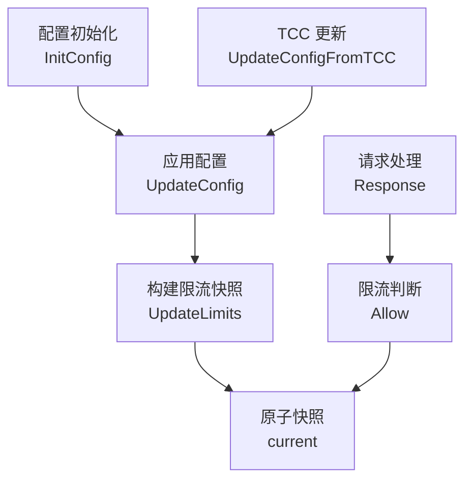

# Rate and Resource Limits

## 模块职责

本模块负责两类运行时资源保护：

1. `interface_limiter`：按接口 `mkey` 做 QPS/突发流量限制，用于请求处理中快速判断当前接口是否允许继续处理。
2. `mem_limit`：根据容器内存上限和配置百分比设置 Go 运行时内存限制，降低进程内存使用超过预期的风险。

两部分都支持运行时配置更新：接口限流通过 TCC JSON 配置热更新，内存限制通过 TCC 百分比配置和环境变量 `MY_MEM_LIMIT` 计算后应用。

## 接口限流：`src/interface_limiter`

### 核心模型

`interface_limiter` 使用不可变快照加原子替换的方式管理限流器：

```go
type snapshot struct {
	limiters map[string]*rate.Limiter
}

var current atomic.Value
```

`current` 中保存当前生效的 `*snapshot`。每次配置更新都会重新构建一份 `map[string]*rate.Limiter`，校验通过后整体替换到 `current`。请求路径只读取当前快照，不加锁。

这种模式的效果是：

- `Allow(mkey string)` 在高频请求路径上只做一次原子读取和一次 map 查询。
- 配置热更新不会修改旧 map，而是构建新快照后替换。
- 如果新配置校验失败，旧快照不会被覆盖，线上行为保持不变。
- 未配置的 `mkey` 默认放行。

### 调用关系



### 初始化行为

包初始化时会写入一个空快照：

```go
func init() {
	current.Store(&snapshot{limiters: map[string]*rate.Limiter{}})
}
```

因此在配置尚未加载、配置关闭、或没有命中指定 `mkey` 时，`Allow` 都会返回 `true`。模块的默认策略是“无配置不拦截”。

`InitConfig(cfg config.InterfaceRateLimiterConfig)` 只是初始化入口，内部直接调用 `UpdateConfig(cfg)`，与后续热更新使用同一套逻辑。

### TCC 配置更新

`UpdateConfigFromTCC(value string, err error)` 是 TCC 回调路径使用的入口：

```go
func UpdateConfigFromTCC(value string, err error) error
```

处理规则：

- `value == ""` 时直接返回 `nil`，不改变当前配置。
- `err != nil` 时直接返回 `nil`，不改变当前配置。
- 使用 `json.Decoder` 解析到 `config.InterfaceRateLimiterConfig`。
- 调用 `decoder.DisallowUnknownFields()`，因此 JSON 中出现未知字段会返回错误。
- JSON 解析成功后调用 `UpdateConfig(c)`。

这里的设计偏保守：TCC 拉取失败或配置为空时不影响现有快照；只有拿到合法配置后才进入更新流程。

### 配置启停

`UpdateConfig(cfg config.InterfaceRateLimiterConfig)` 根据 `cfg.Enable` 决定是否启用限流：

```go
func UpdateConfig(cfg config.InterfaceRateLimiterConfig) error {
	if !cfg.Enable {
		return UpdateLimits(nil)
	}
	return UpdateLimits(cfg.Limits)
}
```

当 `Enable` 为 `false` 时，会调用 `UpdateLimits(nil)`，最终生成一个空 `limiters` map 并替换当前快照。此后所有接口都会放行。

当 `Enable` 为 `true` 时，只对 `cfg.Limits` 中配置的 `mkey` 生效。没有出现在 map 中的接口仍然放行。

### 限流器构建与校验

`UpdateLimits(cfg map[string]config.InterfaceRateLimit)` 负责把配置转换成 `golang.org/x/time/rate.Limiter`：

```go
limiters[mkey] = rate.NewLimiter(rate.Limit(limit.QPS), limit.Burst)
```

每条配置会校验两个字段：

- `limit.QPS > 0`
- `limit.Burst > 0`

任一配置非法时，函数立即返回错误，并且不会执行 `current.Store(...)`。这意味着非法热更新不会污染当前运行中的限流策略。

需要注意的是，`UpdateLimits` 每次都会创建新的 `rate.Limiter`。因此热更新不仅会替换限流参数，也会重置对应接口的令牌桶状态。

### 请求路径判断

`Allow(mkey string) bool` 是请求路径使用的限流判断函数：

```go
func Allow(mkey string) bool {
	s, ok := current.Load().(*snapshot)
	if !ok || s == nil {
		return true
	}
	limiter := s.limiters[mkey]
	if limiter == nil {
		return true
	}
	return limiter.Allow()
}
```

放行规则按顺序为：

1. 当前快照不存在或类型异常：放行。
2. 当前 `mkey` 没有配置限流器：放行。
3. 命中配置：调用 `rate.Limiter.Allow()` 判断是否获取到令牌。

`Allow` 被 `src/middleware/access.go` 中的 `Response` 调用，因此它处于请求处理链路中。这里不能引入阻塞等待逻辑，当前实现使用 `Allow()` 而不是 `Wait()`，超限请求会被立即拒绝或走上层拒绝逻辑。

## 内存限制：`src/mem_limit`

### 核心入口

`mem_limit` 的公开入口是：

```go
func ApplyFromPercent(percentStr string) error
```

它创建 `memLimiter` 并调用内部方法 `update(percentStr)`。实际解析、校验、计算和应用逻辑都在 `(*memLimiter).update` 中。

该入口被 `src/tcc/async_update.go` 的 `process` 调用，用于处理 TCC 下发的内存限制百分比。

### 配置来源

内存限制由两个值共同决定：

- `MY_MEM_LIMIT`：环境变量，表示 Pod 或容器内存上限，单位是字节。
- `percentStr`：配置值，必须是整数百分比字符串。

计算公式由 `getMemBytes(total, percent)` 实现：

```go
func getMemBytes(total, percent int64) int64 {
	return total * percent / 100
}
```

例如 `MY_MEM_LIMIT=2147483648` 且 `percentStr="80"` 时，最终限制为 `1717986918` 字节。

### 校验规则

`(*memLimiter).update(value string)` 的校验规则如下：

- `MY_MEM_LIMIT` 必须能解析为十进制 `int64`。
- `MY_MEM_LIMIT` 不能小于 `0`。
- `value` 必须能解析为十进制 `int64`。
- `percent > 100` 非法。
- `percent <= 0` 表示关闭运行时内存限制，实际设置为 `math.MaxInt64`。
- `1 <= percent <= 100` 时，按 `MY_MEM_LIMIT * percent / 100` 计算字节数。

解析或校验失败时，函数会记录错误日志并返回错误，不会调用 `setMemoryLimit`。

### 应用到 Go 运行时

内存限制最终通过 `setMemoryLimit(limitBytes)` 应用。该函数按 Go 版本分成两个实现。

Go 1.19 及以上版本使用 `runtime/debug.SetMemoryLimit`：

```go
func setMemoryLimit(limitBytes int64) {
	debug.SetMemoryLimit(limitBytes)
}
```

Go 1.19 以下版本没有 `debug.SetMemoryLimit`，因此 `setMemoryLimit` 是空操作，只记录日志：

```go
func setMemoryLimit(limitBytes int64) {
	logs.Info("skip setting runtime memory limit on Go < 1.19, limit=%d", limitBytes)
}
```

这使得同一套代码可以在不同 Go 版本下编译，但只有 Go 1.19 及以上版本会真正影响运行时内存目标。

## 与代码库其他部分的连接

`interface_limiter` 的配置入口来自两处：

- `src/tcc/async_update.go` 中的 `initInterfaceRateLimiterFromConfig` 调用 `InitConfig` 做初始化。
- `src/tcc/async_update.go` 中的 `process` 调用 `UpdateConfigFromTCC` 处理 TCC 热更新。

请求路径中，`src/middleware/access.go` 的 `Response` 调用 `Allow`，根据当前 `mkey` 的限流器状态判断是否继续处理。

`mem_limit` 也接入 TCC 更新链路：`src/tcc/async_update.go` 的 `process` 调用 `ApplyFromPercent`，用配置值和环境变量 `MY_MEM_LIMIT` 计算运行时内存限制。

## 贡献注意事项

修改 `interface_limiter` 时要保持请求路径轻量。`Allow` 当前没有锁、没有 JSON 解析、没有配置读取，只依赖 `atomic.Value` 中的快照；如果新增逻辑，应避免在这里引入阻塞调用或共享状态写入。

修改配置更新逻辑时要保留“校验失败不覆盖旧快照”的语义。`UpdateLimits` 现在先完整构建新 map，最后才 `current.Store`，这是热更新安全性的关键。

修改 `mem_limit` 时要注意注释和实现的一致性。当前 `update` 的实际行为是 `percent <= 0` 关闭限制，设置为 `math.MaxInt64`；`ApplyFromPercent` 上方注释写的是 `percent < 0`，贡献代码时应以实际实现或测试期望为准，并同步修正不一致的说明。

测试中已经覆盖了默认放行、配置关闭、热更新替换快照、非法配置保留旧快照、并发 `Allow` 与配置更新、以及内存限制解析校验等行为。新增行为应优先补充这些边界路径，尤其是热更新失败、未配置 `mkey`、Go 版本差异和环境变量解析失败场景。