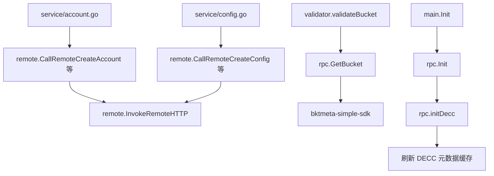

# Remote Integrations

## 模块概览

Remote Integrations 模块负责把 account 服务连接到外部 HTTP/RPC 系统，主要包含三类能力：

1. 通过 `src/remote/http_utils.go` 转发账号和配置变更请求到远端 HTTP 服务。
2. 通过 `src/rpc/bucket.go` 调用 bktmeta SDK 查询 Bucket 信息，供配置校验使用。
3. 通过 `src/rpc/decc.go` 初始化 DECC Kitex 客户端，并周期性刷新账号品类可嵌入元数据缓存。

整体上，这个模块不直接处理业务规则，而是作为 service、validator 与外部系统之间的集成层。



## HTTP 远端调用

HTTP 集成代码位于 `src/remote/http_utils.go`，核心入口是：

```go
func InvokeRemoteHTTP(ctx *gin.Context, method, path, data string) (interface{}, error)
```

它负责执行实际 HTTP 请求，其他 `CallRemote...` 函数都是围绕它的业务方法封装。

### 请求构造

`InvokeRemoteHTTP` 会从当前 `gin.Context` 中读取所有请求头，并原样设置到远端请求中：

```go
header := make(map[string]string)
for k := range ctx.Request.Header {
    header[k] = ctx.GetHeader(k)
}
req := HttpRequest.NewRequest()
req.SetHeaders(header)
```

这意味着上游请求中的鉴权、trace、IDC 或其他网关注入头会被透传给远端服务。调用方不需要手动传 header。

请求体由 `data string` 提供，并通过 `github.com/kirinlabs/HttpRequest` 的 JSON 模式发送：

```go
res, err = req.JSON().Post(path, data)
res, err = req.JSON().Put(path, data)
res, err = req.JSON().Delete(path, data)
```

当前只支持 `"POST"`、`"PUT"`、`"DELETE"` 三种 method。其他 method 会返回 `Unknown HTTP Method` 错误。

### 响应约定

`InvokeRemoteHTTP` 对远端响应有两层判断：

1. HTTP 状态码必须是 `http.StatusOK`。
2. 响应 JSON 中的 `code` 必须等于 `errno.CodeOK`。

响应体会被解析为 `simplejson.Json`：

```go
resp, _ := simplejson.NewJson(body)
code, _ := resp.Get("code").Int()
if code != errno.CodeOK {
    logs.CtxError(ctx, "remote execute failed, resp: %v", resp)
    return nil, serverErr
}

return resp.Get("data"), nil
```

成功时返回的是响应中的 `data` 节点，而不是完整响应对象。

### 错误语义

模块内定义了两个包级错误：

```go
var (
    callErr   = errors.New("http call method failed")
    serverErr = errors.New("server process failed")
)
```

`InvokeRemoteHTTP` 中：

- 网络调用失败，或 HTTP 状态码不是 200，返回 `callErr`。
- HTTP 调用成功但业务 `code != errno.CodeOK`，返回 `serverErr`。

但外层 `CallRemote...` 方法捕获任意错误后通常都会记录日志并统一返回 `callErr`。因此 service 层多数情况下只能感知“远端调用失败”，无法区分远端业务失败和网络失败。

## 账号远端调用

账号相关封装包括：

```go
func CallRemoteCreateAccount(ctx *gin.Context, path string, param []byte) (interface{}, error)
func CallRemoteUpdateAccount(ctx *gin.Context, path string, param []byte) (interface{}, error)
func CallRemoteUpdateAccountStatus(ctx *gin.Context, path string, param []byte) (interface{}, error)
```

它们的共同模式是：

1. 将 `param []byte` 转成字符串。
2. 使用 `fmt.Sprintf(path, "...")` 填充远端方法名。
3. 调用 `InvokeRemoteHTTP`。
4. 失败时记录包含参数的上下文日志。

对应关系如下：

| 函数 | 远端方法名 | HTTP 方法 | 主要调用方 |
| --- | --- | --- | --- |
| `CallRemoteCreateAccount` | `AccountCreateAccount` | `POST` | `CreateAccount` |
| `CallRemoteUpdateAccount` | `AccountUpdateAccount` | `PUT` | `UpdateAccount` |
| `CallRemoteUpdateAccountStatus` | `AccountUpdateAccountStatus` | `PUT` | `UpdateAccountStatus` |

`path` 不是最终 URL，而是一个格式化模板，必须能被 `fmt.Sprintf(path, methodName)` 正确填充。

## 配置远端调用

配置相关封装包括：

```go
func CallRemoteCreateConfig(ctx *gin.Context, path string, param []byte) (interface{}, error)
func CallRemoteCopyConfig(ctx *gin.Context, path string, param []byte) (interface{}, error)
func CallRemoteUpdateConfig(ctx *gin.Context, path string, param []byte) (interface{}, error)
func CallRemoteDeleteConfig(ctx *gin.Context, path string, param []byte) (interface{}, error)
```

对应关系如下：

| 函数 | 远端方法名 | HTTP 方法 | 主要调用方 |
| --- | --- | --- | --- |
| `CallRemoteCreateConfig` | `AccountMCreateConfig` | `POST` | `MCreateConfig` |
| `CallRemoteCopyConfig` | `AccountMCopyConfig` | `POST` | `MCopyConfig` |
| `CallRemoteUpdateConfig` | `AccountMCreateConfig` | `PUT` | `MUpdateConfig` |
| `CallRemoteDeleteConfig` | `AccountMDeleteConfig` | `POST` | `DeleteConfig` |

注意：`CallRemoteUpdateConfig` 使用的远端方法名也是 `AccountMCreateConfig`，区别在于 HTTP 方法是 `PUT`。如果远端服务按方法名区分操作，修改这里前需要确认兼容性。

## 默认 Region 补齐

配置创建、更新和复制调用在转发前会补齐 region 字段。

### `AddDefaultRegionToUpdateConfigRequest`

```go
func AddDefaultRegionToUpdateConfigRequest(param []byte) (string, error)
```

该函数将参数反序列化为 `dto.MUpdateConfigRequest`。如果 `req.Region` 为空，则使用当前 IDC 推导默认 region：

```go
if req.Region == "" {
    req.Region = util.GetRegion(env.IDC())
}
```

随后重新序列化为 JSON 字符串。

调用它的函数包括：

- `CallRemoteCreateConfig`
- `CallRemoteUpdateConfig`

### `AddDefaultRegionToCopyConfigRequest`

```go
func AddDefaultRegionToCopyConfigRequest(param []byte) (string, error)
```

该函数将参数反序列化为 `dto.MCopyConfigRequest`。如果 `req.SourceRegion` 为空，则同样通过 `util.GetRegion(env.IDC())` 补齐：

```go
if req.SourceRegion == "" {
    req.SourceRegion = util.GetRegion(env.IDC())
}
```

调用它的函数是 `CallRemoteCopyConfig`。

这两个函数会在 JSON 解析或序列化失败时直接返回错误。外层调用函数不会把这类错误包装成 `callErr`，因此调用方可以识别参数结构问题。

## Bucket RPC 集成

Bucket 查询位于 `src/rpc/bucket.go`：

```go
var BktCli *bktClient.Client

func GetBucket(ctx context.Context, bucketName string) (*model.BucketInfo, error) {
    return BktCli.GetBucket(ctx, bucketName)
}
```

`BktCli` 在 `rpc.Init()` 中初始化：

```go
BktCli, err = bktClient.NewClient(
    bktClient.WithCallingPSM("toutiao.videoarch.account"),
)
```

该能力主要被配置校验链路使用：

```text
MUpdateConfig
  -> ValidateMUpdateConfigRequest
  -> ValidateMCreateConfigRequest
  -> validateConfigs
  -> validateStorageConfig
  -> validateBucket
  -> rpc.GetBucket
```

`BPMCreateConfigs` 也会通过同一条校验链路调用 `GetBucket`。

因此，Bucket RPC 的可用性会影响配置创建、更新以及 BPM 批量创建配置等流程的校验结果。

## RPC 初始化

RPC 模块统一入口是 `src/rpc/base.go`：

```go
func Init()
```

它完成两件事：

1. 初始化 bktmeta 客户端 `BktCli`。
2. 调用 `initDecc()` 初始化 DECC 集成。

调用方包括：

- `main`
- 测试中的 `TestMain`

如果 bktmeta 客户端初始化失败，代码只记录错误日志，不会阻断服务启动：

```go
if err != nil {
    logs.Errorf("init bktmeta client error: %v", err)
}
```

后续如果调用 `GetBucket`，需要确保 `BktCli` 已成功初始化，否则会有空指针风险。

## DECC 集成与缓存刷新

DECC 相关逻辑位于 `src/rpc/decc.go`。它用于从 DECC channel integration 服务拉取 TOS channel data，并提取可嵌入的 metadata 字段名，缓存在进程内：

```go
var accountCategoryEmbeddedMeta map[string]struct{}

func GetAccountDeccEmbeddedMeta() map[string]struct{} {
    return accountCategoryEmbeddedMeta
}
```

该缓存被 `GetDeccEmbeddedSchema` 使用，用于账号品类 schema 相关逻辑。

### 初始化开关

`initDecc()` 会先检查配置：

```go
if config.Conf.Decc.Switch {
    ...
} else {
    logs.Info("current idc not support decc")
}
```

只有 `config.Conf.Decc.Switch` 为 true 时才会创建 Kitex 客户端：

```go
deccCli, err = channelintegrationservice.NewClient(
    config.Conf.Decc.PSM,
    client.WithCluster(config.Conf.Decc.Cluster),
    client.WithRPCTimeout(timeout),
    client.WithConnectTimeout(timeout),
)
```

超时时间由常量 `timeout = 10 * time.Second` 控制。

### 刷新流程

`startDeccMetaCacheRefresh` 会先同步刷新一次缓存，然后启动 goroutine 按 ticker 周期刷新：

```go
startDeccMetaCacheRefresh(
    time.NewTicker(util.RandomCacheExpireTime(10 * time.Minute)),
)
```

刷新链路如下：

```text
initDecc
  -> startDeccMetaCacheRefresh
  -> refreshDeccAccountCategoryEmbeddedMetadata
  -> getBucketEmbeddedMetadata
  -> getAllChannels
  -> getAllChannelData
```

其中 `util.RandomCacheExpireTime(10 * time.Minute)` 用来生成带随机偏移的刷新周期，避免多实例同时集中请求 DECC。

### 元数据提取

`getBucketEmbeddedMetadata` 的核心逻辑是：

1. 调用 `getAllChannels` 获取全部非 deprecated 的 TOS channel。
2. 对每个 channel 并发调用 `getAllChannelData`。
3. 对每条 channel data 的 `Idl` 字段做两层 JSON 解析。
4. 将 `content` JSON 中的 key 作为 embedded metadata 名称写入集合。

并发限制通过容量为 5 的 channel 实现：

```go
ch := make(chan struct{}, 5)
```

最终结果先写入 `sync.Map`，再转换成普通 `map[string]string`。刷新成功后，`refreshDeccAccountCategoryEmbeddedMetadata` 会构造新的 `map[string]struct{}` 并整体替换 `accountCategoryEmbeddedMeta`。

### Channel 分页

`getAllChannels` 使用分页接口拉取 channel：

```go
req := &decc.GetChannelListResquest{
    ChannelType: "TOS",
    Page:        int32(i),
    Limit:       channelPageSize,
}
```

相关分页常量：

```go
const (
    channelPageSize = 100
    dataPageSize    = 30
    maxPageNum      = 10000
)
```

当响应中的 `Channel` 为空时停止分页。状态为 `"deprecated"` 的 channel 会被跳过。

如果 `deccCli == nil`，`getAllChannels` 返回空列表而不是错误：

```go
if deccCli == nil {
    return []*decc.Channel{}, nil
}
```

这使得 DECC 未启用时刷新流程可以自然得到空缓存。

### Channel Data 分页

`getAllChannelData` 先分页获取 channel data 列表，再对每条非 deprecated 数据调用详情接口：

```go
data, err := deccCli.GetChannelData(
    ctx,
    &decc.GetChannelDataResquest{DataID: d.Id},
)
```

详情接口失败时会跳过该条数据并继续处理其他数据：

```go
if err != nil {
    continue
}
```

因此单条 channel data 读取失败不会导致整个刷新失败；但分页列表接口失败或 `BaseResp.StatusCode != 0` 会返回错误并终止当前 channel 的数据拉取。

## 与业务层的连接

Remote Integrations 模块被业务层以三种方式使用：

| 调用方 | 集成函数 | 作用 |
| --- | --- | --- |
| `CreateAccount` | `CallRemoteCreateAccount` | 创建账号后同步远端账号系统 |
| `UpdateAccount` | `CallRemoteUpdateAccount` | 更新远端账号信息 |
| `UpdateAccountStatus` | `CallRemoteUpdateAccountStatus` | 更新远端账号状态 |
| `MCreateConfig` | `CallRemoteCreateConfig` | 创建配置并转发远端 |
| `MCopyConfig` | `CallRemoteCopyConfig` | 复制配置并转发远端 |
| `MUpdateConfig` | `CallRemoteUpdateConfig` | 更新配置并转发远端 |
| `DeleteConfig` | `CallRemoteDeleteConfig` | 删除配置并转发远端 |
| `validateBucket` | `GetBucket` | 校验存储配置中的 bucket 是否有效 |
| `GetDeccEmbeddedSchema` | `GetAccountDeccEmbeddedMeta` | 获取 DECC 缓存中的 embedded metadata 集合 |

## 贡献注意事项

修改 HTTP 集成时，需要保持远端响应格式约定：`InvokeRemoteHTTP` 只认 `code` 和 `data` 字段。如果远端协议变化，应优先在这里集中适配，避免在各个 `CallRemote...` 函数中分散处理。

新增远端方法时，建议沿用现有封装模式：

```go
func CallRemoteXxx(ctx *gin.Context, path string, param []byte) (interface{}, error) {
    val := string(param)
    path = fmt.Sprintf(path, "AccountXxx")

    res, err := InvokeRemoteHTTP(ctx, "POST", path, val)
    if err != nil {
        logs.CtxError(ctx, "call xxx method failed, err: %v, param: %s", err, val)
        return nil, callErr
    }
    return res, nil
}
```

如果请求需要默认 region，应先复用或扩展 `AddDefaultRegionToUpdateConfigRequest`、`AddDefaultRegionToCopyConfigRequest` 的模式，基于 DTO 做结构化 JSON 处理，不要直接拼接字符串。

修改 DECC 缓存逻辑时，需要注意 `accountCategoryEmbeddedMeta` 是进程内全局变量，目前刷新时采用整体替换 map 的方式。读取方通过 `GetAccountDeccEmbeddedMeta` 直接拿到 map 引用，因此如果后续需要在运行时修改 map 内容，应考虑并发读写安全。

修改 `rpc.Init()` 时，需要评估启动链路影响。当前 bktmeta 初始化失败不会阻断启动，而 DECC 初始化失败也只记录日志并返回。改变这种容错行为会影响 `main` 启动路径和测试初始化路径。