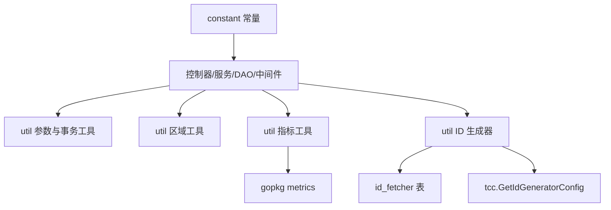

# Shared Utilities

# 共享工具模块

共享工具模块由 `src/constant` 和 `src/util` 组成，提供跨服务复用的常量、请求参数解析、区域归一化、事务辅助、指标上报、限流客户端初始化、本地缓存和 ID 号段生成能力。它不承载业务流程本身，而是被 `service`、`dao`、`middleware`、`validator`、`remote`、`rpc` 和 `main` 等层调用。



## 常量定义

`src/constant/const.go` 集中维护跨模块共享的字符串、枚举和默认值，避免业务代码散落硬编码。

常用状态包括：

- `StatusEnabled`
- `StatusDisabled`
- `StatusDeleted`
- `StatusUnaudited`

`StatusList` 汇总了账号状态列表，适合用于参数校验或枚举判断。

模块枚举包括：

- `ModuleGlobal`
- `ModuleUpload`
- `ModuleTranscode`
- `ModulePlay`
- `ModulePicture`
- `ModuleTasks`
- `ModuleStorage`
- `ModuleOpenAPI`
- `ModuleAccess`
- `ModuleStorageGW`
- `ModuleGeneral`
- `ModuleMedia`
- `ModuleBizCallback`

`ModuleList` 是所有模块名的统一列表。

OpenAPI 权限映射由 `OpenapiMethodPermission` 维护：

```go
var OpenapiMethodPermission = map[string]string{
    "openapi.accounts.get":    "account.openapi.get",
    "openapi.accounts.modify": "account.openapi.modify",
}
```

分页默认值定义为：

- `DefaultPageSize = 20`
- `DefaultAmount = 0`
- `MaxPageSize = 50`

HTTP 头常量包括 `HeaderAuthorization`、`HeaderRealIP`、`HeaderRateLimitLimit`、`HeaderRateLimitRemaining` 和 `HeaderRateLimitReset`，用于鉴权、真实 IP 和限流响应头处理。

## Gin 参数解析

`src/util/common.go` 提供对 `gin.Context` 的轻量参数解析函数。它们只负责读取和类型转换，不做业务校验。

查询参数函数：

- `QueryInt64(c, key)`
- `QueryUInt64(c, key)`
- `QueryBool(c, key)`
- `QueryString(c, key)`
- `QueryInt64Slice(c, key)`

路径参数函数：

- `ParamInt64(c, key)`
- `ParamUInt64(c, key)`
- `ParamString(c, key)`

`QueryString` 和 `ParamString` 在值为空字符串时返回 `*ErrEmpty`：

```go
type ErrEmpty struct {
    key string
}

func (err *ErrEmpty) Error() string {
    return fmt.Sprintf("%s is empty", err.key)
}
```

使用模式通常是控制器或服务层先解析参数，再进入业务逻辑。例如 `DeleteAccess` 调用 `ParamInt64` 解析路径参数，`UpdateAccountStatus` 调用 `ParamString` 读取状态类参数。

需要注意：数值解析函数直接调用 `strconv.ParseInt` 或 `strconv.ParseUint`。如果参数缺失，传入的是空字符串，最终会返回解析错误，而不是 `ErrEmpty`。

## 随机时间扰动

`RandomCacheExpireTime(cacheExpireTime)` 和 `RandomWaitTime(cacheExpireTime)` 用于减少缓存或等待行为的集中触发。

`RandomCacheExpireTime` 在原始 TTL 基础上加入随机扰动：

```go
inc := int64((random.Float64() - 0.5) * 2 * randFactor * float64(cacheExpireTime))
return cacheExpireTime + time.Duration(inc)
```

当前 `randFactor = 0.5`，所以返回范围约为：

```text
ttl * 0.5 到 ttl * 1.5
```

`RandomWaitTime` 返回 `0` 到 `cacheExpireTime` 之间的随机等待时间。调用方包括 `initDecc` 等初始化流程，用于错峰刷新或错峰等待。

## 区域归一化

`src/util/region.go` 把底层 IDC 名称归一化为账号系统使用的区域标识。核心函数是：

- `GetRegion(idc string) string`
- `IsRegionSupported(idc string) bool`
- `IsInnerProdEnv(idc string) bool`
- `GetSyncIDCs(syncInfo string) []string`

`GetRegion` 的行为：

1. 如果传入 `R_ALL`，直接返回 `"all"`。
2. 如果传入空字符串，返回当前运行环境 IDC 对应的默认区域。
3. 如果 `regionMapping` 中存在传入 IDC 的小写形式，返回映射后的区域。
4. 否则回退到默认区域。

默认区域通过 `getDefaultRegion` 计算，并使用 `atomic.Value` 缓存：

```go
defaultRegion.Store(regionMapping[env.IDC()])
```

区域工具被配置、域名和远程请求逻辑使用。例如：

- `CreateDomain` 校验创建域名请求时通过 `GetRegion` 获取默认区域。
- `ListConfigsByCondition` 解析查询条件时通过 `GetRegion` 补齐区域。
- `MUpdateConfig` 的校验链路会调用 `IsRegionSupported` 判断区域是否合法。
- `AddDefaultRegionToUpdateConfigRequest` 在远程请求中补默认区域。

`GetSyncIDCs(syncInfo)` 接收 JSON 字符串，解析为 `map[string]string` 后，把其中的区域键转换为 IDC 列表。它会将 key 转成大写后查询 `regionIDC`。

## 事务辅助

`src/util/tools.go` 中的 `BeginTX` 和 `RollbackTX` 是 GORM 事务的公共封装。

```go
func BeginTX(db *gorm.DB) (tx *gorm.DB, err error) {
    tx = db.Begin()
    if len(tx.GetErrors()) > 0 {
        err = tx.Error
    }
    return
}
```

`RollbackTX(tx, err)` 会执行回滚，并把原始错误和回滚错误合并返回：

- 如果回滚没有错误，返回原始错误。
- 如果原始错误为空，返回事务错误。
- 如果原始错误是 `gorm.Errors`，追加事务错误。
- 否则构造新的 `gorm.Errors`。

这些函数被 ID 号段生成器和 DAO 层复用。例如 `GenId`、`UpdateIdFetcher`、`CreateIdFetcher`、`createAccount` 都依赖这组事务工具。

## 重试工具

`RetryDo(ctx, info, times, run, stopErrors...)` 用于对可重试操作做固定次数重试。调用方传入 `RunFunc`：

```go
type RunFunc func() error
```

执行逻辑：

1. 最多执行 `times` 次。
2. 每次失败后通过 `logs.CtxError` 打印错误。
3. 第 2 次及以后执行前通过 `logs.CtxWarn` 打印重试日志。
4. 如果错误命中 `stopErrors`，立即停止重试并返回该错误。
5. 如果某次执行成功，直接返回 `nil`。

DAO 层的账号和访问密钥写入流程会使用它，例如 `createAccount`、`updateAccount`、`createAccess`、`deleteAccess`、`getAccountAmount`。

注意当前停止条件使用的是：

```go
if errors.Is(e, err) {
    return
}
```

因此调用方传入的 `stopErrors` 需要和实际错误匹配该方向的 `errors.Is` 判断。

## ID 号段生成器

`src/util/id_gen_util.go` 提供基于数据库表 `id_fetcher` 的 ID 号段分配能力。初始化入口是：

```go
func InitIdGenerator(db *gorm.DB) {
    idGenDb = db
}
```

`InitDb` 会调用 `InitIdGenerator` 注入数据库连接。后续 `GenId`、`ListIdFetchers`、`UpdateIdFetcher` 和 `CreateIdFetcher` 都依赖包级变量 `idGenDb`。

### 数据模型

`IdFetcher` 对应数据库表 `id_fetcher`：

```go
type IdFetcher struct {
    ID          uint64
    Region      string
    DBTableName string
    CurrentId   int64
    MaxId       int64
    CreateAt    time.Time
    UpdatedAt   time.Time
}
```

表名由 `TableName()` 固定返回：

```go
func (IdFetcher) TableName() string {
    return "id_fetcher"
}
```

`GetRemainingCount()` 返回当前号段剩余数量：

```go
return d.MaxId - d.CurrentId
```

### 生成 ID

`GenId(ctx, tableName, idCount)` 是核心分配函数。

执行流程：

1. 调用 `tcc.GetIdGeneratorConfig(ctx)` 读取 ID 生成配置。
2. 检查总开关、目标表是否支持、剩余量告警阈值是否存在。
3. 如果配置不满足，返回长度为 `idCount` 的零值数组，不报错。
4. 开启事务。
5. 使用 `select * from id_fetcher where region = ? and table_name = ? for update` 加行锁。
6. 判断 `MaxId - CurrentId` 是否足够分配。
7. 生成连续 ID：`CurrentId + 1` 到 `CurrentId + idCount`。
8. 更新 `id_fetcher.current_id`。
9. 提交事务。
10. 查询目标业务表，检查生成的 ID 是否已经存在。
11. 如果剩余 ID 小于等于阈值，通过 `logs.Errorf` 打告警日志。

事务内的行锁保证同一 `region + table_name` 的并发分配不会重复。事务提交后再检查业务表中是否已有冲突 ID，用于发现号段配置与真实数据不一致的问题。

配置未开启时返回零值数组是一个重要行为：调用方不能只根据 `err == nil` 判断是否拿到了有效 ID，还需要理解当前表是否启用了号段生成。

### 管理号段

`ListIdFetchers(ctx)` 返回所有 `id_fetcher` 记录。

`CreateIdFetcher(ctx, fetcher)` 创建新号段，流程是：

1. 调用 `validateFetcherParam` 校验 `Region`、`DBTableName`、`CurrentId` 和 `MaxId`。
2. 查询目标业务表，确认 `[CurrentId, MaxId]` 区间内没有已存在 ID。
3. 开启事务。
4. 调用 `tx.Create(fetcher)` 插入记录。
5. 提交事务。

`UpdateIdFetcher(ctx, fetcher)` 更新已有号段，流程类似，但会先对 `region + table_name` 对应记录加行锁，并校验数据库中的 `ID` 和请求中的 `fetcher.ID` 一致，避免误更新。

`validateFetcherParam(fetcher)` 的规则：

- `Region` 不能为空。
- `DBTableName` 不能为空。
- `MaxId` 必须大于 `CurrentId`。

## 指标上报

`src/util/metrics.go` 封装了 `gopkg/metrics` 的默认客户端：

```go
metricsClient = metrics.NewDefaultMetricsClientV2("toutiao.videoarch.account", true)
```

公共函数包括：

- `EmitThroughput(name, tags...)`
- `EmitLatency(name, start, tags...)`
- `EmitStore(name, value, tags...)`
- `EmitError(mkey, tags...)`

命名规则是给传入名称追加后缀：

```go
name + ".throughput"
name + ".latency"
name + ".store"
mkey + ".error"
```

`EmitLatency` 使用微秒作为耗时单位：

```go
cost := time.Since(start).Nanoseconds() / 1000
```

指标上报失败时只记录 warning，不中断业务流程。调用方包括：

- `middleware/access.go` 中的 `Response`、`OpenAPIResponse`
- `middleware/janus_access.go` 中的 `JanusResponse`
- `dao/account.go` 中的账号创建、更新、状态更新
- `dao/access.go` 中的访问密钥创建、查询、删除
- `service/account.go` 中的账号查询链路
- `controllers/account.go` 中的搜索接口

## 限流客户端

`src/util/rate_limit.go` 负责初始化 Harden 限流客户端：

```go
var HardenCli *harden.Client
```

`InitRateLimiter()` 使用运行配置构造客户端：

```go
HardenCli = harden.NewClient(
    config.Conf.Meta.PSM,
    harden.WithCluster(config.Conf.Harden.Cluster),
    harden.UseHTTP(),
    harden.WithTimeout(100*time.Millisecond),
    harden.PassOnErr(),
)
```

`main` 和测试初始化流程会调用 `InitRateLimiter`。`harden.PassOnErr()` 表示限流服务异常时放行请求，避免限流系统故障直接阻断主业务。

## 认证与格式工具

`ParseBaseAuth(auth)` 解析 HTTP Basic Auth 头：

1. 要求字符串以 `"Basic "` 开头。
2. 对后续内容做 base64 解码。
3. 按第一个 `:` 分割用户名和密码。
4. 返回 `(u, p, true)`。
5. 任一步失败都返回零值和 `false`。

示例：

```go
u, p, ok := util.ParseBaseAuth(authHeader)
if !ok {
    // 认证头格式非法
}
```

`FormatKV(key, value)` 返回 `key=value` 字符串，适合构造日志字段或简单配置片段。

`GetUUID()` 返回去掉连字符的 UUID 字符串：

```go
return strings.ReplaceAll(uuid.New().String(), "-", "")
```

## 环境与开关工具

`CheckIfSupportCreateProcess()` 根据当前 IDC 判断是否支持创建流程：

```go
if idc := env.IDC(); idc == env.DC_ALISG || idc == env.DC_MALIVA {
    return false
}
return true
```

`InitCheckSuffix()` 从 `config.Conf.CheckSuffix` 初始化包级原子变量 `checkSuffix`。

`NeedCheckAccountNameSuffix()` 读取当前后缀校验开关：

```go
return atomic.LoadInt32(&checkSuffix)
```

这组函数用于把运行环境和配置中心中的开关转换成业务层可直接读取的状态。

## 本地缓存

`LocalCache` 是一个基于 `sync.Map` 的简单内存缓存：

```go
type LocalCache struct {
    m sync.Map
    t sync.Map
}
```

其中：

- `m` 存储 key 到 value。
- `t` 存储 key 到过期时间。

方法包括：

- `Add(key, value, expiresAt)`
- `Delete(key)`
- `Get(key)`
- `GetIncludeExpired(key)`

`Get` 会检查过期时间：

```go
if expire.(time.Time).Sub(time.Now()) >= 0 {
    return v, ok
}
return nil, false
```

如果 key 没有对应过期时间，则只要 `m` 中存在值就返回。`GetIncludeExpired` 不检查过期时间，直接读取原始值。

需要注意：`Get` 发现过期后只返回 miss，不会主动删除 `m` 和 `t` 中的数据。如果缓存 key 数量持续增长，调用方需要自行在合适时机调用 `Delete` 或控制 key 空间。

## 与业务代码的连接方式

共享工具模块主要服务于以下几类调用链：

配置与区域校验链路：

```text
MUpdateConfig
  -> ValidateMUpdateConfigRequest
  -> ValidateMCreateConfigRequest
  -> ValidateRegion
  -> IsRegionSupported
```

域名创建区域补齐链路：

```text
CreateDomain
  -> ValidateCreateDomainRequest
  -> GetRegion
  -> getDefaultRegion
```

账号查询指标链路：

```text
MGetAllAccountWithConfig
  -> mGetAccountWithConfig1
  -> mgetAccountWithConfig
  -> EmitLatency
```

ID 分配链路：

```text
InitDb
  -> InitIdGenerator

业务创建逻辑
  -> GenId
  -> BeginTX
  -> IdFetcher.GetRemainingCount
  -> RollbackTX / Commit
```

中间件指标链路：

```text
Response / OpenAPIResponse / JanusResponse
  -> EmitThroughput / EmitLatency / EmitError
```

这些调用关系说明：`util` 包虽然没有复杂业务模型，但它位于多个关键路径上。修改区域映射、事务封装、指标命名、ID 生成行为或参数解析错误语义时，需要同时考虑控制器、服务、DAO、中间件和验证器的影响。

## 贡献注意事项

修改 `constant` 中的枚举时，应同步检查验证逻辑、数据库字段值、OpenAPI 入参和已有数据。特别是状态、模块名、区域名这类字符串，一旦变更会影响接口兼容性。

修改 `GetRegion` 或 `regionMapping` 时，需要确认默认区域回退行为是否仍符合预期。未知 IDC 当前会回退到默认区域，而不是返回错误。

修改 `GenId` 时，需要保持事务内行锁和 `CurrentId` 更新的原子性。`id_fetcher` 表是并发安全的核心边界，不能把 `for update` 查询和更新拆到不同事务中。

修改 `RollbackTX` 时，要注意 DAO 层依赖它返回组合错误。吞掉原始错误或回滚错误都会降低排障能力。

使用 `LocalCache` 时，不要假设它会自动清理过期 key。它适合小规模、本进程、可容忍短期脏数据的缓存场景，不适合作为强一致缓存或无限 key 空间缓存。

使用指标函数时，传入的 `name` 应保持稳定。因为最终指标名由函数追加 `.throughput`、`.latency`、`.store` 或 `.error`，调用方不应重复拼接这些后缀。