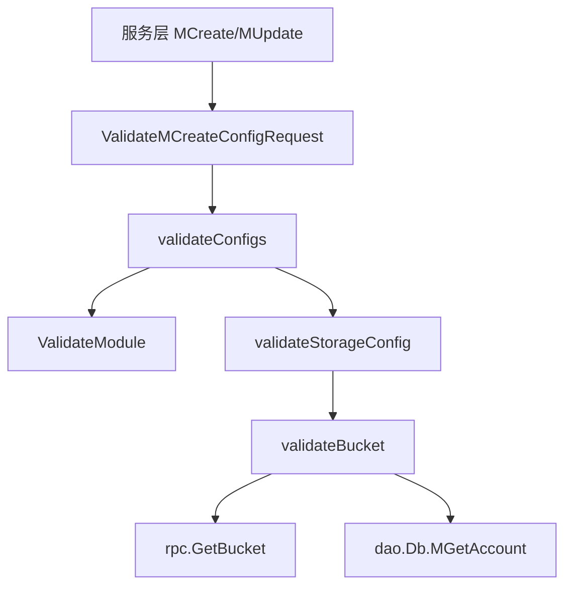

# Validation and Error Handling

## 模块概览

`src/errno` 和 `src/validator` 共同承担账号系统的错误表达与请求校验职责。

`errno.Payload` 是对外响应和内部错误传递的核心结构；它实现了 `error` 接口，因此同一个对象既可以作为业务错误返回，也可以被序列化为接口响应。`validator` 则集中处理账号、配置、域名、分类 schema 等写入类请求的参数校验，并在需要时访问 `dao.Db`、`rpc.GetBucket` 和 `util` 辅助函数完成跨模块校验。

## 错误模型

`errno.Payload` 定义在 `src/errno/code.go`：

```go
type Payload struct {
	Code    int         `json:"code"`
	Message string      `json:"message"`
	Data    interface{} `json:"data,omitempty"`
	Alert   bool        `json:"-"`
}
```

它的 `Error()` 方法返回 `Message`，所以所有预定义错误，例如 `errno.ErrAccountExists`、`errno.ErrRegionInvalid`、`errno.ErrAccessKeyNotExists`，都可以直接作为 `error` 返回。

常用构造函数：

- `OK(data interface{}) *Payload`：返回业务成功响应，`Code` 为 `CodeOK`，`Message` 为 `"ok"`。
- `Error(err error) *Payload`：将普通 `error` 包装成 `Payload`；如果 `err == nil`，返回 `OK(nil)`。
- `ErrorWithCode(code int, err error) *Payload`：用指定 code 包装错误。
- `ParseCBError(err error) error`：把 `gobreaker.ErrOpenState` 和 `gobreaker.ErrTooManyRequests` 转换成数据库熔断错误文案。

需要注意，`ErrAccountExists`、`ErrUnauthorized` 等预定义错误是包级 `*Payload` 指针。调用方应把它们当作只读错误使用，不应修改其中的 `Data`、`Message` 或 `Alert` 字段，否则会影响后续请求。

## 校验入口

`src/validator/validator.go` 提供多个面向 service 层的入口函数：

- `ValidateCreateAccountRequest`：创建账号前校验账号名、地域、账号后缀、重复账号和重复 AccessKey。
- `ValidateMCreateConfigRequest`：批量创建配置前校验 AccessKey、地域、账号存在性和配置内容。
- `ValidateMUpdateConfigRequest`：复用 `ValidateMCreateConfigRequest`，用于批量更新配置。
- `ValidateMCopyConfigRequest`：复制配置前校验源地域、目标地域、AccessKey 和模块列表。
- `ValidateCreateDomainRequest`：创建域名配置时校验域名、状态、类型，并补齐关系字段。
- `ValidateCreateDomainAccountRelRequest`：创建域名账号关系时校验域名、账号名，并补齐 region/category/module/rel type。
- `ValidateCreateAccountCategorySchemaRequest`：创建账号分类 schema 时校验账号、分类、schema 类型和值。
- `ValidateUpdateAccountCategorySchemaRequest`：更新 schema 时校验 ID 和嵌入元数据格式。
- `ValidateMCopyDomainAccountRelRequest`：复制域名账号关系时校验账号名和地域。
- `RefinePageParams`：规范分页参数，限制默认值和最大值。

基础枚举校验由 `ValidateStatus`、`ValidateRuleType`、`ValidateModule` 和 `ValidateRegion` 提供。它们依赖 `constant.StatusList`、`constant.ModuleList`、规则类型常量，以及 `util.IsRegionSupported`。

## 配置校验链路

配置写入的核心逻辑在 `validateConfigs`。它会遍历传入的 `[]*dto.VideoConfig`，先检查 `Module` 是否在允许列表中，再按模块类型执行更深层校验。



`validateConfigs` 的主要行为：

1. 对每个 `dto.VideoConfig` 调用 `ValidateModule`。
2. 当 `ignoreCheckStorageConfig == false` 且模块是 `constant.ModuleStorage` 时，进入存储配置校验。
3. 首次需要存储校验时，通过 `getAccountExistBucketSet` 查询账号已有 bucket，用于兼容历史错误配置。
4. 当模块是 `constant.ModuleGlobal` 且 `CKey == constant.BucketSelectionStrategyCKey` 时，尝试把 `CValue` 反序列化为 `dto.BucketSelectionStrategy`，失败则返回 `CodeBadRequest`。

`ValidateCreateAccountRequest` 调用 `validateConfigs` 时传入 `ignoreCheckStorageConfig = true`，因此新建账号阶段不会检查存储 bucket。`ValidateMCreateConfigRequest` 和 `ValidateMUpdateConfigRequest` 是否检查存储配置由调用方传入的 `ignoreCheckStorageConfig` 决定。

## 存储 Bucket 校验

`validateStorageConfig` 负责解析存储配置并逐个校验 bucket。它兼容三类历史格式：

- `CKey == "bucket"`：直接跳过校验。
- `CKey` 包含 `"migrater_rules"`：直接跳过校验。
- `CValue` 是普通 bucket 名：反序列化 `dto.StorageConfig` 失败时，按单个 bucket 名处理。
- `CValue` 是 JSON：按 `dto.StorageConfig.IDC` 和 `dto.StorageConfig.Default` 中的 bucket 列表逐个处理。

对于账号已有 bucket，`validateStorageConfig` 会直接放行。这是为了兼容历史上已经配置过但不符合当前规则的 bucket。

真正的跨账号安全校验在 `validateBucket` 中完成：

1. 如果 `rpc.BktCli == nil`，直接放行。
2. 调用 `rpc.GetBucket(ctx, bucketName)` 获取 bucket 信息。
3. bucket 不存在时返回 `CodeBadRequest`，消息为 `bucket: <name> not found`。
4. 远程查询失败时返回 `CodeInternalErr`。
5. 查询当前账号信息。
6. 调用 `validateHasOwnerBucketConfig` 校验 bucket owner。
7. 如果 owner 为空或 owner 账号不存在，再调用 `validateEmptyOwnerBucketConfig` 按已有配置判断是否允许复用。

跨 TopAccount 的限制有两条：

- bucket 有 owner 时，只有 owner 账号本身或相同 `TopAccountID` 的账号可以使用。
- bucket 没有有效 owner 时，如果它已经被其他账号配置过，也只能被相同账号或相同 `TopAccountID` 的账号继续使用。

`getOneExistConfig` 使用 `dao.Db.MGetStorageConfigByBucketName` 查询历史配置，并再次解析 `CValue`，避免因为数据库 `like` 查询把 `tos-cn-v-5` 和 `tos-cn-v-51` 这类前缀匹配结果混淆。

## 账号创建校验

`ValidateCreateAccountRequest` 的顺序很重要：

1. 先调用 `validateConfigs` 校验随账号创建传入的配置，但跳过存储 bucket 检查。
2. 校验 `AccountName` 非空，且不能以 `"__"` 开头。
3. 调用 `ValidateRegion` 校验地域；失败时返回 `errno.ErrRegionMissing`，而不是 `ErrRegionInvalid`。
4. 当 `util.NeedCheckAccountNameSuffix() == constant.NeedCheckSuffix` 时，账号名必须以 `env.IDC()` 结尾。
5. 通过 `dao.Db.MGetVideoAccount` 检查账号名是否已存在，包含已删除账号。
6. 如果请求指定了 `AccessKey`，再次查询并确保 AccessKey 未被其他账号使用。

这意味着账号名冲突和 AccessKey 冲突都会返回 `errno.ErrAccountExists`。

## 域名与关系校验

`ValidateCreateDomainRequest` 校验 `dto.Domain` 本身，并标准化其 `AccountRels`：

- `Domain` 不能为空。
- `Status` 不能为空。
- `Type` 不能大于 `dto.InternalPrivateDomain`。
- 每个关系的 `Region` 会被 `util.GetRegion` 归一化。
- 空 `Category` 会补为 `dto.DomainDefaultCategory`。
- 空 `Module` 会补为 `dto.DomainDefaultModule`。
- `RelType` 通过 `dto.BuildDomainRelTypeFromConfig(rel.Region, rel.Module)` 生成。

`ValidateCreateDomainAccountRelRequest` 处理单条 `dto.DomainAccountRel`。它会先 trim `Domain`，再通过 `dao.Db.GetDomain` 确认域名存在，并把 `DomainType` 设置为数据库中的类型。默认情况下还会通过 `dao.Db.MGetAccount` 校验账号存在；当 `ignoreCheckAccountName == true` 时跳过账号存在性检查。

## 分类 Schema 校验

`ValidateCreateAccountCategorySchemaRequest` 校验 `dto.AccountCategorySchema`：

- `AccountName` 不能为空。
- `Category` 不能为空。
- 如果 `SchemaType == dto.SchemaEmbeddedMetadata`，调用 `checkEmbeddedMetadataValue` 校验 `SchemaValue` 能否反序列化为 `dto.EmbeddedMetadataSchema`。
- 通过 `dao.Db.MGetAccount` 确认账号存在。
- `SchemaType` 必须存在于 `dto.SchemaTypeAllowList`。

`ValidateUpdateAccountCategorySchemaRequest` 只要求 `ID != 0`，并在嵌入元数据类型下复用 `checkEmbeddedMetadataValue`。它不会检查账号是否存在，也不会检查 `SchemaTypeAllowList`。

## 与其他层的关系

service 层在执行写操作前调用 validator。典型链路包括：

- `service/account.go` 的 `CreateAccount` 调用 `ValidateCreateAccountRequest`，成功后用 `errno.OK` 返回响应。
- `service/config.go` 的 `MUpdateConfig` 调用 `ValidateMUpdateConfigRequest`，再进入配置更新流程。
- `service/bpm.go` 的 `BPMCreateConfigs` 调用 `ValidateMCreateConfigRequest`，配置校验可能继续访问 bucket 元数据服务。

dao 层大量使用 `errno.ParseCBError` 将 `gobreaker` 的熔断状态转换为统一错误，例如账号、配置、权限、AccessKey 和分类 schema 的数据访问函数。

middleware 和 service 层使用 `errno.OK`、`errno.ErrorWithCode` 生成接口响应，例如 `OpenAPIResponse`、`JanusResponse`、`HandleRateLimiterError` 和 `GetAccess`。

## 贡献注意事项

新增校验逻辑时，应优先返回已有的 `errno.Payload`，只有消息需要携带上下文时再构造新的 `&errno.Payload{Code: ..., Message: ...}`。

修改配置校验时要特别关注 `validateConfigs -> validateStorageConfig -> validateBucket` 这条链路。它会访问数据库和远程 bucket 服务，且直接影响 `MCreateConfig`、`MUpdateConfig`、`BPMCreateConfigs` 等写入流程。

处理 region 错误时要保持现有语义：`ValidateRegion` 本身返回 `errno.ErrRegionInvalid`，但多个请求入口会把它转换为 `errno.ErrRegionMissing`。这不是等价命名，而是当前接口对外错误码约定的一部分。

不要把预定义的 `*errno.Payload` 当作临时响应对象修改；需要附加数据时应创建新的 `Payload`，避免包级错误对象被污染。