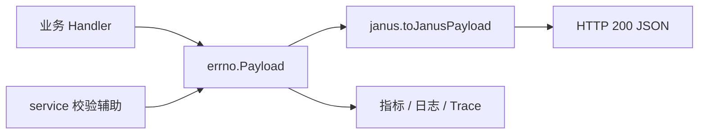

# API DTOs and Responses

## 模块概览

API DTOs and Responses 模块定义接口层使用的数据传输结构、统一业务响应体、Janus 网关响应适配，以及创建 Bucket 时的响应与校验辅助逻辑。核心约定是：业务处理函数返回 `errno.Payload`，中间件再根据接入面把它包装成最终 HTTP JSON。



## DTO 结构

### `BucketSimpleInfo`

定义在 `dto/page.go`，用于分页查询 Bucket 列表的轻量结果。

```go
type BucketSimpleInfo struct {
    Name     string `gorm:"column:name" json:"name"`
    Creator  string `gorm:"column:creator" json:"creator"`
    IDC      string `gorm:"column:idc" json:"idc"`
    Category string `gorm:"column:category" json:"category"`
}
```

字段同时带有 `gorm` 和 `json` tag，说明它既可直接承接数据库查询结果，也可作为 API 响应序列化对象。`IDC` 表示当前 Bucket 配置中心。

### `PageBucketsResponse`

定义分页列表响应：

```go
type PageBucketsResponse struct {
    Buckets    []*BucketSimpleInfo `json:"buckets"`
    TotalCount int64               `json:"totalCount"`
}
```

`Buckets` 保存当前页数据，`TotalCount` 保存总数。调用方通常将它作为 `errno.OK(data)` 的 `Data` 返回。

### `TempBucket`

定义在 `dto/tempBucket.go`：

```go
type TempBucket struct {
    meta.Bucket
    SysTicketID  uint64 `gorm:"column:sys_ticket_id" json:"sys_ticket_id"`
    TicketStatus int8   `gorm:"ticket_status" json:"ticket_status"`
    ExpiredAt    int64  `gorm:"expired_at" json:"expired_at"`
}
```

`TempBucket` 嵌入 `meta.Bucket`，并追加工单相关字段。它用于临时 Bucket 或审批流程场景，调用关系中可见 `createAndUpdateTosBucket`、`GetValidTempBucketByName`、`UpdateTicketStatusByName`、`DeleteTempBucket` 等逻辑依赖该结构。

注意 `TicketStatus` 的 `gorm` tag 写法是 `gorm:"ticket_status"`，不同于其他字段的 `gorm:"column:..."` 风格；修改映射逻辑时需要确认 GORM 行为是否符合预期。

## 统一业务响应：`errno.Payload`

`errno.Payload` 是服务内部统一返回结构：

```go
type Payload struct {
    Code    int         `json:"code"`
    Message string      `json:"message"`
    Data    interface{} `json:"data,omitempty"`
    ETag    string      `json:"etag,omitempty"`
    Alert   bool        `json:"-"`
}
```

字段含义：

- `Code`：业务状态码，不等同于 HTTP 状态码。
- `Message`：业务状态说明或错误信息。
- `Data`：响应数据，空值时不输出。
- `ETag`：缓存或版本校验标识，空值时不输出。
- `Alert`：内部标记，不参与 JSON 序列化。

成功响应通过 `OK` 或 `OKWithETag` 创建：

```go
payload := errno.OK(dto.PageBucketsResponse{
    Buckets:    buckets,
    TotalCount: total,
})
```

```go
payload := errno.OKWithETag(data, etag)
```

错误响应有三类构造方式：

```go
errno.Error(err)
errno.ErrorWithCode(errno.CodeBadRequest, err)
errno.ErrorWithCodeAndData(errno.CodeBadRequest, err, detail)
```

`Error(nil)` 会返回 `OK(nil)`。非空错误会返回 `Code: 600` 和 `err.Error()`；如果需要稳定的业务错误码，应优先使用 `ErrorWithCode` 或预定义错误。

`Payload` 上的 `Error()` 方法返回的是 `error`：

```go
func (p *Payload) Error() error {
    return errors.New(p.Message)
}
```

这不是 Go 标准 `error` 接口要求的 `Error() string`，因此 `Payload` 本身不实现 `error`。它只是一个把 `Payload.Message` 转成 `error` 的辅助方法。

## 错误码与预定义错误

`errno/error.go` 定义了业务错误码。主要分组如下：

- 成功类：`CodeOKZero`、`CodeOK`、`CodeCreated`、`CodePartialContent`
- 请求错误：`CodeBadRequest`、`CodeUnauthorized`、`CodeForbidden`、`CodeNotFound`、`CodeTooManyRequests`
- 服务错误：`CodeInternalErr`、`CodeServiceUnavailable`、`CodeVsreErr`、`CodeGetDataErr`、`CodeParseDataErr`、`CodeDbErr`

预定义错误以 `Payload` 变量形式存在，例如：

```go
var ErrBucketNotFound = Payload{
    Code:    CodeNotFound,
    Message: "bucket not found",
}
```

这些变量适合用于稳定、可复用的业务失败场景，例如鉴权失败、Bucket 不存在、参数非法、DB 熔断、VSRE 异常等。由于它们是包级变量，业务代码如果需要携带请求级 `Data`，应创建新的 `Payload`，不要修改这些全局变量。

## Janus 响应适配

`janus/response.go` 将内部 `errno.Payload` 转换为 Janus 接口格式：

```go
type JanusPayload struct {
    Code      int         `json:"code"`
    Message   string      `json:"message"`
    RequestId string      `json:"trace_id"`
    Response  interface{} `json:"response"`
}
```

转换逻辑在 `toJanusPayload` 中：

```go
func toJanusPayload(c *gin.Context, p errno.Payload) JanusPayload {
    if p.Code == errno.CodeOK {
        jp.Code = JanusOkCode
    } else {
        jp.Code = p.Code
    }

    jp.Message = p.Message
    jp.Response = p.Data
    return jp
}
```

内部成功码 `errno.CodeOK` 是 `2000`，Janus 成功码是 `0`。因此 Janus 调用方看到的成功响应为：

```json
{
  "code": 0,
  "message": "ok",
  "response": {}
}
```

失败时，Janus 保留原始业务错误码：

```json
{
  "code": 4004,
  "message": "bucket not found",
  "response": null
}
```

`ResponseMiddleware` 是实际输出响应的 Gin 中间件。它从 `middleware.ResultDataContextKey` 读取 `errno.Payload`，禁用缓存，然后以 HTTP 200 写出 Janus JSON：

```go
dataRet, _ := c.Get(middleware.ResultDataContextKey)
data := dataRet.(errno.Payload)

c.Writer.Header().Set("Cache-Control", "max-age=0, no-cache, no-store, must-revalidate, proxy-revalidate")
c.Writer.Header().Set("Pragma", "no-cache")
c.Writer.Header().Set("Expires", "0")
c.JSON(http.StatusOK, toJanusPayload(c, data))
```

该中间件还会：

- 从 `middleware.MKeyContextKey` 读取接口指标名。
- 从 `PSM` 上下文值读取来源服务，缺省为 `"unknown"`。
- 调用 `util.EmitLatency`、`util.EmitThroughput`、`util.EmitError` 上报指标。
- 设置 BytedTrace span 名称、来源服务、业务状态码。
- 当 `data.Code != errno.CodeOK` 时按错误码级别写日志；`CodeInternalErr` 及以上写 error，其余写 warn。

使用该中间件的 Handler 必须保证在上下文中写入 `middleware.ResultDataContextKey`，且值类型必须是 `errno.Payload`，否则这里的类型断言会 panic。

## Service 响应与 Bucket 校验

`service/response.go` 中的公开响应结构是 `CreateBucketResponse`：

```go
type CreateBucketResponse struct {
    AccessKey string `json:"access_key"`
    SecretKey string `json:"secret_key"`
}
```

它被 `createBucket`、`handleCreateBucketWithAkSkRequest` 等创建 Bucket 流程使用，通常作为 `errno.Payload.Data` 返回。

同一文件还包含创建或更新 Bucket 前的校验与默认 IDC 配置补齐逻辑。

### `validateBkt`

`validateBkt(b *meta.Bucket) error` 负责校验并规范化 `meta.Bucket`：

1. `Name` 不能为空。
2. `IDC` 为空时使用 `env.IDC()`。
3. `Providers` 为空时使用旧字段 `Owner`。
4. 调用 `checkBackendBucketBkt` 校验主 `BackendBucket`。
5. 遍历 `IdcConfigs`，补齐 `Name`，校验 `IDC` 非空，并校验每个 IDC 配置的 `BackendBucket`。

`checkBackendBucketBkt` 会根据 `BackendType` 解析不同后端配置，并调用对应 SDK 类型的 `Validate()`：

- `meta.BackendTos` → `meta.TosBucket`
- `meta.BackendS3` → `meta.S3Bucket`
- `meta.BackendOss` → `meta.OSSBucket`
- `meta.BackendMosaic` → `meta.MosaicBucket`
- `meta.BackendGCS` → `meta.GCSBucket`
- `meta.BackendToBTos` → `meta.ToBTosBucket`

如果 JSON 解析失败，会返回类似 `parse tos bucket error:...` 的错误；如果 SDK 校验失败，则直接返回 `Validate()` 的错误。

### `fillDefaultIDCConfigs`

`fillDefaultIDCConfigs(ctx, b)` 从 TCC 读取默认 IDC 配置，并尝试为 Bucket 追加 `IdcConfigs`：

```go
if c, ok := tcc.GetDefaultIDCConfigs(b.IDC, b.BackendType); ok && c != nil {
    for _, defaultIdcConf := range c {
        idcConfig, err := buildDefaultIDCConfig(b, defaultIdcConf)
        ...
        b.IdcConfigs = append(b.IdcConfigs, idcConfig)
    }
}
```

它只记录日志，不向调用方返回错误。单个默认配置构建失败时会写 error 日志，但不会阻断其他配置处理。

### `buildDefaultIDCConfig`

`buildDefaultIDCConfig` 根据当前 Bucket 的后端配置复制出一个新的 `meta.BucketIdcConfig`。目前自动补齐逻辑只处理：

- `meta.BackendTos`
- `meta.BackendS3`
- `meta.BackendToBTos`

流程是：

1. 从 `meta.Bucket` 中解析对应后端结构，例如 `b.GetTosBucket()`。
2. 遍历 `config.DefaultIDCConfig.DefaultBackendFields`。
3. 使用 `setFieldValue` 通过反射设置字段。
4. 将修改后的后端结构重新 `json.Marshal` 到 `idcConfig.BackendBucket`。

如果后端类型不是上述三类，函数会返回只包含 `Name` 和 `IDC` 的 `BucketIdcConfig`，`BackendBucket` 保持空值。

### `setFieldValue`

`setFieldValue(obj, fieldName, value)` 是反射字段写入工具。它要求 `obj` 必须是指针，并通过字段名查找结构体字段：

```go
fieldValue := objValue.FieldByName(fieldName)
```

类型不完全一致时有两类兼容逻辑：

- 目标字段是 `*bool` 且传入值是 `bool` 时，会自动取地址，兼容 S3 配置。
- 如果传入值可转换为目标类型，则使用 `Convert` 转换。

否则返回 `field <name> type does not match.`。字段不存在时返回 `field <name> does not exist in the object.`。

这里依赖 `DefaultBackendFields.FieldName` 与 SDK 结构体字段名完全一致，也就是 Go 字段名，而不是 JSON 字段名。新增默认字段配置时需要按 SDK 类型的真实字段名填写。