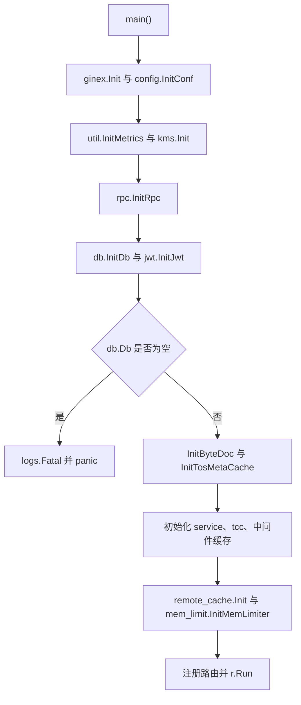

# Application Bootstrap

## 模块定位

Application Bootstrap 模块由 `main.go` 承担，是服务的组合根。它负责初始化运行时依赖、构造服务层 API 实例、绑定 Gin 路由，并最终通过 `r.Run()` 启动 HTTP 服务。

该模块不承载具体业务逻辑；业务处理集中在 `service.MetaBucketApi`、`service.IdcProxySettingApi` 及各类中间件、RPC、DB、缓存模块中。`main()` 的主要价值是定义启动顺序和对外 HTTP 面。

## 启动流程



`main()` 的初始化顺序有依赖关系：

1. `ginex.Init()` 先初始化 Ginex 运行环境。
2. `config.InitConf(ginex.ConfDir())` 使用 Ginex 配置目录加载服务配置，并在内部执行 `mergeTCCBaseConfig`。
3. `util.InitMetrics()` 初始化指标上报能力。
4. `kms.Init()` 初始化 KMS 客户端，执行流会进入 `getIAMAkSk` 获取 IAM AK/SK；失败会直接 `panic`。
5. `rpc.InitRpc()` 初始化外部 RPC 客户端，执行流包含 `TosPublicV3Client`、`FakeTosPublicV3APi`、`BpmClient`。
6. `db.InitDb()` 初始化主数据库连接，并写入全局 `db.Db`。
7. `jwt.InitJwt()` 初始化 JWT 相关能力。
8. 显式检查 `db.Db == nil`，数据库不可用时通过 `logs.Fatal("init db error")` 和 `panic("init db error")` 终止启动。
9. `db.InitByteDoc()` 初始化 ByteDoc 相关存储能力。
10. `db.InitTosMetaCache()` 初始化 TOS 元数据缓存。
11. `service.InitThirdPartyClient()` 初始化服务层依赖的第三方客户端。
12. `tcc.InitConfig()` 初始化 TCC 动态配置；失败会 `panic`。
13. `middleware.StartRefreshAGWTenantAkSkCache()` 启动 AGW 租户 AK/SK 缓存刷新逻辑。
14. `remote_cache.Init()` 初始化远端缓存；失败会 `panic`。
15. `mem_limit.InitMemLimiter()` 初始化内存限制器。
16. 创建 Gin 引擎、注册路由，最后执行 `logs.Fatal("%v", r.Run())`。

`defer logs.Stop()` 在 `main()` 退出前执行，用于收尾日志系统。`code.byted.org/lidar/agent/init` 通过空白导入触发包级副作用初始化，代码中不直接引用其符号。

## API 实例构造

路由注册前会创建两个核心 API 对象：

```go
proxySettingApi := service.NewIdcProxySettingApi(db.Db)
api := service.NewMetaBucketApi(db.Db, proxySettingApi)
```

`service.NewIdcProxySettingApi(db.Db)` 负责 IDC 代理配置相关接口。  
`service.NewMetaBucketApi(db.Db, proxySettingApi)` 负责 Bucket 元数据、TOS、Volc、BPM、Janus 等主要接口，并依赖 `proxySettingApi` 处理部分 IDC 代理能力。

这两个构造函数都依赖已经初始化完成的 `db.Db`，因此它们必须出现在 `db.InitDb()` 和空值检查之后。

## HTTP 路由结构

所有 HTTP 路由都挂在同一个 `ginex.Default()` 返回的路由引擎上。不同前缀通过不同中间件区分认证、响应格式和调用来源。

| 路由前缀 | 中间件 | 主要用途 |
| --- | --- | --- |
| `/bktmeta-api/v1` | `middleware.ResponseMiddleware()` | 主版本 Bucket 元数据接口 |
| `/bktmeta-api/v2` | `middleware.ZtiResponseMiddleware()` | ZTI 响应格式接口 |
| `/volcengine-iam/v1` | `middleware.ResponseMiddleware()` | Volcengine IAM AK 管理接口 |
| `/bktmeta-tob/v1` | `middleware.ResponseMiddleware()` | TOB 凭证查询接口 |
| `/bktmeta-s/v1` | `middleware.ResponseMiddlewareWithoutAuthCheck()` | 简化版无鉴权 Bucket 查询接口 |
| `/gateway/v1` | `janus.ResponseMiddleware()` | Janus 网关、运维、BPM 回调、批处理接口 |
| `/bpm/v1` | `middleware.BPMMiddleware()` | BPM 工单提交与校验接口 |
| `/bktmeta-openapi/v1` | `middleware.OpenapiMiddleware()` | OpenAPI 版本的完整查询接口 |
| `/bktmeta-openapi-s/v1` | `middleware.OpenapiMiddleware()` | OpenAPI 版本的简化查询接口 |

## 主要路由分组

### `/bktmeta-api/v1`

该分组是主业务 API，绑定到 `service.MetaBucketApi`：

- `GET /buckets` → `api.GetAllBuckets`
- `GET /buckets/:name` → `api.GetBucket`
- `GET /buckets/listByProvider` → `api.ListBucketsByProvider`
- `POST /buckets` → `api.CreateBucket`
- `PATCH /buckets/:name` → `api.UpdateBucket`
- `PUT /buckets/:name` → `api.OverwriteBucket`
- `DELETE /buckets/:name` → `api.DeleteBucket`
- `GET /signature` → `api.Signature`
- `GET /buckets/:name/s3info` → `api.GetTosBucketS3Info`
- `GET /buckets/tos/authority/all` → `api.GetAllTosAuthorityBuckets`
- `POST /buckets/createWithAkSk` → `api.CreateBucketWithAkSk`
- `GET /tob/cred/:name` → `api.GetTobTosBucketBaseInfo`

### `/bktmeta-api/v2`

当前只注册加密 Bucket 查询：

- `GET /buckets/encryption` → `api.GetAllEncryptionBuckets`

该分组使用 `middleware.ZtiResponseMiddleware()`，响应格式和鉴权语义与 v1 不同。

### `/volcengine-iam/v1`

该分组提供 Volcengine IAM 凭证管理：

- `POST /:access_key` → `api.CreateVolc`
- `PUT /:access_key` → `api.UpdateVolc`
- `GET /:access_key` → `api.GetVolc`
- `DELETE /:access_key` → `api.DeleteVolc`
- `GET /volcs` → `api.GetVolcs`

### `/gateway/v1`

该分组面向 Janus 网关和内部运维流程，使用 `janus.ResponseMiddleware()`。它覆盖几类能力：

- Bucket 查询与测试：`api.GetBucketJanus`、`api.GetAllBucketsJanus`、`api.BucketObjStorageParamTest`、`api.GetBucketTestRecord`
- VSRE 触发与工单：`api.VsreTrigger`、`api.CreateVsreV2Ticket`、`api.CallbackVsreV2Ticket`
- IDC 代理配置：`proxySettingApi.GetAllIdcsJanus`、`proxySettingApi.GetIdcProxiesJanus`、`proxySettingApi.CreateIdcJanus`、`proxySettingApi.UpdateIdcJanus`
- TOS 后端信息：`api.GetTosBackendConfigJanus`、`api.GetTosServiceNodeJanus`、`api.GetTosBpmJanus`
- Bucket 批量更新：`api.UpdateBucketsIdcJanus`、`api.UpdateBucketsPsmJanus`、`api.UpdateBucketsSkJanus`、`api.CreateBucketBatch`
- IDC 配置批处理：`api.CreateBucketIDCConfigBatch`、`api.DeleteBucketIDCConfigBatch`
- Volc 运维：`api.GetVolcJanus`、`api.GetAllVolcsJanus`、`api.VsreVolcTrigger`
- BPM 回调：`api.QueryTOSBucketBPM`、`api.CreateTOSBucketsBPM`、`api.ModifyTOSBucketLimitsBPM`、`api.CreateTOSBucketCallBack`
- Region Bucket 同步：`api.CreateRegionBuckets`、`api.QueryRegionBuckets`、`api.UpdateTosAllBucketsDB`、`api.ListAllRegionTosBuckets`
- 脚本入口：`api.FixBucketExtra`

因为该分组混合了查询、运维、批量写入和回调入口，新增路由时应优先确认调用方是否确实是 Janus 或内部系统，并保持响应格式与 `janus.ResponseMiddleware()` 一致。

### `/bpm/v1`

该分组只暴露 BPM 工单相关入口：

- `POST /bucket/submit` → `api.CreateBucketBPM`
- `GET /bucket/exist` → `api.CheckBucketExistBPM`
- `GET /bucket/registered` → `api.CheckBucketRegisteredBPM`

它使用 `middleware.BPMMiddleware()`，不应和普通用户 API 共用中间件。

### OpenAPI 与简化 API

`/bktmeta-openapi/v1` 复用主查询处理函数，例如 `api.GetAllBuckets`、`api.GetBucket`、`api.Signature`、`api.GetTosBucketS3Info`。  
`/bktmeta-openapi-s/v1` 复用简化查询处理函数，例如 `api.GetAllBucketsSimple`、`api.GetBucketSimple`。

简化 API 只暴露读取能力，不注册创建、更新、删除接口。

## 常量：TOB TOS Region 到 IDC 的映射

`constant/constant.go` 定义了：

```go
var TobTosRegionIDCMap = map[string]string{
    "cn-beijing":     env.DC_LFTOBIAAS,
    "cn-shanghai":    env.DC_SHTOBIAAS,
    "cn-guangzhou":   env.DC_GZTOBIAAS,
    "cn-guilin-boe":  env.DC_HLTOBIAAS,
    "ap-southeast-1": "johortobiaas",
}
```

该映射把 TOB TOS region 转换为 IDC 标识。大部分国内 region 使用 `code.byted.org/gopkg/env` 中的环境常量；`ap-southeast-1` 使用字面量 `"johortobiaas"`，注释说明其对应柔佛公有云机房。

维护该映射时需要注意：

- key 是 TOS region 名称，调用方应按 region 查询。
- value 是 IDC 名称或环境常量值。
- 新增 region 时应确认对应 IDC 是否已经在 `env` 包中有常量；没有常量时才使用明确的字面量。
- 该文件不参与 `main()` 启动顺序，但会影响依赖 region 到 IDC 解析的业务逻辑。

## 失败模式

启动阶段采用快速失败策略：

- `kms.Init()` 失败直接 `panic`。
- `db.Db == nil` 时先 `logs.Fatal("init db error")`，再 `panic("init db error")`。
- `db.InitByteDoc()` 失败直接 `panic`。
- `tcc.InitConfig()` 失败直接 `panic`。
- `remote_cache.Init()` 失败直接 `panic`。
- `r.Run()` 返回后通过 `logs.Fatal("%v", r.Run())` 记录并终止。

因此，Application Bootstrap 不做降级启动。只要核心依赖不可用，服务就不会继续暴露 HTTP 路由。

## 扩展建议

新增启动依赖时，应放在满足其前置条件的位置。例如依赖配置的初始化应在 `config.InitConf()` 之后；依赖数据库的初始化应在 `db.InitDb()` 和 `db.Db` 空值检查之后；依赖动态配置的逻辑应确认是否需要放在 `tcc.InitConfig()` 之后。

新增 HTTP 接口时，应先判断入口类型：

- 面向主业务调用方：优先放入 `/bktmeta-api/v1` 或后续版本分组。
- 面向 ZTI 语义：放入 `/bktmeta-api/v2` 并使用 `middleware.ZtiResponseMiddleware()`。
- 面向 Janus 或内部运维：放入 `/gateway/v1`。
- 面向 BPM：放入 `/bpm/v1`。
- 面向 OpenAPI：放入 `/bktmeta-openapi/v1` 或 `/bktmeta-openapi-s/v1`。
- 只读简化查询：使用已有 simple handler，例如 `GetAllBucketsSimple`、`GetBucketSimple`。

新增路由时应复用已构造的 `api` 或 `proxySettingApi`，避免在 `main()` 中直接引入业务处理逻辑。