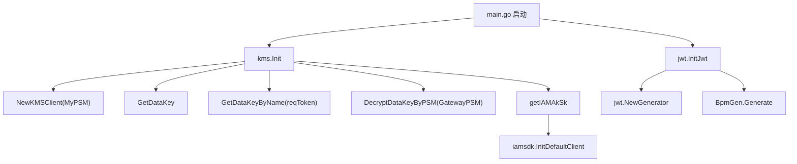

# Authentication and Security

## 模块概览

Authentication and Security 模块负责服务启动阶段的安全依赖初始化、Bucket 访问凭证生成、加密密钥生成与签名下发。相关代码分布在：

- `jwt/jwt.go`：初始化 BPM JWT 生成器。
- `kms/client.go`：初始化 KMS 客户端、数据密钥、IAM SDK 默认客户端，并提供加解密能力。
- `service/keygenerator.go`：为 Bucket 生成 AK/SK 和加密配置中的数据密钥。
- `service/signature.go`：根据 Bucket AK/SK 生成客户端可使用的签名。

该模块不是一个独立服务层，而是被 `main.go`、Bucket 创建流程、中间件鉴权流程和签名接口共同调用。

## 初始化流程

服务启动时，`main.go` 会调用：

```go
kms.Init()
jwt.InitJwt()
```

`kms.Init()` 是安全能力的核心初始化入口。它完成以下工作：

1. 使用 `MyPSM` 创建 `gokms.KMSClient`。
2. 通过 `Client.GetDataKey()` 初始化当前服务自己的 `Cipher`。
3. 通过 `Client.GetDataKeyByName("reqToken")` 初始化 `ReqTokenCipher`，用于请求 token 解密。
4. 通过 `Client.DecryptDataKeyByPSM(GatewayPSM)` 初始化 `GatewayCipher`，用于和 storage gateway 共享的密钥体系。
5. 读取 KMS 配置项 `iamaksk`，并调用 `iamsdk.InitDefaultClient()` 初始化 IAM SDK 默认客户端。



`jwt.InitJwt()` 负责初始化全局变量 `BpmGen`。如果 `config.Conf.TosAPI.Disable` 为 `true`，函数只记录 warning 并跳过初始化。否则它会使用 `config.Conf.ModifyTOSBucketBpmConfig.Partition` 创建 JWT generator，并用 `SecretKey` 调用一次 `Generate()`。这里的错误只会被记录，不会阻止服务继续启动。

## KMS 客户端与密钥

`kms/client.go` 暴露了几个包级变量：

```go
var Client *gokms.KMSClient
var Cipher *gokms.AesCipher
var GatewayCipher *gokms.AesCipher
var ReqTokenCipher *gokms.AesCipher
```

它们由 `kms.Init()` 初始化，后续业务代码直接使用这些全局 cipher。

`GatewayCipher` 用在 Bucket 加密密钥相关逻辑中：

- `NewEncryptedKey(size int)`：生成随机明文 key，并用 `GatewayCipher.Encrypt()` 加密。
- `Decrypt(ciphertext string)`：使用 `GatewayCipher.Decrypt()` 解密密文。

`ReqTokenCipher` 用在请求鉴权中：

- `DecryptRequestToken(ciphertext string)`：调用 `ReqTokenCipher.DecryptWithMetadata()` 解密带 metadata 的 request token。
- 调用方包括 `middleware/base.go` 中的 `checkTokenValid`。

`NewEncryptedKey(size int)` 的 `size` 使用 bit 表示，例如 `meta.KeySize256` 会生成 `256 / 8` 字节的随机 key。随机数来源是 `crypto/rand.Read`。如果随机数生成失败，会返回包含实际读取长度的错误；如果 KMS 加密失败，会返回统一错误 `ErrFailedToEncryptWithKMS`。

## Bucket AK/SK 生成

`service/keygenerator.go` 中的 `genAkSk(b *meta.Bucket)` 在 Bucket 创建流程中被 `createBucket` 调用。

逻辑分为三类：

1. 如果 `b.AccessKey` 和 `b.SecretKey` 都已经存在，直接返回。
2. 如果 `b.BackendType == meta.BackendTos`，从 `b.BackendBucket` 反序列化 `meta.TosBucket`，并复用其中的 `AccessKey` 和 `SecretKey`。
3. 其他 Bucket 类型会生成新的 AK/SK。

生成函数是：

```go
func genAK() string
func genSK() string
func genRandString(size int, chars []rune) (string, error)
```

AK 长度为 `SizeAK = 20`，字符集是数字和大写字母。SK 长度为 `SizeSK = 40`，字符集是数字、小写字母和大写字母。

`genRandString()` 使用 `crypto/rand.Read()` 生成随机字节，再通过 `int(r) % len(chars)` 映射到字符集。`genAK()` 和 `genSK()` 在随机数生成失败时会记录错误，并分别返回兜底值 `DefaultAccesskey` 和 `DefaultSecretkey`。

## Bucket 加密密钥生成

`genEncryptionKey(b *meta.Bucket)` 同样在 `createBucket` 中调用，用于处理 `b.EncryptionInfo`。

执行流程：

1. 如果 `b.EncryptionInfo == ""`，说明 Bucket 未启用加密，直接返回。
2. 将 `b.EncryptionInfo` 反序列化为 `meta.EncryptionInfo`。
3. 如果 `em.Encrypted` 为 `false`，直接返回。
4. 如果调用方已经传入 `em.Key`，返回错误 `"pre-defined key is forbidden"`，禁止外部预置加密 key。
5. 根据 `em.Method` 生成密钥：
   - `meta.EncMethodAES256CFB`：调用 `kms.NewEncryptedKey(meta.KeySize256)`。
   - `meta.EncMethodAES128CFB` 或空 method：调用 `kms.NewEncryptedKey(meta.KeySize128)`，并将 method 规范化为 `meta.EncMethodAES128CFB`。
6. 将 KMS 加密后的 key 写回 `em.Key`，再序列化回 `b.EncryptionInfo`。

不支持的加密方法会返回 `"unsupported encrypt method"`。

## 签名接口

`service/signature.go` 中的入口方法是：

```go
func (api *MetaBucketApi) Signature(c *gin.Context)
```

它通过 `middleware.Response(c, "buckets.signature", api.handleSignatureRequest)` 接入统一响应包装。实际逻辑在 `handleSignatureRequest(c *gin.Context)` 中。

请求需要提供：

- `bucket`
- `accessKey`
- `duration` 或 `encodeBody`

密钥查找逻辑如下：

1. 先从本地 `keyMap` 查找 `accessKey`。该 map 中包含几个历史或固定账号。
2. 如果不在 `keyMap`，调用 `api.getBucket(c, bucket, "", "", false)` 获取 Bucket。
3. 校验 `bkt.AccessKey == accessKey`，否则返回 `errno.ErrBucketAkInvalid`。
4. 使用 Bucket 中保存的 `SecretKey` 生成签名。

签名有两种模式。

`duration` 模式调用：

```go
func buildSignature(accessKey string, secretKey string, duration time.Duration) string
```

它会生成形如 `deadline: <unix_timestamp>` 的字符串，对该字符串做 URL-safe base64 编码，再用 HMAC-SHA1 和 `secretKey` 对编码后的 deadline 签名。最终返回：

```text
<accessKey>:<base64_hmac_sha1>:<base64_deadline>
```

`encodeBody` 模式调用：

```go
func buildSignature2(accessKey, secretKey, encodeBody string) string
```

它直接对传入的 `encodeBody` 做 HMAC-SHA1 签名，最终返回：

```text
<accessKey>:<base64_hmac_sha1>:<encodeBody>
```

如果 `duration` 解析失败，或者既没有 `duration` 也没有 `encodeBody`，接口返回 `errno.ErrSignatureInvalid`。

## 与其他模块的连接

Bucket 创建流程依赖本模块补全安全字段：

- `createBucket` 调用 `genAkSk()` 生成或继承 Bucket AK/SK。
- `createBucket` 调用 `genEncryptionKey()` 生成 Bucket 加密密钥。

请求鉴权依赖 KMS token 解密：

- `middleware/base.go` 中的 `checkTokenValid` 调用 `kms.DecryptRequestToken()`。

加密 Bucket 查询依赖 KMS 解密：

- `handleGetAllEncryptionBucketsRequest` 调用 `kms.Decrypt()` 解密已保存的加密 key。

签名下发接口依赖 Bucket 元数据：

- `MetaBucketApi.Signature()` 通过 `api.getBucket()` 获取 Bucket，并用 Bucket AK/SK 构造签名。

## 贡献注意事项

`kms.Init()` 初始化的是包级全局变量，新增依赖这些变量的代码前，需要确保调用路径发生在服务初始化之后。测试中也需要显式调用 `kms.Init()`，现有 `TestMain` 已覆盖多个包。

`genEncryptionKey()` 明确禁止外部传入明文或预置 key。修改加密算法支持时，应保持这一约束，并通过 `kms.NewEncryptedKey()` 统一生成加密后的 key。

`buildSignature()` 和 `buildSignature2()` 使用的是 HMAC-SHA1 与 `base64.URLEncoding`。调整签名格式会影响现有客户端解析逻辑，不能只改服务端生成逻辑。

`getIAMAkSk()` 在读取 KMS 配置失败时会 `panic`，并且默认假设配置值格式为 `"accessKey,secretKey"`。如果要增强健壮性，需要同步考虑启动失败语义和 IAM SDK 初始化依赖。